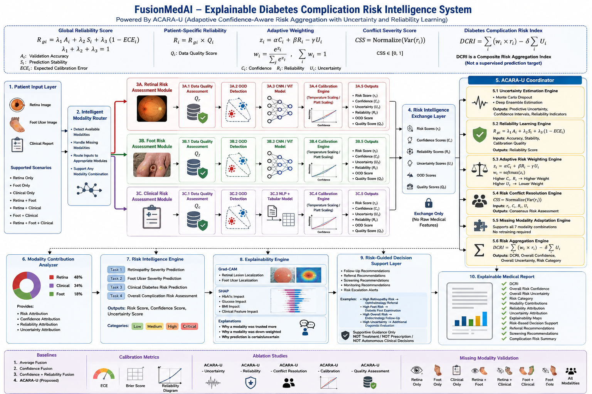

# FusionMedAI: Multi-Modal Clinical Intelligence System

[](https://www.python.org/downloads/release/python-3120/)
[](https://pytorch.org/)
[](LICENSE)

FusionMedAI is a clinical engineering framework designed for multi-modal medical diagnostics and interpretability. The system targets diagnostic classification across heterogeneous datasets (imaging, clinical structured data, and patient reports) by combining advanced deep learning backbones with transparent explainable AI (XAI) models.

The primary architecture utilizes **ACARA-U Fusion** (Attention-driven Clinical and Retinal Analysis with Uncertainty estimation) to fuse high-resolution clinical imaging, tabular EHR markers, and visual explanation metrics into robust diagnostic predictions.

## ✨ Current Features

- Automated dataset verification and metadata generation
- Stratified train/validation/test splitting (80/10/10)
- Custom PyTorch Dataset and transforms with configurable DataLoader
- End-to-end pipeline and integration verification
- Automated Exploratory Data Analysis (EDA) & RGB channel profiling
- Continuous Image Quality Assessment (Quality Score Q)
- Dataset duplicate audit & SHA-256 fingerprinting
- Centralized configuration and research logs

---

## 🏗️ Current Development Architecture

The following diagram illustrates the multi-modal diagnostic flow of the FusionMedAI framework, from raw heterogeneous ingestion to multi-level predictive fusion:



*Figure 1: High-level architectural overview of the FusionMedAI multi-modal pipeline.*

---

## 🎯 Project Goals

- **Multi-Modal Diagnostic Fusion**: Integrate clinical eye scans, demographic records, diabetic lab markers, and foot ulcer images into unified disease staging.
- **Academic-Grade Reproducibility**: Enforce strict data validation, deterministic stratified splitting, and reproducible pipelines.
- **Fail-Fast Clinical Engineering**: Ensure dataset integrity (e.g., shape, resolution, aspect ratio, label bounds, file corruption) is programmatically verified before training begins.
- **Interpretability & Trust**: Build transparent models using Explainable AI (XAI) tools like SHAP and Integrated Gradients to support clinical decision-making.

---

## 📌 Current Implementation

Implemented:
- ✔ Dataset Preparation
- ✔ Metadata Generation
- ✔ Dataset Verification
- ✔ Stratified Splitting
- ✔ RetinaDataset
- ✔ Image Transforms
- ✔ DataLoader
- ✔ End-to-End Verification
- ✔ Exploratory Data Analysis (EDA) & Quality Audit

In Progress:
- 🔄 Image Preprocessing & Baseline CNN Development

---

## 🚀 Releases

| Version | Status |
|---------|--------|
| v0.1.0 | Dataset Preparation ✅ |
| v0.2.0 | Data Pipeline ✅ |
| v0.3.0 | Exploratory Data Analysis ✅ |
| v0.4.0 | Preprocessing & CNN Development 🔄 |
| v0.5.0 | Training & Evaluation |
| v0.6.0 | Explainability |
| v1.0.0 | Retina Module |

---

## 📊 Project Status & Progress

The framework is organized into specialized domain modules. The current status of development is tracked below:

### Overall Progress

| Module | Core Features | Status |
| :--- | :--- | :--- |
| **Retina Module** | Diabetic Retinopathy staging (APTOS 2019 / IDRiD) | 🔄 In Progress |
| **Foot Ulcer Module** | Wound segmentation and infection classification | ⬜ Not Started |
| **Clinical Module** | Tabular EHR risk prediction and feature extraction | ⬜ Not Started |
| **Fusion Engine (ACARA-U)** | Joint embedding & uncertainty-weighted cross-attention | ⬜ Not Started |

### Retina Module Development Progress

- [x] **Dataset Preparation**: Completed data integrity checks, resolution-imbalance analysis, and automated metadata generation.
- [x] **Data Pipeline**: Implemented reproducible stratified 80/10/10 split, lazy-loading `RetinaDataset` subclass, validation/training image transformations, and multi-process `DataLoader`.
- [x] **Verification Framework**: Configured a rigorous unit and integration verification suite validating dataset integrity, lazy image loading, and zero data leakage.
- [x] **Exploratory Data Analysis (EDA)**: Completed colorimetric RGB profiling, image quality assessment (Continuous Quality Score $Q$), duplicate auditing (detecting 134 pairs), and publication-ready report compilations.
- [ ] **Image Preprocessing**: Pre-generate optimized cropped and padded images based on EDA recommendations.
- [ ] **Model Development**: Setup model backbone architecture and baseline configurations.
- [ ] **Training**: Configure training scripts, loss functions, and optimization policies.
- [ ] **Explainability**: Integrate XAI visualizations.
- [ ] **Evaluation**: Document validation and external testing metrics.

---

## 📁 Repository Structure

```directory
FusionMedAI/
├── datasets/                 # Labeled medical databases
│   ├── raw/                  # Unmodified raw clinical inputs (e.g., aptos2019)
│   ├── interim/              # Generated diagnostic reports & logs
│   └── processed/            # Final versioned data splits
├── docs/                     # Architectural diagrams & specifications
├── notebooks/                # Academic Jupyter notebooks
│   └── retina/
│       ├── eda.ipynb         # Interactive dataset exploratory analysis
│       ├── extract_stats.py  # Concurrent statistical feature extractor
│       └── run_eda_analysis.py # Automated EDA & report generation engine
├── research/                 # Academic notebooks & clinical engineering logs
│   ├── Volume_01_Dataset_Preparation/  # Raw audits, checks, and metadata logic
│   ├── Volume_02_Data_Pipeline/        # Data flow, complexities, and pipeline decisions
│   └── Volume_03_Exploratory_Data_Analysis/ # Spatial, RGB, quality, and duplicate analysis
├── src/                      # Production source codebase
│   ├── config.py             # Centralized pipeline configuration
│   └── data/                 # Data loading, transforms, and splits
│       ├── dataset.py        # Custom RetinaDataset class (lazy loading)
│       ├── dataloader.py     # Multi-process DataLoader constructor
│       ├── generate_metadata.py # Raw dataset scanning and CSV generation
│       ├── split_dataset.py  # Stratified 80/10/10 dataset splitter
│       ├── transforms.py     # Centralized PyTorch transformation pipelines
│       ├── verify_dataset.py # Raw dataset integrity validation
│       ├── verify_dataset_class.py # RetinaDataset unit verification
│       ├── verify_dataloader.py # DataLoader unit verification
│       ├── verify_pipeline.py # End-to-end integration verification script
│       └── verify_transforms.py # Transforms unit verification
├── LICENSE                   # Open-source licensing
└── requirements.txt          # Virtual environment dependencies
```

---

## 📚 Research Documentation

Each engineering phase is documented in detail:
- **Volume 01 — Dataset Preparation** (located at [research/Volume_01_Dataset_Preparation/](research/Volume_01_Dataset_Preparation/))
- **Volume 02 — Data Pipeline** (located at [research/Volume_02_Data_Pipeline/](research/Volume_02_Data_Pipeline/))
- **Volume 03 — Exploratory Data Analysis** (located at [research/Volume_03_Exploratory_Data_Analysis/](research/Volume_03_Exploratory_Data_Analysis/))

Each volume contains:
- Introduction & background
- Objectives & contributions
- Technical design decisions & trade-offs
- Verification methodology & coverage
- Multi-dimensional figures and dashboards (for Volume 3)
- Research limitations & mitigations
- Concluding roadmaps

---

## ⚙️ Installation & Setup

### 1. Environment Setup
Verify that Python is installed (Python 3.12 recommended). Clone the repository and initialize a virtual environment:

```bash
# Clone the repository
git clone https://github.com/Dr-Venom29/FusionMedAI.git
cd FusionMedAI

# Create virtual environment
python -m venv venv

# Activate virtual environment
# On Windows:
venv\Scripts\activate
# On Linux/macOS:
source venv/bin/activate

# Install dependencies
pip install -r requirements.txt
```

### 2. Dataset Ingestion
> Note:
> The APTOS 2019 dataset is not distributed with this repository due to Kaggle licensing. Download it separately and place it under `datasets/raw/aptos2019/`.

Organize the files into the following directory layout:

```directory
datasets/
└── raw/
    └── aptos2019/
        ├── train.csv
        └── train_images/
            ├── 000c1434d8d7.png
            ├── 001639a39701.png
            └── ...
```

Run the pipeline setup scripts in order:

```bash
# Step 1: Run raw dataset checks & verify images
python src/data/verify_dataset.py

# Step 2: Generate dataset metadata
python src/data/generate_metadata.py

# Step 3: Compute stratified train/validation/test splits
python src/data/split_dataset.py

# Step 4: Execute end-to-end pipeline verification
python src/data/verify_pipeline.py

# Step 5: Run Exploratory Data Analysis & report generation
python -m notebooks.retina.run_eda_analysis
```

All verification and analysis steps must run successfully before proceeding to model preprocessing and training.

---

## 🗺️ Project Roadmap

- **v0.1.0 (Dataset Preparation)**: Completed raw audit, metadata generation, and resolution scanning. ✅
- **v0.2.0 (Data Pipeline)**: Completed stratified split, lazy loading, transforms, and E2E verification. ✅
- **v0.3.0 (Exploratory Data Analysis)**: Completed concurrent stats extraction, RGB profiling, duplicate audit, quality scoring, and automated reports. ✅
- **v0.4.0 (Retina Preprocessing & CNN Development)**: Pre-generate optimized dataset splits and build timm backbone CNN models. 🔄
- **v0.5.0 (Retina Training & Evaluation)**: Complete optimization, validation benchmarks, and external testing.
- **v0.6.0 (Retina Explainability)**: Integrate post-hoc visual explanations.
- **v1.0.0 (Retina Module Complete)**: Fully release verified, explainable Diabetic Retinopathy module.
- **v2.0.0 (Foot Ulcer Module Complete)**: Integrate wound segmentation models.
- **v3.0.0 (Clinical Module Complete)**: Integrate EHR structured features and classification networks.
- **v4.0.0 (FusionMedAI Complete)**: Release unified multi-modal ACARA-U Fusion model.

---

## 📄 Citation

```bibtex
@misc{FusionMedAI2026,
  title={FusionMedAI: Attention-driven Clinical and Retinal Analysis with Uncertainty Estimation},
  author={Shashank Reddy},
  year={2026},
  note={Manuscript in preparation}
}
```

---

## ⚖️ License

Distributed under the MIT License. See [LICENSE](LICENSE) for more information.
