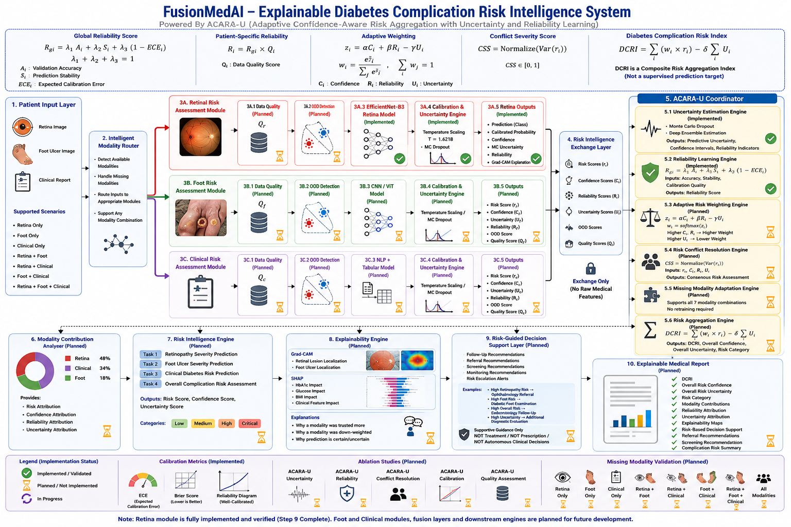

# FusionMedAI
> Explainable Multi-Modal AI Framework for Diabetic Disease Analysis

Retina • Clinical • Foot Ulcer • Multimodal Fusion

[](https://www.python.org/downloads/release/python-3120/)
[](https://pytorch.org/)
[](LICENSE)

FusionMedAI is a modular research framework for explainable multi-modal diabetic disease analysis. The project develops independent Retina, Clinical, and Foot Ulcer AI modules using reproducible engineering practices before integrating them through the uncertainty-aware ACARA-U Fusion Engine.

**Current Status**
- ✓ Retina Benchmarking Complete
- ✓ Explainability Complete
- 🔄 Calibration
- 🔄 Uncertainty Estimation
- ⬜ Foot Module
- ⬜ Clinical Module
- ⬜ ACARA-U Fusion

---

## ✨ Core Infrastructure

- ✓ Dataset verification
- ✓ Data pipeline
- ✓ EDA
- ✓ Modular training
- ✓ Benchmarking
- ✓ Experiment tracking
- ✓ Inference
- ✓ Verification
- ✓ Explainable AI (Grad-CAM)

---

## 🏗️ Architecture

The following diagram illustrates the multi-modal diagnostic flow of the FusionMedAI framework, from raw heterogeneous ingestion to multi-level predictive fusion:



*Figure 1: High-level architectural overview of the FusionMedAI multi-modal pipeline.*

---

## 🔬 Architecture Benchmarking

We conducted a rigorous, identical-condition benchmark across five distinct vision architectures to select the optimal Retina Module backbone:
1. **EfficientNet-B0** (CNN)
2. **EfficientNet-B3** (CNN)
3. **ConvNeXt-Tiny** (Modernized CNN)
4. **Swin-Tiny** (Hierarchical Transformer)
5. **ViT-B/16** (Vision Transformer)

### Final Benchmark Results

| Model | Accuracy | Balanced Acc. | Macro F1 | QWK | ROC-AUC | Params | Peak VRAM | Latency | Throughput |
|---|---|---|---|---|---|---|---|---|---|
| **EfficientNet-B3** | **84.20%** | 67.22% | 0.6813 | **0.9233** | 0.9457 | 10.70M | 2.81 GB | 12.64 ms | 79.1 img/s |
| ConvNeXt-Tiny | 81.20% | **72.05%** | **0.6893** | 0.9145 | **0.9587** | 27.82M | 2.30 GB | 5.65 ms | 177.0 img/s |
| EfficientNet-B0 | 79.29% | 67.68% | 0.6505 | 0.9101 | 0.9353 | 4.01M | 1.50 GB | 8.08 ms | 123.7 img/s |
| Swin-Tiny | 78.75% | 66.35% | 0.6406 | 0.8973 | 0.9516 | 27.52M | 2.57 GB | 12.89 ms | 77.6 img/s |
| ViT-B/16 | 77.38% | 58.01% | 0.5804 | 0.8656 | 0.9225 | 85.80M | 3.41 GB | 15.16 ms | 66.0 img/s |

**Selection Outcome:** **EfficientNet-B3** was selected as the final Retinal Module backbone due to its superior clinical grading metrics (Accuracy and QWK) and excellent hardware efficiency compared to massive transformers.

---

## 🌟 Research Highlights

- Five-model benchmark under identical experimental conditions
- EfficientNet-B3 selected as the final retinal backbone
- Modular PyTorch framework with reproducible experiment tracking
- Comprehensive engineering documentation across six research volumes
- Reproducible end-to-end retinal AI research pipeline

---

## 🛠️ Tech Stack

**Language**
- Python 3.12

**Deep Learning**
- PyTorch
- Torchvision

**Data**
- NumPy
- Pandas

**Vision**
- OpenCV
- Albumentations

**Visualization**
- Matplotlib
- TensorBoard

---

## 🎯 Project Goals

- **Multi-Modal Diagnostic Fusion**: Integrate clinical eye scans, demographic records, diabetic lab markers, and foot ulcer images into unified disease staging.
- **Academic-Grade Reproducibility**: Enforce strict data validation, deterministic stratified splitting, and reproducible pipelines.
- **Fail-Fast Clinical Engineering**: Ensure dataset integrity (e.g., shape, resolution, aspect ratio, label bounds, file corruption) is programmatically verified before training begins.
- **Interpretability & Trust**: Build transparent models using Explainable AI (XAI) tools like SHAP and Integrated Gradients to support clinical decision-making.

---

## 📁 Repository Structure

```directory
FusionMedAI/
├── datasets/                 # Labeled medical databases
├── docs/                     # Architectural diagrams & specifications
├── notebooks/                # Academic Jupyter notebooks
├── reports/                  # Benchmark, Explainability & Evaluation Reports
├── research/                 # Academic documentation
├── src/                      # Production source codebase
├── verification/             # Independent verification scripts
├── LICENSE                   # Open-source licensing
└── requirements.txt          # Virtual environment dependencies
```

---

## 📚 Research Documentation

| Volume | Topic | Status |
| :--- | :--- | :--- |
| I | Dataset Preparation | ✅ |
| II | Data Pipeline | ✅ |
| III | Exploratory Data Analysis | ✅ |
| IV | Baseline Framework | ✅ |
| V | Architecture Benchmarking | ✅ |
| VI | Model Explainability | ✅ |

Detailed documentation can be found in the `research/` directory.

---

## ⚙️ Installation & Setup

### 1. Environment Setup
Verify that Python is installed (Python 3.12 recommended). Clone the repository and initialize a virtual environment:

```bash
# Clone the repository
git clone https://github.com/Dr-Venom29/FusionMedAI.git
cd FusionMedAI

# Create virtual environment
python -m venv venv

# Activate virtual environment
# On Windows:
venv\Scripts\activate
# On Linux/macOS:
source venv/bin/activate

# Install dependencies
pip install -r requirements.txt
```

### 2. Dataset Ingestion
> Note:
> The APTOS 2019 dataset is not distributed with this repository due to Kaggle licensing. Download it separately and place it under `datasets/raw/aptos2019/`.

Organize the files into the following directory layout:

```directory
datasets/
└── raw/
    └── aptos2019/
        ├── train.csv
        └── train_images/
            ├── 000c1434d8d7.png
            ├── 001639a39701.png
            └── ...
```

Run the pipeline setup and verification scripts in order:

```bash
# Step 1: Run raw dataset checks & verify images
python src/data/verify_dataset.py

# Step 2: Generate dataset metadata
python src/data/generate_metadata.py

# Step 3: Compute stratified train/validation/test splits
python src/data/split_dataset.py

# Step 4: Execute end-to-end pipeline verification
python src/data/verify_pipeline.py

# Step 5: Run Exploratory Data Analysis & report generation
python -m notebooks.retina.run_eda_analysis

# Step 6: Verify model wrapper and parameter count
python verification/model/verify_model.py

# Step 7: Verify training loop, backpropagation, and scheduler updates
python verification/model/verify_training.py

# Step 8: Verify checkpoint saving, loading, and resumes
python verification/model/verify_checkpoint.py
```

All verification and analysis steps must run successfully before proceeding to model preprocessing and training.

---

## 📊 Framework Verification

Framework verification confirmed:
- ✓ Model initialization
- ✓ Training loop
- ✓ Checkpoint recovery
- ✓ Inference
- ✓ Explainability pipeline

**Detailed results**: `reports/framework_verification.md`

---

## 🚀 Development Milestones

| Version | Status |
|---------|--------|
| v0.1.0  | Dataset Preparation ✅ |
| v0.2.0  | Data Pipeline ✅ |
| v0.3.0  | Exploratory Data Analysis ✅ |
| v0.4.0  | Baseline Model Framework ✅ |
| v0.5.0  | Architecture Benchmarking ✅ |
| v0.6.0  | Explainability Complete · Calibration & Uncertainty In Progress |
| v1.0.0  | Retina Module |

---

## 🗺️ Project Roadmap

- **v0.1.0 (Dataset Preparation)**: Completed raw audit, metadata generation, and resolution scanning. ✅
- **v0.2.0 (Data Pipeline)**: Completed stratified split, lazy loading, transforms, and E2E verification. ✅
- **v0.3.0 (Exploratory Data Analysis)**: Completed concurrent stats extraction, RGB profiling, duplicate audit, quality scoring, and automated reports. ✅
- **v0.4.0 (Baseline Framework)**: Built custom model wrapper, factory, BaseClassifier, trainer, mixed precision (AMP), Early Stopping, checkpointing, standalone inference, and verification framework. ✅
- **v0.5.0 (Architecture Benchmarking)**: Completed fair-benchmark comparison across 5 architectures, yielding EfficientNet-B3 as the final Retinal backbone. ✅
- **v0.6.0 (Calibration, Explainability, Uncertainty)**:
  Completed:
  • Explainability (Grad-CAM)
  In Progress:
  • Calibration
  • Uncertainty Estimation
- **v1.0.0 (Retina Module)**: Production release of explainable, calibrated Retina module.
- **v2.0.0 (Foot Ulcer Module Complete)**: Integrate wound segmentation models.
- **v3.0.0 (Clinical Module Complete)**: Integrate EHR structured features and classification networks.
- **v4.0.0 (FusionMedAI Complete)**: Release unified multi-modal ACARA-U Fusion model.

---

## ⚖️ License

Distributed under the MIT License. See [LICENSE](LICENSE) for more information.
