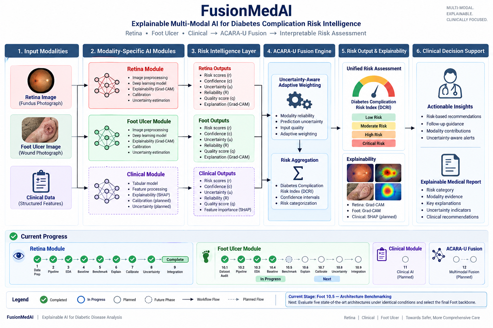
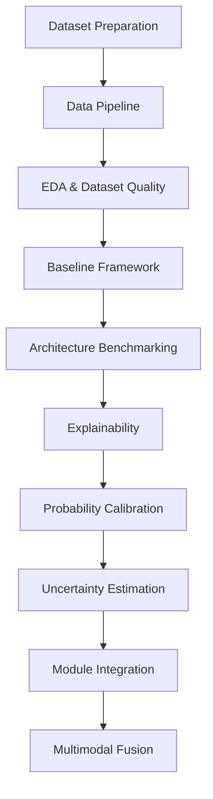
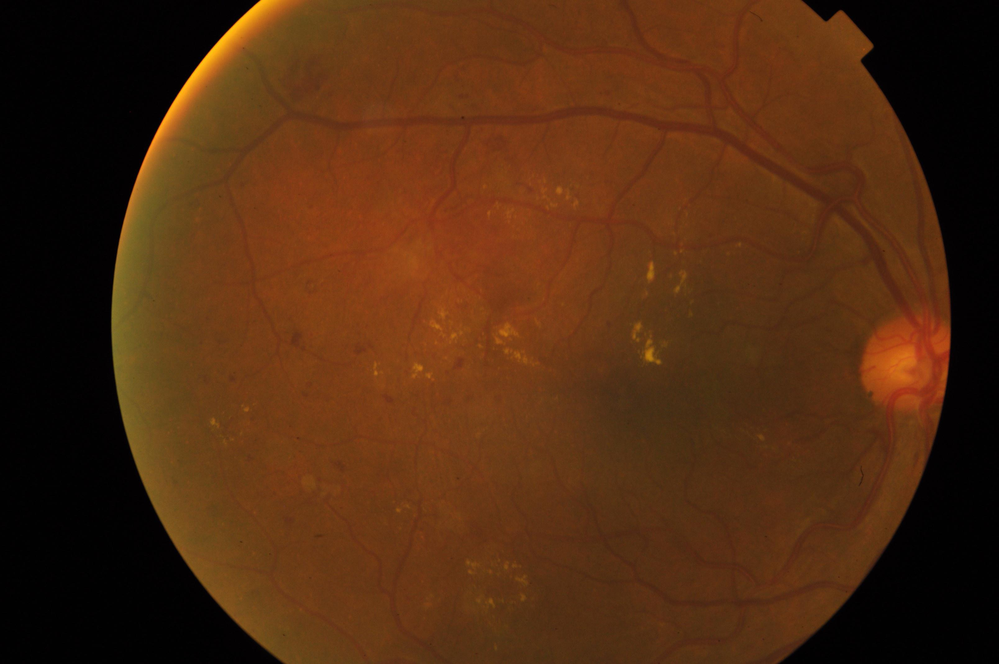
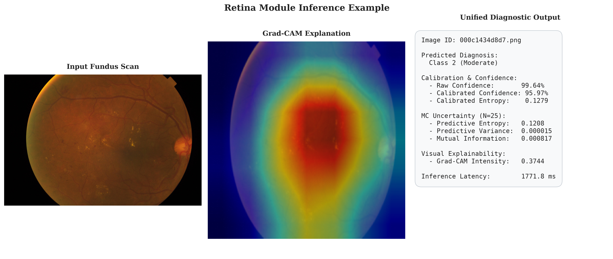

# FusionMedAI

> Explainable Multi-Modal AI Framework for Diabetic Disease Analysis

Retina • Foot Ulcer • Clinical • Multimodal Fusion

[](https://www.python.org/downloads/release/python-3120/)
[](https://pytorch.org/)
[](LICENSE)

FusionMedAI is a research framework for developing and evaluating independent AI modules for diabetic disease analysis and subsequently combining their outputs through an uncertainty-aware multimodal fusion layer.

The framework currently includes a completed retinal imaging pipeline and an independently developed diabetic foot-ulcer pipeline. The clinical module and multimodal fusion layer remain under development.

---

## Current Status

The Foot Ulcer module has completed dataset preparation, leakage-aware pipeline construction, exploratory data analysis, baseline model development, controlled architecture benchmarking, post-hoc explainability analysis, and probability calibration.

EfficientNet-B3 was selected as the primary Foot Ulcer backbone. Probability calibration was evaluated using Temperature Scaling and Vector Scaling, with Vector Scaling selected using validation negative log-likelihood under the predefined selection protocol.

The next stage is **Phase 10.8 — Prediction Uncertainty Estimation**.

### Retina Module
- Dataset preparation — Completed
- Data pipeline — Completed
- Exploratory data analysis and dataset quality assessment — Completed
- Baseline framework — Completed
- Architecture benchmarking — Completed
- Grad-CAM explainability — Completed
- Probability calibration — Completed
- Uncertainty estimation — Completed
- Module integration — Completed
- Acceptance testing — Completed

### Foot Ulcer Module
- Dataset acquisition and audit — Completed
- Canonical dataset construction — Completed
- Source-image grouping — Completed
- Duplicate and near-duplicate analysis — Completed
- Group-stratified train/validation/test splitting — Completed
- Dataset implementation — Completed
- Image preprocessing and augmentation pipeline — Completed
- DataLoader implementation — Completed
- End-to-end pipeline verification — Completed
- Statistical profiling — Completed
- Class-wise visual analysis — Completed
- Image quality analysis — Completed
- Outlier analysis — Completed
- Class separability analysis — Completed
- Dataset bias and shortcut analysis — Completed
- Baseline framework — Completed
- Architecture benchmarking — Completed
- Explainability — Completed
- Probability calibration — Completed
- Prediction uncertainty estimation — In development
- Module integration — Planned

### Remaining Modules
- Clinical module — Planned
- ACARA-U multimodal fusion — Planned

---

## Architecture



*Figure 1. Architecture of the FusionMedAI framework.*

FusionMedAI is organized as a sequence of independent modality-specific pipelines followed by a multimodal fusion stage.

Each modality is developed and evaluated independently before integration. The current architecture comprises:

- **Retina Module** — diabetic retinopathy assessment from fundus images.
- **Foot Ulcer Module** — Wagner-grade classification from diabetic foot-ulcer images.
- **Clinical Module** — structured clinical risk assessment; under development.
- **ACARA-U Fusion Engine** — uncertainty- and reliability-aware aggregation of modality outputs; under development.

The fusion layer is designed to operate on modality-level risk, confidence, reliability, and uncertainty information rather than directly combining raw modality features.

---

## Research Methodology

The project follows the same general development sequence for each modality:


```mermaid
flowchart TD
    A[Dataset Preparation] --> B[Data Pipeline]
    B --> C[EDA & Dataset Quality]
    C --> D[Baseline Framework]
    D --> E[Architecture Benchmarking]
    E --> F[Explainability]
    F --> G[Probability Calibration]
    G --> H[Uncertainty Estimation]
    H --> I[Module Integration]
    I --> J[Multimodal Fusion]
```

This separation is intentional. Dataset validation, model evaluation, calibration, uncertainty estimation, explainability, and integration are treated as separate research stages rather than being combined into a single training workflow.

---

## Retina Module

The Retina module has completed its full independent development cycle.

### Dataset
The module uses the APTOS 2019 diabetic retinopathy dataset. The dataset is not distributed with this repository and must be obtained separately.

### Dataset Analysis

The Retina pipeline included dataset quality assessment, class-distribution analysis, preprocessing validation, and leakage-aware evaluation. The data pipeline was verified before model benchmarking, with the final model evaluated on a frozen test set under a controlled experimental protocol.

### Backbone Selection
Five architectures were evaluated under a controlled benchmarking procedure:
- EfficientNet-B0
- EfficientNet-B3
- ConvNeXt-Tiny
- Swin-Tiny
- ViT-B/16

| Rank | Model | Accuracy | Balanced Acc. | Macro F1 | QWK | ROC-AUC | Parameters | Latency (GPU) |
| :---: | :--- | ---: | ---: | ---: | ---: | ---: | ---: | ---: |
| 1 | **EfficientNet-B3** | **84.20%** | 67.22% | 0.6813 | **0.9233** | 0.9457 | 10.70M | 12.64 ms |
| 2 | ConvNeXt-Tiny | 81.20% | **72.05%** | **0.6893** | 0.9145 | **0.9587** | 27.82M | **5.65 ms** |
| 3 | EfficientNet-B0 | 79.29% | 67.68% | 0.6505 | 0.9101 | 0.9353 | **4.01M** | 8.08 ms |
| 4 | Swin-Tiny | 78.75% | 66.35% | 0.6406 | 0.8973 | 0.9516 | 27.52M | 12.89 ms |
| 5 | ViT-B/16 | 77.38% | 58.01% | 0.5804 | 0.8656 | 0.9225 | 85.80M | 15.16 ms |

**Selected backbone**: EfficientNet-B3

EfficientNet-B3 was retained as the final Retina backbone based on the overall benchmark evaluation, including classification performance, quadratic weighted kappa, parameter count, and computational requirements.

The complete methodology and benchmark results are documented in Research Volume V — Architecture Benchmarking.

### Calibration and Uncertainty
The final Retina model uses:
- Temperature Scaling for probability calibration
- MC Dropout for predictive uncertainty estimation
- Predictive entropy
- Mutual information
- Risk-coverage analysis
- Grad-CAM for visual explanation

On the frozen Retina test set, MC predictive variance achieved an AUROC of 0.8443 for prediction-error detection. The MC Dropout configuration was evaluated for convergence, with 25 stochastic passes selected for the final implementation.

### Integration
The final Retina module combines prediction, calibrated confidence, uncertainty estimation, and Grad-CAM into a unified inference output. The integrated module has passed its acceptance tests.

---

## Foot Ulcer Module

The Foot Ulcer module has completed dataset preparation, leakage-aware pipeline construction, exploratory data analysis, baseline model development, controlled architecture benchmarking, post-hoc explainability analysis, and probability calibration. Prediction uncertainty estimation and module integration are the next development stages.

### Dataset

The module uses the ADPM V3.3 Diabetic Foot Ulcer Classification dataset, organized into four Wagner-based classes:

| Class | Description |
| :--- | :--- |
| **Grade 1** | Superficial ulcer |
| **Grade 2** | Deep ulcer without bone involvement |
| **Grade 3** | Deep ulcer with abscess, osteomyelitis, or joint sepsis |
| **Grade 4** | Localized gangrene |

The audited dataset contains 10,062 valid images. Exact duplicate resolution produced 10,050 canonical images grouped into 1,770 source-image groups.

The final leakage-aware splits contain:

- **Train**: 8,038 images
- **Validation**: 1,006 images
- **Test**: 1,006 images

No source-image group overlaps occur between the final splits, and no exact duplicates cross split boundaries.

### Dataset Analysis

Exploratory analysis examined statistical distributions, visual characteristics, image quality, potential shortcuts, and class separability.

The four Wagner grades are relatively balanced across the dataset. The primary visual challenge is substantial overlap between Grade 2 and Grade 3 ulcers. Quality variations and capture artifacts were retained to maintain alignment with realistic clinical imaging conditions.

### Baseline

A ResNet-50 baseline model was evaluated under the frozen source-group split using standard cross-entropy training:

- **Test Macro F1**: 0.6339
- **Balanced Accuracy**: 0.6391
- **Accuracy**: 0.6372
- **Macro ROC-AUC**: 0.8423

The baseline highlighted two key challenges: early validation performance saturation (overfitting risk) and substantial Grade 2 ↔ Grade 3 misclassification.

### Backbone Selection

Five candidate architectures were evaluated under identical, controlled experimental conditions against the ResNet-50 baseline:

| Rank | Model | Macro F1 | Balanced Accuracy | Macro ROC-AUC | Parameters | Latency (GPU, T4) |
| :---: | :--- | ---: | ---: | ---: | ---: | ---: |
| 1 | **EfficientNet-B3** | **0.6683** | **0.6672** | **0.8685** | **10.70M** | **70.39 ms** |
| 2 | EfficientNet-B0 | 0.6672 | 0.6656 | 0.8431 | 4.01M | 37.89 ms |
| 3 | ConvNeXt-Tiny | 0.6566 | 0.6562 | 0.8613 | 27.82M | 109.61 ms |
| 4 | ResNet-50 (Baseline Reference) | 0.6339 | 0.6391 | 0.8423 | 23.51M | — |
| 5 | Swin-Tiny | 0.6266 | 0.6262 | 0.8269 | 27.52M | 129.09 ms |
| 6 | ViT-B/16 | 0.5788 | 0.5878 | 0.8364 | 85.80M | 310.28 ms |

**Selection**: EfficientNet-B3 was selected as the primary Foot Ulcer backbone based on the predefined primary metric of held-out test Macro F1, with Balanced Accuracy, Macro ROC-AUC, class-wise performance, and computational cost considered as secondary criteria. EfficientNet-B0 remains a lightweight alternative. Its test Macro F1 of 0.6672 was only 0.0011 below EfficientNet-B3 (0.6683), while requiring substantially fewer parameters and lower inference latency.

### Explainability

Post-hoc spatial attribution analysis using Grad-CAM was performed across the complete held-out test set ($N=1,006$). Target layer representations (`backbone.features[8]`) were empirically verified, producing localized attributions focused on visible wound bed and margin regions (mean high-attribution area fraction $= 19.61\%$). Model randomization sanity checking produced a Pearson correlation coefficient of 0.0000, indicating that the attribution maps were not preserved after model parameter randomization under the predefined sanity-check protocol. These results evaluate attribution sensitivity to model parameters; they do not establish lesion localization accuracy or clinical validity.

### Calibration

Probability calibration was performed using post-hoc Temperature Scaling and Vector Scaling on the frozen EfficientNet-B3 model.

Calibration parameters were fitted exclusively on the validation set and evaluated on the held-out test set.

Vector Scaling was selected because it achieved lower validation NLL than Temperature Scaling under the predefined selection protocol.

| Method | Test NLL | Test ECE | Accuracy | Macro F1 | Balanced Accuracy |
| :--- | ---: | ---: | ---: | ---: | ---: |
| Raw | 0.8779 | 0.0424 | 0.6690 | 0.6683 | 0.6672 |
| Temperature Scaling | 0.8785 | 0.0388 | 0.6690 | 0.6683 | 0.6672 |
| **Vector Scaling** | **0.8749** | **0.0313** | **0.6769** | **0.6758** | **0.6753** |

Vector Scaling reduced test ECE from 0.0424 to 0.0313, corresponding to a 26.18% relative reduction.

The selected calibration artifact is frozen under `experiments/foot/final_model/calibration.json`.

### Uncertainty

Prediction uncertainty estimation is the next development stage. The planned analysis will evaluate stochastic predictive uncertainty and risk-coverage behaviour for the selected Foot Ulcer model.

### Integration

Integrated Foot Ulcer inference will combine prediction, calibrated probabilities, uncertainty estimation, and Grad-CAM explanations after completion of the uncertainty stage.

Module integration will follow the same interface and verification principles established for the Retina module.

---

## Core Infrastructure

The repository provides reusable infrastructure for dataset validation, model development, evaluation, and verification:

- Dataset validation
- Metadata generation
- Deterministic dataset splitting
- DataLoader and preprocessing pipelines
- Model training
- Checkpoint management
- Inference
- Architecture benchmarking
- Experiment tracking
- Grad-CAM
- Probability calibration
- MC Dropout uncertainty estimation
- Risk-coverage analysis
- Pipeline verification
- Model acceptance testing

Modality-specific implementations remain isolated under their respective source directories.

---

## Repository Structure

```directory
FusionMedAI/
├── datasets/
│   ├── retina/
│   │   ├── raw/
│   │   ├── interim/
│   │   ├── processed/
│   │   └── metadata/
│   └── foot/
│       ├── raw/
│       ├── interim/
│       ├── processed/
│       └── metadata/
├── docs/
│   └── architecture_v1.png
├── experiments/
│   ├── retina/
│   └── foot/
│       ├── architecture_benchmark/
│       ├── explainability/
│       └── final_model/
├── notebooks/
│   ├── retina/
│   └── foot/
├── reports/
├── research/
│   ├── retina/
│   ├── foot/
│   ├── clinical/
│   └── fusion/
├── src/
│   ├── retina/
│   └── foot/
├── verification/
│   ├── retina/
│   │   ├── data/
│   │   └── model/
│   └── foot/
│       ├── data/
│       └── model/
├── LICENSE
└── requirements.txt
```

---

## Research Documentation

### Retina
| Volume | Topic | Status |
| :--- | :--- | :---: |
| **I** | Dataset Preparation | Completed |
| **II** | Data Pipeline | Completed |
| **III** | Exploratory Data Analysis | Completed |
| **IV** | Baseline Framework | Completed |
| **V** | Architecture Benchmarking | Completed |
| **VI** | Model Explainability | Completed |
| **VII** | Probability Calibration | Completed |
| **VIII** | Prediction Uncertainty Estimation | Completed |
| **IX** | Module Integration & Finalization | Completed |

### Foot Ulcer

| Phase | Topic | Status |
|---|---|---|
| 10.1 | Dataset Preparation & Audit | Completed |
| 10.2 | Data Pipeline | Completed |
| 10.3.1 | Dataset Statistical Profiling | Completed |
| 10.3.2 | Class-Wise Visual Analysis | Completed |
| 10.3.3 | Image Quality Analysis | Completed |
| 10.3.4 | Outlier Analysis | Completed |
| 10.3.5 | Class Separability Analysis | Completed |
| 10.3.6 | Dataset Bias & Shortcut Analysis | Completed |
| 10.4 | Baseline Framework | Completed |
| 10.5 | Architecture Benchmarking | Completed |
| 10.6 | Explainability | Completed |
| 10.7 | Probability Calibration | Completed |
| 10.8 | Prediction Uncertainty Estimation | In Development |
| 10.9 | Module Integration | Planned |

---

## Installation & Setup

### Requirements
- Python 3.12
- PyTorch 2.4

Create a virtual environment and install project dependencies:

```bash
git clone https://github.com/Dr-Venom29/FusionMedAI.git
cd FusionMedAI

python -m venv venv

# On Windows:
venv\Scripts\activate
# On Linux/macOS:
source venv/bin/activate

pip install -r requirements.txt
```

### Dataset Setup

#### Retina
The APTOS 2019 dataset must be obtained separately.

Expected structure:
```directory
datasets/
└── retina/
    └── raw/
        └── aptos2019/
            ├── train.csv
            └── train_images/
                ├── 000c1434d8d8.png
                ├── 001639a39701.png
                └── ...
```

#### Foot Ulcer
The Foot Ulcer dataset is maintained separately under:
```directory
datasets/
└── foot/
    └── raw/
```

The raw dataset is treated as immutable. Dataset cleaning, canonicalization, grouping, and final modeling splits are generated into the corresponding `processed/`, `interim/`, and `metadata/` directories.

---

## Verification

Verification scripts are maintained independently from the training code under `verification/`:
- `verification/retina/data/` & `verification/retina/model/`
- `verification/foot/data/` & `verification/foot/model/`

The framework verifies components including:
- Dataset integrity
- Pipeline construction
- Model initialization
- Training and backpropagation
- Checkpoint loading
- Inference
- Explainability
- Calibration
- Uncertainty estimation
- Module-level acceptance

The project does not treat successful model training alone as sufficient validation. Each completed research stage has its own verification criteria.

---

## Example Retina Inference

### Input Fundus Scan


### Unified Prediction & Explanation Output


The output demonstrates the integrated Retina inference interface, including model prediction, calibrated confidence, uncertainty information, and Grad-CAM explanation.

---

## Development Roadmap

- **v1.0 (Retina Module)** — **Completed**. The Retina pipeline has progressed from dataset preparation through module integration and acceptance testing.
- **v2.0 (Foot Ulcer Module)** — **In Development**. Completed: Phase 10.1 through Phase 10.7, including dataset audit, leakage-aware pipeline construction, EDA and quality analysis, baseline evaluation, architecture benchmarking, explainability, and probability calibration. Selected backbone: EfficientNet-B3. Next: Phase 10.8 — Prediction Uncertainty Estimation.
- **v3.0 (Clinical Module)** — **Planned**. Development of the independent clinical-data assessment module.
- **v4.0 (ACARA-U Fusion)** — **Planned**. Integration of the Retina, Foot Ulcer, and Clinical modules through the ACARA-U uncertainty- and reliability-aware fusion framework.

---

## License

This project is distributed under the MIT License. See [LICENSE](LICENSE) for details.
