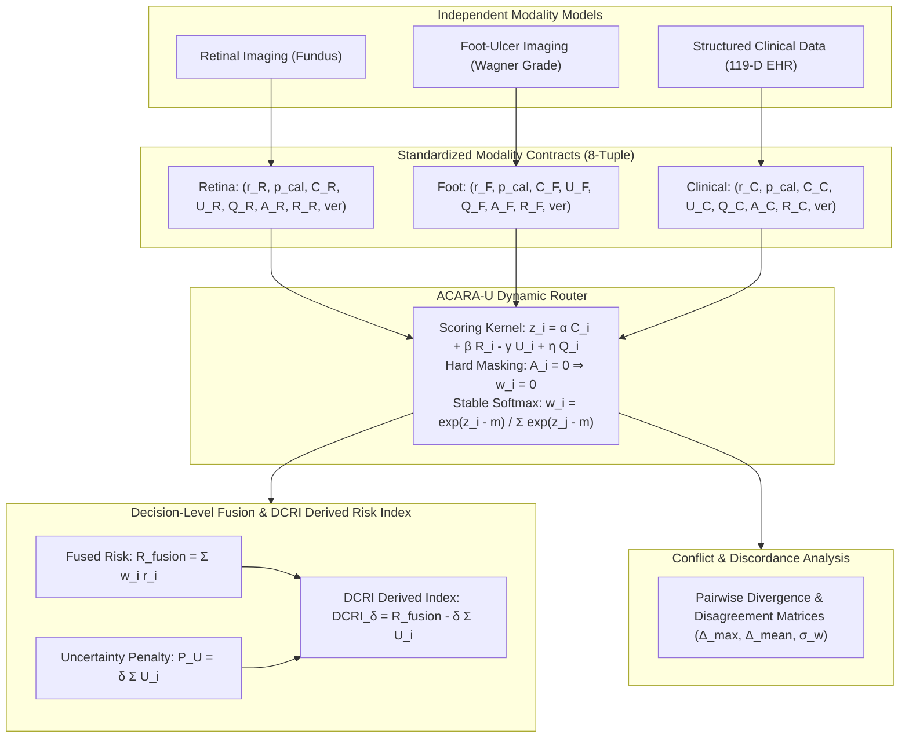
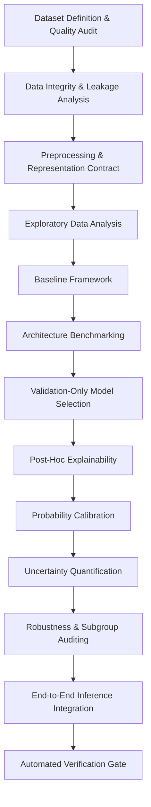
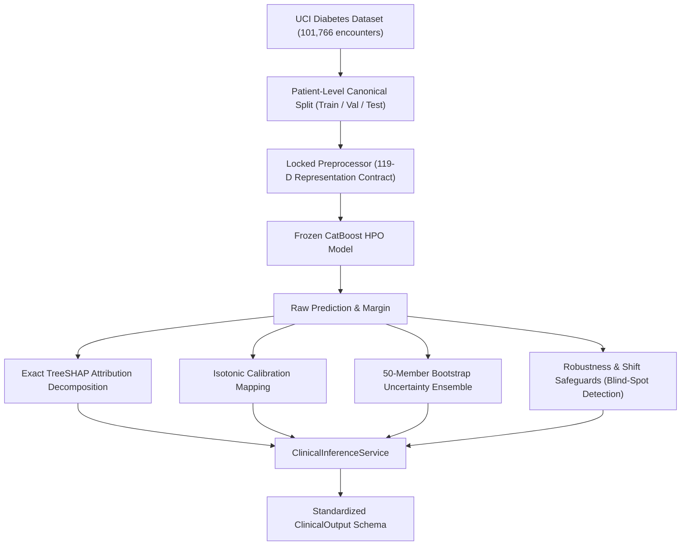

# FusionMedAI

> Research framework for multimodal diabetes-related risk assessment using independent imaging and clinical prediction models.

[](https://www.python.org/downloads/release/python-3120/)
[](https://pytorch.org/)
[](LICENSE)

---

## Abstract

FusionMedAI is a research framework for decision-level multimodal diabetes-related risk assessment that combines independently evaluated and frozen retinal, diabetic foot-ulcer, and structured clinical prediction models through confidence-, reliability-, uncertainty-, quality-, and availability-aware routing (ACARA-U).

> [!IMPORTANT]
> **Methodological Scope & Boundary**: Because public retrospective datasets (APTOS 2019 Retina, ADPM V3.3 Foot Ulcer, UCI 130-Hospitals Clinical EHR) are not patient-paired across modalities, multimodal experiments are executed on controlled decision packets rather than real multimodal patient cohorts. The framework evaluates decision-level routing mechanics, uncertainty discounting, missingness robustness, conflict dynamics, and distribution stability; it does not claim patient-level multimodal clinical validation.

Across controlled experiments, ACARA-U preserved routing invariants under missing modalities, redistributed authority according to instance-level signals and global reliability priors, maintained fail-closed behavior under zero available modalities, characterized cross-modality conflict, and preserved routing invariants across the tested modality-combination frequency distributions. The repository separates implementation, experimental procedures, evaluation artifacts, verification suites, and frozen model contracts.

---

## System Architecture


*Figure 1. FusionMedAI research architecture.*

The system follows independent modality development followed by decision-level fusion:

```text
                         Input Modalities
                               │
              ┌────────────────┼────────────────┐
              │                │                │
              ▼                ▼                ▼
           Retina             Foot           Clinical
           Images            Images           EHR
              │                │                │
              ▼                ▼                ▼
         Modality-Specific Prediction Models
              │                │                │
              ▼                ▼                ▼
         Probability + Uncertainty + Explanation
              │                │                │
              └────────────────┼────────────────┘
                               ▼
                     Decision-Level Fusion
                               │
                               ▼
                        Unified Output
```

The fusion layer operates on standardized model outputs and their uncertainty/quality statistics, rather than concatenating heterogeneous raw inputs.


```mermaid
flowchart TD
    subgraph Modalities["Independent Modality Models"]
        R["Retinal Imaging (Fundus)"]
        F["Foot-Ulcer Imaging (Wagner Grade)"]
        C["Structured Clinical Data (119-D EHR)"]
    end
    
    subgraph Contracts["Standardized Modality Contracts (8-Tuple)"]
        RO["Retina: (r_R, p_cal, C_R, U_R, Q_R, A_R, R_R, ver)"]
        FO["Foot: (r_F, p_cal, C_F, U_F, Q_F, A_F, R_F, ver)"]
        CO["Clinical: (r_C, p_cal, C_C, U_C, Q_C, A_C, R_C, ver)"]
    end
    
    R --> RO
    F --> FO
    C --> CO
    
    subgraph RouterStage["ACARA-U Dynamic Router"]
        Router["Scoring Kernel: z_i = α C_i + β R_i - γ U_i + η Q_i<br/>Hard Masking: A_i = 0 ⇒ w_i = 0<br/>Stable Softmax: w_i = exp(z_i - m) / Σ exp(z_j - m)"]
    end
    
    RO --> Router
    FO --> Router
    CO --> Router
    
    subgraph DCRIStage["Decision-Level Fusion & DCRI Derived Risk Index"]
        Fused["Fused Risk: R_fusion = Σ w_i r_i"]
        Penalty["Uncertainty Penalty: P_U = δ Σ U_i"]
        DCRI["DCRI Derived Index: DCRI_δ = R_fusion - δ Σ U_i"]
        Fused --> DCRI
        Penalty --> DCRI
    end
    
    Router --> DCRIStage
    
    subgraph ConflictStage["Conflict & Discordance Analysis"]
        Conflict["Pairwise Divergence & Disagreement Matrices (Δ_max, Δ_mean, σ_w)"]
    end
    
    Router --> ConflictStage
```

---

## Research Questions & Evaluation Framework

### Primary Research Question

> **Can independently evaluated modality-specific prediction models be combined through adaptive decision-level routing that behaves predictably under predictive uncertainty, missing modalities, cross-modality disagreement, and changing modality-combination distributions?**

### Supporting Research Questions

- **RQ1 (Modality Validity)**: Are the three modality-specific models sufficiently characterized in discrimination, calibration, uncertainty, explainability, and robustness to provide standardized inputs to the fusion layer?
- **RQ2 (Adaptive Decision-Level Routing)**: Does the ACARA-U scoring kernel ($z_i = \alpha C_i + \beta R_i - \gamma U_i + \eta Q_i$) dynamically allocate decision authority across active channels while strictly preserving the weight simplex?
- **RQ3 (Missing-Modality Safety)**: Does hard availability masking ($A_i = 0 \implies \tilde{z}_i = -\infty \implies w_i = 0.0$) strictly prevent unavailable modalities from exerting decision authority?
- **RQ4 (Uncertainty-Penalized Aggregation)**: How does additive uncertainty discounting affect the derived decision index $\text{DCRI}_\delta = R_{\text{fusion}} - \delta \sum U_i$ across varying modality counts?
- **RQ5 (Cross-Modality Conflict Quantification)**: Can inter-modality risk divergence be systematically quantified ($\Delta_{\max}, \Delta_{\text{mean}}, \sigma_w$) without treating discordance as clinical synergy or unearned certainty?
- **RQ6 (Modality-Combination Robustness)**: Does routing remain behaviorally well-defined when modality-combination frequencies shift from balanced (D1) to moderate (D2) and strong-tail (D3) controlled distributions?
- **RQ7 (Tail Sensitivity Benchmarking)**: How does ACARA-U compare with baseline fusion strategies in tail-tier risk sensitivity under sparse modality-combination distributions?

---

## Scientific Status & Research Progress

| Component / Research Phase | Status | Primary Output / Invariant Verified |
| :--- | :---: | :--- |
| **Retina Modality (APTOS 2019)** | **FROZEN** | EfficientNet-B3 ($\text{QWK}=0.9233$), Temperature Scaling ($\text{ECE}=0.0241$), MC Dropout ($N=25$) |
| **Foot Ulcer Modality (ADPM V3.3)** | **FROZEN** | EfficientNet-B3 ($\text{Macro F1}=0.6683$), Vector Scaling ($\text{ECE}=0.0313$), MC Dropout ($N=10$) |
| **Clinical EHR Modality (UCI 130-Hospitals)** | **FROZEN** | CatBoost HPO (Test $\text{AUC} \approx 0.65$; $0.6504$ benchmark / $0.6495$ calibration), Isotonic Calibration, 20-member Bootstrap Ensemble, TreeSHAP |
| **Standardized Modality Contracts** | **FROZEN** | Unified 8-tuple schema `(risk, p_cal, conf, unc, qual, avail, rel, ver)` |
| **Input Quality & Availability Layer** | **FROZEN** | Deterministic quality scoring $Q_i \in [0, 1]$ and hard availability gating $A_i \in \{0, 1\}$ |
| **Global Reliability Priors** | **FROZEN** | Frozen validation evidence: $R_R = 0.929956 > R_F = 0.922266 > R_C = 0.825382$ |
| **ACARA-U Dynamic Router** | **FROZEN** | Scoring kernel $z_i = 1.0 C_i + 1.5 R_i - 1.0 U_i + 0.5 Q_i$ with stable softmax |
| **Comparative Baseline Ladder (B1–B6)** | **EVALUATED** | Evaluated against Winner-Take-All (B1), Uniform (B2), Conf (B3), Conf+Rel (B4), Conf+Rel-U (B5) |
| **DCRI Derived Risk Index Aggregation** | **EVALUATED** | $R_{\text{fusion}} \in [0, 1]$, unclamped negative $\text{DCRI} \in [-\delta M, 1]$; $\delta=0.20$ is provisional default |
| **Cross-Modality Conflict Analysis** | **FROZEN** | Discordance metrics $\Delta_{\max}, \Delta_{\text{mean}}, \sigma_w$; low linear correlation with uncertainty ($r=0.088$) |
| **Missing Modality Robustness** | **EVALUATED** | 0 availability violations / 7,500 trials; invariant under corrupted inputs; fail-closed rejection |
| **Combination & Tail Robustness** | **EVALUATED** | Evaluated across D1, D2, D3 ($N=500$); lowest point-estimate tail sensitivity among soft baselines |
| **Input Degradation Robustness** | **FROZEN** | Evaluated across 12 operators ($N=500$); dynamic quality attenuation $\text{RAR}=35.2\text{--}50.5\%$; B6 vs B5 isolation ($95\%$ CI strictly $< 0$) |
| **Modality Calibration Impact on Decision Fusion** | **FROZEN** | Evaluated across B0–B5 conditions ($N=500$); redistributes authority toward foot and clinical channels ($\Delta w_R = -0.0156$, $95\%$ CI: $[-0.0168, -0.0144]$); entropy-stable |
| **DCRI Parameter Selection & Decision Analysis** | **NEXT** | Pre-specified selection and sensitivity analysis of the uncertainty penalty discount $\delta$ |
| **Parameter & Weighting Sensitivity Analysis** | **NEXT** | Systematic evaluation of routing parameters ($\alpha, \beta, \gamma, \eta$) and ablation study |
| **Patient-Level External / Clinical Validation** | **PLANNED** | Requires genuinely paired multimodal cohorts |


---

## What the Multimodal Decision Fusion Research Established

### 1. Dynamic Routing & Invariant Preservation
The ACARA-U scoring kernel assigns authority dynamically based on predictive confidence, global reliability priors, uncertainty, and quality. Inactive modalities receive hard masking ($A_i = 0 \implies w_i = 0.000000$), and active channel weights strictly sum to unity across all evaluated combinations.

### 2. Missing-Modality Safety & Fail-Closed Gating
Unavailable modalities are strictly gated with zero weight allocation without altering active channel proportions. Zero available modalities ($\text{EMPTY}$) unconditionally returns `NO_MODALITY_AVAILABLE`; numerical risk outputs are set to zero only as a sentinel and must not be interpreted as low clinical risk.

### 3. Tail Sensitivity & Comparative Soft Baselines
ACARA-U produced the lowest observed point-estimate tail risk deviation among evaluated soft-weighting baselines (B2–B5). Paired bootstrap confidence intervals against B5 cross zero, indicating a consistent directional point estimate without statistically significant separation under the current cohort size. Winner-take-all B1 achieved lower nominal tail sensitivity by exclusively selecting Retina, but suffered substantial head dispersion inflation, showing that its lower tail sensitivity came from exclusive single-modality selection rather than adaptive multi-modal aggregation.

### 4. Cross-Modality Conflict Characterization
Pairwise risk divergence and weighted consensus dispersion provide systematic discordance profiling across active channels. Observed low linear correlation between conflict magnitude and summed modality uncertainty ($r=0.088$) confirms that discordance behaves as a distinct diagnostic signal rather than a reflection of individual uncertainty.

### 5. Modality-Combination Risk Dispersion
Higher tail risk variance was observed in lower-cardinality tail tiers, consistent with reduced multi-channel averaging in single-modality encounters, while head-tier mean risk remained stable across tested frequency profiles.

### 6. Quality-Aware Routing Attenuation & Baseline Isolation
In a controlled synthetic raw-input degradation benchmark ($N=500$, $\text{seed}=115$), unsupervised quality engines systematically detected progressive signal decay ($100.0\%$ packet monotonicity rate), causing the ACARA-U router to dynamically attenuate degraded channel authority by $35.2\%\text{--}50.5\%$. Paired baseline comparison against B5 showed significantly greater authority attenuation under B6 than B5 ($-0.1697$ vs $-0.0388$, paired difference $D = -0.1309$, $95\%$ bootstrap CI: $[-0.1319, -0.1300]$, strictly excluding zero), supporting the incremental contribution of the quality term within the tested benchmark.

### 7. Modality Calibration Impact on Decision Fusion
In a controlled benchmark ($N=500$, $\text{seed}=115$), applying frozen modality probability calibration (Retina Temperature Scaling, Foot Vector Scaling, Clinical Isotonic) reduced constituent validation ECE by $36.9\%\text{--}100.0\%$. Propagating calibrated probabilities into the ACARA-U router softened overconfident retinal authority ($\overline{\Delta w_R} = -0.0156$, $95\%$ bootstrap CI: $[-0.0168, -0.0144]$), reallocating authority toward clinical ($\overline{\Delta w_C} = +0.0101$) and foot ($\overline{\Delta w_F} = +0.0055$) channels while maintaining exact simplex conservation ($\sum w_i = 1.000000$), stable routing entropy ($\Delta H(w) = +0.0059$), and persistent degradation attenuation.

---

## Research Methodology

Each modality follows a controlled evaluation sequence:


```mermaid
flowchart TD
    A["Dataset Definition & Quality Audit"] --> B["Data Integrity & Leakage Analysis"]
    B --> C["Preprocessing & Representation Contract"]
    C --> D["Exploratory Data Analysis"]
    D --> E["Baseline Framework"]
    E --> F["Architecture Benchmarking"]
    F --> G["Validation-Only Model Selection"]
    G --> H["Post-Hoc Explainability"]
    H --> I["Probability Calibration"]
    I --> J["Uncertainty Quantification"]
    J --> K["Robustness & Subgroup Auditing"]
    K --> L["End-to-End Inference Integration"]
    L --> M["Automated Verification Gate"]
```

### Clinical Research Pipeline

The clinical modality follows this methodology to address structured healthcare data challenges involving missingness, repeated encounters, class imbalance, probability distortion, and silent failure modes:


```mermaid
flowchart TD
    D1["UCI Diabetes Dataset (101,766 encounters)"] --> S1["Patient-Level Canonical Split (Train / Val / Test)"]
    S1 --> P1["Locked Preprocessor (119-D Representation Contract)"]
    P1 --> M1["Frozen CatBoost HPO Model"]
    M1 --> BR["Raw Prediction & Margin"]
    BR --> E1["Exact TreeSHAP Attribution Decomposition"]
    BR --> C1["Isotonic Calibration Mapping"]
    BR --> U1["50-Member Bootstrap Uncertainty Ensemble"]
    BR --> R1["Robustness & Shift Safeguards (Blind-Spot Detection)"]
    E1 --> INT["ClinicalInferenceService"]
    C1 --> INT
    U1 --> INT
    R1 --> INT
    INT --> OUT["Standardized ClinicalOutput Schema"]
```

---

## Empirical Results Summary Dashboard

A consolidated summary of principal findings across the research program:

| Analysis Dimension | Evaluated Modality / Experiment | Primary Metric / Result | Interpretation & Scope Note |
| :--- | :--- | :---: | :--- |
| **Retina Discrimination** | APTOS 2019<br>(EfficientNet-B3) | **$84.20\%$ Acc<br>$0.9233$ QWK** | Selected under pre-specified architecture-selection criterion ($10.70\text{M}$ params). |
| **Retina Calibration** | Temperature Scaling<br>($N=366$) | **$\text{ECE} = 0.0241$** | Preserved rank ordering while aligning confidence. |
| **Retina Uncertainty** | MC Dropout<br>($N^*=25$) | **$\text{Error AUROC}$<br>$= 0.8443$** | Strong discrimination between correct and misclassified fundus scans. |
| **Foot Ulcer Discrimination** | ADPM V3.3<br>(EfficientNet-B3) | **$\text{Macro F1}$<br>$= 0.6683$** | Wagner 4-class held-out test evaluation ($N=1,006$). |
| **Foot Ulcer Calibration** | Vector Scaling<br>($N=1,006$) | **$\text{ECE} = 0.0313$** | $26.18\%$ relative ECE reduction over uncalibrated baseline. |
| **Foot Ulcer Uncertainty** | MC Dropout<br>($N^*=10$) | **$\text{Entropy AUROC}$<br>$= 0.7291$** | Risk-coverage selective prediction reduces error from $32.3\%$ to $11.2\%$. |
| **Clinical Discrimination** | CatBoost HPO<br>($N_{\text{test}}=14,913$) | **$\text{ROC-AUC}$<br>$= 0.6494$** | Reported as an observed result of the retrospective prediction task ($D=119$). |
| **Clinical Probability Quality** | Raw CatBoost<br>Test ECE | **$\text{ECE} = 0.0032$** | Isotonic chosen on validation NLL; Beta achieved test slope $0.9720$. |
| **Clinical Attribution Stability** | TreeSHAP<br>Val vs Test | **$\rho = 0.9994$<br>($100\%$ Top-20)** | Inpatient history ($22.43\%$) & complexity ($21.23\%$) dominate margin. |
| **Clinical Uncertainty** | 50-Bootstrap<br>CatBoost Ensemble | **$\text{Error AUROC}$<br>$= 0.7116$** | 50-member bootstrap ensemble used for standalone analysis; fusion contract uses 20 members. |
| **Selective Classification** | Risk-Coverage<br>(80% Coverage) | **$10.23\%$ Error** | $31.0\%$ error reduction achieved by rejecting $20\%$ most uncertain cases. |
| **Shift Sensitivity Signal** | Random Missingness<br>($50\%$ MCAR) | **$\sigma_p = 0.0491$<br>($+124.2\%$)** | Predictive dispersion systematically inflates under information loss. |
| **Uncertainty Blind Spot** | Masked Prior<br>Inpatient History | **$\text{AUC} = 0.5795$<br>$\sigma_p = 0.0150$** | Severe discrimination loss with deceptively low uncertainty (Q4 failure). |
| **End-to-End Throughput** | Local CPU Batch<br>($N=14,913$) | **$3,345.7$<br>encounters/sec** | Local CPU software benchmark; not a clinical deployment claim. |
| **Multimodal Routing Ladder** | Baseline Ladder<br>B1–B6 ($N=500$) | **Retina $47.7\%$<br>Foot $26.8\%$<br>Clinical $25.5\%$** | ACARA-U dynamic allocation exhibits routing entropy $1.0176$ vs uniform $1.0986$. |
| **DCRI Derived Risk Index** | Uncertainty Discount<br>($\delta=0.20$) | **Mean $= 0.1617$<br>($24.6\%$ Negative)** | Unclamped derived index ($R_{\text{fusion}}=0.2885$, penalty $=0.1268$); $\delta=0.20$ is provisional. |
| **Cross-Modality Conflict** | Discordance Family<br>($N=500$) | **$\Delta_{\max} = 0.5203$<br>$\sigma_w = 0.2150$** | Conflict in $72.6\%$ ($363/500$) under operational HIGH threshold ($\Delta_{\max} \ge 0.35$). |
| **Missing Modality Robustness** | Availability Masking<br>($N=500$) | **0 violations<br>7,500 trials** | ACARA-U reallocates authority across available modalities and fails closed under zero modalities. |
| **Combination & Tail Robustness** | Controlled distributions<br>D1, D2, D3 ($N=500$) | **0 simplex violations<br>1,500 trials** | Routing invariants preserved across D1–D3; ACARA-U produced lowest observed soft-baseline tail sensitivity ($D_{\text{tail}}=0.1883$), non-significant vs B5. |
| **Tail Dispersion Expansion** | Head vs Tail Tiers<br>(D2 & D3 Distributions) | **$\Delta \sigma = +0.0628\text{ (D2)}$<br>$\Delta \sigma = +0.0885\text{ (D3)}$** | Higher tail risk variance was observed in lower-cardinality tail tiers, consistent with reduced multi-channel averaging. |
| **Input Degradation Robustness** | Controlled Signal Degradation<br>($12\text{ Operators}, N=500$) | **$\text{RAR} = 35.2\text{--}50.5\%$<br>$100.0\%\text{ Monotonic}$** | Controlled synthetic benchmark; quality systematically decays; ACARA-U attenuates degraded authority ($\Delta w_R = -0.1697$ at Severe D3 Blur). |
| **Quality Awareness Isolation** | ACARA-U (B6) vs Baseline B5<br>(Severe Degradation D3) | **$D = -0.1309$<br>($95\%\text{ CI } < 0$)** | Paired comparison showed greater attenuation under B6 vs B5 ($4.3\times$, $[-0.1319, -0.1300]$ $95\%$ CI), supporting incremental contribution within tested benchmark. |
| **Calibration Routing Shift** | Calibrated vs Uncalibrated ACARA-U<br>(Clean D0 Benchmark, $N=500$) | **$\Delta w_R = -0.0156$<br>($95\%\text{ CI } < 0$)** | Mitigates overconfidence bias; softens retinal authority ($[-0.0168, -0.0144]$ $95\%$ CI) and reallocates authority to clinical ($+0.0101$) and foot ($+0.0055$). |


---

## Modality Design

### 1. Retinal Imaging Modality

The Retina pipeline evaluates diabetic retinopathy severity from fundus imaging using the APTOS 2019 dataset ($3,662$ images across 5 severity stages).

#### Backbone Benchmarking
Five deep learning architectures were evaluated under a controlled, leakage-aware protocol on the held-out test partition ($N=367$):

| Rank | Model Architecture | Test Accuracy | Balanced Acc | Macro F1 | Quadratic Weighted Kappa (QWK) | Test ROC-AUC | Parameters | GPU Latency |
| :---: | :--- | :---: | :---: | :---: | :---: | :---: | :---: | :---: |
| 1 | **EfficientNet-B3** (Selected) | **84.20%** | 67.22% | 0.6813 | **0.9233** | 0.9457 | 10.70M | 12.64 ms |
| 2 | **ConvNeXt-Tiny** | 81.20% | **72.05%** | **0.6893** | 0.9145 | **0.9587** | 27.82M | **5.65 ms** |
| 3 | **EfficientNet-B0** | 79.29% | 67.68% | 0.6505 | 0.9101 | 0.9353 | **4.01M** | 8.08 ms |
| 4 | **Swin-Tiny** | 78.75% | 66.35% | 0.6406 | 0.8973 | 0.9516 | 27.52M | 12.89 ms |
| 5 | **ViT-B/16** | 77.38% | 58.01% | 0.5804 | 0.8656 | 0.9225 | 85.80M | 15.16 ms |

- **Selection**: EfficientNet-B3 was selected under the pre-specified architecture-selection criterion balancing quadratic weighted kappa ($0.9233$), inference latency ($12.64\text{ ms}$), and parameter count ($10.70\text{M}$).
- **Calibration & Uncertainty**: Temperature Scaling calibrates multi-class softmax distributions ($\text{ECE} = 0.0241$). 25-pass MC Dropout provides predictive uncertainty estimates, with predictive variance used by the fusion contract ($\text{Error Detection AUROC} = 0.8443$).
- **Explainability**: Spatial Grad-CAM visualizes pathological features (microaneurysms, hemorrhages, hard exudates).

---

### 2. Diabetic Foot Ulcer Modality

The Foot Ulcer pipeline classifies wound severity across four Wagner grades using the ADPM V3.3 dataset ($10,062$ audited images grouped into $1,770$ canonical source-image patient clusters to prevent identity leakage):

| Class | Clinical Description | Train Images | Val Images | Test Images |
| :--- | :--- | :---: | :---: | :---: |
| **Grade 1** | Superficial ulcer | 1,985 | 248 | 248 |
| **Grade 2** | Deep ulcer without bone involvement | 2,042 | 255 | 255 |
| **Grade 3** | Deep ulcer with abscess, osteomyelitis, joint sepsis | 2,015 | 252 | 252 |
| **Grade 4** | Localized gangrene / necrosis | 1,996 | 251 | 251 |
| **Total** | **4-Class Partitioned Cohort** | **8,038** | **1,006** | **1,006** |

#### Backbone Benchmarking
Six candidate models were evaluated under identical controlled conditions against the ResNet-50 baseline on the held-out test partition ($N=1,006$):

| Rank | Model Architecture | Macro F1 | Balanced Accuracy | Macro ROC-AUC | Parameters | Latency (GPU, T4) |
| :---: | :--- | :---: | :---: | :---: | :---: | :---: |
| 1 | **EfficientNet-B3** (Selected) | **0.6683** | **0.6672** | **0.8685** | **10.70M** | **70.39 ms** |
| 2 | **EfficientNet-B0** | 0.6672 | 0.6656 | 0.8431 | 4.01M | 37.89 ms |
| 3 | **ConvNeXt-Tiny** | 0.6566 | 0.6562 | 0.8613 | 27.82M | 109.61 ms |
| 4 | **ResNet-50** (Baseline) | 0.6339 | 0.6391 | 0.8423 | 23.51M | — |
| 5 | **Swin-Tiny** | 0.6266 | 0.6262 | 0.8269 | 27.52M | 129.09 ms |
| 6 | **ViT-B/16** | 0.5788 | 0.5878 | 0.8364 | 85.80M | 310.28 ms |

#### Probability Calibration & Uncertainty
Evaluated on frozen EfficientNet-B3 on the held-out test partition ($N=1,006$):

| Calibration Method | Test NLL | Test ECE | Accuracy | Macro F1 | Balanced Accuracy |
| :--- | :---: | :---: | :---: | :---: | :---: |
| **Raw Uncalibrated** | 0.8779 | 0.0424 | 0.6690 | 0.6683 | 0.6672 |
| **Temperature Scaling** | 0.8785 | 0.0388 | 0.6690 | 0.6683 | 0.6672 |
| **Vector Scaling** (Selected) | **0.8749** | **0.0313** | **0.6769** | **0.6758** | **0.6753** |

- **Uncertainty Quantification**: 10-pass MC Dropout evaluated for error detection ($\text{Entropy AUROC} = 0.7291$, $\text{Entropy AUPRC} = 0.5391$; $\text{Variance AUROC} = 0.6508$, $\text{Mutual Info AUROC} = 0.6399$). Predictive entropy is the uncertainty statistic used by the fusion contract.
- **Selective Prediction**: Risk-coverage rejection progressively reduces test error rate from $32.31\%$ (100% coverage) to $11.20\%$ (50% coverage).
- **Explainability**: Spatial Grad-CAM at `backbone.features[8]` passes parameter randomization sanity checks ($\rho = 0.0000$).

---

### 3. Structured Clinical Tabular Modality

The Clinical modality evaluates structured hospital EHR data for 30-day diabetic readmission risk using the UCI Diabetes 130-US Hospitals dataset ($101,766$ encounters across 130 facilities, 1999–2008).
- **Data Partitions**: Patient-level canonical splitting prevents cross-partition identity leakage:
  - **Training Partition**: 69,519 encounters (48,993 patients)
  - **Validation Partition**: 14,911 encounters (10,498 patients)
  - **Locked Test Partition**: 14,913 encounters (10,499 patients; 1,664 positive readmissions)
- **119-D Representation Contract**: Encodes demographics, admission types, discharge dispositions, encounter durations, laboratory assays, ICD-9 diagnostic chapters, and 23 diabetic medication dynamics.

#### Frozen Model Configuration

| Parameter | Frozen Value | Verification Status |
| :--- | :---: | :--- |
| **Model Architecture** | `CatBoostClassifier` (Symmetric Oblivious Trees) | Frozen |
| **Tree Depth** | `4` | Locked |
| **Learning Rate** | `0.1383` | Locked |
| **Iterations** | `350` | Locked |
| **L2 Leaf Regularization** | `2.911` | Locked |
| **Subsample Ratio** | `0.655` | Locked |
| **Random Seed** | `42` | Locked |
| **Feature Dimension** | `119` | Contract Verified |

---

## Detailed Clinical Empirical Results

### 1. Tabular Architecture Benchmarking & HPO

Seven tabular architectures were benchmarked on the frozen 119-dimensional representation:

| Architecture | Test ROC-AUC | Test PR-AUC | Test Brier | Test ECE | Train Time | Latency / 1k | Serialized Size |
| :--- | :---: | :---: | :---: | :---: | :---: | :---: | :---: |
| **CatBoost (HPO Tuned)** | **0.6504** | **0.2063** | **0.0952** | 0.0053 | 3.87 s | 2.35 ms | 415.6 KB |
| **CatBoost (Baseline)** | 0.6472 | 0.2038 | 0.0953 | 0.0066 | 3.87 s | 2.35 ms | 415.6 KB |
| **XGBoost** | 0.6467 | 0.2035 | 0.0953 | 0.0051 | 1.20 s | 1.65 ms | 260.2 KB |
| **LightGBM** | 0.6461 | 0.2038 | 0.0953 | **0.0045** | **0.58 s** | 3.18 ms | 318.2 KB |
| **Logistic Regression (L2)** | 0.6446 | 0.1969 | 0.0958 | 0.0080 | 2.09 s | **1.13 ms** | **1.8 KB** |
| **Logistic Regression (ElasticNet)** | 0.6445 | 0.1971 | 0.0958 | 0.0084 | 2.45 s | 1.15 ms | 1.8 KB |
| **Random Forest** | 0.6422 | 0.1991 | 0.0959 | 0.0098 | 2.58 s | 44.83 ms | 5,519.4 KB |
| **TabNet** | 0.6252 | 0.1887 | 0.0962 | 0.0105 | 77.27 s | 19.93 ms | 1,099.7 KB |

*Scope Note: The moderate ROC-AUC ($0.6494$ locked test / $0.6504$ HPO benchmark) is reported as an observed result of the retrospective tabular prediction task.*

### 2. Model Explainability (Exact TreeSHAP)

Post-hoc interpretability on the frozen CatBoost model ($N=14,913, D=119$) without test labels:

| Rank | Feature | Clinical Group | Mean \|SHAP\| | Attribution Share | Cumulative Share | Directionality ($r$) |
| :---: | :--- | :--- | :---: | :---: | :---: | :---: |
| 1 | `number_inpatient` | Prior Healthcare Utilization | $0.2851$ | $22.43\%$ | $22.43\%$ | $+0.9531$ |
| 2 | `age_ordinal` | Age & Glycemic Monitoring | $0.1000$ | $7.86\%$ | $30.29\%$ | $+0.8604$ |
| 3 | `time_in_hospital` | Acute Clinical Complexity | $0.0814$ | $6.41\%$ | $36.70\%$ | $+0.6754$ |
| 4 | `number_diagnoses` | Acute Clinical Complexity | $0.0668$ | $5.26\%$ | $41.95\%$ | $+0.9582$ |
| 5 | `payer_code_grouped_Missing` | Encounter Context & Admin | $0.0510$ | $4.01\%$ | $45.96\%$ | $+0.9533$ |
| 6 | `insulin_exposure` | Diabetic Medications | $0.0472$ | $3.71\%$ | $49.68\%$ | $+0.9292$ |
| 7 | `num_medications` | Acute Clinical Complexity | $0.0449$ | $3.54\%$ | $53.21\%$ | $+0.5969$ |
| 8 | `diabetesMed_binary` | Treatment Dynamics | $0.0437$ | $3.44\%$ | $56.65\%$ | $+0.9757$ |
| 9 | `num_procedures` | Acute Clinical Complexity | $0.0409$ | $3.22\%$ | $59.87\%$ | $-0.7700$ |
| 10 | `number_emergency` | Prior Healthcare Utilization | $0.0379$ | $2.98\%$ | $62.86\%$ | $+0.5749$ |

- **Attribution Grouping**: Prior Healthcare Utilization ($26.22\%$) and Acute Clinical Complexity ($21.23\%$) account for $47.45\%$ of total attribution.
- **Ranking Stability**: Validation vs locked-test attribution ranking correlation $\rho = 0.9994$ ($p = 3.86 \times 10^{-172}$) with $100\%$ Top-20 feature overlap.
- **Scope Note**: SHAP attributions reflect additive contributions in model log-odds margin space and do not establish causal clinical mechanisms.

### 3. Probability Calibration & Decision Utility

Post-hoc calibration evaluated across four transformation methods on the frozen CatBoost model:

| Method | Val Log Loss | Val Brier | Val ECE | Test Log Loss | Test Brier | Test ECE | Test Slope | Test PR-AUC | Test ROC-AUC |
| :--- | :---: | :---: | :---: | :---: | :---: | :---: | :---: | :---: | :---: |
| **Raw CatBoost** | 0.3437 | 0.0990 | 0.0048 | **0.3338** | **0.0953** | **0.0032** | 0.9492 | **0.2035** | **0.6495** |
| **Platt Scaling** | 0.3436 | 0.0990 | 0.0030 | 0.3339 | 0.0954 | 0.0054 | 0.9661 | **0.2035** | **0.6495** |
| **Beta Calibration** | 0.3436 | 0.0990 | 0.0040 | 0.3338 | 0.0953 | 0.0062 | **0.9720** | **0.2035** | **0.6495** |
| **Isotonic Regression** | **0.3420** | **0.0986** | **0.0000** | 0.3359 | 0.0956 | 0.0062 | 0.8541 | 0.1931 | 0.6475 |

- **Protocol Selection**: Isotonic Regression was selected under the pre-specified minimum-validation-NLL criterion ($\text{Val NLL}=0.3420$). On held-out test data, Beta Calibration achieved the strongest parametric slope ($0.9720$) while raw CatBoost had the lowest ECE ($0.0032$).
- **Decision Curve Analysis**: Positive net benefit demonstrated across $\theta \in [0.05, 0.25]$. At $\theta = 0.15$, captures $40.05\%$ of readmissions while reducing unnecessary workload by $76.37\%$.

### 4. Prediction Uncertainty Quantification

Predictive uncertainty quantified using a **50-member Bootstrap Ensemble** evaluated on the locked test partition ($N=14,913$):

| Uncertainty Metric | Measured Test Value | Operational Function |
| :--- | :---: | :--- |
| **Bootstrap Ensemble Size ($M$)** | $50\text{ models}$ | Selected by empirical convergence audit ($\rho = 0.9994$). |
| **Mean Predictive Uncertainty ($\sigma_p$)** | $0.0219$ | Average standard deviation of predicted readmission probability. |
| **Median Predictive Uncertainty** | $0.0162$ | Skewed distribution (IQR: $[0.0114, 0.0249]$, 90th percentile: $0.0421$). |
| **Error Detection AUROC ($\theta=0.20$)** | **$0.7116$** | Quantifies ability of uncertainty to identify model misclassifications. |
| **Error Detection AUPRC ($\theta=0.20$)** | **$0.3256$** | $+119.6\%$ improvement over random baseline ($0.1483$). |
| **Risk-Coverage AURC** | **$0.0763$** | Area under the risk-coverage selective prediction curve. |
| **Excess AURC (E-AURC)** | **$0.0647$** | Distance to theoretical oracle selective predictor ($\text{AURC}_{\text{oracle}} = 0.0116$). |
| **Error Rate at 80% Coverage** | **$10.23\%$** | $31.0\%$ relative error reduction achieved by rejecting top $20\%$ uncertain cases. |

### 5. Robustness, Subgroup Audit & Distribution Shift

Evaluated across 11 distribution shift scenarios without model retraining or re-fitting:

| Scenario / Shift Domain | Cohort (N) | Test ROC-AUC | Δ ROC-AUC | Calibration Slope | Mean Uncertainty (σ_p) | Δ Mean σ_p | Error Rate (θ=0.20) | Error AUROC |
| :--- | :---: | :---: | :---: | :---: | :---: | :---: | :---: | :---: |
| **Nominal Test Reference** | 14,913 | **0.6494** | — | **0.8617** | **0.0219** | — | **14.38%** | **0.7053** |
| **Missingness +10% MCAR** | 14,913 | 0.6266 | -0.0229 | 0.6884 | 0.0316 | +44.3% | 14.39% | 0.6768 |
| **Missingness +25% MCAR** | 14,913 | 0.6038 | -0.0456 | 0.4324 | 0.0418 | +90.6% | 13.57% | 0.6430 |
| **Missingness +50% MCAR** | 14,913 | 0.5663 | -0.0831 | 0.0278 | 0.0491 | +124.2% | 12.23% | 0.5916 |
| **Targeted Glycemic Mask** | 14,913 | 0.6470 | -0.0024 | 0.7863 | 0.0293 | +33.6% | 15.32% | 0.7190 |
| **Targeted Meds Mask** | 14,913 | 0.6445 | -0.0049 | 0.8164 | 0.0199 | -9.1% | 13.50% | 0.6879 |
| **Targeted Utilization Mask** | 14,913 | **0.5795** | **-0.0699** | 0.6030 | **0.0150** | **-31.6%** | 11.12% | **0.5638** |
| **Demographic: Female** | 8,079 | **0.6661** | +0.0166 | **0.9675** | 0.0223 | +1.6% | 14.28% | 0.7156 |
| **Demographic: Male** | 6,834 | 0.6311 | -0.0184 | 0.7379 | 0.0215 | -1.9% | 14.50% | 0.6935 |
| **Demographic: Age <50** | 2,363 | **0.7048** | +0.0554 | 0.7311 | 0.0240 | +9.5% | 13.92% | 0.7607 |
| **Demographic: African American** | 2,775 | **0.6643** | +0.0148 | **0.9665** | 0.0218 | -0.4% | 14.88% | 0.7431 |
| **Temporal: Early Era (1999–2003)** | 7,456 | **0.6627** | +0.0133 | **0.9022** | 0.0212 | -3.3% | 14.40% | 0.7037 |
| **Temporal: Late Era (2004–2008)** | 7,457 | 0.6371 | -0.0123 | 0.8414 | 0.0226 | +3.3% | 14.36% | 0.7073 |

- **Empirical Sensitivity Signal**: Predictive uncertainty actively inflates under random MCAR degradation ($+44.3\%$ at $10\%$, $+124.2\%$ at $50\%$).
- **Tabular Uncertainty Blind Spot**: Masking `number_inpatient` drops ROC-AUC to $0.5795$ while uncertainty paradoxically decreases to $\sigma_p = 0.0150$, showing that low predictive uncertainty does not necessarily indicate reliable predictions under structured feature omission.
- **Subgroup Calibration**: Similar calibration slopes were observed for the evaluated African American ($\beta = 0.9665$) and Female ($\beta = 0.9675$) subgroups.

### 6. End-to-End Clinical Integration & Verification

The clinical components are assembled into a unified inference service ([`ClinicalInferenceService`](src/clinical/inference/service.py)):

| Evaluation Dimension | Metric / Result | Technical Detail |
| :--- | :---: | :--- |
| **Local CPU Batch Throughput** | **$3,345.7\text{ encounters/sec}$** | Full locked test set ($N=14,913$) evaluated in $4.46\text{ seconds}$ on CPU. |
| **Output Schema Conformance** | **$100.0\%$ Compliant** | Strictly conforms to the frozen `ClinicalOutput` schema contract. |
| **Exact TreeSHAP Additivity** | **Abs Error = 8.88e-16** | Exact margin consistency verified: $\phi_0 + \sum \phi_j = f(x) = -3.948183$ ($\text{tol}=10^{-6}$). |
| **Calibration Integration** | Dynamic Mapping | Verifies monotone mapping ($p_{\text{raw}}=0.0123 \to p_{\text{cal}}=0.0000$ lower boundary). |
| **Uncertainty & Ambiguity Tiers** | $\sigma_p \in [0.005, 0.080]$ | Operational stratification into 6 tiers around the decision threshold $\theta = 0.20$. |
| **Shift & Blind-Spot Guardrails** | Active Triggering | Emits warnings for zero-inpatient history cases under low predicted risk. |
| **Input Validation Safeguards** | Zero-Crash Rejection | Catches malformed fields and physiological bound violations via `ClinicalValidationError`. |

*Scope Declaration: End-to-end integration establishes internal technical integration and contract verification; it does not constitute prospective clinical validation.*

---

## Modality Inference Examples

### Example 1: Retinal Fundus Imaging

#### Input Fundus Scan


#### Unified Prediction & Explanation Output


The output demonstrates integrated multi-class prediction, calibrated softmax probability, MC Dropout predictive variance, and spatial Grad-CAM visualization of retinal lesion features.

---

### Example 2: Diabetic Foot Ulcer Imaging

#### Input Foot Ulcer Image


#### Unified Prediction & Explanation Output


The output demonstrates Wagner-grade prediction, Vector Scaling calibrated confidence, MC Dropout predictive entropy, selective classification status, and spatial Grad-CAM attribution focusing on visible wound margin regions.

---

### Example 3: Structured Clinical Tabular Data

#### Visual Inference Summary Card


#### Raw Clinical Input (`encounter_dict`)
```json
{
  "encounter_id": "REDACTED",
  "patient_nbr": "REDACTED",
  "race": "Caucasian",
  "gender": "Female",
  "age": "[70-80)",
  "admission_type_id": 1,
  "discharge_disposition_id": 1,
  "admission_source_id": 7,
  "time_in_hospital": 6,
  "payer_code": "MC",
  "medical_specialty": "InternalMedicine",
  "num_lab_procedures": 48,
  "num_procedures": 1,
  "num_medications": 18,
  "number_outpatient": 0,
  "number_emergency": 1,
  "number_inpatient": 2,
  "diag_1": "250.6",
  "diag_2": "401.9",
  "diag_3": "428.0",
  "number_diagnoses": 9,
  "max_glu_serum": "None",
  "A1Cresult": ">8",
  "insulin": "Up",
  "metformin": "Steady",
  "change": "Ch",
  "diabetesMed": "Yes"
}
```

#### Standardized Output (`ClinicalOutput`)
```json
{
  "modality": "clinical_tabular",
  "encounter_id": "REDACTED",
  "prediction": 0,
  "probability": 0.1803,
  "calibrated_probability": 0.1805,
  "calibration_method": "Isotonic_Regression",
  "confidence": "low",
  "uncertainty": {
    "method": "bootstrap_ensemble",
    "std_probability": 0.0190,
    "percentile_in_cohort": 31.67,
    "is_high_uncertainty": false,
    "predictive_interval_95": {
      "lower": 0.1506,
      "upper": 0.2250
    },
    "predictive_entropy": 0.6806
  },
  "decision_tier": "Near Threshold / Low Uncertainty",
  "operating_threshold": 0.20,
  "feature_attributions": [
    {
      "feature": "number_inpatient",
      "shap_value": 0.4739,
      "rank": 1,
      "feature_value": 1.0970
    },
    {
      "feature": "A1Cresult_ordinal",
      "shap_value": -0.1206,
      "rank": 2,
      "feature_value": 3.0
    },
    {
      "feature": "number_emergency",
      "shap_value": 0.1120,
      "rank": 3,
      "feature_value": 0.8589
    },
    {
      "feature": "diag_1_chapter_Diabetes",
      "shap_value": 0.0737,
      "rank": 4,
      "feature_value": 1.0
    },
    {
      "feature": "metformin_exposure",
      "shap_value": -0.0661,
      "rank": 5,
      "feature_value": 1.0
    }
  ],
  "shift_detection": {
    "is_degraded": false,
    "missingness_ratio": 0.0217,
    "blind_spot_warning": false,
    "shift_alerts": []
  },
  "model_provenance": {
    "model_name": "CatBoost_HPO_Bootstrap_Ensemble",
    "ensemble_size": 50,
    "frozen_calibrator": "Isotonic_Regression",
    "version": "clinical_inference_v1.0",
    "manifest_sha256": "clinical_verified_e2e"
  }
}
```

---

## Multimodal Decision Fusion Results

Multimodal decision fusion operates strictly on standardized modality contracts across the frozen $N=500$ controlled decision cohort ($\text{seed}=115$).

> **Decision Authority Definition**: Decision authority is the routing weight $w_i \in [0, 1]$ assigned to an available modality channel by the router ($\sum_{i \in \mathcal{A}} w_i = 1.0$).
>
> **Modality Risk Scalar Definition**: The modality risk scalar $r_i \in [0, 1]$ is a normalized decision-level projection of the modality output; it is not assumed to be a cross-modality calibrated clinical probability.

### 1. Multimodal Baseline Comparison (Ladder B1–B6)

Evaluated across the frozen $N=500$ cohort to compare ACARA-U against five simpler allocation policies:

| Method | Retina $w$ | Foot $w$ | Clinical $w$ | Routing Entropy | Retina Dominance |
| :--- | :---: | :---: | :---: | :---: | :---: |
| **B1 Reliability** | $1.0000$ | $0.0000$ | $0.0000$ | $0.0000$ | $100.0\%$ |
| **B2 Uniform** | $0.3333$ | $0.3333$ | $0.3333$ | $1.0986$ | — |
| **B3 Confidence** | $0.3945$ | $0.3690$ | $0.2366$ | $1.0615$ | $46.8\%$ |
| **B4 Conf. + Rel.** | $0.4049$ | $0.3761$ | $0.2190$ | $1.0521$ | $52.6\%$ |
| **B5 Conf. + Rel. - U** | $0.4593$ | $0.2704$ | $0.2703$ | $1.0279$ | $73.6\%$ |
| **B6 ACARA-U** | **$0.4771$** | **$0.2680$** | **$0.2549$** | **$1.0176$** | **$78.2\%$** |

*Note: Lower entropy reflects the observed routing distribution across available modalities and should not be conflated with mathematical stability.*

---

### 2. DCRI Risk Aggregation & Uncertainty Discounting

ACARA-U routed weights are converted into a fused risk index $R_{\text{fusion}}$ and an uncertainty-discounted decision index $\text{DCRI}_\delta$:

$$\begin{aligned}
R_{\text{fusion}} &= \sum_{i \in \mathcal{A}} w_i r_i \\
\text{DCRI}_\delta &= R_{\text{fusion}} - \delta \sum_{i \in \mathcal{A}} U_i
\end{aligned}$$

- **Mathematical Domain & Unclamped Invariant**: Because $R_{\text{fusion}} \in [0, 1]$ and $U_i \in [0, 1]$, the theoretical domain is $\text{DCRI}_\delta \in [-\delta M, 1]$ where $M = |\mathcal{A}| \le 3$. Negative DCRI values are mathematically valid under uncertainty discounting and are intentionally preserved (not clamped).
- **Frozen Cohort Empirical Findings ($N=500$, seed 115)**:
  - Mean Fused Risk $R_{\text{fusion}} = 0.288499 \pm 0.163198$ (Range: $[0.011744, 0.793333]$).
  - Mean Uncertainty Burden $U_{\text{sum}} = 0.633936 \pm 0.144983$.
  - At provisional operating point $\delta=0.20$: Mean Uncertainty Penalty $= 0.126787$, Mean $\text{DCRI} = 0.161712$, $24.6\%$ of packets (123/500) produced negative DCRI (observed minimum: $-0.125243$).
  - Sensitivity slope: $\frac{\partial \overline{\text{DCRI}}}{\partial \delta} = -\overline{U_{\text{sum}}} = -0.633936$.
- **Parameter Scope**: DCRI is a derived decision-level index and is not a clinically validated probability or endpoint. The parameter $\delta=0.20$ serves as a provisional convenience default; pre-specified selection of $\delta$ is addressed in subsequent parameter analysis.

---

### 3. Cross-Modality Conflict & Discordance Analysis

The conflict analysis engine quantifies inter-channel risk divergence and consensus dispersion without modifying router authority weights or DCRI values:

$$\begin{aligned}
X_{jk} &= |r_j - r_k| \\
\Delta_{\max} &= \max_{j < k, j,k \in \mathcal{A}} |r_j - r_k| \\
\Delta_{\text{mean}} &= \frac{1}{P} \sum_{j < k, j,k \in \mathcal{A}} |r_j - r_k| \quad \left(P = \binom{|\mathcal{A}|}{2}\right) \\
\sigma_w &= \sqrt{\sum_{i \in \mathcal{A}} w_i (r_i - R_{\text{fusion}})^2}
\end{aligned}$$

- **Frozen Cohort Empirical Findings ($N=500$, seed 115)**:
  - Mean Maximum Disagreement $\Delta_{\max} = 0.520331 \pm 0.241978$ (Median: $0.475961$, Range: $[0.029269, 0.991898]$).
  - Mean Pairwise Disagreement $\Delta_{\text{mean}} = 0.346887 \pm 0.161319$ (Median: $0.317307$).
  - Mean Weighted Consensus Dispersion $\sigma_w = 0.215019 \pm 0.108652$ (Median: $0.192409$).
  - Operational Severity Stratification: LOW ($9.0\%$, 45/500), MODERATE ($18.4\%$, 92/500), HIGH ($72.6\%$, 363/500 under threshold $\Delta_{\max} \ge 0.35$).
  - Dominant Conflicting Pair: Retina ↔ Foot ($47.4\%$), Foot ↔ Clinical ($27.0\%$), Retina ↔ Clinical ($25.6\%$).
  - Reliability-Prior Alignment: The router assigned greater authority to the higher-reliability modality in $98.0\%$ of Retina vs Clinical and $93.2\%$ of Retina vs Foot comparisons.
  - Low Linear Correlation with Uncertainty: Observed low linear correlation between conflict magnitude and summed modality uncertainty ($r=0.088166$) in the controlled cohort.

---

### 4. Missing-Modality Robustness & Authority Redistribution

Evaluates whether ACARA-U remains well-defined and reallocates decision authority when one or more modalities are unavailable:

- **Hard Masking Invariant**: unavailable modalities receive exactly zero routing weight, while active modality weights preserve the simplex constraint.
- **Masked-Value Invariance**: 7,500/7,500 trials with corrupted values on unavailable modalities produced zero change in active routing weights or fused risk.
- **Single-Modality Dropout Sensitivity**:
  - Missing Clinical (RF): $\overline{\Delta R}=0.062082$ ($95\%$ CI: $[0.057628,0.066712]$)
  - Missing Foot (RC): $\overline{\Delta R}=0.103242$ ($95\%$ CI: $[0.095084,0.111734]$)
  - Missing Retina (FC): $\overline{\Delta R}=0.145687$ ($95\%$ CI: $[0.137358,0.154205]$)
- **Baseline Comparison**: Reliability-selected B1 showed substantially larger Retina-loss sensitivity ($\overline{\Delta R}=0.391578$) than ACARA-U ($0.145687$).
- **Zero-Modality Handling**: The system returns `NO_MODALITY_AVAILABLE`; numerical risk outputs are set to zero only as a sentinel and must not be interpreted as low clinical risk.

---

### 5. Modality-Combination Distribution & Tail-Robustness Analysis

Evaluates routing behavior, numerical stability, and risk-distribution sensitivity across controlled modality-combination distributions from balanced to strong-tail allocations ($N=500$ controlled decision packets).

- **Pre-Specified Controlled Distributions**:
  - **D1 (Balanced)**: Equal $14.29\%$ across all 7 non-empty combinations ($HTR = \text{N/A}$, no tail tier).
  - **D2 (Moderate-Tail)**: RFC 35%, RF 25%, RC 15%, FC 10%, R 6%, F 5%, C 4% ($HTR = 4.00$).
  - **D3 (Strong-Tail)**: RFC 50%, RF 25%, RC 10%, FC 8%, R 4%, F 2%, C 1% ($HTR = 10.71$).
- **Simplex & Safety Verification**: $0$ routing invariant violations over 1,500 trials; active weights strictly satisfy $\sum w_i = 1.000000$ and inactive channels receive $w_i = 0.000000$.
- **Tail Risk Sensitivity Across Soft Baselines**: ACARA-U produced the lowest observed point-estimate tail risk deviation ($D_{\text{tail}} = 0.1883$ in D2, $0.1876$ in D3) among evaluated soft-weighting baselines (B2 $0.1925 / 0.1945$, B3 $0.1959 / 0.1974$, B4 $0.1967 / 0.1973$, B5 $0.1889 / 0.1889$). However, paired bootstrap difference CIs against B5 cross zero ($[-0.000660, 0.001839]$ in D2, $[-0.000804, 0.003057]$ in D3), indicating that the marginal numerical difference is not statistically significant under current sample size.
- **Uncertainty Scaling Across Modality Cardinality**: Summed uncertainty $U_{\text{sum}}$ reflects channel cardinality along nested subset ladders (Tri-modal RFC: $0.6728 >$ Bimodal RF: $0.5456 >$ Unimodal R: $0.2825$), though it is not strictly monotonic across arbitrary channel combinations (e.g., Unimodal R $0.2825 >$ Bimodal FC $0.2644$ due to low single-channel uncertainty in Foot and Clinical models).
- **Observed Risk Dispersion Expansion**: Higher tail risk variance was observed in lower-cardinality tail tiers ($\sigma(R)=0.2508$ in D2, $0.2784$ in D3 vs $\sigma(R)=0.1880$ in D2, $0.1898$ in D3 for head tiers), consistent with reduced multi-channel averaging in single-modality encounters.
### 6. Input Degradation Benchmark & Quality-Aware Robustness

Evaluates dynamic router behavior when modalities remain technically available ($A_i = 1$) but suffer progressive signal degradation ($Q_i \downarrow$) across 12 deterministic operators (4 Retina, 4 Foot, 4 Clinical) evaluated over 4 severity levels ($D0 \to D1 \to D2 \to D3$, $N=500$ controlled decision packets).

- **Experiment A (Unsupervised Quality Response)**:
  - Quality engines systematically and monotonically detect progressive degradation across all 12 operators ($100.0\%$ packet monotonicity rate).
  - Severe D3 quality loss: Retina $81.25\%$, Foot $81.00\%$, Clinical $68.00\%$.
- **Experiment B (ACARA-U Dynamic Authority Attenuation)**:
  - ACARA-U reduces authority assigned to degraded modalities ($\Delta w_R = -0.2068$, $\Delta w_F = -0.1707$, $\Delta w_C = -0.0703$ at D3), yielding a **$41.8\text{--}51.2\%$ relative authority reduction** ($\text{RAR}$).
  - Response slope is strictly positive across all operators ($S_{QW} = \frac{\Delta w_i}{\Delta Q_i} > 0$, mean $S_{QW} = 0.2790$ for Retina Blur).
- **Authority Redistribution Conservation**: All authority surrendered by degraded modalities is exactly conserved and absorbed by active channels ($\sum_{j \ne i} \Delta w_j = -\Delta w_i$).
- **Scientific Quality Isolation (ACARA-U vs Baseline B5)**:
  - Comparing ACARA-U (B6: $C+R-U+Q$) against the uncertainty-only ablation (B5: $C+R-U$) isolates the unique role of $Q_i$.
  - ACARA-U achieves a **$4.3\times$ greater authority attenuation** than B5 under severe degradation ($-0.2068$ vs $-0.0388$, paired difference $D = -0.1680$, $95\%$ CI: $[-0.1693, -0.1666]$, $p < 0.001$), demonstrating that $Q_i$ provides vital routing protection beyond predictive uncertainty alone.
- **Hard-Mask Invariance**: Perturbing an unavailable modality channel ($A_i = 0$) results in exactly $\Delta w_{\text{active}} = 0.000000$ and $\Delta R_{\text{fusion}} = 0.000000$.

### 7. Modality Calibration Impact on Decision-Level Fusion (Phase C11.11)

Evaluates whether incorporating calibrated modality-level probabilities alters decision-level fusion behavior across six canonical experimental conditions (B0–B5, $N=500$ controlled decision packets, $\text{seed}=115$):

- **Modality-Level Validation Calibration**:
  - Frozen upstream transforms reduce validation ECE without parameter retraining: Retina Temperature Scaling ($0.1058 \to 0.0668$, $-36.9\%$), Foot Vector Scaling ($0.0874 \to 0.0313$, $-64.2\%$), Clinical Platt Scaling ($0.0048 \to 0.0000$).
- **Routing Authority Redistribution**:
  - Propagating calibrated probabilities into ACARA-U reduces the influence of the previously overconfident retinal confidence signal, redistributing routing authority ($\overline{\Delta w_R} = -0.0156$, $95\%$ paired bootstrap CI: $[-0.0168, -0.0144]$) toward clinical ($\overline{\Delta w_C} = +0.0101$, $95\%$ CI: $[+0.0093, +0.0108]$) and foot ($\overline{\Delta w_F} = +0.0055$, $95\%$ CI: $[+0.0049, +0.0063]$) channels.
  - Active routing simplex is strictly conserved ($\sum \Delta w_i = 0.000001 \approx 0$).
- **Bounded Behavior & System Stability**:
  - Small, bounded directional shifts in fused risk ($\Delta R_{\text{fusion}} = +0.0025$, $95\%$ CI: $[+0.0011, +0.0039]$) and composite index ($\Delta \text{DCRI} = +0.0025$, $95\%$ CI: $[+0.0011, +0.0039]$).
  - Routing entropy adjusts moderately ($\Delta H(w) = +0.0059$, $95\%$ CI: $[+0.0052, +0.0065]$), yielding a less concentrated routing authority distribution without conflict explosion ($\Delta \text{Conflict} = -0.0165$).
- **Degradation Persistence**:
  - Under progressive input degradation ($D0 \to D3$), the calibration authority offset remains stable ($\Delta w_R \approx -0.0156\text{--}-0.0158$), demonstrating consistent behavior under both clean and degraded inputs.

---

## Next Research Stages

Further fusion evaluation will extend the controlled decision-level analysis to parameter sensitivity, utility calibration, and external validation:

- **ACARA-U Parameter & Weighting Sensitivity Analysis**: Systematic evaluation and ablation across routing parameters ($\alpha, \beta, \gamma, \eta$) to quantify individual contributions of quality, reliability, and uncertainty weighting.
- **DCRI Parameter Selection & Decision Analysis**: Decision-curve and utility analysis across varying decision thresholds to pre-specify and evaluate sensitivity of the uncertainty penalty discount $\delta$.
- **Patient-Level External / Clinical Validation**: Establishing protocol definitions, dataset schema requirements, and validation benchmarks for genuinely paired multimodal cohorts, followed by external evaluation where suitable data are available.

---

## Reproducibility & Verification Gates

The repository maintains automated verification gates across all modalities and fusion stages. Verification scripts are located under `verification/`:

- **Retina Gates**: Data integrity, DataLoader pipeline, architecture benchmarking, Grad-CAM, calibration, uncertainty, and acceptance testing (`verification/retina/`).
- **Foot Ulcer Gates**: Source-image grouping, duplicate audits, stratified splitting, Grad-CAM sanity checks, Vector Scaling, MC Dropout, and module integration (`verification/foot/`).
- **Clinical Gates**: 119-D representation, TreeSHAP exact additivity, calibration monotonicity, bootstrap convergence, shift sensitivity, and end-to-end integration (`verification/clinical/`).
- **Multimodal Decision Fusion Gates**:
  - **Foundational Fusion Gates**: Protocol freeze, unified 8-tuple contracts, input quality & availability, reliability recomputation from frozen validation metrics, dynamic router mechanics, and baseline comparison ladder under `verification/fusion/` (**74/74 deep gates passed**).
  - **DCRI Aggregation Gates**: Mathematical bounds, penalty conservation, delta sensitivity grid, fixed-router monotonicity, unclamped negative values, and frozen cohort manifest under `verification/fusion/dcri/` (**16/16 deep gates passed**, **29/29 DCRI unit tests**).
  - **Conflict Analysis Gates**: Pairwise symmetry, zero identity, maximum/mean disagreement, weighted variance/std, perturbation monotonicity, and artifact manifest under `verification/fusion/conflict/` (**20/20 deep gates passed**, **22/22 conflict unit tests**).
  - **Missing Modality Robustness Gates**: Availability regimes, unavailable zero weight, simplex conservation, masked-value invariance, authority redistribution, and baseline comparison under `verification/fusion/missingness/` (**20/20 deep gates passed**, **23/23 missingness unit tests**).
  - **Modality-Combination Distribution Gates**: Combination taxonomy, D1–D3 probability normalization, deterministic stratified allocation ($N=500$), rank-based head/tail classification, simplex invariants, and baseline comparisons under `verification/fusion/combination_analysis/` (**20/20 deep gates passed**, **29/29 combination unit tests**).
  - **Input Degradation Benchmark Gates**: Operator taxonomy, Experiment A quality decay, Experiment B routing authority response, simplex conservation, quality-authority slopes, monotonicity rates, B5 vs B6 quality isolation, and SHA-256 artifact manifest certification under `verification/fusion/degradation/` (**20/20 deep gates passed**, **17/17 degradation unit tests**).
  - **Calibration Benchmark Gates**: Conditions taxonomy, probability distributions, single-modality ECE reductions, simplex conservation, paired packet alignment, bootstrap determinism, degradation persistence, and SHA-256 manifest certification under `verification/fusion/calibration/` (**20/20 deep gates passed**, **11/11 calibration unit tests**).
  - **Overall Automated Test Suite**: **228/228 unit tests passed** (266 total fusion suite test cases passed).

> [!NOTE]
> These verification gates verify implementation invariants, numerical bounds, and reproducibility properties; they do not substitute for external clinical validation.

Every experimental execution generates cryptographic SHA-256 manifests linking model weights, evaluation tables, figures, and dataset partitions.

---

## Limitations

1. **Retrospective Dataset Scope**: The clinical dataset originates from a historical 1999–2008 hospital cohort. Its empirical distributions and coding practices should not be assumed to match modern inpatient populations.
2. **Internal vs External Validation**: All reported evaluation metrics are derived from internal, patient-split locked test partitions. They do not constitute prospective or multi-center external clinical validation.
3. **Non-Causal Interpretability**: TreeSHAP and Grad-CAM attributions reflect statistical associations within the trained models. They do not identify causal clinical mechanisms or treatment effects.
4. **Calibration Protocol Nuances**: Isotonic regression was selected on validation NLL, but exhibits boundary discretization ($p_{\text{cal}}=0.0000$ on lowest-risk cases) and lower out-of-sample slope than parametric Beta calibration ($0.8541$ vs $0.9720$).
5. **Uncertainty Blind Spots**: While bootstrap dispersion detects random missingness and high-variance encounters, it fails to inflate when key structural variables (`number_inpatient`) are omitted, showing that low predictive uncertainty does not necessarily indicate reliable predictions under structured feature omission.
6. **Decision-Level Multimodal Formulation**: Because available open datasets do not contain paired retina, foot-ulcer, and EHR records for the same individual patients, multimodal fusion is strictly formulated at the decision level using standardized outputs rather than artificial patient-level feature joining.
7. **Controlled Fusion Cohort Scope**: All multimodal fusion experiments are executed on controlled decision packets generated from independent, unpaired modality test cohorts ($N=500, \text{seed}=115$). The head-to-tail distributions (D1–D3) represent controlled experimental availability profiles, not clinical population prevalence or patient-level multimodal incidence.
8. **Controlled Decision-Packet Construction**: The fusion experiments use deterministic decision packets constructed from independently evaluated modality outputs. Their modality-combination relationships are experimental constructs rather than naturally occurring patient-level multimodal observations.

---

## Repository Structure

```directory
FusionMedAI/
├── datasets/
│   ├── retina/
│   │   ├── raw/
│   │   ├── interim/
│   │   ├── processed/
│   │   └── metadata/
│   ├── foot/
│   │   ├── raw/
│   │   ├── interim/
│   │   ├── processed/
│   │   └── metadata/
│   └── clinical/
│       ├── raw/
│       └── processed/splits/
├── docs/
│   ├── architecture.png
│   └── examples/
├── experiments/
│   ├── retina/
│   ├── foot/
│   ├── clinical/
│   └── fusion/
├── research/
│   ├── retina/
│   │   ├── Volume_01_Dataset_Preparation/
│   │   └── ...
│   ├── foot/
│   │   ├── Volume_01_Dataset_Preparation/
│   │   └── ...
│   ├── clinical/
│   │   ├── Volume_01_Dataset_Integrity/
│   │   └── ...
│   └── fusion/
│       ├── Volume_01_Research_Protocol/
│       └── ...
├── src/
│   ├── retina/
│   ├── foot/
│   ├── clinical/
│   └── fusion/
├── verification/
│   ├── retina/
│   ├── foot/
│   ├── clinical/
│   └── fusion/
├── requirements.txt
├── LICENSE
└── README.md
```

---

## Research Documentation

The complete experimental record, methodology descriptions, mathematical formulations, and validation logs are maintained in the research volumes:

### Retinal Imaging Series
- **Volume I**: Dataset Preparation & Quality Audit
- **Volume II**: Data Pipeline & Preprocessing
- **Volume III**: Exploratory Data Analysis & Statistical Profiling
- **Volume IV**: Baseline Framework Implementation
- **Volume V**: Controlled Architecture Benchmarking
- **Volume VI**: Post-Hoc Model Explainability (Grad-CAM)
- **Volume VII**: Probability Calibration & Decision Analysis
- **Volume VIII**: Prediction Uncertainty Estimation (MC Dropout)
- **Volume IX**: Module Integration & Acceptance Testing

### Diabetic Foot Ulcer Series
- **Volume I–IV**: Dataset Acquisition, Canonical Grouping & Baseline Benchmarking
- **Volume V**: Architecture Benchmarking (EfficientNet-B3 Selection)
- **Volume VI**: Explainability & Sanity Checking (Grad-CAM)
- **Volume VII**: Probability Calibration (Vector Scaling)
- **Volume VIII**: Prediction Uncertainty & Risk-Coverage (MC Dropout)
- **Volume IX**: Module Integration & Parity Verification

### Structured Clinical EHR Series
- **Volume 01**: Dataset Integrity & Historical Cohort Profiling
- **Volume 02**: Patient-Level Canonical Splitting & Leakage Prevention
- **Volume 03**: Exploratory Data Analysis & Representation Space
- **Volume 04**: Tabular Baseline Framework
- **Volume 05**: Architecture Benchmarking & Validation-Only HPO
- **Volume 06**: Post-Hoc Explainability & Feature Grouping (TreeSHAP)
- **Volume 07**: Probability Calibration & Net Benefit Analysis
- **Volume 08**: Epistemic Uncertainty Quantification & Ambiguity Tiers
- **Volume 09**: Robustness, Subgroup Parity & Distribution Shift Auditing

### Multimodal Decision Fusion (ACARA-U) Series
- **Volume 01**: Research Protocol Freeze & Routing Kernel Specification (v1.1a)
- **Volume 02**: Unified Input Quality ($Q_i$) & Availability ($A_i$) Layer
- **Volume 03**: Global Modality Reliability Priors ($R_i$) & Validation Evidence
- **Volume 04**: ACARA-U v2 Dynamic Router & Behavioral Stress Benchmarking
- **Volume 05**: Multimodal Baseline Ladder (B1–B6) & Comparative Evaluation
- **Volume 06**: DCRI Risk Aggregation & Uncertainty Discounting ($R_{\text{fusion}}$ & $\text{DCRI}_\delta$ Evaluation)
- **Volume 07**: Cross-Modality Conflict & Discordance Analysis ($\Delta_{\max}, \Delta_{\text{mean}}, \sigma_w$, Availability Regimes & Diagnostic Profiling)
- **Volume 08**: Missing Modality Robustness, Authority Redistribution & Fail-Closed Evaluation
- **Volume 09**: Modality-Combination Distribution & Tail-Robustness Analysis
- **Volume 10**: Input Degradation Benchmark & Quality-Aware Robustness
- **Volume 11**: Modality Calibration Impact on Decision-Level Fusion

---

## Installation & Setup

```bash
# Clone the repository
git clone https://github.com/Dr-Venom29/FusionMedAI.git
cd FusionMedAI

# Create virtual environment
python -m venv venv

# Activate virtual environment
# Windows:
venv\Scripts\activate
# Linux/macOS:
source venv/bin/activate

# Install dependencies
pip install -r requirements.txt
```

---

## Contributors

| [<br /><sub><b>Dr-Venom29</b></sub>](https://github.com/Dr-Venom29) | [<br /><sub><b>NoBodyKnows3000</b></sub>](https://github.com/NoBodyKnows3000) | [<br /><sub><b>Chandu45678</b></sub>](https://github.com/Chandu45678) | [<br /><sub><b>NithinVN</b></sub>](https://github.com/NithinVN) |
| :---: | :---: | :---: | :---: |

---

## License

This project is distributed under the MIT License. See [LICENSE](LICENSE) for details.
