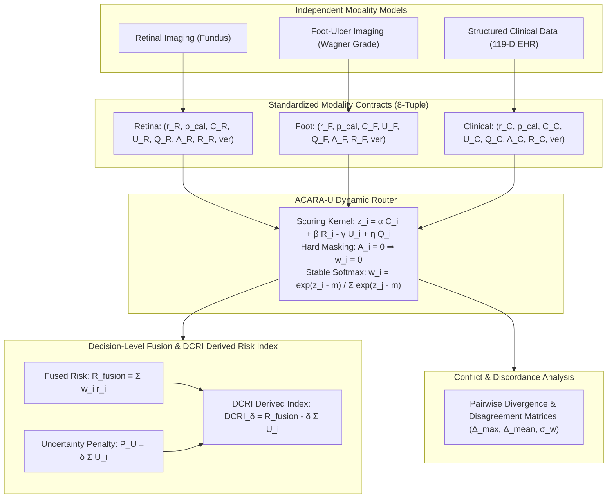
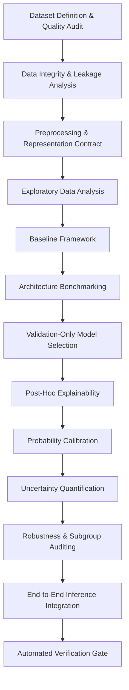
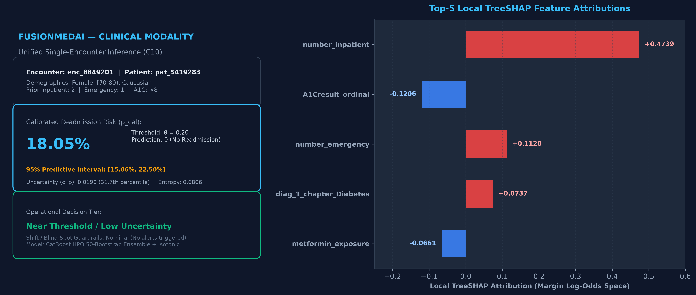

# FusionMedAI

> Research framework for decision-level fusion of independent retinal, diabetic foot-ulcer, and structured clinical prediction models.

[](https://www.python.org/downloads/release/python-3120/)
[](https://pytorch.org/)
[](LICENSE)

---

## Abstract

FusionMedAI is a research framework for decision-level multimodal diabetes-related risk assessment that combines independently evaluated and frozen retinal, diabetic foot-ulcer, and structured clinical prediction models through confidence-, reliability-, uncertainty-, quality-, and availability-aware routing (ACARA-U).

> [!IMPORTANT]
> **Methodological Scope & Boundary**: Because public retrospective datasets (APTOS 2019 Retina, ADPM V3.3 Foot Ulcer, UCI 130-Hospitals Clinical EHR) are not patient-paired across modalities, multimodal experiments are executed on controlled decision packets rather than real multimodal patient cohorts. The framework evaluates decision-level routing mechanics, uncertainty discounting, missingness robustness, conflict dynamics, degradation response, and parameter sensitivity; it does not claim patient-level multimodal clinical validation.

Across controlled benchmark experiments, ACARA-U preserved routing invariants under missing modalities, redistributed authority according to instance-level signals and global reliability priors, maintained fail-closed behavior under zero available modalities, characterized cross-modality conflict, and preserved routing invariants across tested modality-combination frequency distributions.

---

## System Architecture


*Figure 1. FusionMedAI research architecture.*

The system follows independent modality development followed by decision-level fusion:

```text
                         Input Modalities
                                │
               ┌────────────────┼────────────────┐
               │                │                │
               ▼                ▼                ▼
            Retina             Foot           Clinical
            Images            Images           EHR
               │                │                │
               ▼                ▼                ▼
          Modality-Specific Prediction Models
               │                │                │
               ▼                ▼                ▼
          Standardized Modality Outputs
     (risk, calibrated probability, confidence,
      uncertainty, quality, availability, reliability)
               │                │                │
               └────────────────┼────────────────┘
                                ▼
                      Decision-Level Fusion
                                │
                                ▼
                         Unified Output
```

> **Note**: Modality-specific explanations such as Grad-CAM and TreeSHAP remain outside the numerical fusion contract and serve post-hoc interpretability.


```mermaid
flowchart TD
    subgraph Modalities["Independent Modality Models"]
        R["Retinal Imaging (Fundus)"]
        F["Foot-Ulcer Imaging (Wagner Grade)"]
        C["Structured Clinical Data (119-D EHR)"]
    end
    
    subgraph Contracts["Standardized Modality Contracts (8-Tuple)"]
        RO["Retina: (r_R, p_cal, C_R, U_R, Q_R, A_R, R_R, ver)"]
        FO["Foot: (r_F, p_cal, C_F, U_F, Q_F, A_F, R_F, ver)"]
        CO["Clinical: (r_C, p_cal, C_C, U_C, Q_C, A_C, R_C, ver)"]
    end
    
    R --> RO
    F --> FO
    C --> CO
    
    subgraph RouterStage["ACARA-U Dynamic Router"]
        Router["Scoring Kernel: z_i = α C_i + β R_i - γ U_i + η Q_i<br/>Hard Masking: A_i = 0 ⇒ w_i = 0<br/>Stable Softmax: w_i = exp(z_i - m) / Σ exp(z_j - m)"]
    end
    
    RO --> Router
    FO --> Router
    CO --> Router
    
    subgraph DCRIStage["Decision-Level Fusion & DCRI Derived Risk Index"]
        Fused["Fused Risk: R_fusion = Σ w_i r_i"]
        Penalty["Uncertainty Penalty: P_U = δ Σ U_i"]
        DCRI["DCRI Derived Index: DCRI_δ = R_fusion - δ Σ U_i"]
        Fused --> DCRI
        Penalty --> DCRI
    end
    
    Router --> DCRIStage
    
    subgraph ConflictStage["Conflict & Discordance Analysis"]
        Conflict["Pairwise Divergence & Disagreement Matrices (Δ_max, Δ_mean, σ_w)"]
    end
    
    Router --> ConflictStage
```

---

## Research Questions & Evaluation Framework

### Primary Research Question

> **Can independently evaluated modality-specific prediction models be combined through adaptive decision-level routing that behaves predictably under predictive uncertainty, missing modalities, cross-modality disagreement, and changing modality-combination distributions?**

### Supporting Research Questions

- **RQ1 (Modality Validity)**: Are the three modality-specific models sufficiently characterized in discrimination, calibration, uncertainty, explainability, and robustness to provide standardized inputs to the fusion layer?
- **RQ2 (Adaptive Decision-Level Routing & Parameter Sensitivity)**: Does the ACARA-U scoring kernel ($z_i = \alpha C_i + \beta R_i - \gamma U_i + \eta Q_i$) dynamically allocate decision authority across active channels while strictly preserving the weight simplex, and does the router exhibit stable behavioral dynamics under coefficient perturbations?
- **RQ3 (Missing-Modality Safety)**: Does hard availability masking ($A_i = 0 \implies \tilde{z}_i = -\infty \implies w_i = 0.0$) strictly prevent unavailable modalities from exerting decision authority?
- **RQ4 (Uncertainty-Penalized Aggregation)**: How does additive uncertainty discounting affect the derived decision index $\text{DCRI}_\delta = R_{\text{fusion}} - \delta \sum U_i$ across varying modality counts?
- **RQ5 (Cross-Modality Conflict Quantification)**: Can inter-modality risk divergence be systematically quantified ($\Delta_{\max}, \Delta_{\text{mean}}, \sigma_w$) without treating discordance as clinical synergy or unearned certainty?
- **RQ6 (Modality-Combination Robustness)**: Does routing remain behaviorally well-defined when modality-combination frequencies shift from balanced (D1) to moderate (D2) and strong-tail (D3) controlled distributions?
- **RQ7 (Tail Sensitivity Benchmarking)**: How does ACARA-U compare with baseline fusion strategies in tail-tier risk sensitivity under sparse modality-combination distributions?

---

## Scientific Status & Research Progress

| Component / Research Phase | Status | Primary Output / Invariant Verified |
| :--- | :---: | :--- |
| **Retina Modality (APTOS 2019)** | **FROZEN** | EfficientNet-B3 ($\text{QWK}=0.9233$), Temperature Scaling ($\text{ECE}=0.0241$), MC Dropout ($N=25$) |
| **Foot Ulcer Modality (ADPM V3.3)** | **FROZEN** | EfficientNet-B3 ($\text{Macro F1}=0.6683$), Vector Scaling ($\text{ECE}=0.0313$), MC Dropout ($N=10$) |
| **Clinical EHR Modality (UCI 130-Hospitals)** | **FROZEN** | CatBoost HPO (Test $\text{AUC} \approx 0.65$; $0.6504$ benchmark / $0.6495$ calibration), Isotonic Calibration, 20-member Bootstrap Ensemble, TreeSHAP |
| **Standardized Modality Contracts** | **FROZEN** | Unified 8-tuple schema `(risk, p_cal, conf, unc, qual, avail, rel, ver)` |
| **Input Quality & Availability Layer** | **FROZEN** | Deterministic quality scoring $Q_i \in [0, 1]$ and hard availability gating $A_i \in \{0, 1\}$ |
| **Global Reliability Priors** | **FROZEN** | Frozen validation evidence: $R_R = 0.929956 > R_F = 0.922266 > R_C = 0.825382$ |
| **ACARA-U Dynamic Router** | **FROZEN** | Scoring kernel $z_i = 1.0 C_i + 1.5 R_i - 1.0 U_i + 0.5 Q_i$ with stable softmax |
| **Comparative Baseline Ladder (B1–B6)** | **EVALUATED / SEALED** | Evaluated against Winner-Take-All (B1), Uniform (B2), Conf (B3), Conf+Rel (B4), Conf+Rel-U (B5) |
| **DCRI Derived Risk Index Aggregation** | **EVALUATED / SEALED** | $R_{\text{fusion}} \in [0, 1]$, unclamped negative $\text{DCRI} \in [-\delta M, 1]$; $\delta=0.20$ is provisional default |
| **Cross-Modality Conflict Analysis** | **EVALUATED / SEALED** | Discordance metrics $\Delta_{\max}, \Delta_{\text{mean}}, \sigma_w$; low linear correlation with uncertainty ($r=0.088$) |
| **Missing Modality Robustness** | **EVALUATED / SEALED** | 0 availability violations / 7,500 trials; invariant under corrupted inputs; fail-closed rejection |
| **Combination & Tail Analysis** | **EVALUATED / SEALED** | Evaluated across D1, D2, D3 ($N=500$); lowest point-estimate tail sensitivity among soft baselines |
| **Input Degradation Response** | **EVALUATED / SEALED** | Evaluated across 12 operators ($N=500$); dynamic quality attenuation $\text{RAR}=35.2\text{--}50.5\%$; B6 vs B5 isolation ($95\%$ CI strictly $< 0$) |
| **Modality Calibration Impact on Decision Fusion** | **EVALUATED / SEALED** | Evaluated across B0–B5 conditions ($N=500$); redistributes authority ($\Delta w_R = -0.0156$, $95\%$ CI: $[-0.0168, -0.0144]$); entropy-stable |
| **Parameter & Weighting Sensitivity Analysis (C11.12)** | **EVALUATED / SEALED** | 23 named evaluations (19 unique coefficient vectors); bounded stability $\bar{H} \in [0.9633, 1.0460]\text{ nats}$; zero routing collapse under prespecified grid |
| **DCRI Parameter Selection & Decision Analysis (C11.13)** | **PLANNED** | Pre-specified selection and sensitivity analysis of the uncertainty penalty discount $\delta$ |
| **Patient-Level External / Clinical Validation** | **PLANNED** | Requires genuinely paired multimodal cohorts |

---

## Key Research Findings

1. **Adaptive Authority Redistribution**: The ACARA-U router dynamically reallocates decision authority across available modalities based on instance confidence, global reliability priors, uncertainty, and quality ([Volume 05](research/fusion/Volume_05_Baseline_Fusion/README.md)).
2. **Strict Availability Invariance**: Hard masking prevents inactive modalities ($A_i = 0 \implies w_i = 0.000000$) from exerting decision authority, preserving exact simplex conservation across all availability combinations ([Volume 08](research/fusion/Volume_08_Missing_Modality_Robustness/README.md)).
3. **Conflict Separable From Uncertainty**: Cross-modality risk divergence ($\Delta_{\max}, \sigma_w$) showed low linear correlation with summed uncertainty ($r=0.088$), demonstrating that discordance and predictive uncertainty represent distinct measured dimensions in the controlled benchmark ([Volume 07](research/fusion/Volume_07_Conflict_Analysis/README.md)).
4. **Quality-Aware Authority Attenuation**: In a controlled synthetic raw-input degradation benchmark, unsupervised quality engines detected progressive decay, causing ACARA-U to attenuate degraded channel authority by $35.2\%\text{--}50.5\%$ ([Volume 10](research/fusion/Volume_10_Input_Degradation/README.md)).
5. **Calibration-Driven Authority Softening**: Incorporating calibrated modality probabilities softened previously overconfident retinal authority ($\Delta w_R = -0.0156$, $95\%$ CI: $[-0.0168, -0.0144]$) while maintaining routing stability ([Volume 11](research/fusion/Volume_11_Fusion_Calibration/README.md)).
6. **Empirical Parameter Stability**: Across 23 named sensitivity evaluations (19 unique coefficient vectors), ACARA-U maintained high routing entropy ($\bar{H} \in [0.9633, 1.0460]\text{ nats}$) with zero routing collapse or invariant violations observed under the prespecified perturbation grid ([Volume 12](research/fusion/Volume_12_ACARA_U_Parameter_Sensitivity/README.md)).

---

## Research Methodology

Each modality follows a controlled evaluation sequence:


```mermaid
flowchart TD
    A["Dataset Definition & Quality Audit"] --> B["Data Integrity & Leakage Analysis"]
    B --> C["Preprocessing & Representation Contract"]
    C --> D["Exploratory Data Analysis"]
    D --> E["Baseline Framework"]
    E --> F["Architecture Benchmarking"]
    F --> G["Validation-Only Model Selection"]
    G --> H["Post-Hoc Explainability"]
    H --> I["Probability Calibration"]
    I --> J["Uncertainty Quantification"]
    J --> K["Robustness & Subgroup Auditing"]
    K --> L["End-to-End Inference Integration"]
    L --> M["Automated Verification Gate"]
```

The clinical modality additionally incorporates patient-level canonical splitting, a locked 119-dimensional representation contract, validation-only hyperparameter optimization, exact TreeSHAP attribution decomposition, post-hoc calibration, bootstrap uncertainty ensembles, and distribution-shift auditing. Complete methodology and validation logs are maintained in the [Clinical Research Series](research/clinical/).

---

## Empirical Results Summary Dashboard

A consolidated summary of principal measured findings across the research program:

| Analysis Dimension | Evaluated Modality / Experiment | Primary Metric / Result | Interpretation & Scope Note |
| :--- | :--- | :---: | :--- |
| **Retina Discrimination** | APTOS 2019<br>(EfficientNet-B3) | **$84.20\%$ Acc<br>$0.9233$ QWK** | Selected under pre-specified architecture-selection criterion ($10.70\text{M}$ params). |
| **Retina Calibration** | Temperature Scaling<br>($N=366$) | **$\text{ECE} = 0.0241$** | Preserved rank ordering while aligning confidence. |
| **Retina Uncertainty** | MC Dropout<br>($N^*=25$) | **$\text{Error AUROC}$<br>$= 0.8443$** | Strong discrimination between correct and misclassified fundus scans. |
| **Foot Ulcer Discrimination** | ADPM V3.3<br>(EfficientNet-B3) | **$\text{Macro F1}$<br>$= 0.6683$** | Wagner 4-class held-out test evaluation ($N=1,006$). |
| **Foot Ulcer Calibration** | Vector Scaling<br>($N=1,006$) | **$\text{ECE} = 0.0313$** | $26.18\%$ relative ECE reduction over uncalibrated baseline. |
| **Foot Ulcer Uncertainty** | MC Dropout<br>($N^*=10$) | **$\text{Entropy AUROC}$<br>$= 0.7291$** | Risk-coverage selective prediction reduces error from $32.3\%$ to $11.2\%$. |
| **Clinical Discrimination** | CatBoost HPO<br>($N_{\text{test}}=14,913$) | **$\text{ROC-AUC}$<br>$= 0.6494$** | Reported as an observed result of the retrospective prediction task ($D=119$). |
| **Clinical Calibration** | Raw vs Calibrated<br>Test ECE | **$\text{ECE} = 0.0032$** | Isotonic chosen on validation NLL; Beta achieved test slope $0.9720$. |
| **Clinical Attribution Stability** | TreeSHAP<br>Val vs Test | **$\rho = 0.9994$<br>($100\%$ Top-20)** | Inpatient history ($22.43\%$) & complexity ($21.23\%$) dominate margin. |
| **Clinical Uncertainty** | 50-Bootstrap<br>CatBoost Ensemble | **$\text{Error AUROC}$<br>$= 0.7116$** | 50-member bootstrap ensemble used for standalone analysis; fusion contract uses 20 members. |
| **Multimodal Routing Ladder** | Baseline Ladder<br>B1–B6 ($N=500$) | **Retina $47.7\%$<br>Foot $26.8\%$<br>Clinical $25.5\%$** | ACARA-U dynamic allocation exhibits routing entropy $1.0176$ vs uniform $1.0986$. |
| **DCRI Derived Risk Index** | Uncertainty Discount<br>($\delta=0.20$) | **Mean $= 0.1617$<br>($24.6\%$ Negative)** | Unclamped derived index ($R_{\text{fusion}}=0.2885$, penalty $=0.1268$); $\delta=0.20$ is provisional. |
| **Cross-Modality Conflict** | Discordance Family<br>($N=500$) | **$\Delta_{\max} = 0.5203$<br>$\sigma_w = 0.2150$** | Conflict in $72.6\%$ ($363/500$) under operational HIGH threshold ($\Delta_{\max} \ge 0.35$). |
| **Missing Modality Robustness** | Availability Masking<br>($N=500$) | **0 violations<br>7,500 trials** | ACARA-U reallocates authority across available modalities and fails closed under zero modalities. |
| **Combination & Tail Analysis** | Controlled distributions<br>D1, D2, D3 ($N=500$) | **0 simplex violations<br>1,500 trials** | Routing invariants preserved across D1–D3; lowest point-estimate tail sensitivity among soft baselines. |
| **Input Degradation Response** | Controlled Signal Degradation<br>($12\text{ Operators}, N=500$) | **$\text{RAR} = 35.2\text{--}50.5\%$<br>$100.0\%\text{ Monotonic}$** | Quality scores decreased monotonically across tested degradation operators; authority attenuated. |
| **Quality Term Isolation** | ACARA-U (B6) vs Baseline B5<br>(Severe Degradation D3) | **$D = -0.1309$<br>($95\%\text{ CI } < 0$)** | Paired comparison showed greater attenuation under B6 vs B5 ($[-0.1319, -0.1300]$ $95\%$ CI). |
| **Calibration Routing Shift** | Calibrated vs Uncalibrated ACARA-U<br>(Clean D0 Benchmark, $N=500$) | **$\Delta w_R = -0.0156$<br>($95\%\text{ CI } < 0$)** | Softens retinal authority ($[-0.0168, -0.0144]$ $95\%$ CI) and reallocates authority to clinical and foot channels. |
| **Parameter Sensitivity (C11.12)** | 23 Named Evaluations<br>(19 Unique Vectors, $N=500$) | **$\bar{H} \in [0.9633, 1.0460]$<br>$\gamma > \alpha > \beta > \eta$** | Finite-range stability verified; aggregate normalized sensitivity ranking established. |

---

## Modality Design

### 1. Retinal Imaging Modality

The Retina pipeline evaluates diabetic retinopathy severity from fundus imaging using the APTOS 2019 dataset ($3,662$ images across 5 severity stages).

#### Backbone Benchmarking
Five deep learning architectures were evaluated under a controlled, leakage-aware protocol on the held-out test partition ($N=367$):

| Rank | Model Architecture | Test Accuracy | Balanced Acc | Macro F1 | Quadratic Weighted Kappa (QWK) | Test ROC-AUC | Parameters | GPU Latency |
| :---: | :--- | :---: | :---: | :---: | :---: | :---: | :---: | :---: | :---: |
| 1 | **EfficientNet-B3** (Selected) | **84.20%** | 67.22% | 0.6813 | **0.9233** | 0.9457 | 10.70M | 12.64 ms |
| 2 | **ConvNeXt-Tiny** | 81.20% | **72.05%** | **0.6893** | 0.9145 | **0.9587** | 27.82M | **5.65 ms** |
| 3 | **EfficientNet-B0** | 79.29% | 67.68% | 0.6505 | 0.9101 | 0.9353 | **4.01M** | 8.08 ms |
| 4 | **Swin-Tiny** | 78.75% | 66.35% | 0.6406 | 0.8973 | 0.9516 | 27.52M | 12.89 ms |
| 5 | **ViT-B/16** | 77.38% | 58.01% | 0.5804 | 0.8656 | 0.9225 | 85.80M | 15.16 ms |

- **Selection**: EfficientNet-B3 was selected under the pre-specified architecture-selection criterion balancing quadratic weighted kappa ($0.9233$), inference latency ($12.64\text{ ms}$), and parameter count ($10.70\text{M}$).
- **Calibration & Uncertainty**: Temperature Scaling calibrates multi-class softmax distributions ($\text{ECE} = 0.0241$). 25-pass MC Dropout provides predictive uncertainty estimates ($\text{Error Detection AUROC} = 0.8443$).
- **Explainability**: Spatial Grad-CAM visualizes pathological features (microaneurysms, hemorrhages, hard exudates).
- **Full Research Volume**: [Volume 05 — Architecture Benchmarking](research/retina/Volume_05_Architecture_Benchmarking/README.md).

---

### 2. Diabetic Foot Ulcer Modality

The Foot Ulcer pipeline classifies wound severity across four Wagner grades using the ADPM V3.3 dataset ($10,062$ audited images grouped into $1,770$ canonical source-image patient clusters to prevent identity leakage).

#### Backbone Benchmarking
Six candidate models were evaluated under identical controlled conditions on the held-out test partition ($N=1,006$):

| Rank | Model Architecture | Macro F1 | Balanced Accuracy | Macro ROC-AUC | Parameters | Latency (GPU, T4) |
| :---: | :--- | :---: | :---: | :---: | :---: | :---: |
| 1 | **EfficientNet-B3** (Selected) | **0.6683** | **0.6672** | **0.8685** | **10.70M** | **70.39 ms** |
| 2 | **EfficientNet-B0** | 0.6672 | 0.6656 | 0.8431 | 4.01M | 37.89 ms |
| 3 | **ConvNeXt-Tiny** | 0.6566 | 0.6562 | 0.8613 | 27.82M | 109.61 ms |
| 4 | **ResNet-50** (Baseline) | 0.6339 | 0.6391 | 0.8423 | 23.51M | — |
| 5 | **Swin-Tiny** | 0.6266 | 0.6262 | 0.8269 | 27.52M | 129.09 ms |
| 6 | **ViT-B/16** | 0.5788 | 0.5878 | 0.8364 | 85.80M | 310.28 ms |

#### Probability Calibration
Evaluated on frozen EfficientNet-B3 on the held-out test partition ($N=1,006$):

| Calibration Method | Test NLL | Test ECE | Accuracy | Macro F1 | Balanced Accuracy |
| :--- | :---: | :---: | :---: | :---: | :---: |
| **Raw Uncalibrated** | 0.8779 | 0.0424 | 0.6690 | 0.6683 | 0.6672 |
| **Temperature Scaling** | 0.8785 | 0.0388 | 0.6690 | 0.6683 | 0.6672 |
| **Vector Scaling** (Selected) | **0.8749** | **0.0313** | **0.6769** | **0.6758** | **0.6753** |

- **Uncertainty Quantification**: 10-pass MC Dropout evaluated for error detection ($\text{Entropy AUROC} = 0.7291$).
- **Explainability**: Spatial Grad-CAM at `backbone.features[8]` passes parameter randomization sanity checks ($\rho = 0.0000$).
- **Full Research Volumes**: [Volume 05 — Architecture Benchmarking](research/foot/Volume_05_Architecture_Benchmarking/README.md) and [Volume 07 — Probability Calibration](research/foot/Volume_07_Probability_Calibration/README.md).

---

### 3. Structured Clinical Tabular Modality

The Clinical modality evaluates structured hospital EHR data for 30-day diabetic readmission risk using the UCI Diabetes 130-US Hospitals dataset ($101,766$ encounters across 130 facilities, 1999–2008) under a patient-level canonical split ($N_{\text{test}}=14,913$).

#### Tabular Architecture Benchmarking
Seven tabular architectures were benchmarked on the frozen 119-dimensional representation:

| Architecture | Test ROC-AUC | Test PR-AUC | Test Brier | Test ECE | Train Time | Latency / 1k | Serialized Size |
| :--- | :---: | :---: | :---: | :---: | :---: | :---: | :---: |
| **CatBoost (HPO Tuned)** | **0.6504** | **0.2063** | **0.0952** | 0.0053 | 3.87 s | 2.35 ms | 415.6 KB |
| **CatBoost (Baseline)** | 0.6472 | 0.2038 | 0.0953 | 0.0066 | 3.87 s | 2.35 ms | 415.6 KB |
| **XGBoost** | 0.6467 | 0.2035 | 0.0953 | 0.0051 | 1.20 s | 1.65 ms | 260.2 KB |
| **LightGBM** | 0.6461 | 0.2038 | 0.0953 | **0.0045** | **0.58 s** | 3.18 ms | 318.2 KB |
| **Logistic Regression (L2)** | 0.6446 | 0.1969 | 0.0958 | 0.0080 | 2.09 s | **1.13 ms** | **1.8 KB** |
| **Logistic Regression (ElasticNet)** | 0.6445 | 0.1971 | 0.0958 | 0.0084 | 2.45 s | 1.15 ms | 1.8 KB |
| **Random Forest** | 0.6422 | 0.1991 | 0.0959 | 0.0098 | 2.58 s | 44.83 ms | 5,519.4 KB |
| **TabNet** | 0.6252 | 0.1887 | 0.0962 | 0.0105 | 77.27 s | 19.93 ms | 1,099.7 KB |

*Scope Note: The moderate ROC-AUC ($0.6494$ locked test / $0.6504$ HPO benchmark) is reported as an observed result of the retrospective tabular prediction task.*

#### Top Feature Attributions (Exact TreeSHAP)

| Rank | Feature | Clinical Group | Mean \|SHAP\| | Attribution Share | Cumulative Share |
| :---: | :--- | :--- | :---: | :---: | :---: |
| 1 | `number_inpatient` | Prior Healthcare Utilization | $0.2851$ | $22.43\%$ | $22.43\%$ |
| 2 | `age_ordinal` | Age & Glycemic Monitoring | $0.1000$ | $7.86\%$ | $30.29\%$ |
| 3 | `time_in_hospital` | Acute Clinical Complexity | $0.0814$ | $6.41\%$ | $36.70\%$ |
| 4 | `number_diagnoses` | Acute Clinical Complexity | $0.0668$ | $5.26\%$ | $41.95\%$ |
| 5 | `payer_code_grouped_Missing` | Encounter Context & Admin | $0.0510$ | $4.01\%$ | $45.96\%$ |

#### Calibration Contexts & Uncertainty
- **Standalone Clinical Evaluation**: Isotonic Regression was selected under the pre-specified validation NLL criterion ($\text{Val NLL}=0.3420$).
- **Fusion-Facing C11.11 Evaluation**: Frozen Platt/logit scaling parameters from the calibration workflow were used because the fusion experiment requires an invertible continuous probability transform.
- **Uncertainty Quantification**: 50-member Bootstrap Ensemble evaluated for error detection ($\text{Error Detection AUROC} = 0.7116$).
- **Robustness & Shift Highlights**:
  1. Predictive dispersion systematically inflates under random information loss ($+124.2\%$ at $50\%$ MCAR).
  2. Masking `number_inpatient` reveals an uncertainty blind spot (ROC-AUC drops to $0.5795$ while uncertainty paradoxically decreases to $\sigma_p = 0.0150$).
  3. Similar calibration slopes were observed across demographic subgroups (African American $\beta = 0.9665$, Female $\beta = 0.9675$).
- **Full Clinical Research**: [Volume 05 — Architecture Benchmarking](research/clinical/Volume_05_Architecture_Benchmarking/README.md), [Volume 06 — Explainability](research/clinical/Volume_06_Explainability/README.md), and [Volume 09 — Robustness & Fairness](research/clinical/Volume_09_Robustness_Fairness/README.md).

---

## Modality Inference Examples

### Example 1: Retinal Fundus Imaging

| Input Fundus Scan | Unified Prediction & Explanation Output |
| :---: | :---: |
|  |  |

The output demonstrates integrated multi-class prediction, calibrated softmax probability, MC Dropout predictive variance, and spatial Grad-CAM visualization of retinal lesion features.

---

### Example 2: Diabetic Foot Ulcer Imaging

| Input Foot Ulcer Image | Unified Prediction & Explanation Output |
| :---: | :---: |
|  |  |

The output demonstrates Wagner-grade prediction, Vector Scaling calibrated confidence, MC Dropout predictive entropy, selective classification status, and spatial Grad-CAM attribution focusing on visible wound margin regions.

---

### Example 3: Structured Clinical Tabular Data



#### Representative Clinical Input & Output Summary

```json
// Representative encounter input
{
  "encounter_id": "REDACTED", "patient_nbr": "REDACTED",
  "age": "[70-80)", "time_in_hospital": 6, "num_medications": 18,
  "number_inpatient": 2, "A1Cresult": ">8", "insulin": "Up", "diabetesMed": "Yes"
}
```

```json
// Standardized ClinicalOutput schema
{
  "modality": "clinical_tabular",
  "prediction": 0,
  "probability": 0.1803,
  "calibrated_probability": 0.1805,
  "calibration_method": "Isotonic_Regression",
  "uncertainty": {
    "method": "bootstrap_ensemble",
    "std_probability": 0.0190,
    "percentile_in_cohort": 31.67,
    "is_high_uncertainty": false
  },
  "top_attributions": [
    {"feature": "number_inpatient", "shap_value": 0.4739, "rank": 1},
    {"feature": "A1Cresult_ordinal", "shap_value": -0.1206, "rank": 2}
  ]
}
```

---

## Multimodal Decision Fusion Results

Multimodal decision fusion operates strictly on standardized modality contracts across the frozen $N=500$ controlled decision cohort ($\text{seed}=115$).

> **Decision Authority Definition**: Decision authority is the routing weight $w_i \in [0, 1]$ assigned to an available modality channel by the router ($\sum_{i \in \mathcal{A}} w_i = 1.0$).
>
> **Modality Risk Scalar Definition**: The modality risk scalar $r_i \in [0, 1]$ is a normalized decision-level projection of the modality output; it is not assumed to be a cross-modality calibrated clinical probability.

### 1. Multimodal Baseline Comparison (Ladder B1–B6)

Evaluated across the frozen $N=500$ cohort to compare ACARA-U against five simpler allocation policies:

| Method | Retina $w$ | Foot $w$ | Clinical $w$ | Routing Entropy | Retina Dominance |
| :--- | :---: | :---: | :---: | :---: | :---: |
| **B1 Reliability** | $1.0000$ | $0.0000$ | $0.0000$ | $0.0000$ | $100.0\%$ |
| **B2 Uniform** | $0.3333$ | $0.3333$ | $0.3333$ | $1.0986$ | — |
| **B3 Confidence** | $0.3945$ | $0.3690$ | $0.2366$ | $1.0615$ | $46.8\%$ |
| **B4 Conf. + Rel.** | $0.4049$ | $0.3761$ | $0.2190$ | $1.0521$ | $52.6\%$ |
| **B5 Conf. + Rel. - U** | $0.4593$ | $0.2704$ | $0.2703$ | $1.0279$ | $73.6\%$ |
| **B6 ACARA-U** | **$0.4771$** | **$0.2680$** | **$0.2549$** | **$1.0176$** | **$78.2\%$** |

*Note: Lower entropy reflects the observed routing distribution across available modalities and should not be conflated with mathematical stability.*

---

### 2. DCRI Risk Aggregation & Uncertainty Discounting

ACARA-U routed weights are converted into a fused risk index $R_{\text{fusion}}$ and an uncertainty-discounted decision index $\text{DCRI}_\delta$:

$$\begin{aligned}
R_{\text{fusion}} &= \sum_{i \in \mathcal{A}} w_i r_i \\
\text{DCRI}_\delta &= R_{\text{fusion}} - \delta \sum_{i \in \mathcal{A}} U_i
\end{aligned}$$

- **Mathematical Domain & Unclamped Invariant**: Because $R_{\text{fusion}} \in [0, 1]$ and $U_i \in [0, 1]$, the theoretical domain is $\text{DCRI}_\delta \in [-\delta M, 1]$ where $M = |\mathcal{A}| \le 3$. Negative DCRI values are mathematically valid under uncertainty discounting and are intentionally preserved (not clamped).
- **Frozen Cohort Empirical Findings ($N=500$, seed 115)**:
  - Mean Fused Risk $R_{\text{fusion}} = 0.288499 \pm 0.163198$ (Range: $[0.011744, 0.793333]$).
  - At provisional operating point $\delta=0.20$: Mean Uncertainty Penalty $= 0.126787$, Mean $\text{DCRI} = 0.161712$, $24.6\%$ of packets (123/500) produced negative DCRI.
  - Sensitivity slope: $\frac{\partial \overline{\text{DCRI}}}{\partial \delta} = -\overline{U_{\text{sum}}} = -0.633936$.
- **Parameter Scope**: DCRI is a derived decision-level index and is not a clinically validated probability. The parameter $\delta=0.20$ serves as a provisional default; pre-specified selection of $\delta$ is addressed in Phase C11.13.

---

### 3. Cross-Modality Conflict & Discordance Analysis

The conflict analysis engine quantifies inter-channel risk divergence and consensus dispersion:

$$\begin{aligned}
\Delta_{\max} &= \max_{j < k, j,k \in \mathcal{A}} |r_j - r_k| \\
\sigma_w &= \sqrt{\sum_{i \in \mathcal{A}} w_i (r_i - R_{\text{fusion}})^2}
\end{aligned}$$

- **Frozen Cohort Empirical Findings ($N=500$, seed 115)**:
  - Mean Maximum Disagreement $\Delta_{\max} = 0.520331 \pm 0.241978$ (Median: $0.475961$).
  - Mean Weighted Consensus Dispersion $\sigma_w = 0.215019 \pm 0.108652$ (Median: $0.192409$).
  - Conflict in $72.6\%$ ($363/500$) under operational threshold $\Delta_{\max} \ge 0.35$.
  - Low linear correlation between conflict magnitude and summed modality uncertainty ($r=0.088166$) shows that conflict and uncertainty represent distinct measured quantities in the controlled benchmark.

---

### 4. Missing-Modality Robustness & Authority Redistribution

Evaluates whether ACARA-U remains well-defined when one or more modalities are unavailable:

- **Hard Masking Invariant**: Inactive modalities receive exactly zero routing weight ($w_i = 0.000000$), while active modality weights preserve the simplex constraint ($\sum_{i \in \mathcal{A}} w_i = 1.000000$).
- **Masked-Value Invariance**: 7,500/7,500 trials with corrupted values on unavailable modalities produced zero change in active routing weights or fused risk.
- **Zero-Modality Handling**: Returns `NO_MODALITY_AVAILABLE`; numerical risk outputs are set to zero only as a sentinel and must not be interpreted as low clinical risk.

---

### 5. Modality-Combination Distribution & Tail Analysis

Evaluates routing behavior across controlled modality-combination distributions from balanced (D1) to moderate-tail (D2) and strong-tail (D3) allocations ($N=500$ controlled decision packets).

- **Simplex & Safety Verification**: $0$ routing invariant violations over 1,500 trials; active weights strictly satisfy $\sum w_i = 1.000000$.
- **Tail Risk Sensitivity Across Soft Baselines**: ACARA-U produced the lowest observed point-estimate tail risk deviation ($D_{\text{tail}} = 0.1883$ in D2, $0.1876$ in D3) among evaluated soft-weighting baselines (B2–B5). Paired bootstrap difference CIs against B5 cross zero ($[-0.000660, 0.001839]$ in D2), indicating that the marginal point-estimate difference is not statistically significant under the current cohort size.
- **Observed Risk Dispersion Expansion**: Higher tail risk variance was observed in lower-cardinality tail tiers ($\sigma(R)=0.2508$ in D2, $0.2784$ in D3 vs $\sigma(R)=0.1880$ in D2, $0.1898$ in D3 for head tiers), consistent with reduced multi-channel averaging in single-modality encounters.

---

### 6. Input Degradation Response (Phase C11.10)

Evaluates dynamic router behavior when modalities remain technically available ($A_i = 1$) but suffer progressive signal degradation ($Q_i \downarrow$) across 12 deterministic operators evaluated over 4 severity levels ($D0 \to D1 \to D2 \to D3$, $N=500$).

- **Unsupervised Quality Response**: Quality scores decreased monotonically across tested degradation operators ($100.0\%$ packet monotonicity rate).
- **Dynamic Authority Attenuation**: ACARA-U reduces authority assigned to degraded modalities, yielding a **$35.2\text{--}50.5\%$ relative authority reduction** ($\text{RAR}$).
- **Quality Term Isolation (B6 vs Baseline B5)**: Paired baseline comparison against B5 showed greater attenuation under B6 vs B5 ($-0.1697$ vs $-0.0388$, paired difference $D = -0.1309$, $95\%$ bootstrap CI: $[-0.1319, -0.1300]$, strictly excluding zero), supporting an incremental contribution of the quality term within the tested benchmark.

---

### 7. Modality Calibration Impact on Decision Fusion (Phase C11.11)

Evaluates whether incorporating calibrated modality-level probabilities alters decision-level fusion behavior across six canonical experimental conditions (B0–B5, $N=500$ controlled decision packets, $\text{seed}=115$):

- **Routing Authority Redistribution**: Propagating calibrated probabilities into ACARA-U softens previously overconfident retinal authority ($\overline{\Delta w_R} = -0.0156$, $95\%$ paired bootstrap CI: $[-0.0168, -0.0144]$), reallocating authority toward clinical ($\overline{\Delta w_C} = +0.0101$) and foot ($\overline{\Delta w_F} = +0.0055$) channels while maintaining exact simplex conservation ($\sum \Delta w_i \approx 0$).
- **Bounded Behavioral Stability**: Fused risk and DCRI shifts remain small and bounded ($\Delta R_{\text{fusion}} = +0.0025$, $95\%$ CI: $[+0.0011, +0.0039]$) with stable routing entropy ($\Delta H(w) = +0.0059$).
- **Degradation Persistence**: Under progressive input degradation ($D0 \to D3$), the calibration authority offset remains consistent ($\Delta w_R \approx -0.0156\text{--}-0.0158$).

---

### 8. ACARA-U Parameter & Weighting Sensitivity Analysis (Phase C11.12)

Evaluates the sensitivity of the ACARA-U routing logit kernel ($z_i = \alpha C_i + \beta R_i - \gamma U_i + \eta Q_i$) to perturbations around the frozen reference configuration $\Theta_0 = (1.0, 1.5, 1.0, 0.5)$ across the frozen paired cohort ($N=500$, $\text{seed}=115$):

- **Prespecified Evaluation Grid**: 23 named sensitivity evaluations representing 19 unique coefficient vectors spanning One-Factor-At-A-Time (OFAT) sweeps ($\pm 50\%$ for $\alpha, \gamma, \eta$; $\pm 33\%$ for $\beta$) and combined factorial scaling.
- **Empirical Behavioral Stability**: Across all 23 evaluations, mean routing entropy remained high ($\bar{H} \in [0.9633, 1.0460]\text{ nats} > 0.85$ threshold), with zero routing collapse, zero invariant violations, and exact machine-precision logit derivative consistency ($< 1.2 \times 10^{-15}$).
- **Aggregate Normalized Sensitivity Ranking**: Defined as the 3-D authority vector norm $S_\theta^{\text{agg,norm}} = \sqrt{\sum (S_\theta^{\text{norm}}(w_i))^2}$, the empirical ranking under this experimental design was:
  1. **Uncertainty Penalty ($\gamma$)**: $S_\gamma^{\text{agg,norm}} = 0.423033$ (Primary active authority modulator)
  2. **Confidence Weighting ($\alpha$)**: $S_\alpha^{\text{agg,norm}} = 0.395566$ (Dynamic per-case authority scaling)
  3. **Reliability Weighting ($\beta$)**: $S_\beta^{\text{agg,norm}} = 0.124725$ (Static validation prior anchor)
  4. **Quality Bonus ($\eta$)**: $S_\eta^{\text{agg,norm}} = 0.036448$ (Gentle, non-disruptive quality bonus)
- **Reference Configuration Retained**: $\Theta_0$ is retained without modification for Phase C11.13.
- **Full Research Volume**: [Volume 12 — ACARA-U Parameter Sensitivity](research/fusion/Volume_12_ACARA_U_Parameter_Sensitivity/README.md).

---

## Next Research Stages

1. **DCRI Parameter Selection & Decision Analysis (Phase C11.13)**: Decision-curve and utility analysis across varying decision thresholds to pre-specify and evaluate sensitivity of the uncertainty penalty discount $\delta \in [0.0, 1.0]$.
2. **Patient-Level External / Clinical Validation**: Establishing protocol definitions, dataset schema requirements, and validation benchmarks for genuinely paired multimodal cohorts, followed by external evaluation where suitable clinical data are available.

---

## Reproducibility & Verification

The repository separates implementation, experimental procedures, evaluation artifacts, verification suites, and frozen model contracts.

Automated verification covers modality pipelines, fusion invariants, experiment manifests, and reproducibility checks across `verification/`:

- **Retina Verification**: Data integrity, DataLoader pipeline, architecture benchmarking, Grad-CAM, calibration, uncertainty, and acceptance testing.
- **Foot Ulcer Verification**: Source-image grouping, duplicate audits, stratified splitting, Grad-CAM sanity checks, Vector Scaling, and MC Dropout.
- **Clinical Verification**: 119-D representation, TreeSHAP exact additivity, calibration monotonicity, bootstrap convergence, shift sensitivity, and end-to-end service integration.
- **Multimodal Decision Fusion Verification**:
  - Foundational fusion protocol and routing mechanics (**74/74 gates**).
  - DCRI aggregation bounds, delta sensitivity, and unclamped negatives (**16/16 gates**).
  - Conflict analysis symmetry, disagreement metrics, and dispersion (**20/20 gates**).
  - Missing modality availability regimes, hard-masking, and fail-closed safety (**20/20 gates**).
  - Modality-combination distribution normalization and tail analysis (**20/20 gates**).
  - Input degradation quality decay, authority attenuation, and quality isolation (**20/20 gates**).
  - Modality calibration ECE reductions and authority redistribution (**20/20 gates**).
  - Parameter sensitivity grid pre-registration, derivative semantics, and stability (**20/20 gates**).

> [!NOTE]
> Automated verification gates verify implementation invariants, numerical bounds, and code reproducibility; they do not substitute for external clinical validation.

Every experimental execution generates cryptographic SHA-256 manifests linking model weights, evaluation tables, figures, and dataset partitions.

---

## Limitations

1. **Retrospective Dataset Scope**: The clinical dataset originates from a historical 1999–2008 hospital cohort. Its empirical distributions and coding practices should not be assumed to match modern inpatient populations.
2. **Internal vs External Validation**: All reported evaluation metrics are derived from internal, patient-split locked test partitions. They do not constitute prospective or multi-center external clinical validation.
3. **Non-Causal Interpretability**: TreeSHAP and Grad-CAM attributions reflect statistical associations within the trained models. They do not identify causal clinical mechanisms or treatment effects.
4. **Calibration Protocol Nuances**: Isotonic regression was selected on validation NLL for standalone clinical prediction, but exhibits boundary discretization ($p_{\text{cal}}=0.0000$ on lowest-risk cases) and lower out-of-sample slope than parametric Beta calibration ($0.8541$ vs $0.9720$).
5. **Uncertainty Blind Spots**: While bootstrap dispersion detects random missingness and high-variance encounters, it fails to inflate when key structural variables (`number_inpatient`) are omitted, showing that low predictive uncertainty does not necessarily indicate reliable predictions under structured feature omission.
6. **Unpaired Multimodal Dataset Scope**: Because public retrospective datasets do not contain paired retina, foot-ulcer, and EHR records for the same individual patients, multimodal fusion is strictly formulated at the decision level using standardized outputs rather than patient-level multimodal joining.
7. **Controlled Decision-Packet Benchmark Cohort**: All multimodal fusion experiments are executed on controlled decision packets constructed from independently evaluated modality outputs ($N=500, \text{seed}=115$). The evaluated combination distributions (D1–D3) and perturbation grids are controlled experimental constructs rather than naturally occurring patient-level observations.

---

## Repository Structure

```directory
FusionMedAI/
├── datasets/
│   ├── retina/
│   ├── foot/
│   └── clinical/
├── docs/
│   ├── architecture.png
│   └── examples/
├── experiments/
│   ├── retina/
│   ├── foot/
│   ├── clinical/
│   └── fusion/
├── research/
│   ├── retina/
│   ├── foot/
│   ├── clinical/
│   └── fusion/
├── src/
│   ├── retina/
│   ├── foot/
│   ├── clinical/
│   └── fusion/
├── verification/
│   ├── retina/
│   ├── foot/
│   ├── clinical/
│   └── fusion/
├── requirements.txt
├── LICENSE
└── README.md
```

---

## Research Documentation

The complete experimental record, methodology descriptions, mathematical formulations, and validation logs are maintained in the research volumes:

### Retinal Imaging Series
- [Volume 01 — Dataset Preparation & Quality Audit](research/retina/Volume_01_Dataset_Preparation/README.md)
- [Volume 02 — Data Pipeline & Preprocessing](research/retina/Volume_02_Data_Pipeline/README.md)
- [Volume 03 — Exploratory Data Analysis & Statistical Profiling](research/retina/Volume_03_Exploratory_Data_Analysis/README.md)
- [Volume 04 — Baseline Framework Implementation](research/retina/Volume_04_Baseline_Framework/README.md)
- [Volume 05 — Controlled Architecture Benchmarking](research/retina/Volume_05_Architecture_Benchmarking/README.md)
- [Volume 06 — Post-Hoc Model Explainability (Grad-CAM)](research/retina/Volume_06_Final_Model_Explainability/README.md)
- [Volume 07 — Probability Calibration & Decision Analysis](research/retina/Volume_07_Calibration/README.md)
- [Volume 08 — Prediction Uncertainty Estimation (MC Dropout)](research/retina/Volume_08_Uncertainty_Estimation/README.md)

### Diabetic Foot Ulcer Series
- [Volume 01 — Dataset Acquisition & Quality Audit](research/foot/Volume_01_Dataset_Preparation/README.md)
- [Volume 02 — Data Pipeline & Canonical Grouping](research/foot/Volume_02_Data_Pipeline/README.md)
- [Volume 03 — Exploratory Data Analysis](research/foot/Volume_03_Exploratory_Data_Analysis/README.md)
- [Volume 04 — Baseline Framework Implementation](research/foot/Volume_04_Baseline_Framework/README.md)
- [Volume 05 — Architecture Benchmarking (EfficientNet-B3 Selection)](research/foot/Volume_05_Architecture_Benchmarking/README.md)
- [Volume 06 — Explainability & Sanity Checking (Grad-CAM)](research/foot/Volume_06_Explainability/README.md)
- [Volume 07 — Probability Calibration (Vector Scaling)](research/foot/Volume_07_Probability_Calibration/README.md)
- [Volume 08 — Prediction Uncertainty & Risk-Coverage (MC Dropout)](research/foot/Volume_08_Prediction_Uncertainty/README.md)
- [Volume 09 — Module Integration & Parity Verification](research/foot/Volume_09_Module_Integration/README.md)

### Structured Clinical EHR Series
- [Volume 01 — Dataset Integrity & Historical Cohort Profiling](research/clinical/Volume_01_Dataset_Audit/README.md)
- [Volume 02 — Patient-Level Canonical Splitting & Leakage Prevention](research/clinical/Volume_02_Data_Pipeline/README.md)
- [Volume 03 — Exploratory Data Analysis & Representation Space](research/clinical/Volume_03_Exploratory_Data_Analysis/README.md)
- [Volume 04 — Tabular Baseline Framework](research/clinical/Volume_04_Baseline_Modeling/README.md)
- [Volume 05 — Architecture Benchmarking & Validation-Only HPO](research/clinical/Volume_05_Architecture_Benchmarking/README.md)
- [Volume 06 — Post-Hoc Explainability & Feature Grouping (TreeSHAP)](research/clinical/Volume_06_Explainability/README.md)
- [Volume 07 — Probability Calibration & Net Benefit Analysis](research/clinical/Volume_07_Probability_Calibration/README.md)
- [Volume 08 — Epistemic Uncertainty Quantification & Ambiguity Tiers](research/clinical/Volume_08_Uncertainty/README.md)
- [Volume 09 — Robustness, Subgroup Parity & Distribution Shift Auditing](research/clinical/Volume_09_Robustness_Fairness/README.md)

### Multimodal Decision Fusion (ACARA-U) Series
- [Volume 01 — Research Protocol Freeze & Routing Kernel Specification](research/fusion/Volume_01_Research_Protocol/README.md)
- [Volume 02 — Unified Input Quality ($Q_i$) & Availability ($A_i$) Layer](research/fusion/Volume_02_Quality_Layer/README.md)
- [Volume 03 — Global Modality Reliability Priors ($R_i$) & Validation Evidence](research/fusion/Volume_03_Global_Reliability/README.md)
- [Volume 04 — ACARA-U v2 Dynamic Router & Behavioral Stress Benchmarking](research/fusion/Volume_04_ACARA_U_Router/README.md)
- [Volume 05 — Multimodal Baseline Ladder (B1–B6) & Comparative Evaluation](research/fusion/Volume_05_Baseline_Fusion/README.md)
- [Volume 06 — DCRI Risk Aggregation & Uncertainty Discounting](research/fusion/Volume_06_DCRI_Aggregation/README.md)
- [Volume 07 — Cross-Modality Conflict & Discordance Analysis](research/fusion/Volume_07_Conflict_Analysis/README.md)
- [Volume 08 — Missing Modality Robustness & Authority Redistribution](research/fusion/Volume_08_Missing_Modality_Robustness/README.md)
- [Volume 09 — Modality-Combination Distribution & Tail Analysis](research/fusion/Volume_09_Modality_Combination_Analysis/README.md)
- [Volume 10 — Input Degradation Response & Quality Isolation](research/fusion/Volume_10_Input_Degradation/README.md)
- [Volume 11 — Modality Calibration Impact on Decision Fusion](research/fusion/Volume_11_Fusion_Calibration/README.md)
- [Volume 12 — ACARA-U Parameter & Weighting Sensitivity Analysis](research/fusion/Volume_12_ACARA_U_Parameter_Sensitivity/README.md)

---

## Installation & Setup

```bash
# Clone the repository
git clone https://github.com/Dr-Venom29/FusionMedAI.git
cd FusionMedAI

# Create virtual environment
python -m venv venv

# Activate virtual environment
# Windows:
venv\Scripts\activate
# Linux/macOS:
source venv/bin/activate

# Install dependencies
pip install -r requirements.txt
```

---

## Contributors

| [<br /><sub><b>Dr-Venom29</b></sub>](https://github.com/Dr-Venom29) | [<br /><sub><b>NoBodyKnows3000</b></sub>](https://github.com/NoBodyKnows3000) | [<br /><sub><b>Chandu45678</b></sub>](https://github.com/Chandu45678) | [<br /><sub><b>NithinVN</b></sub>](https://github.com/NithinVN) |
| :---: | :---: | :---: | :---: |

---

## License

This project is distributed under the MIT License. See [LICENSE](LICENSE) for details.
