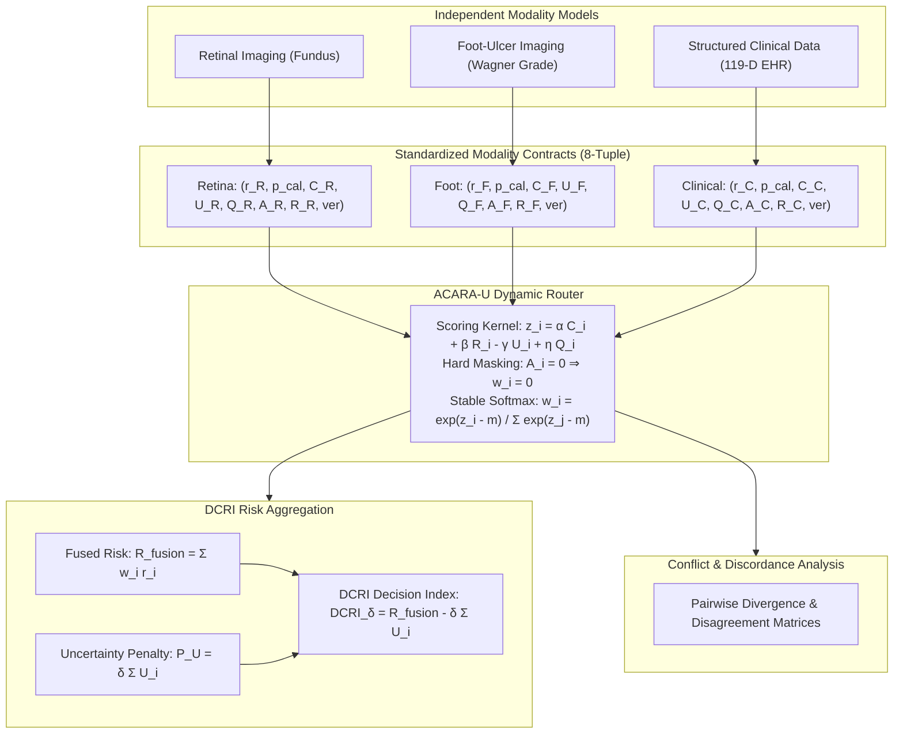
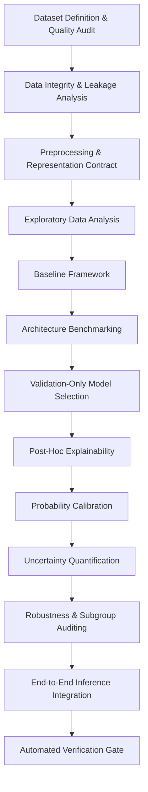
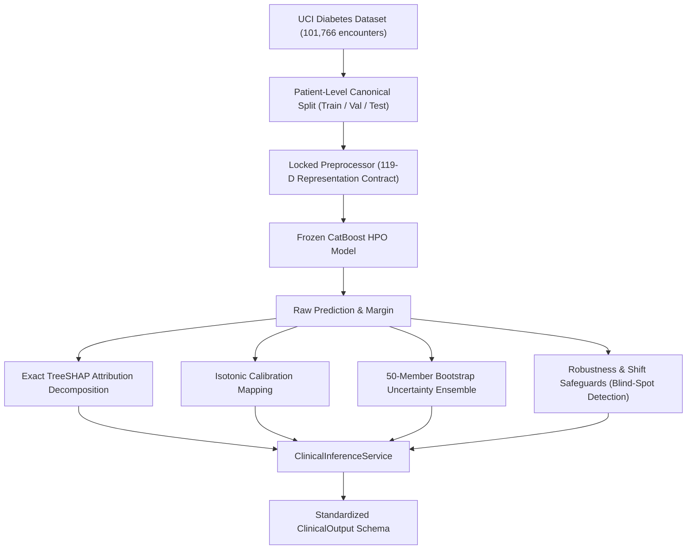

# FusionMedAI

> Research framework for multimodal diabetes-related risk assessment using independent imaging and clinical prediction models.

[](https://www.python.org/downloads/release/python-3120/)
[](https://pytorch.org/)
[](LICENSE)

---

## Abstract

FusionMedAI investigates whether independently developed retinal, diabetic foot-ulcer, and structured clinical models can provide complementary risk information for diabetes-related assessment.

The project treats each modality as an independent prediction problem. Each model is evaluated for discrimination, calibration, interpretability, uncertainty, and robustness before its output is considered for decision-level multimodal fusion.


```mermaid
flowchart TD
    subgraph Modalities["Independent Modality Models"]
        R["Retinal Imaging (Fundus)"]
        F["Foot-Ulcer Imaging (Wagner Grade)"]
        C["Structured Clinical Data (119-D EHR)"]
    end
    
    subgraph Contracts["Standardized Modality Contracts (8-Tuple)"]
        RO["Retina: (r_R, p_cal, C_R, U_R, Q_R, A_R, R_R, ver)"]
        FO["Foot: (r_F, p_cal, C_F, U_F, Q_F, A_F, R_F, ver)"]
        CO["Clinical: (r_C, p_cal, C_C, U_C, Q_C, A_C, R_C, ver)"]
    end
    
    R --> RO
    F --> FO
    C --> CO
    
    subgraph RouterStage["ACARA-U Dynamic Router"]
        Router["Scoring Kernel: z_i = α C_i + β R_i - γ U_i + η Q_i<br/>Hard Masking: A_i = 0 ⇒ w_i = 0<br/>Stable Softmax: w_i = exp(z_i - m) / Σ exp(z_j - m)"]
    end
    
    RO --> Router
    FO --> Router
    CO --> Router
    
    subgraph DCRIStage["DCRI Risk Aggregation"]
        Fused["Fused Risk: R_fusion = Σ w_i r_i"]
        Penalty["Uncertainty Penalty: P_U = δ Σ U_i"]
        DCRI["DCRI Decision Index: DCRI_δ = R_fusion - δ Σ U_i"]
        Fused --> DCRI
        Penalty --> DCRI
    end
    
    Router --> DCRIStage
    
    subgraph ConflictStage["Conflict & Discordance Analysis"]
        Conflict["Pairwise Divergence & Disagreement Matrices"]
    end
    
    Router --> ConflictStage
```

The repository is organized as a research system rather than as a single end-to-end black-box classifier. Experimental procedures, evaluation artifacts, verification suites, and frozen model contracts are maintained alongside the implementation.

---

## Research Question

The project investigates:

> **Can independently validated, calibrated, interpretable, and uncertainty-aware prediction models provide complementary information for multimodal diabetes-related risk assessment?**

This question is divided into two distinct levels:

1. **Modality-Level Validity**: Can each input modality produce a prediction whose discrimination, calibration, explanation, uncertainty, and robustness are empirically characterized and verified?
2. **Fusion-Level Validity**: Can those independently characterized predictions later be combined at the decision level without treating predictions from different retrospective datasets as if they originated from the same patient?

The second question is intentionally separated from modality development.

---

## System Architecture


*Figure 1. FusionMedAI research architecture.*

The system follows independent modality development followed by decision-level fusion:

```text
                         Input Modalities
                              │
             ┌────────────────┼────────────────┐
             │                │                │
             ▼                ▼                ▼
          Retina             Foot           Clinical
          Images            Images           EHR
             │                │                │
             ▼                ▼                ▼
        Modality-Specific Prediction Models
             │                │                │
             ▼                ▼                ▼
        Probability + Uncertainty + Explanation
             │                │                │
             └────────────────┼────────────────┘
                              ▼
                    Decision-Level Fusion
                              │
                              ▼
                       Unified Output
```

The fusion layer is designed to operate on model outputs and their reliability information, rather than directly concatenating heterogeneous raw inputs.

---

## Research Methodology

Each modality follows a controlled evaluation sequence:


```mermaid
flowchart TD
    A["Dataset Definition & Quality Audit"] --> B["Data Integrity & Leakage Analysis"]
    B --> C["Preprocessing & Representation Contract"]
    C --> D["Exploratory Data Analysis"]
    D --> E["Baseline Framework"]
    E --> F["Architecture Benchmarking"]
    F --> G["Validation-Only Model Selection"]
    G --> H["Post-Hoc Explainability"]
    H --> I["Probability Calibration"]
    I --> J["Uncertainty Quantification"]
    J --> K["Robustness & Subgroup Auditing"]
    K --> L["End-to-End Inference Integration"]
    L --> M["Automated Verification Gate"]
```

### Clinical Research Pipeline

The clinical modality follows this methodology particularly closely because structured healthcare data introduces challenges involving missingness, repeated encounters, class imbalance, temporal shifts, probability distortion, and silent failure modes:


```mermaid
flowchart TD
    D1["UCI Diabetes Dataset (101,766 encounters)"] --> S1["Patient-Level Canonical Split (Train / Val / Test)"]
    S1 --> P1["Locked Preprocessor (119-D Representation Contract)"]
    P1 --> M1["Frozen CatBoost HPO Model"]
    M1 --> BR["Raw Prediction & Margin"]
    BR --> E1["Exact TreeSHAP Attribution Decomposition"]
    BR --> C1["Isotonic Calibration Mapping"]
    BR --> U1["50-Member Bootstrap Uncertainty Ensemble"]
    BR --> R1["Robustness & Shift Safeguards (Blind-Spot Detection)"]
    E1 --> INT["ClinicalInferenceService"]
    C1 --> INT
    U1 --> INT
    R1 --> INT
    INT --> OUT["Standardized ClinicalOutput Schema"]
```

---

## Empirical Results Summary Dashboard

A consolidated summary of principal findings across the research program:

| Analysis Dimension | Evaluated Modality / Experiment | Primary Metric / Result | Interpretation & Scope Note |
| :--- | :--- | :---: | :--- |
| **Retina Discrimination** | APTOS 2019 (EfficientNet-B3) | **$84.20\%$ Acc / $0.9233$ QWK** | Highest overall trade-off among 5 architectures ($10.70\text{M}$ params). |
| **Retina Calibration** | Temperature Scaling ($N=366$) | **$\text{ECE} = 0.0241$** | Preserved rank ordering while aligning confidence. |
| **Retina Uncertainty** | MC Dropout ($N^*=25$) | **$\text{Error AUROC} = 0.8443$** | Strong discrimination between correct and misclassified fundus scans. |
| **Foot Ulcer Discrimination** | ADPM V3.3 (EfficientNet-B3) | **$\text{Macro F1} = 0.6683$** | Wagner 4-class held-out test evaluation ($N=1,006$). |
| **Foot Ulcer Calibration** | Vector Scaling ($N=1,006$) | **$\text{ECE} = 0.0313$** | $26.18\%$ relative ECE reduction over uncalibrated baseline. |
| **Foot Ulcer Uncertainty** | MC Dropout ($N^*=10$) | **$\text{Entropy AUROC} = 0.7291$** | Risk-coverage selective prediction reduces error from $32.3\%$ to $11.2\%$. |
| **Clinical Discrimination** | CatBoost HPO ($N_{\text{test}}=14,913$) | **$\text{ROC-AUC} = 0.6494$** | Reflects retrospective tabular readmission task complexity ($D=119$). |
| **Clinical Probability Quality** | Raw CatBoost Test ECE | **$\text{ECE} = 0.0032$** | Isotonic chosen on validation NLL; Beta achieved test slope $0.9720$. |
| **Clinical Attribution Stability** | TreeSHAP Validation vs Test | **$\rho = 0.9994$** ($100\%$ Top-20) | Inpatient history ($22.43\%$) & complexity ($21.23\%$) dominate margin. |
| **Clinical Uncertainty** | 50-Bootstrap CatBoost Ensemble | **$\text{Error AUROC} = 0.7116$** | 50-member bootstrap ensemble used for the standalone clinical uncertainty analysis; the fusion-facing contract uses a 20-member bootstrap ensemble. |
| **Selective Classification** | Risk-Coverage at 80% Coverage | **$10.23\%$ Error Rate** | $31.0\%$ error reduction achieved by rejecting $20\%$ most uncertain cases. |
| **Shift Sensitivity Signal** | Random Missingness ($50\%$ MCAR) | **$\sigma_p = 0.0491$<br>($+124.2\%$)** | Predictive dispersion systematically inflates under information loss. |
| **Uncertainty Blind Spot** | Masked Prior Inpatient History | **$\text{ROC-AUC} = 0.5795$,<br>$\sigma_p = 0.0150$** | Severe discrimination loss with deceptively low uncertainty (Q4 failure). |
| **End-to-End Throughput** | Local CPU Batch Inference ($N=14,913$) | **$3,345.7\text{ encounters/sec}$** | Local CPU software benchmark; not a clinical deployment claim. |
| **Multimodal Routing (C11.5)** | Baseline Ladder B1–B6 ($N=500$) | **Retina $47.71\%$<br>Foot $26.80\%$<br>Clinical $25.49\%$** | ACARA-U dynamic allocation exhibits routing entropy $1.0176$ vs uniform $1.0986$. |
| **DCRI Aggregation (C11.6)** | Uncertainty Discounting ($\delta=0.20$) | **Mean DCRI = $0.1617$<br>($24.6\%$ Negative)** | Unclamped derived index ($R_{\text{fusion}}=0.2885$, penalty $=0.1268$); $\delta=0.20$ is provisional. |
| **Cross-Modality Conflict (C11.7)** | Discordance Family ($N=500$) | **Mean $\Delta_{\max} = 0.5203$,<br>$\sigma_w = 0.2150$** | High conflict in $72.6\%$ ($363/500$), primarily driven by Retina ↔ Foot ($47.4\%$). |
| **Missing Modality Robustness (C11.8)** | Availability masking & controlled modality dropout ($N=500$) | **0 availability violations<br>7,500 invariance trials** | ACARA-U reallocates authority across available modalities and fails closed under zero available modalities. |

---

## Modality Design

### 1. Retinal Imaging Modality

The Retina pipeline evaluates diabetic retinopathy severity from fundus imaging using the APTOS 2019 dataset ($3,662$ images across 5 severity stages).

#### Backbone Benchmarking
Five deep learning architectures were evaluated under a controlled, leakage-aware protocol on the held-out test partition ($N=367$):

| Rank | Model Architecture | Test Accuracy | Balanced Acc | Macro F1 | Quadratic Weighted Kappa (QWK) | Test ROC-AUC | Parameters | GPU Latency |
| :---: | :--- | :---: | :---: | :---: | :---: | :---: | :---: | :---: |
| 1 | **EfficientNet-B3** (Selected) | **84.20%** | 67.22% | 0.6813 | **0.9233** | 0.9457 | 10.70M | 12.64 ms |
| 2 | **ConvNeXt-Tiny** | 81.20% | **72.05%** | **0.6893** | 0.9145 | **0.9587** | 27.82M | **5.65 ms** |
| 3 | **EfficientNet-B0** | 79.29% | 67.68% | 0.6505 | 0.9101 | 0.9353 | **4.01M** | 8.08 ms |
| 4 | **Swin-Tiny** | 78.75% | 66.35% | 0.6406 | 0.8973 | 0.9516 | 27.52M | 12.89 ms |
| 5 | **ViT-B/16** | 77.38% | 58.01% | 0.5804 | 0.8656 | 0.9225 | 85.80M | 15.16 ms |

- **Calibration & Uncertainty**: Temperature Scaling calibrates multi-class softmax distributions ($\text{ECE} = 0.0241$). 25-pass MC Dropout provides predictive uncertainty estimates, with predictive variance used by the fusion contract ($\text{Error Detection AUROC} = 0.8443$).
- **Explainability**: Spatial Grad-CAM visualizes pathological features (microaneurysms, hemorrhages, hard exudates).

---

### 2. Diabetic Foot Ulcer Modality

The Foot Ulcer pipeline classifies wound severity across four Wagner grades using the ADPM V3.3 dataset ($10,062$ audited images grouped into $1,770$ canonical source-image patient clusters to prevent identity leakage):

| Class | Clinical Description | Train Images | Val Images | Test Images |
| :--- | :--- | :---: | :---: | :---: |
| **Grade 1** | Superficial ulcer | 1,985 | 248 | 248 |
| **Grade 2** | Deep ulcer without bone involvement | 2,042 | 255 | 255 |
| **Grade 3** | Deep ulcer with abscess, osteomyelitis, joint sepsis | 2,015 | 252 | 252 |
| **Grade 4** | Localized gangrene / necrosis | 1,996 | 251 | 251 |
| **Total** | **4-Class Partitioned Cohort** | **8,038** | **1,006** | **1,006** |

#### Backbone Benchmarking
Six candidate models were evaluated under identical controlled conditions against the ResNet-50 baseline on the held-out test partition ($N=1,006$):

| Rank | Model Architecture | Macro F1 | Balanced Accuracy | Macro ROC-AUC | Parameters | Latency (GPU, T4) |
| :---: | :--- | :---: | :---: | :---: | :---: | :---: |
| 1 | **EfficientNet-B3** (Selected) | **0.6683** | **0.6672** | **0.8685** | **10.70M** | **70.39 ms** |
| 2 | **EfficientNet-B0** | 0.6672 | 0.6656 | 0.8431 | 4.01M | 37.89 ms |
| 3 | **ConvNeXt-Tiny** | 0.6566 | 0.6562 | 0.8613 | 27.82M | 109.61 ms |
| 4 | **ResNet-50** (Baseline) | 0.6339 | 0.6391 | 0.8423 | 23.51M | — |
| 5 | **Swin-Tiny** | 0.6266 | 0.6262 | 0.8269 | 27.52M | 129.09 ms |
| 6 | **ViT-B/16** | 0.5788 | 0.5878 | 0.8364 | 85.80M | 310.28 ms |

#### Probability Calibration & Uncertainty
Evaluated on frozen EfficientNet-B3 on the held-out test partition ($N=1,006$):

| Calibration Method | Test NLL | Test ECE | Accuracy | Macro F1 | Balanced Accuracy |
| :--- | :---: | :---: | :---: | :---: | :---: |
| **Raw Uncalibrated** | 0.8779 | 0.0424 | 0.6690 | 0.6683 | 0.6672 |
| **Temperature Scaling** | 0.8785 | 0.0388 | 0.6690 | 0.6683 | 0.6672 |
| **Vector Scaling** (Selected) | **0.8749** | **0.0313** | **0.6769** | **0.6758** | **0.6753** |

- **Uncertainty Quantification**: 10-pass MC Dropout evaluated for error detection ($\text{Entropy AUROC} = 0.7291$, $\text{Entropy AUPRC} = 0.5391$; $\text{Variance AUROC} = 0.6508$, $\text{Mutual Info AUROC} = 0.6399$). Predictive entropy is the uncertainty statistic used by the fusion contract.
- **Selective Prediction**: Risk-coverage rejection progressively reduces test error rate from $32.31\%$ (100% coverage) to $11.20\%$ (50% coverage).
- **Explainability**: Spatial Grad-CAM at `backbone.features[8]` passes parameter randomization sanity checks ($\rho = 0.0000$).

---

### 3. Structured Clinical Tabular Modality

The Clinical modality evaluates structured hospital EHR data for 30-day diabetic readmission risk using the UCI Diabetes 130-US Hospitals dataset ($101,766$ encounters across 130 facilities, 1999–2008).
- **Data Partitions**: Patient-level canonical splitting prevents cross-partition identity leakage:
  - **Training Partition**: 69,519 encounters (48,993 patients)
  - **Validation Partition**: 14,911 encounters (10,498 patients)
  - **Locked Test Partition**: 14,913 encounters (10,499 patients; 1,664 positive readmissions)
- **119-D Representation Contract**: Encodes demographics, admission types, discharge dispositions, encounter durations, laboratory assays, ICD-9 diagnostic chapters, and 23 diabetic medication dynamics.


---

## Clinical Risk Model & Evaluation Framework

The clinical module is evaluated across five distinct dimensions rather than relying on discrimination alone:

```text
1. Discrimination:        ROC-AUC, PR-AUC, Sensitivity, Specificity
2. Probability Quality:   Validation/Test Log Loss, Brier Score, ECE, Calibration Slope, DCA Net Benefit
3. Interpretability:      Exact TreeSHAP, Expected Base Value, Feature Directionality, Error Profiling
4. Prediction Uncertainty: Bootstrap Dispersion (σ_p), 95% Predictive Interval, Aleatoric Entropy, Ambiguity Tiers
5. Robustness & Shift:    MCAR Missingness, Domain Omission, Subgroup Parity, Longitudinal Drift, Silent Failures
```

### Frozen Model Configuration

The selected clinical architecture is a tuned CatBoost classifier:

| Parameter | Frozen Value | Verification Status |
| :--- | :---: | :--- |
| **Model Architecture** | `CatBoostClassifier` (Symmetric Oblivious Trees) | Frozen |
| **Tree Depth** | `4` | Locked |
| **Learning Rate** | `0.1383` | Locked |
| **Iterations** | `350` | Locked |
| **L2 Leaf Regularization** | `2.911` | Locked |
| **Subsample Ratio** | `0.655` | Locked |
| **Random Seed** | `42` | Locked |
| **Feature Dimension** | `119` | Contract Verified |

---

## Detailed Clinical Empirical Results

### 1. Tabular Architecture Benchmarking & HPO

Seven tabular architectures were benchmarked on the frozen 119-dimensional representation:

| Architecture | Test ROC-AUC | Test PR-AUC | Test Brier | Test ECE | Train Time | Latency / 1k | Serialized Size |
| :--- | :---: | :---: | :---: | :---: | :---: | :---: | :---: |
| **CatBoost (HPO Tuned)** | **0.6504** | **0.2063** | **0.0952** | 0.0053 | 3.87 s | 2.35 ms | 415.6 KB |
| **CatBoost (Baseline)** | 0.6472 | 0.2038 | 0.0953 | 0.0066 | 3.87 s | 2.35 ms | 415.6 KB |
| **XGBoost** | 0.6467 | 0.2035 | 0.0953 | 0.0051 | 1.20 s | 1.65 ms | 260.2 KB |
| **LightGBM** | 0.6461 | 0.2038 | 0.0953 | **0.0045** | **0.58 s** | 3.18 ms | 318.2 KB |
| **Logistic Regression (L2)** | 0.6446 | 0.1969 | 0.0958 | 0.0080 | 2.09 s | **1.13 ms** | **1.8 KB** |
| **Logistic Regression (ElasticNet)** | 0.6445 | 0.1971 | 0.0958 | 0.0084 | 2.45 s | 1.15 ms | 1.8 KB |
| **Random Forest** | 0.6422 | 0.1991 | 0.0959 | 0.0098 | 2.58 s | 44.83 ms | 5,519.4 KB |
| **TabNet** | 0.6252 | 0.1887 | 0.0962 | 0.0105 | 77.27 s | 19.93 ms | 1,099.7 KB |

*Note: The moderate ROC-AUC ($0.6504$) reflects the inherent complexity of retrospective tabular 30-day readmission prediction and is reported as a primary scientific finding rather than obscured.*

---

### 2. Model Explainability (Exact TreeSHAP)

Post-hoc interpretability on the frozen CatBoost model ($N=14,913, D=119$) without test labels:

| Rank | Feature | Clinical Group | Mean \|SHAP\| | Attribution Share | Cumulative Share | Directionality ($r$) |
| :---: | :--- | :--- | :---: | :---: | :---: | :---: |
| 1 | `number_inpatient` | Prior Healthcare Utilization | $0.2851$ | $22.43\%$ | $22.43\%$ | $+0.9531$ |
| 2 | `age_ordinal` | Age & Glycemic Monitoring | $0.1000$ | $7.86\%$ | $30.29\%$ | $+0.8604$ |
| 3 | `time_in_hospital` | Acute Clinical Complexity | $0.0814$ | $6.41\%$ | $36.70\%$ | $+0.6754$ |
| 4 | `number_diagnoses` | Acute Clinical Complexity | $0.0668$ | $5.26\%$ | $41.95\%$ | $+0.9582$ |
| 5 | `payer_code_grouped_Missing` | Encounter Context & Admin | $0.0510$ | $4.01\%$ | $45.96\%$ | $+0.9533$ |
| 6 | `insulin_exposure` | Diabetic Medications | $0.0472$ | $3.71\%$ | $49.68\%$ | $+0.9292$ |
| 7 | `num_medications` | Acute Clinical Complexity | $0.0449$ | $3.54\%$ | $53.21\%$ | $+0.5969$ |
| 8 | `diabetesMed_binary` | Treatment Dynamics | $0.0437$ | $3.44\%$ | $56.65\%$ | $+0.9757$ |
| 9 | `num_procedures` | Acute Clinical Complexity | $0.0409$ | $3.22\%$ | $59.87\%$ | $-0.7700$ |
| 10 | `number_emergency` | Prior Healthcare Utilization | $0.0379$ | $2.98\%$ | $62.86\%$ | $+0.5749$ |


- **Taxonomy Concentration**: Prior Healthcare Utilization ($26.22\%$) and Acute Clinical Complexity ($21.23\%$) account for $47.45\%$ of total attribution.
- **Ranking Stability**: Validation vs locked-test attribution ranking correlation $\rho = 0.9994$ ($p = 3.86 \times 10^{-172}$) with $100\%$ Top-20 feature overlap.
- **Scope Note**: SHAP attributions reflect additive contributions in model log-odds margin space and do not establish causal clinical mechanisms.

---

### 3. Probability Calibration & Decision Utility

Post-hoc calibration evaluated across four transformation methods on the frozen CatBoost model:

| Method | Val Log Loss | Val Brier | Val ECE | Test Log Loss | Test Brier | Test ECE | Test Slope | Test PR-AUC | Test ROC-AUC |
| :--- | :---: | :---: | :---: | :---: | :---: | :---: | :---: | :---: | :---: |
| **Raw CatBoost** | 0.3437 | 0.0990 | 0.0048 | **0.3338** | **0.0953** | **0.0032** | 0.9492 | **0.2035** | **0.6495** |
| **Platt Scaling** | 0.3436 | 0.0990 | 0.0030 | 0.3339 | 0.0954 | 0.0054 | 0.9661 | **0.2035** | **0.6495** |
| **Beta Calibration** | 0.3436 | 0.0990 | 0.0040 | 0.3338 | 0.0953 | 0.0062 | **0.9720** | **0.2035** | **0.6495** |
| **Isotonic Regression** | **0.3420** | **0.0986** | **0.0000** | 0.3359 | 0.0956 | 0.0062 | 0.8541 | 0.1931 | 0.6475 |

- **Protocol Selection vs Out-of-Sample Behavior**: Isotonic Regression was selected under the pre-registered minimum-validation-NLL criterion ($\text{Val NLL}=0.3420$). On held-out test data, Beta Calibration achieved the strongest parametric slope ($0.9720$) while raw CatBoost had the lowest ECE ($0.0032$).
- **Decision Curve Analysis**: Positive clinical net benefit demonstrated over default policies across $\theta \in [0.05, 0.25]$. At $\theta = 0.15$, captures $40.05\%$ of readmissions while reducing unnecessary workload by $76.37\%$.

---

### 4. Prediction Uncertainty Quantification

Predictive uncertainty quantified using a **50-member Bootstrap Ensemble** evaluated on the locked test partition ($N=14,913$):

| Uncertainty Metric | Measured Test Value | Operational Function |
| :--- | :---: | :--- |
| **Bootstrap Ensemble Size ($M$)** | $50\text{ models}$ | Selected by empirical convergence audit ($\rho = 0.9994$). |
| **Mean Predictive Uncertainty ($\sigma_p$)** | $0.0219$ | Average standard deviation of predicted readmission probability. |
| **Median Predictive Uncertainty** | $0.0162$ | Skewed distribution (IQR: $[0.0114, 0.0249]$, 90th percentile: $0.0421$). |
| **Error Detection AUROC ($\theta=0.20$)** | **$0.7116$** | Quantifies ability of uncertainty to identify model misclassifications. |
| **Error Detection AUPRC ($\theta=0.20$)** | **$0.3256$** | $+119.6\%$ improvement over random baseline ($0.1483$). |
| **Risk-Coverage AURC** | **$0.0763$** | Area under the risk-coverage selective prediction curve. |
| **Excess AURC (E-AURC)** | **$0.0647$** | Distance to theoretical oracle selective predictor ($\text{AURC}_{\text{oracle}} = 0.0116$). |
| **Error Rate at 80% Coverage** | **$10.23\%$** | $31.0\%$ relative error reduction achieved by rejecting top $20\%$ uncertain cases. |

---

### 5. Robustness, Subgroup Audit & Distribution Shift

Evaluated across 11 distribution shift scenarios without model retraining or re-fitting:

| Scenario / Shift Domain | Cohort (N) | Test ROC-AUC | Δ ROC-AUC | Calibration Slope | Mean Uncertainty (σ_p) | Δ Mean σ_p | Error Rate (θ=0.20) | Error AUROC |
| :--- | :---: | :---: | :---: | :---: | :---: | :---: | :---: | :---: |
| **Nominal Test Reference** | 14,913 | **0.6494** | — | **0.8617** | **0.0219** | — | **14.38%** | **0.7053** |
| **Missingness +10% MCAR** | 14,913 | 0.6266 | -0.0229 | 0.6884 | 0.0316 | +44.3% | 14.39% | 0.6768 |
| **Missingness +25% MCAR** | 14,913 | 0.6038 | -0.0456 | 0.4324 | 0.0418 | +90.6% | 13.57% | 0.6430 |
| **Missingness +50% MCAR** | 14,913 | 0.5663 | -0.0831 | 0.0278 | 0.0491 | +124.2% | 12.23% | 0.5916 |
| **Targeted Glycemic Mask** | 14,913 | 0.6470 | -0.0024 | 0.7863 | 0.0293 | +33.6% | 15.32% | 0.7190 |
| **Targeted Meds Mask** | 14,913 | 0.6445 | -0.0049 | 0.8164 | 0.0199 | -9.1% | 13.50% | 0.6879 |
| **Targeted Utilization Mask** | 14,913 | **0.5795** | **-0.0699** | 0.6030 | **0.0150** | **-31.6%** | 11.12% | **0.5638** |
| **Demographic: Female** | 8,079 | **0.6661** | +0.0166 | **0.9675** | 0.0223 | +1.6% | 14.28% | 0.7156 |
| **Demographic: Male** | 6,834 | 0.6311 | -0.0184 | 0.7379 | 0.0215 | -1.9% | 14.50% | 0.6935 |
| **Demographic: Age <50** | 2,363 | **0.7048** | +0.0554 | 0.7311 | 0.0240 | +9.5% | 13.92% | 0.7607 |
| **Demographic: African American** | 2,775 | **0.6643** | +0.0148 | **0.9665** | 0.0218 | -0.4% | 14.88% | 0.7431 |
| **Temporal: Early Era (1999–2003)** | 7,456 | **0.6627** | +0.0133 | **0.9022** | 0.0212 | -3.3% | 14.40% | 0.7037 |
| **Temporal: Late Era (2004–2008)** | 7,457 | 0.6371 | -0.0123 | 0.8414 | 0.0226 | +3.3% | 14.36% | 0.7073 |

- **Empirical Sensitivity Signal**: Predictive uncertainty actively inflates under random MCAR degradation ($+44.3\%$ at $10\%$, $+124.2\%$ at $50\%$).
- **Tabular Uncertainty Blind Spot**: Masking `number_inpatient` drops ROC-AUC to $0.5795$ while uncertainty paradoxically decreases to $\sigma_p = 0.0150$, showing that low uncertainty does not guarantee prediction reliability and motivating multimodal decision guardrails.
- **Intersectional Parity**: High calibration slope parity observed across African American ($\beta = 0.9665$) and Female ($\beta = 0.9675$) cohorts.

---

### 6. End-to-End Clinical Integration & Verification

The clinical components are assembled into a unified inference service ([`ClinicalInferenceService`](src/clinical/inference/service.py)):

| Evaluation Dimension | Metric / Result | Technical Detail |
| :--- | :---: | :--- |
| **Local CPU Batch Throughput** | **$3,345.7\text{ encounters/sec}$** | Full locked test set ($N=14,913$) evaluated in $4.46\text{ seconds}$ on CPU. |
| **Output Schema Conformance** | **$100.0\%$ Compliant** | Strictly conforms to the frozen `ClinicalOutput` schema contract. |
| **Exact TreeSHAP Additivity** | **Abs Error = 8.88e-16** | Exact margin consistency verified: $\phi_0 + \sum \phi_j = f(x) = -3.948183$ ($\text{tol}=10^{-6}$). |
| **Calibration Integration** | Dynamic Mapping | Verifies monotone mapping ($p_{\text{raw}}=0.0123 \to p_{\text{cal}}=0.0000$ lower boundary). |
| **Uncertainty & Ambiguity Tiers** | $\sigma_p \in [0.005, 0.080]$ | Operational stratification into 6 tiers around the decision threshold $\theta = 0.20$. |
| **Shift & Blind-Spot Guardrails** | Active Triggering | Emits warnings for zero-inpatient history cases under low predicted risk. |
| **Input Validation Safeguards** | Zero-Crash Rejection | Catches malformed fields and physiological bound violations via `ClinicalValidationError`. |

*Scope Declaration: End-to-end integration establishes internal technical integration and contract verification; it does not constitute prospective clinical validation.*

---

## Modality Inference Examples

### Example 1: Retinal Fundus Imaging

#### Input Fundus Scan


#### Unified Prediction & Explanation Output


The output demonstrates integrated multi-class prediction, calibrated softmax probability, MC Dropout predictive variance, and spatial Grad-CAM visualization of retinal lesion features.

---

### Example 2: Diabetic Foot Ulcer Imaging

#### Input Foot Ulcer Image


#### Unified Prediction & Explanation Output


The output demonstrates Wagner-grade prediction, Vector Scaling calibrated confidence, MC Dropout predictive entropy, selective classification status, and spatial Grad-CAM attribution focusing on visible wound margin regions.

---

### Example 3: Structured Clinical Tabular Data

#### Visual Inference Summary Card


#### Raw Clinical Input (`encounter_dict`)
```json
{
  "encounter_id": "enc_8849201",
  "patient_nbr": "pat_5419283",
  "race": "Caucasian",
  "gender": "Female",
  "age": "[70-80)",
  "admission_type_id": 1,
  "discharge_disposition_id": 1,
  "admission_source_id": 7,
  "time_in_hospital": 6,
  "payer_code": "MC",
  "medical_specialty": "InternalMedicine",
  "num_lab_procedures": 48,
  "num_procedures": 1,
  "num_medications": 18,
  "number_outpatient": 0,
  "number_emergency": 1,
  "number_inpatient": 2,
  "diag_1": "250.6",
  "diag_2": "401.9",
  "diag_3": "428.0",
  "number_diagnoses": 9,
  "max_glu_serum": "None",
  "A1Cresult": ">8",
  "insulin": "Up",
  "metformin": "Steady",
  "change": "Ch",
  "diabetesMed": "Yes"
}
```

#### Standardized Output (`ClinicalOutput`)
```json
{
  "modality": "clinical_tabular",
  "encounter_id": "enc_8849201",
  "prediction": 0,
  "probability": 0.1803,
  "calibrated_probability": 0.1805,
  "calibration_method": "Isotonic_Regression",
  "confidence": "low",
  "uncertainty": {
    "method": "bootstrap_ensemble",
    "std_probability": 0.0190,
    "percentile_in_cohort": 31.67,
    "is_high_uncertainty": false,
    "predictive_interval_95": {
      "lower": 0.1506,
      "upper": 0.2250
    },
    "aleatoric_entropy": 0.6806
  },
  "decision_tier": "Near Threshold / Low Uncertainty",
  "operating_threshold": 0.20,
  "feature_attributions": [
    {
      "feature": "number_inpatient",
      "shap_value": 0.4739,
      "rank": 1,
      "feature_value": 1.0970
    },
    {
      "feature": "A1Cresult_ordinal",
      "shap_value": -0.1206,
      "rank": 2,
      "feature_value": 3.0
    },
    {
      "feature": "number_emergency",
      "shap_value": 0.1120,
      "rank": 3,
      "feature_value": 0.8589
    },
    {
      "feature": "diag_1_chapter_Diabetes",
      "shap_value": 0.0737,
      "rank": 4,
      "feature_value": 1.0
    },
    {
      "feature": "metformin_exposure",
      "shap_value": -0.0661,
      "rank": 5,
      "feature_value": 1.0
    }
  ],
  "shift_detection": {
    "is_degraded": false,
    "missingness_ratio": 0.0217,
    "blind_spot_warning": false,
    "shift_alerts": []
  },
  "model_provenance": {
    "model_name": "CatBoost_HPO_Bootstrap_Ensemble",
    "ensemble_size": 50,
    "frozen_calibrator": "Isotonic_Regression",
    "version": "clinical_inference_v1.0",
    "manifest_sha256": "clinical_verified_e2e"
  }
}
```

---

## Multimodal Decision Fusion Results

Multimodal decision fusion operates strictly on standardized reliability-aware modality contracts across the frozen $N=500$ controlled decision cohort ($\text{seed}=115$):

### 1. Baseline Fusion Evaluation (Ladder B1–B6)

Evaluated across the frozen $N=500$ cohort to compare ACARA-U against five simpler allocation policies:

| Method | Retina $w$ | Foot $w$ | Clinical $w$ | Routing Entropy | Retina Dominance |
| :--- | :---: | :---: | :---: | :---: | :---: |
| **B1 Reliability** | $1.0000$ | $0.0000$ | $0.0000$ | $0.0000$ | $100.0\%$ |
| **B2 Uniform** | $0.3333$ | $0.3333$ | $0.3333$ | $1.0986$ | — |
| **B3 Confidence** | $0.3945$ | $0.3690$ | $0.2366$ | $1.0615$ | $46.8\%$ |
| **B4 Conf. + Rel.** | $0.4049$ | $0.3761$ | $0.2190$ | $1.0521$ | $52.6\%$ |
| **B5 Conf. + Rel. - U** | $0.4593$ | $0.2704$ | $0.2703$ | $1.0279$ | $73.6\%$ |
| **B6 ACARA-U** | **$0.4771$** | **$0.2680$** | **$0.2549$** | **$1.0176$** | **$78.2\%$** |

*Note: Lower entropy reflects the observed routing distribution across available modalities and should not be conflated with mathematical stability.*

---

### 2. DCRI Risk Aggregation & Uncertainty Discounting

ACARA-U routed weights are converted into a fused risk index $R_{\text{fusion}}$ and an uncertainty-discounted decision index $\text{DCRI}_\delta$:

$$\begin{aligned}
R_{\text{fusion}} &= \sum_{i \in \mathcal{A}} w_i r_i \\
\text{DCRI}_\delta &= R_{\text{fusion}} - \delta \sum_{i \in \mathcal{A}} U_i
\end{aligned}$$

- **Mathematical Domain & Unclamped Invariant**: Because $R_{\text{fusion}} \in [0, 1]$ and $U_i \in [0, 1]$, the theoretical domain is $\text{DCRI}_\delta \in [-\delta M, 1]$ where $M = |\mathcal{A}| \le 3$. Negative DCRI values are mathematically valid under uncertainty discounting and are intentionally preserved (not clamped).
- **Frozen Cohort Empirical Findings ($N=500$, seed 115)**:
  - Mean Fused Risk $R_{\text{fusion}} = 0.288499 \pm 0.163198$ (Range: $[0.011744, 0.793333]$).
  - Mean Uncertainty Burden $U_{\text{sum}} = 0.633936 \pm 0.144983$.
  - At provisional operating point $\delta=0.20$: Mean Uncertainty Penalty $= 0.126787$, Mean $\text{DCRI} = 0.161712$, $24.6\%$ of packets (123/500) produced negative DCRI (observed minimum: $-0.125243$).
  - Sensitivity slope: $\frac{\partial \overline{\text{DCRI}}}{\partial \delta} = -\overline{U_{\text{sum}}} = -0.633936$.
- **Parameter Scope**: DCRI is a derived decision-level index and is not a clinically validated probability or endpoint. The parameter $\delta=0.20$ serves as a provisional convenience default; formal optimization of $\delta$ is deferred to subsequent hyperparameter analysis.

---

### 3. Cross-Modality Conflict & Discordance Analysis

The conflict analysis engine quantifies inter-channel risk divergence and consensus dispersion without modifying router authority weights or DCRI values:

$$\begin{aligned}
X_{jk} &= |r_j - r_k| \\
\Delta_{\max} &= \max_{j < k, j,k \in \mathcal{A}} |r_j - r_k| \\
\Delta_{\text{mean}} &= \frac{1}{P} \sum_{j < k, j,k \in \mathcal{A}} |r_j - r_k| \quad \left(P = \binom{|\mathcal{A}|}{2}\right) \\
\sigma_w &= \sqrt{\sum_{i \in \mathcal{A}} w_i (r_i - R_{\text{fusion}})^2}
\end{aligned}$$

- **Frozen Cohort Empirical Findings ($N=500$, seed 115)**:
  - Mean Maximum Disagreement $\Delta_{\max} = 0.520331 \pm 0.241978$ (Median: $0.475961$, Range: $[0.029269, 0.991898]$).
  - Mean Pairwise Disagreement $\Delta_{\text{mean}} = 0.346887 \pm 0.161319$ (Median: $0.317307$).
  - Mean Weighted Consensus Dispersion $\sigma_w = 0.215019 \pm 0.108652$ (Median: $0.192409$).
  - Operational Severity Stratification: LOW ($9.0\%$, 45/500), MODERATE ($18.4\%$, 92/500), HIGH ($72.6\%$, 363/500).
  - Dominant Conflicting Pair: Retina ↔ Foot ($47.4\%$), Foot ↔ Clinical ($27.0\%$), Retina ↔ Clinical ($25.6\%$).
  - Reliability-Authority Alignment: Router biased authority toward higher global reliability ($R_R=0.930 > R_F=0.922 > R_C=0.825$) in $98.0\%$ of Retina vs Clinical and $93.2\%$ of Retina vs Foot encounters.
  - Uncertainty Orthogonality: Linear correlation $r(\Delta_{\max}, U_{\text{sum}}) = 0.088166$, establishing that conflict magnitude is structurally orthogonal to individual-modality uncertainty.

---

### 4. Missing Modality Robustness

Phase C11.8 evaluates whether ACARA-U remains well-defined and reallocates decision authority when one or more modalities are unavailable.

- **Hard Masking Invariant**: unavailable modalities receive exactly zero routing weight, while active modality weights preserve the simplex constraint.
- **Masked-Value Invariance**: 7,500/7,500 trials with corrupted values on unavailable modalities produced zero change in active routing weights or fused risk.
- **Single-Modality Dropout Sensitivity**:
  - Missing Clinical (RF): $\overline{\Delta R}=0.062082$ ($95\%$ CI: $[0.057628,0.066712]$)
  - Missing Foot (RC): $\overline{\Delta R}=0.103242$ ($95\%$ CI: $[0.095084,0.111734]$)
  - Missing Retina (FC): $\overline{\Delta R}=0.145687$ ($95\%$ CI: $[0.137358,0.154205]$)
- **Baseline Comparison**: Reliability-selected B1 showed substantially larger Retina-loss sensitivity ($\overline{\Delta R}=0.391578$) than ACARA-U ($0.145687$).
- **Zero-Modality Handling**: the system returns `NO_MODALITY_AVAILABLE` rather than producing a fused risk value.

---

## Next Research Stage

Further fusion evaluation will extend the controlled decision-level analysis to input degradation, quality degradation, and subsequent fusion parameter analysis.

The next planned benchmark will evaluate:

- **Retinal & Foot Image Degradation**: Gaussian blur, contrast attenuation, illumination shifts, and synthetic artifact stress.
- **Clinical Feature Corruption**: Random and systematic feature masking, out-of-range perturbations, and domain omission.
- **Quality–Uncertainty Response**: Measuring changes in routing authority as modality quality degrades and predictive uncertainty changes.

---

## Reproducibility & Verification Gates

The repository maintains strict verification gates for all research phases. Verification scripts are located under `verification/`:

- **Retina Gates**: Data integrity, DataLoader pipeline, architecture benchmarking, Grad-CAM, calibration, uncertainty, and acceptance testing (`verification/retina/`).
- **Foot Ulcer Gates**: Source-image grouping, duplicate audits, stratified splitting, Grad-CAM sanity checks, Vector Scaling, MC Dropout, and module integration (`verification/foot/`).
- **Clinical Gates**: 119-D representation, TreeSHAP exact additivity, calibration monotonicity, bootstrap convergence, shift sensitivity, and end-to-end integration (`verification/clinical/`).
- **Multimodal Decision Fusion Gates**:
  - **Foundational Fusion Gates**: Protocol freeze, unified 8-tuple contracts, input quality & availability, validation reliability live recomputation, dynamic router mechanics, and baseline comparison ladder under `verification/fusion/` (**74/74 deep gates passed**).
  - **DCRI Aggregation Gates**: Mathematical bounds, penalty conservation, delta sensitivity grid, fixed-router monotonicity, unclamped negative values, and frozen cohort manifest under `verification/fusion/dcri/` (**16/16 deep gates passed**, **29/29 DCRI unit tests**).
  - **Conflict Analysis Gates**: Pairwise symmetry, zero identity, maximum/mean disagreement, weighted variance/std, perturbation monotonicity, and artifact manifest under `verification/fusion/conflict/` (**20/20 deep gates passed**, **22/22 conflict unit tests**).
  - **Missing Modality Robustness Gates**: Availability regimes, unavailable zero weight, simplex conservation, masked-value invariance, authority redistribution, and baseline comparison under `verification/fusion/missingness/` (**20/20 deep gates passed**, **23/23 missingness unit tests**).
  - **Overall Automated Test Suite**: **171/171 unit tests passed**.

Every experimental execution generates cryptographic SHA-256 manifests linking model weights, evaluation tables, figures, and dataset partitions.

---

## Limitations

1. **Retrospective Dataset Scope**: The clinical dataset originates from a historical 1999–2008 hospital cohort. Its empirical distributions and coding practices should not be assumed to match modern inpatient populations.
2. **Internal vs External Validation**: All reported evaluation metrics are derived from internal, patient-split locked test partitions. They do not constitute prospective or multi-center external clinical validation.
3. **Non-Causal Interpretability**: TreeSHAP and Grad-CAM attributions reflect statistical associations within the trained models. They do not identify causal clinical mechanisms or treatment effects.
4. **Calibration Protocol Nuances**: Isotonic regression was selected on validation NLL, but exhibits boundary discretization ($p_{\text{cal}}=0.0000$ on lowest-risk cases) and lower out-of-sample slope than parametric Beta calibration ($0.8541$ vs $0.9720$).
5. **Uncertainty Blind Spots**: While bootstrap dispersion detects random missingness and high-variance encounters, it fails to inflate when key structural variables (`number_inpatient`) are omitted, emphasizing the necessity of multimodal input-completeness safeguards.
6. **Decision-Level Multimodal Formulation**: Because available open datasets do not contain paired retina, foot-ulcer, and EHR records for the same individual patients, multimodal fusion is strictly formulated at the decision level using reliability-aware outputs rather than artificial patient-level feature joining. The controlled decision cohort is therefore an evaluation construct for routing and aggregation behavior, not a cohort of jointly observed multimodal patients and not a clinical validation dataset.

---

## Repository Structure

```directory
FusionMedAI/
├── datasets/
│   ├── retina/
│   │   ├── raw/
│   │   ├── interim/
│   │   ├── processed/
│   │   └── metadata/
│   ├── foot/
│   │   ├── raw/
│   │   ├── interim/
│   │   ├── processed/
│   │   └── metadata/
│   └── clinical/
│       ├── raw/
│       └── processed/splits/
├── docs/
│   ├── architecture.png
│   └── examples/
├── experiments/
│   ├── retina/
│   ├── foot/
│   ├── clinical/
│   └── fusion/
├── research/
│   ├── retina/
│   │   ├── Volume_01_Dataset_Preparation/
│   │   └── ...
│   ├── foot/
│   │   ├── Volume_01_Dataset_Preparation/
│   │   └── ...
│   ├── clinical/
│   │   ├── Volume_01_Dataset_Integrity/
│   │   └── ...
│   └── fusion/
│       ├── Volume_01_Research_Protocol/
│       └── ...
├── src/
│   ├── retina/
│   ├── foot/
│   ├── clinical/
│   └── fusion/
├── verification/
│   ├── retina/
│   ├── foot/
│   ├── clinical/
│   └── fusion/
├── requirements.txt
├── LICENSE
└── README.md
```

---

## Research Documentation

The complete experimental record, methodology descriptions, mathematical formulations, and validation logs are maintained in the research volumes:

### Retinal Imaging Series
- **Volume I**: Dataset Preparation & Quality Audit
- **Volume II**: Data Pipeline & Preprocessing
- **Volume III**: Exploratory Data Analysis & Statistical Profiling
- **Volume IV**: Baseline Framework Implementation
- **Volume V**: Controlled Architecture Benchmarking
- **Volume VI**: Post-Hoc Model Explainability (Grad-CAM)
- **Volume VII**: Probability Calibration & Decision Analysis
- **Volume VIII**: Prediction Uncertainty Estimation (MC Dropout)
- **Volume IX**: Module Integration & Acceptance Testing

### Diabetic Foot Ulcer Series
- **Volume I–IV**: Dataset Acquisition, Canonical Grouping & Baseline Benchmarking
- **Volume V**: Architecture Benchmarking (EfficientNet-B3 Selection)
- **Volume VI**: Explainability & Sanity Checking (Grad-CAM)
- **Volume VII**: Probability Calibration (Vector Scaling)
- **Volume VIII**: Prediction Uncertainty & Risk-Coverage (MC Dropout)
- **Volume IX**: Module Integration & Parity Verification

### Structured Clinical EHR Series
- **Volume 01**: Dataset Integrity & Historical Cohort Profiling
- **Volume 02**: Patient-Level Canonical Splitting & Leakage Prevention
- **Volume 03**: Exploratory Data Analysis & Representation Space
- **Volume 04**: Tabular Baseline Framework
- **Volume 05**: Architecture Benchmarking & Validation-Only HPO
- **Volume 06**: Post-Hoc Explainability & Feature Grouping (TreeSHAP)
- **Volume 07**: Probability Calibration & Net Benefit Analysis
- **Volume 08**: Epistemic Uncertainty Quantification & Ambiguity Tiers
- **Volume 09**: Robustness, Subgroup Parity & Distribution Shift Auditing

### Multimodal Decision Fusion (ACARA-U) Series
- **Volume 01**: Research Protocol Freeze & Routing Kernel Specification (v1.1a)
- **Volume 02**: Unified Input Quality ($Q_i$) & Availability ($A_i$) Layer
- **Volume 03**: Global Modality Reliability Priors ($R_i$) & Validation Evidence
- **Volume 04**: ACARA-U v2 Dynamic Router & Behavioral Stress Benchmarking
- **Volume 05**: Multimodal Baseline Ladder (B1–B6) & Comparative Evaluation
- **Volume 06**: DCRI Risk Aggregation & Uncertainty Discounting ($R_{\text{fusion}}$ & $\text{DCRI}_\delta$ Evaluation)
- **Volume 07**: Cross-Modality Conflict & Discordance Analysis ($\Delta_{\max}, \Delta_{\text{mean}}, \sigma_w$, Availability Regimes & Diagnostic Profiling)
- **Volume 08**: Missing Modality Robustness, Authority Redistribution & Fail-Closed Evaluation

---

## Installation & Setup

```bash
# Clone the repository
git clone https://github.com/Dr-Venom29/FusionMedAI.git
cd FusionMedAI

# Create virtual environment
python -m venv venv

# Activate virtual environment
# Windows:
venv\Scripts\activate
# Linux/macOS:
source venv/bin/activate

# Install dependencies
pip install -r requirements.txt
```

---

## Contributors

| [<br /><sub><b>Dr-Venom29</b></sub>](https://github.com/Dr-Venom29) | [<br /><sub><b>NoBodyKnows3000</b></sub>](https://github.com/NoBodyKnows3000) | [<br /><sub><b>Chandu45678</b></sub>](https://github.com/Chandu45678) | [<br /><sub><b>NithinVN</b></sub>](https://github.com/NithinVN) |
| :---: | :---: | :---: | :---: |

---

## License

This project is distributed under the MIT License. See [LICENSE](LICENSE) for details.
