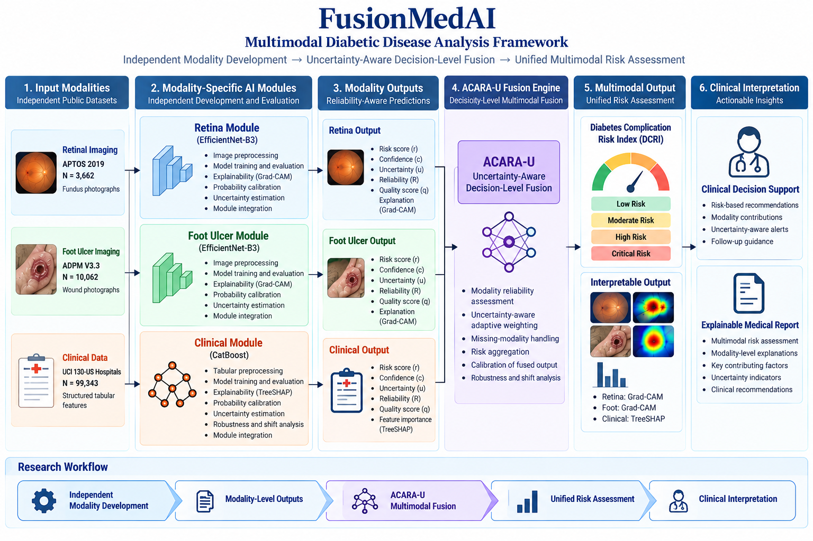
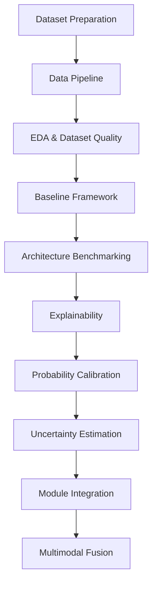
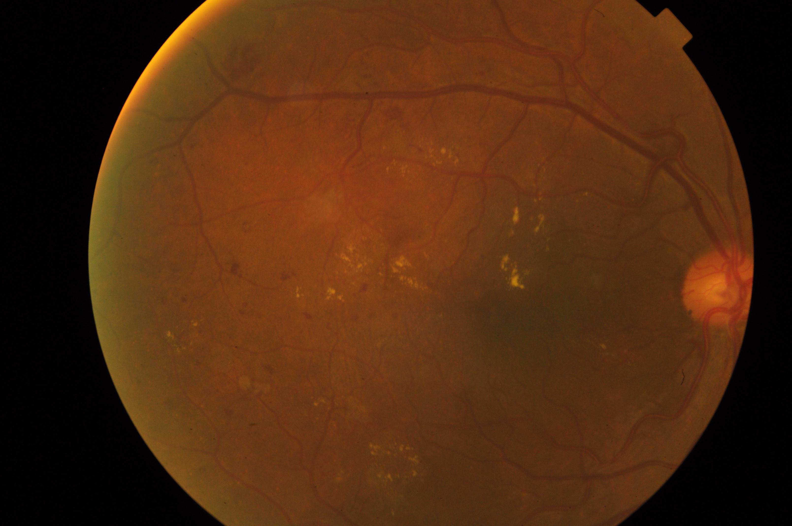
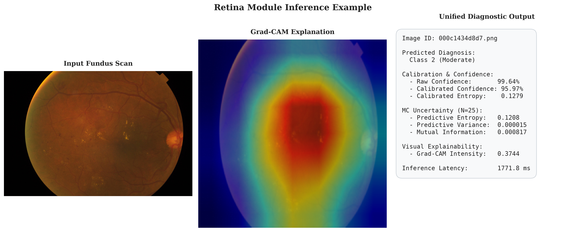
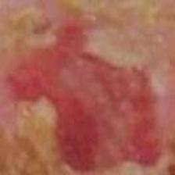
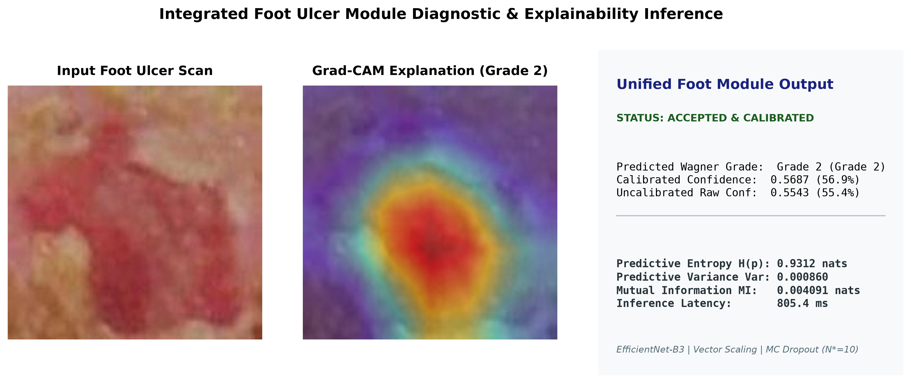

# FusionMedAI

> Explainable Multi-Modal AI Framework for Diabetic Disease Analysis

Retina • Foot Ulcer • Clinical • Multimodal Fusion

[](https://www.python.org/downloads/release/python-3120/)
[](https://pytorch.org/)
[](LICENSE)

FusionMedAI is a research framework for developing and evaluating independent AI
modules for diabetic disease analysis and combining their outputs through an
uncertainty-aware multimodal fusion layer.

The framework currently includes completed retinal imaging and diabetic
foot-ulcer pipelines, and completed clinical tabular benchmarking and explainability phases.
The multimodal fusion layer remains under development.

---

## Current Status

The Foot Ulcer module has completed dataset preparation, leakage-aware pipeline construction, exploratory data analysis, baseline model development, controlled architecture benchmarking, post-hoc explainability analysis, probability calibration, prediction uncertainty estimation, and module integration.

EfficientNet-B3 was selected as the primary Foot Ulcer backbone. Probability calibration was evaluated using Temperature Scaling and Vector Scaling, with Vector Scaling selected using validation negative log-likelihood under the predefined selection protocol.

Prediction uncertainty estimation was completed using MC Dropout, with the final configuration selected through convergence analysis. The integrated Foot module provides prediction, calibrated probabilities, uncertainty estimates, and Grad-CAM explanations through a unified inference interface.

### Retina Module
- Dataset preparation — Completed
- Data pipeline — Completed
- Exploratory data analysis and dataset quality assessment — Completed
- Baseline framework — Completed
- Architecture benchmarking — Completed
- Grad-CAM explainability — Completed
- Probability calibration — Completed
- Uncertainty estimation — Completed
- Module integration — Completed
- Acceptance testing — Completed

### Foot Ulcer Module
- Dataset acquisition and audit — Completed
- Canonical dataset construction — Completed
- Source-image grouping — Completed
- Duplicate and near-duplicate analysis — Completed
- Group-stratified train/validation/test splitting — Completed
- Dataset implementation — Completed
- Image preprocessing and augmentation pipeline — Completed
- DataLoader implementation — Completed
- End-to-end pipeline verification — Completed
- Statistical profiling — Completed
- Class-wise visual analysis — Completed
- Image quality analysis — Completed
- Outlier analysis — Completed
- Class separability analysis — Completed
- Dataset bias and shortcut analysis — Completed
- Baseline framework — Completed
- Architecture benchmarking — Completed
- Explainability — Completed
- Probability calibration — Completed
- Prediction uncertainty estimation — Completed
- Module integration — Completed

### Clinical Module
- Dataset preparation & audit (C1) — Completed
- Patient-level canonical splitting (C2) — Completed
- Clinical feature representation (C3) — Completed
- Locked clinical preprocessing (C4) — Completed
- Architecture benchmarking & HPO (C5) — Completed
- Model explainability & TreeSHAP (C6) — Completed
- Probability calibration (C7) — Completed
- Prediction uncertainty estimation (C8) — Completed
- Robustness & subgroup auditing (C9) — Planned (Next)
- External clinical validation (C10) — Planned
- Clinical module integration (C11) — Planned

## Clinical Module

The Clinical module evaluates structured clinical data for readmission-risk prediction using a frozen, patient-level evaluation protocol.

The C5 benchmarking phase uses:

- 99,343 total encounters
- 48,993 patients in the training partition
- 10,498 patients in validation
- 10,499 patients in test
- 119-dimensional clinical representation
- patient-level train/validation/test partitioning

The test partition contains 14,913 encounters, including 1,664 positive readmission cases.

### Clinical Research Pipeline

The clinical module was developed as a controlled benchmarking pipeline rather than a single-model experiment:

1. Frozen canonical dataset splits
2. Locked clinical preprocessing
3. 119-dimensional feature representation
4. Baseline and architecture benchmarking
5. Computational complexity profiling
6. Clinical subgroup analysis
7. Validation-only hyperparameter optimization
8. Consolidated empirical audit

The test partition was not used during hyperparameter search.

### Architecture Benchmarking

Seven tabular architectures were evaluated under the same frozen representation and patient-level splits:

| Architecture | Test ROC-AUC | Test PR-AUC | Test Brier | Test ECE |
|---|---:|---:|---:|---:|
| CatBoost | 0.6472 | 0.2038 | 0.0953 | 0.0066 |
| XGBoost | 0.6467 | 0.2035 | 0.0953 | 0.0051 |
| LightGBM | 0.6461 | 0.2038 | 0.0953 | 0.0045 |
| Logistic Regression (L2) | 0.6446 | 0.1969 | 0.0958 | 0.0080 |
| Logistic Regression (ElasticNet) | 0.6445 | 0.1971 | 0.0958 | 0.0084 |
| Random Forest | 0.6422 | 0.1991 | 0.0959 | 0.0098 |
| TabNet | 0.6252 | 0.1887 | 0.0962 | 0.0105 |

The tree-based models produced similar discrimination on the frozen test partition. CatBoost achieved the highest baseline test ROC-AUC.

### Hyperparameter Optimization

Validation-only HPO was conducted for:

- CatBoost
- XGBoost
- LightGBM

CatBoost used a bounded 15-trial search over tree depth, learning rate, iterations, L2 regularization, and subsampling.

The tuned CatBoost configuration achieved:

- Test ROC-AUC: 0.6504
- Test PR-AUC: 0.2063
- Test Brier score: 0.0952
- Test ECE: 0.0053

Relative to the default CatBoost configuration, the tuned model increased test ROC-AUC from 0.6472 to 0.6504 and test PR-AUC from 0.2038 to 0.2063.

The tuned configuration was selected using validation data only.

### Computational Analysis

A separate complexity benchmark measured training time, inference latency, and serialized model size.

Observed results included:

| Architecture | Train Time | Latency / 1k | Size |
|---|---:|---:|---:|
| Logistic Regression | 2.09 s | 1.13 ms | 1.8 KB |
| Random Forest | 2.58 s | 44.83 ms | 5,519.4 KB |
| XGBoost | 1.20 s | 1.65 ms | 260.2 KB |
| LightGBM | 0.58 s | 3.18 ms | 318.2 KB |
| CatBoost | 3.87 s | 2.35 ms | 415.6 KB |
| TabNet | 77.27 s | 19.93 ms | 1,099.7 KB |

These measurements are reported as empirical benchmark results on the evaluation environment and are not intended as hardware-independent performance guarantees.

### Clinical Subgroup Analysis

Subgroup analysis was performed for the CatBoost clinical model across validation and test partitions.

The analysis evaluates model behaviour across clinically relevant subgroups rather than relying only on aggregate metrics.

### Calibration

Calibration was evaluated using:

- Brier score
- Log loss
- Expected Calibration Error (ECE)

Among the baseline architectures, LightGBM produced the lowest measured test ECE at 0.0045.

The benchmark therefore reports both discrimination and probability-quality metrics rather than relying on ROC-AUC alone.

### Model Explainability (TreeSHAP)

Post-hoc interpretability analysis was conducted on the frozen CatBoost candidate model (`depth=4`, `learning_rate=0.1383`, `iterations=350`, `l2_leaf_reg=2.911`, `subsample=0.655`) using exact TreeSHAP across the locked test partition ($N=14,913, D=119$) without test-label inputs:

| Rank | Feature | Clinical Domain | Mean \|SHAP\| | Attribution Share | Cumulative Share | Directionality ($r$) |
| :---: | :--- | :--- | :---: | :---: | :---: | :---: |
| 1 | `number_inpatient` | Prior Healthcare Utilization | $0.2851$ | $22.43\%$ | $22.43\%$ | $+0.9531$ |
| 2 | `age_ordinal` | Age & Glycemic Monitoring | $0.1000$ | $7.86\%$ | $30.29\%$ | $+0.8604$ |
| 3 | `time_in_hospital` | Acute Clinical Complexity | $0.0814$ | $6.41\%$ | $36.70\%$ | $+0.6754$ |
| 4 | `number_diagnoses` | Acute Clinical Complexity | $0.0668$ | $5.26\%$ | $41.95\%$ | $+0.9582$ |
| 5 | `payer_code_grouped_Missing` | Encounter Context & Admin | $0.0510$ | $4.01\%$ | $45.96\%$ | $+0.9533$ |
| 6 | `insulin_exposure` | Diabetic Medications | $0.0472$ | $3.71\%$ | $49.68\%$ | $+0.9292$ |
| 7 | `num_medications` | Acute Clinical Complexity | $0.0449$ | $3.54\%$ | $53.21\%$ | $+0.5969$ |
| 8 | `diabetesMed_binary` | Treatment Dynamics | $0.0437$ | $3.44\%$ | $56.65\%$ | $+0.9757$ |
| 9 | `num_procedures` | Acute Clinical Complexity | $0.0409$ | $3.22\%$ | $59.87\%$ | $-0.7700$ |
| 10 | `number_emergency` | Prior Healthcare Utilization | $0.0379$ | $2.98\%$ | $62.86\%$ | $+0.5749$ |

Key findings from the explainability audit include:
- **Taxonomy Concentration**: Prior Healthcare Utilization ($26.22\%$) and Acute Clinical Complexity ($21.23\%$) together account for $47.45\%$ of total mean absolute SHAP attribution across $8$ compact features.
- **Attribution Ranking Stability**: Near-perfect ranking correlation between validation and test partitions ($\rho = 0.9994$, $p = 3.86 \times 10^{-172}$) with $100\%$ Top-20 feature overlap.
- **Demographic Attribution**: Explicit demographic variables (race, gender) contribute $1.91\%$ of total attribution, with similar attribution magnitudes observed across female and male cohorts.
- **Local & Error Case Profiling**: Audited positive, negative, false-positive, and false-negative case attributions under the primary $\theta=0.20$ operating threshold.
- **Non-Causal Associative Scope**: SHAP attributions reflect additive contributions in model log-odds space within this dataset and do not establish causal clinical mechanisms or treatment effects.

### Probability Calibration & Risk Reliability (C7)

Post-hoc calibration was evaluated on the frozen CatBoost candidate model to assess risk probability reliability on the locked test partition ($N=14,913, D=119$) using validation-only parameter fitting ($N_{\text{val}}=14,911$):

| Method | Val Log Loss | Val Brier | Val ECE | Test Log Loss | Test Brier | Test ECE | Test Slope | Test PR-AUC | Test ROC-AUC |
| :--- | :---: | :---: | :---: | :---: | :---: | :---: | :---: | :---: | :---: |
| **Raw CatBoost** | 0.3437 | 0.0990 | 0.0048 | **0.3338** | **0.0953** | **0.0032** | 0.9492 | **0.2035** | **0.6495** |
| **Platt Scaling** | 0.3436 | 0.0990 | 0.0030 | 0.3339 | 0.0954 | 0.0054 | 0.9661 | **0.2035** | **0.6495** |
| **Beta Calibration** | 0.3436 | 0.0990 | 0.0040 | 0.3338 | 0.0953 | 0.0062 | **0.9720** | **0.2035** | **0.6495** |
| **Isotonic Regression** | **0.3420** | **0.0986** | **0.0000** | 0.3359 | 0.0956 | 0.0062 | 0.8541 | 0.1931 | 0.6475 |

Key findings from the Phase C7 calibration evaluation:
- **Optimization Trade-offs & Status**: Isotonic Regression was selected under the pre-registered minimum-validation-NLL criterion ($\text{Val NLL} = 0.3420$, $\text{Val ECE} = 0.0000$). On out-of-sample test data, Beta Calibration achieved the strongest parametric calibration slope ($0.9720$) while strictly preserving continuous rank discrimination ($\text{PR-AUC} = 0.2035$), whereas the raw model retained the lowest test ECE ($0.0032$). No single calibrator is declared universally superior or permanently frozen solely from this experiment; deployment selection will be finalized after Phase C8 uncertainty analysis.
- **Subgroup Calibration Reliability**: Evaluated across Inpatient history ($\ge 1$), Gender (Male, Female), and Age cohorts ($<50, 50-70, \ge 70$), showing no major subgroup calibration degradation under the evaluated ECE criterion ($\text{ECE} < 0.030$).
- **Decision Curve Analysis (DCA)**: Calibrated predictions demonstrate positive net benefit over both "Treat All" and "Treat None" default clinical policies across the verified decision threshold window $\theta \in [0.05, 0.25]$. At $\theta = 0.15$, the model captures $40.05\%$ of readmissions while reducing intervention workload by $76.37\%$.
- **Non-Causal Calibration Scope**: Calibrated probabilities approximate conditional event rates under retrospective cohort conditions and do not establish causal treatment effects or deterministic individual certainties.

### Prediction Uncertainty Estimation (C8)

Predictive uncertainty was quantified for the frozen CatBoost candidate model using a **50-member Bootstrap Ensemble** trained on resampled training draws ($N_{\text{train}}=69,519$) and evaluated on the locked test partition ($N_{\text{test}}=14,913, D=119$):

| Metric | Measured Test Value | Description / Operational Role |
| :--- | :---: | :--- |
| **Ensemble Size ($M$)** | $50\text{ models}$ | Selected by empirical convergence audit ($\rho = 0.9994$ ranking correlation). |
| **Mean Predictive Uncertainty ($\sigma_p$)** | $0.0219$ | Average standard deviation of predicted readmission risk across bootstrap resamples. |
| **Median Predictive Uncertainty** | $0.0162$ | Skewed distribution (IQR: $[0.0114, 0.0249]$, 90th percentile: $0.0421$). |
| **Error Detection AUROC ($\theta=0.20$)** | **$0.7116$** | Uncertainty reliably discriminates between correct and incorrect classifications. |
| **Error Detection AUPRC ($\theta=0.20$)** | **$0.3256$** | $+119.6\%$ improvement over random error guessing baseline ($0.1483$). |
| **Risk-Coverage AURC** | **$0.0763$** | Quantifies selective classification efficacy across progressive rejection thresholds. |
| **Excess AURC (E-AURC)** | **$0.0647$** | Distance to theoretical oracle selective predictor ($\text{AURC}_{\text{oracle}} = 0.0116$). |
| **Error Rate at 80% Coverage** | **$10.23\%$** | $31.0\%$ error reduction achieved by rejecting the $20\%$ most uncertain encounters. |

Key findings from the Phase C8 uncertainty estimation:
- **Error Identification**: Encounters misclassified by the model exhibit an average uncertainty of $\sigma_p = 0.0357$ compared to $\sigma_p = 0.0195$ for correct cases ($p < 10^{-100}$), validating uncertainty as a reliable automated failure indicator.
- **Selective Classification**: Progressively abstaining on uncertain predictions reduces residual error from $14.83\%$ (full cohort) to $10.23\%$ at $80\%$ coverage and $7.77\%$ at $50\%$ coverage.
- **Threshold Ambiguity Tiers**: Stratified encounters into 6 operational tiers around $\theta = 0.20$, isolating the $6.14\%$ of cases located in the decision-boundary ambiguity zone ($\theta \pm 0.03$ with high variance).
- **Phenotype Divergence**: Prior Inpatient $= 0$ encounters exhibit low baseline variance ($\mu_{\sigma} = 0.0160$), whereas Prior Inpatient $\ge 1$ encounters experience higher epistemic spread ($\mu_{\sigma} = 0.0336$, Error AUROC: $0.7048$).
- **Multimodal Schema**: Formalized the `ClinicalOutput` schema containing prediction, calibrated probability, predictive standard deviation, 95% predictive interval $[q_{2.5}, q_{97.5}]$, and decision tier.

### Interpretation of Results

The C5-C8 experiments demonstrate that gradient-boosted trees provide strong tabular discrimination, interpretable attributions aligned with clinical risk factors, reliable probability calibration, and validated predictive uncertainty on the locked 119-dimensional representation.

The results support using the frozen CatBoost ensemble as the clinical candidate for subsequent robustness auditing (C9) and multimodal integration.

This result should not be interpreted as evidence of clinical effectiveness. External validation, prospective evaluation, calibration assessment on independent populations, and clinical utility analysis remain future work.

### Reproducibility and Experiment Integrity

Each benchmarking run exports experiment artifacts and a cryptographic manifest.

The clinical pipeline records:

- model configuration
- validation and test metrics
- computational measurements
- subgroup analysis outputs
- HPO results
- TreeSHAP explainability attributions and figures
- Probability calibration tables, reliability diagrams, and DCA curves
- Bootstrap ensemble uncertainty metrics, risk-coverage curves, and ambiguity tiers
- experiment artifacts
- cryptographic manifest information (SHA-256)

Detailed clinical experiments are documented under:

`research/clinical/`

### Remaining Work

- Clinical module — C5 benchmarking, C6 explainability, C7 calibration, and C8 uncertainty estimation completed; subgroup & robustness auditing (C9), external validation (C10), and module integration (C11) remain
- ACARA-U multimodal fusion — Planned
- Final multimodal validation — Planned

---

## Architecture



*Figure 1. Architecture of the FusionMedAI framework.*

FusionMedAI is organized as a sequence of independent modality-specific pipelines followed by a multimodal fusion stage.

Each modality is developed and evaluated independently before integration. The current architecture comprises:

- **Retina Module** — diabetic retinopathy assessment from fundus images.
- **Foot Ulcer Module** — Wagner-grade classification from diabetic foot-ulcer images.
- **Clinical Module** — structured clinical readmission-risk assessment; C5 benchmarking & C6 explainability completed.
- **ACARA-U Fusion Engine** — uncertainty- and reliability-aware aggregation of modality outputs; under development.

The fusion layer is designed to operate on modality-level risk, confidence, reliability, and uncertainty information rather than directly combining raw modality features.

---

## Research Methodology

The project follows the same general development sequence for each modality:


```mermaid
flowchart TD
    A[Dataset Preparation] --> B[Data Pipeline]
    B --> C[EDA & Dataset Quality]
    C --> D[Baseline Framework]
    D --> E[Architecture Benchmarking]
    E --> F[Explainability]
    F --> G[Probability Calibration]
    G --> H[Uncertainty Estimation]
    H --> I[Module Integration]
    I --> J[Multimodal Fusion]
```

This separation is intentional. Dataset validation, model evaluation, calibration, uncertainty estimation, explainability, and integration are treated as separate research stages rather than being combined into a single training workflow.

---

## Retina Module

The Retina module has completed its full independent development cycle.

### Dataset
The module uses the APTOS 2019 diabetic retinopathy dataset. The dataset is not distributed with this repository and must be obtained separately.

### Dataset Analysis

The Retina pipeline included dataset quality assessment, class-distribution analysis, preprocessing validation, and leakage-aware evaluation. The data pipeline was verified before model benchmarking, with the final model evaluated on a frozen test set under a controlled experimental protocol.

### Backbone Selection
Five architectures were evaluated under a controlled benchmarking procedure:
- EfficientNet-B0
- EfficientNet-B3
- ConvNeXt-Tiny
- Swin-Tiny
- ViT-B/16

| Rank | Model | Accuracy | Balanced Acc. | Macro F1 | QWK | ROC-AUC | Parameters | Latency (GPU) |
| :---: | :--- | ---: | ---: | ---: | ---: | ---: | ---: | ---: |
| 1 | **EfficientNet-B3** | **84.20%** | 67.22% | 0.6813 | **0.9233** | 0.9457 | 10.70M | 12.64 ms |
| 2 | ConvNeXt-Tiny | 81.20% | **72.05%** | **0.6893** | 0.9145 | **0.9587** | 27.82M | **5.65 ms** |
| 3 | EfficientNet-B0 | 79.29% | 67.68% | 0.6505 | 0.9101 | 0.9353 | **4.01M** | 8.08 ms |
| 4 | Swin-Tiny | 78.75% | 66.35% | 0.6406 | 0.8973 | 0.9516 | 27.52M | 12.89 ms |
| 5 | ViT-B/16 | 77.38% | 58.01% | 0.5804 | 0.8656 | 0.9225 | 85.80M | 15.16 ms |

**Selected backbone**: EfficientNet-B3

EfficientNet-B3 was retained as the final Retina backbone based on the overall benchmark evaluation, including classification performance, quadratic weighted kappa, parameter count, and computational requirements.

The complete methodology and benchmark results are documented in Research Volume V — Architecture Benchmarking.

### Calibration and Uncertainty
The final Retina model uses:
- Temperature Scaling for probability calibration
- MC Dropout for predictive uncertainty estimation
- Predictive entropy
- Mutual information
- Risk-coverage analysis
- Grad-CAM for visual explanation

On the frozen Retina test set, MC predictive variance achieved an AUROC of 0.8443 for prediction-error detection. The MC Dropout configuration was evaluated for convergence, with 25 stochastic passes selected for the final implementation.

### Integration
The final Retina module combines prediction, calibrated confidence, uncertainty estimation, and Grad-CAM into a unified inference output. The integrated module has passed its acceptance tests.

---

## Foot Ulcer Module

The Foot Ulcer module has completed its independent development and integration cycle, from dataset audit through unified inference and acceptance testing.


### Dataset

The module uses the ADPM V3.3 Diabetic Foot Ulcer Classification dataset, organized into four Wagner-based classes:

| Class | Description |
| :--- | :--- |
| **Grade 1** | Superficial ulcer |
| **Grade 2** | Deep ulcer without bone involvement |
| **Grade 3** | Deep ulcer with abscess, osteomyelitis, or joint sepsis |
| **Grade 4** | Localized gangrene |

The audited dataset contains 10,062 valid images. Exact duplicate resolution produced 10,050 canonical images grouped into 1,770 source-image groups.

The final leakage-aware splits contain:

- **Train**: 8,038 images
- **Validation**: 1,006 images
- **Test**: 1,006 images

No source-image group overlaps occur between the final splits, and no exact duplicates cross split boundaries.

### Dataset Analysis

Exploratory analysis examined statistical distributions, visual characteristics, image quality, potential shortcuts, and class separability.

The four Wagner grades are relatively balanced across the dataset. The primary visual challenge is substantial overlap between Grade 2 and Grade 3 ulcers. Quality variations and capture artifacts were retained to maintain alignment with realistic clinical imaging conditions.

### Baseline

A ResNet-50 baseline model was evaluated under the frozen source-group split using standard cross-entropy training:

- **Test Macro F1**: 0.6339
- **Balanced Accuracy**: 0.6391
- **Accuracy**: 0.6372
- **Macro ROC-AUC**: 0.8423

The baseline highlighted two key challenges: early validation performance saturation (overfitting risk) and substantial Grade 2 ↔ Grade 3 misclassification.

### Backbone Selection

Five candidate architectures were evaluated under identical, controlled experimental conditions against the ResNet-50 baseline:

| Rank | Model | Macro F1 | Balanced Accuracy | Macro ROC-AUC | Parameters | Latency (GPU, T4) |
| :---: | :--- | ---: | ---: | ---: | ---: | ---: |
| 1 | **EfficientNet-B3** | **0.6683** | **0.6672** | **0.8685** | **10.70M** | **70.39 ms** |
| 2 | EfficientNet-B0 | 0.6672 | 0.6656 | 0.8431 | 4.01M | 37.89 ms |
| 3 | ConvNeXt-Tiny | 0.6566 | 0.6562 | 0.8613 | 27.82M | 109.61 ms |
| 4 | ResNet-50 (Baseline Reference) | 0.6339 | 0.6391 | 0.8423 | 23.51M | — |
| 5 | Swin-Tiny | 0.6266 | 0.6262 | 0.8269 | 27.52M | 129.09 ms |
| 6 | ViT-B/16 | 0.5788 | 0.5878 | 0.8364 | 85.80M | 310.28 ms |

**Selection**: EfficientNet-B3 was selected as the primary Foot Ulcer backbone based on the predefined primary metric of held-out test Macro F1, with Balanced Accuracy, Macro ROC-AUC, class-wise performance, and computational cost considered as secondary criteria. EfficientNet-B0 remains a lightweight alternative. Its test Macro F1 of 0.6672 was only 0.0011 below EfficientNet-B3 (0.6683), while requiring substantially fewer parameters and lower inference latency.

### Explainability

Post-hoc spatial attribution analysis using Grad-CAM was performed across the complete held-out test set ($N=1,006$). Target layer representations (`backbone.features[8]`) were empirically verified, producing localized attributions focused on visible wound bed and margin regions (mean high-attribution area fraction $= 19.61\%$). Model randomization sanity checking produced a Pearson correlation coefficient of 0.0000, indicating that the attribution maps were not preserved after model parameter randomization under the predefined sanity-check protocol. These results evaluate attribution sensitivity to model parameters; they do not establish lesion localization accuracy or clinical validity.

### Calibration

Probability calibration was performed using post-hoc Temperature Scaling and Vector Scaling on the frozen EfficientNet-B3 model.

Calibration parameters were fitted exclusively on the validation set and evaluated on the held-out test set.

Vector Scaling was selected because it achieved lower validation NLL than Temperature Scaling under the predefined selection protocol.

| Method | Test NLL | Test ECE | Accuracy | Macro F1 | Balanced Accuracy |
| :--- | ---: | ---: | ---: | ---: | ---: |
| Raw | 0.8779 | 0.0424 | 0.6690 | 0.6683 | 0.6672 |
| Temperature Scaling | 0.8785 | 0.0388 | 0.6690 | 0.6683 | 0.6672 |
| **Vector Scaling** | **0.8749** | **0.0313** | **0.6769** | **0.6758** | **0.6753** |

Vector Scaling reduced test ECE from 0.0424 to 0.0313, corresponding to a 26.18% relative reduction.

The selected calibration artifact is frozen under `experiments/foot/final_model/calibration.json`.

### Uncertainty

Prediction uncertainty estimation was evaluated on the frozen EfficientNet-B3 model and frozen Vector Scaling calibrator using stochastic MC Dropout ($N^{*}=10$ passes under the selected Option B pipeline).

On the held-out test set ($N=1,006$), Predictive Entropy achieved an AUROC of **0.7291** and AUPRC of **0.5391** for prediction-error detection. Predictive Variance achieved an AUROC of **0.6508** and AUPRC of **0.4472**, while Mutual Information achieved an AUROC of **0.6399** and AUPRC of **0.4424**.

Selective prediction via risk-coverage rejection demonstrated a monotonic test error rate reduction from 32.31% (100% coverage) to 11.20% (50% coverage). Classwise analysis showed higher uncertainty for Grade 2 and Grade 3 than for Grade 4 in this evaluation.

A total of **45 unique high-uncertainty test cases** were identified, with deterministic Grad-CAM overlays generated for qualitative inspection.

The frozen uncertainty configuration is saved in `experiments/foot/final_model/uncertainty.json`.

### Integration

The Foot Ulcer module is integrated through `src/foot/foot_module.py`.

The unified interface combines:

- EfficientNet-B3 inference
- Vector Scaling probability calibration
- MC Dropout uncertainty estimation ($N^*=10$)
- Grad-CAM explanation
- Input validation
- Unified modality output schema

The module supports both standard inference and explainable inference modes and has passed the 12-point automated verification suite and end-to-end acceptance testing across all four Wagner grades.

The Foot module output schema was also verified for contract parity with the existing `RetinaModule`, providing a consistent interface for future multimodal fusion.

---

## Core Infrastructure

The repository provides reusable infrastructure for dataset validation, model development, evaluation, and verification:

- Dataset validation
- Metadata generation
- Deterministic dataset splitting
- DataLoader and preprocessing pipelines
- Model training
- Checkpoint management
- Inference
- Architecture benchmarking
- Experiment tracking
- Grad-CAM
- Probability calibration
- MC Dropout uncertainty estimation
- Risk-coverage analysis
- Pipeline verification
- Model acceptance testing

Modality-specific implementations remain isolated under their respective source directories.

---

## Repository Structure

```directory
FusionMedAI/
├── datasets/
│   ├── retina/
│   │   ├── raw/
│   │   ├── interim/
│   │   ├── processed/
│   │   └── metadata/
│   └── foot/
│       ├── raw/
│       ├── interim/
│       ├── processed/
│       └── metadata/
├── docs/
│   └── architecture_v1.png
├── experiments/
│   ├── retina/
│   ├── foot/
│   │   ├── architecture_benchmark/
│   │   ├── explainability/
│   │   └── final_model/
│   └── clinical/
│       └── benchmarking/
├── notebooks/
│   ├── retina/
│   └── foot/
├── reports/
├── research/
│   ├── retina/
│   ├── foot/
│   ├── clinical/
│   └── fusion/
├── src/
│   ├── retina/
│   ├── foot/
│   └── clinical/
│       ├── modeling/
│       ├── benchmarking/
│       └── ...
├── verification/
│   ├── retina/
│   │   ├── data/
│   │   └── model/
│   └── foot/
│       ├── data/
│       └── model/
├── LICENSE
└── requirements.txt
```

---

## Research Documentation

### Retina
| Volume | Topic | Status |
| :--- | :--- | :---: |
| **I** | Dataset Preparation | Completed |
| **II** | Data Pipeline | Completed |
| **III** | Exploratory Data Analysis | Completed |
| **IV** | Baseline Framework | Completed |
| **V** | Architecture Benchmarking | Completed |
| **VI** | Model Explainability | Completed |
| **VII** | Probability Calibration | Completed |
| **VIII** | Prediction Uncertainty Estimation | Completed |
| **IX** | Module Integration & Finalization | Completed |

### Foot Ulcer

| Phase | Topic | Status |
|---|---|---|
| 10.1 | Dataset Preparation & Audit | Completed |
| 10.2 | Data Pipeline | Completed |
| 10.3.1 | Dataset Statistical Profiling | Completed |
| 10.3.2 | Class-Wise Visual Analysis | Completed |
| 10.3.3 | Image Quality Analysis | Completed |
| 10.3.4 | Outlier Analysis | Completed |
| 10.3.5 | Class Separability Analysis | Completed |
| 10.3.6 | Dataset Bias & Shortcut Analysis | Completed |
| 10.4 | Baseline Framework | Completed |
| 10.5 | Architecture Benchmarking | Completed |
| 10.6 | Explainability | Completed |
| 10.7 | Probability Calibration | Completed |
| 10.8 | Prediction Uncertainty Estimation | Completed |
| 10.9 | Module Integration | Completed |

### Clinical

| Phase | Topic | Status |
|---|---|---|
| C1 | Clinical Dataset Preparation | Completed |
| C2 | Patient-Level Canonical Splitting | Completed |
| C3 | Clinical Feature Representation | Completed |
| C4 | Locked Clinical Preprocessing | Completed |
| C5 | Architecture Benchmarking & HPO | Completed |
| C6 | Model Explainability (TreeSHAP) | Completed |
| C7 | Probability Calibration | Planned |
| C8 | Prediction Uncertainty Estimation | Planned |
| C9 | Robustness & Subgroup Auditing | Planned |
| C10 | External Clinical Validation | Planned |
| C11 | Clinical Module Integration | Planned |

---

## Installation & Setup

### Requirements
- Python 3.12
- PyTorch 2.4

Create a virtual environment and install project dependencies:

```bash
git clone https://github.com/Dr-Venom29/FusionMedAI.git
cd FusionMedAI

python -m venv venv

# On Windows:
venv\Scripts\activate
# On Linux/macOS:
source venv/bin/activate

pip install -r requirements.txt
```

### Dataset Setup

#### Retina
The APTOS 2019 dataset must be obtained separately.

Expected structure:
```directory
datasets/
└── retina/
    └── raw/
        └── aptos2019/
            ├── train.csv
            └── train_images/
                ├── 000c1434d8d8.png
                ├── 001639a39701.png
                └── ...
```

#### Foot Ulcer
The Foot Ulcer dataset is maintained separately under:
```directory
datasets/
└── foot/
    └── raw/
```

The raw dataset is treated as immutable. Dataset cleaning, canonicalization, grouping, and final modeling splits are generated into the corresponding `processed/`, `interim/`, and `metadata/` directories.

---

## Verification

Verification scripts are maintained independently from the training code under `verification/`:
- `verification/retina/data/` & `verification/retina/model/`
- `verification/foot/data/` & `verification/foot/model/`
- `verification/clinical/data/` & `verification/clinical/model/`

The framework verifies components including:
- Dataset integrity
- Pipeline construction
- Model initialization
- Training and backpropagation
- Checkpoint loading
- Inference
- Explainability
- Calibration
- Uncertainty estimation
- Module-level acceptance

The project does not treat successful model training alone as sufficient validation. Each completed research stage has its own verification criteria.

---

## Example Retina Inference

### Input Fundus Scan


### Unified Prediction & Explanation Output


The output demonstrates the integrated Retina inference interface, including model prediction, calibrated confidence, uncertainty information, and Grad-CAM explanation.

---

## Example Foot Ulcer Inference

### Input Foot Ulcer Image



### Unified Prediction & Explanation Output



The output demonstrates the integrated Foot Ulcer inference interface, including Wagner-grade prediction, calibrated confidence, uncertainty information, and Grad-CAM explanation.

---

## Development Roadmap

- **v1.0 (Retina Module)** — **Completed**. The Retina pipeline has progressed from dataset preparation through module integration and acceptance testing.
- **v2.0 (Foot Ulcer Module)** — **Completed**. The Foot Ulcer pipeline has progressed from dataset audit through probability calibration, uncertainty estimation, module integration, and acceptance testing.
- **v3.0 (Clinical Module)** — **C5 Benchmarking & C6 Explainability Completed**. The clinical pipeline has progressed through patient-level splitting, locked preprocessing, architecture benchmarking, computational profiling, subgroup analysis, validation-only HPO, and TreeSHAP explainability.
- **v4.0 (ACARA-U Fusion)** — **Planned**. Integration of the Retina, Foot Ulcer, and Clinical modules through the ACARA-U uncertainty- and reliability-aware fusion framework.

---

## License

This project is distributed under the MIT License. See [LICENSE](LICENSE) for details.
