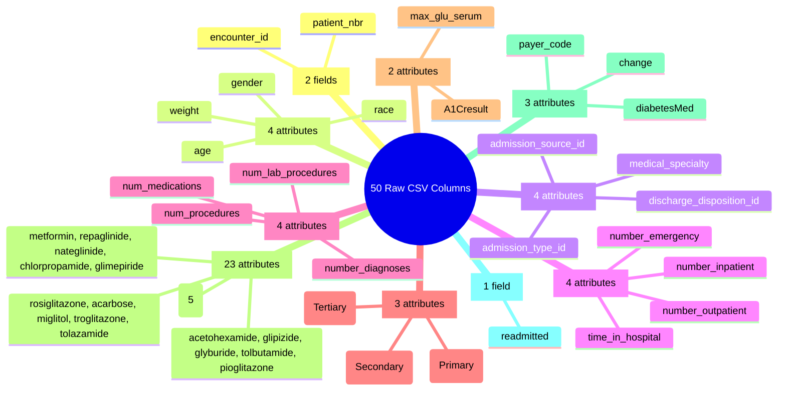

# Clinical Dataset: Diabetes 130-US Hospitals (1999–2008)

This directory contains the dataset artifacts, audit specifications, and metadata for the **Clinical Modality** of **FusionMedAI**.

The clinical modality extracts risk signals from structured electronic health record (EHR) data to predict 30-day early hospital readmissions in diabetic patients. Downstream, calibrated risk distributions and uncertainty estimates are fused with the **Retina** and **Foot Ulcer** modalities within the **ACARA-U** multimodal fusion engine.

---

## 1. Directory Structure

```directory
datasets/clinical/
├── diabetic_data.csv          # Raw encounter table (101,766 rows, 50 columns) [Read-only / Frozen]
├── IDS_mapping.csv            # Lookup mappings for admission/discharge integer IDs [Read-only]
└── README.md                  # Comprehensive clinical dataset audit documentation
```

*Note: Raw data files (`diabetic_data.csv` and `IDS_mapping.csv`) are cryptographically frozen and ignored in git tracking via `.gitignore`.*

---

## 2. Dataset Physical Inventory & Cryptographic Fingerprint

| File Name | Physical Size | Record Count | Column Breakdown | Cryptographic Hash (SHA-256) |
| :--- | :--- | :---: | :---: | :--- |
| `diabetic_data.csv` | 19,159,383 bytes (18.27 MB) | 101,766 encounters | 50 columns (47 predictive + 2 identifiers + 1 target) | `0689e7ec031237dc63031b938805c48377748761a3b26acab621567afa24df97` |
| `IDS_mapping.csv` | 2,547 bytes (2.49 KB) | 69 mapping rows | 2 columns | `f1bb82b471cb34649352597572c9b1fb00bd27f77b9f5a22a03dc3eb1039749e` |

---

## 3. Dataset Provenance & Inclusion Criteria

- **Primary Source**: Health Facts database (Cerner Corporation, Kansas City, MO, USA), published via the UCI Machine Learning Repository.
- **Reference Publication**:
  > Strack, B., DeShazo, J. P., Gennings, C., Olmo, J. L., Ventura, S., Cios, K. J., & Clore, J. N. (2014). *Impact of HbA1c Measurement on Hospital Readmission Rates: Analysis of 70,000 Clinical Database Patient Records*. BioMed Research International, vol. 2014, Article ID 781670. [DOI: 10.1155/2014/781670](https://doi.org/10.1155/2014/781670)
- **Temporal & Spatial Scope**: 10 continuous years (1999–2008) across 130 participating medical centers in the United States.
- **Inclusion Rules**:
  1. Inpatient hospital admission.
  2. Established diabetes diagnosis (ICD-9 prefix `250.xx` in top 3 diagnoses).
  3. Length of stay between 1 and 14 days.
  4. At least one laboratory test performed during the stay.
  5. Diabetic pharmacotherapy administered or prescribed during the encounter.

---

## 4. Target Formulation: 30-Day Early Hospital Readmission

The dataset provides the raw target column `readmitted`:

| Raw Category | Clinical Meaning | Encounter Count | Percentage | Primary Binary Mapping ($y \in \{0, 1\}$) |
| :--- | :--- | :---: | :---: | :---: |
| `'NO'` | No readmission recorded in the dataset's participating hospital network | 54,864 | 53.91% | $y = 0$ (Negative / No early readmission) |
| `'>30'` | Readmission recorded after 30 days post-discharge | 35,545 | 34.93% | $y = 0$ (Negative / No early readmission) |
| `'<30'` | **Early readmission recorded within 30 days post-discharge** | 11,357 | 11.16% | **$y = 1$ (Positive / 30-Day Readmission)** |
| **Total** | | **101,766** | **100.00%** | **Baseline Prevalence: 11.16%** (Imbalance $\approx 1:7.96$) |

### Prediction-Time Boundary
The primary task is defined at the point of **discharge planning**. Therefore, features representing information accumulated during the completed inpatient encounter may be used, provided that they are available before the prediction is issued. This formulation must not be interpreted as an admission-time readmission prediction task.

---

## 5. 50-Column Clinical Taxonomy (9 Domains)

The 50 CSV columns are partitioned into **47 predictive/input attributes**, **2 identifier fields**, and **1 target field** across **9 domains**:



*\*Note: `examide` and `citoglipton` contain 100% `'No'` across all 101,766 rows (zero-variance attributes).*

---

## 6. Missingness Paradigms & Informative Absence

The audit establishes a strict pre-modeling distinction between three types of missingness:

1. **Unrecorded Data (`'?'`)**:
   - `weight`: 98,569 missing (96.86%) — rarely recorded across participating hospitals.
   - `medical_specialty`: 49,949 missing (49.08%) — general/unspecified admitting service.
   - `payer_code`: 40,256 missing (39.56%) — non-clinical billing field unassigned.
   - `race`: 2,273 missing (2.23%) — declined/unreported demographic.
   - `diag_3` (1.40%), `diag_2` (0.35%), `diag_1` (0.02%) — fewer than 3 diagnoses coded.

2. **Informative Absence (`'None'`) in Laboratory Tests**:
   - `A1Cresult` is `'None'` in **84,748 encounters (83.28%)**.
   - `max_glu_serum` is `'None'` in **96,420 encounters (94.75%)**.
   - **Clinical Policy**: `'None'` indicates that the corresponding test result was not recorded for the encounter. This state is retained explicitly because test ordering/measurement itself may carry clinical information (MNAR). Blindly imputing `'None'` destroys this clinical behavioral signal.

3. **Administrative Missingness in Lookup IDs**:
   - Explicit integer codes for *NULL*, *Not Available*, or *Not Mapped* exist in `admission_type_id`, `discharge_disposition_id`, and `admission_source_id`.

---

## 7. Encounter vs. Patient Dynamics

The dataset is **encounter-level** rather than independent-patient level:
- **Total Encounters**: 101,766
- **Unique Patients**: 71,518
- **Single-Encounter Cohort**: 54,745 patients (76.55%) appear exactly once.
- **Repeat-Encounter Cohort**: 16,773 patients (23.45%) account for **47,021 encounters (46.20%)**.
- **Maximum Visits per Patient**: 40 encounters.

**Mandatory Isolation Rule**: All train/validation/test splits must be grouped strictly by `patient_nbr` (e.g., `StratifiedGroupKFold`) to prevent patient history leakage across evaluation folds:
$$\text{Patients}(\mathcal{D}_{\text{train}}) \cap \text{Patients}(\mathcal{D}_{\text{val}}) \cap \text{Patients}(\mathcal{D}_{\text{test}}) = \emptyset$$

---

## 8. Cohort Eligibility & Risk Register Summary

1. **Expired / Hospice Structural Determinism**: 2,423 encounters with discharge dispositions associated with death or hospice care require explicit cohort eligibility handling before model training.
2. **Patient Overlap**: Repeat visits from the same patient across splits cause severe memorization leakage.
3. **Chronological Drift**: `encounter_id` increases monotonically with calendar year and must be excluded from feature matrices.
4. **Timing Boundary**: Tabular risk is formally formulated as a Discharge-Time Risk Stratification task.

---

## 9. Verification Gate Execution

All 11 Phase C1 audit gates are verifiable deterministically via the automated verification script:

```bash
python verification/clinical/data/verify_dataset_audit.py
```

---

## 10. Clinical Research & Pipeline Progression

| Phase | Volume / Milestone | Focus | Status |
| :---: | :--- | :--- | :---: |
| **C1** | [Volume 01: Dataset & Task Audit](../../research/clinical/Volume_01_Dataset_Audit/README.md) | Provenance, Schema, Target Freeze, Missingness, Leakage Register | ✅ **PASS (FROZEN)** |
| **C2** | [Volume 02: Data Pipeline Construction](../../research/clinical/Volume_02_Data_Pipeline/README.md) | Patient-Grouped Stratified Splits, Cohort Eligibility, Zero-Leakage | ✅ **PASS** |
| **C3** | [Volume 03: Exploratory Data Analysis](../../research/clinical/Volume_03_Exploratory_Data_Analysis/README.md) | Feature Distributions, Missingness Structure, Representation Contract | ✅ **PASS** |
| **C4** | Volume 04: Baseline Framework | Logistic Regression, Random Forest, XGBoost, LightGBM | ⬜ **NEXT** |
| **C5** | Volume 05: Architecture Benchmarking | TabNet, CatBoost, Modern Tabular Deep Architectures | ⬜ |
| **C6** | Volume 06: Model Explainability | TreeSHAP, Integrated Gradients, Clinical Feature Attribution | ⬜ |
| **C7** | Volume 07: Probability Calibration | Platt Scaling, Isotonic Regression, Temperature Scaling | ⬜ |
| **C8** | Volume 08: Uncertainty Estimation | Deep Ensembles, Epistemic vs Aleatoric Uncertainty | ⬜ |
| **C9** | Volume 09: Multimodal Integration | Integration into ACARA-U Multimodal Decision Fusion | ⬜ |
