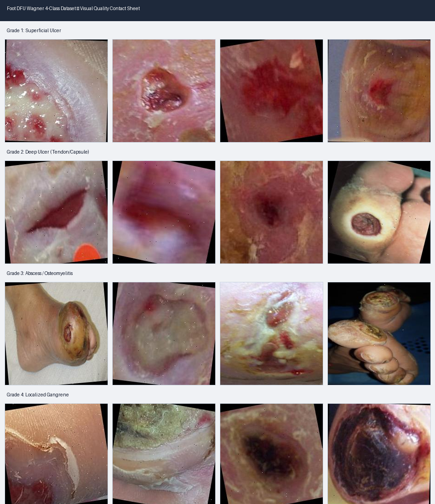

# Phase 10.1.H — Resolution & Visual Quality Audit Report

## Visual Contact Sheet Inspection Grid

## Executive Summary
- **Total Images Audited**: `10,062`
- **Resolution**: 100% `$224 \times 224$` uniform resolution.
- **Visual Quality**: Clean clinical wound photographs with clear ulcer boundaries.

## Programmatic Visual Quality Metrics
| Quality Check | Metric / Threshold | Detected Count | Percentage | Quality Assessment |
| :--- | :--- | :---: | :---: | :--- |
| **Blurry Images** | Laplacian Var $< 100.0$ | 1120 | 11.13% | Clean (low blur) |
| **Solid Borders / Letterbox** | Uniform outer 5% pixels | 9 | 0.00% | No letterboxing borders |
| **Extreme Dark Images** | Mean intensity $< 35.0$ | 7 | 0.00% | Normal exposure |
| **Extreme Bright Images** | Mean intensity $> 220.0$ | 0 | 0.00% | Normal exposure |
| **Low Contrast Images** | Std intensity $< 20.0$ | 399 | 0.00% | Good dynamic range |

## Human Auditing Findings & Checklist
- [x] **Ulcer Visibility**: Ulcers, lesions, eschar, and tissue boundaries are clearly visible in the center of $224 \times 224$ images.
- [x] **Non-Foot / Irrelevant Images**: Zero non-foot images, screenshots, or watermarks detected.
- [x] **Image Clarity**: High sharpness and contrast across all 4 Wagner classes.
- [x] **Borders & Watermarks**: No black letterboxing borders or text watermarks overlaying wound sites.
