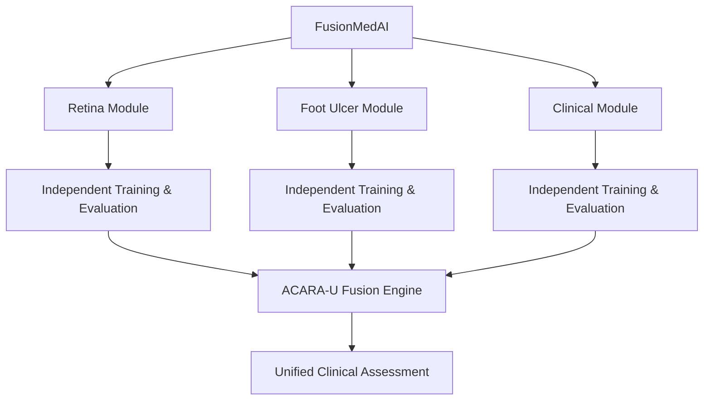
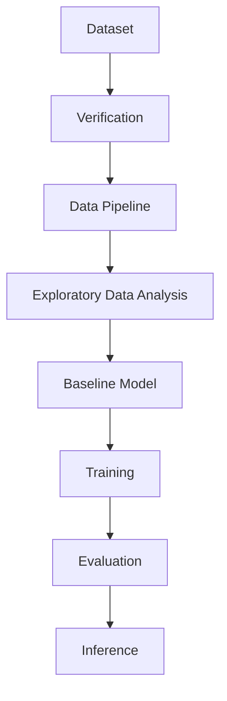

# System Architecture

## Overview

FusionMedAI is organized as a modular clinical intelligence framework. Each medical modality is developed, trained, validated, and verified independently before integration through the ACARA-U Fusion Engine.

This design improves reproducibility, simplifies experimentation, and prevents information leakage between heterogeneous public datasets.

---

## High-Level Architecture

---

## Module Architecture

Each modality follows the same engineering workflow:

This standardized pipeline ensures that every module is independently validated before participating in multimodal fusion.

---

## Current Implementation Status

| Module            | Status                        |
| ----------------- | ----------------------------- |
| Retina Module     | ✅ Baseline Framework Complete |
| Foot Ulcer Module | ⏳ Planned                     |
| Clinical Module   | ⏳ Planned                     |
| ACARA-U Fusion    | ⏳ Planned                     |

---

## Fusion Strategy

FusionMedAI adopts a **decision-level fusion** methodology.

Each independent module produces:

* Disease prediction
* Confidence score
* Reliability score
* Uncertainty estimate

The ACARA-U Fusion Engine aggregates these outputs to generate the final clinical assessment.

Raw patient features are **not** merged across datasets because the public datasets originate from different patient populations.

---

## Design Principles

The system architecture is based on the following principles:

* Modular software design
* Independent model development
* Reproducible experimentation
* Versioned experiment tracking
* Explainability-ready architecture
* Scalable multimodal integration
