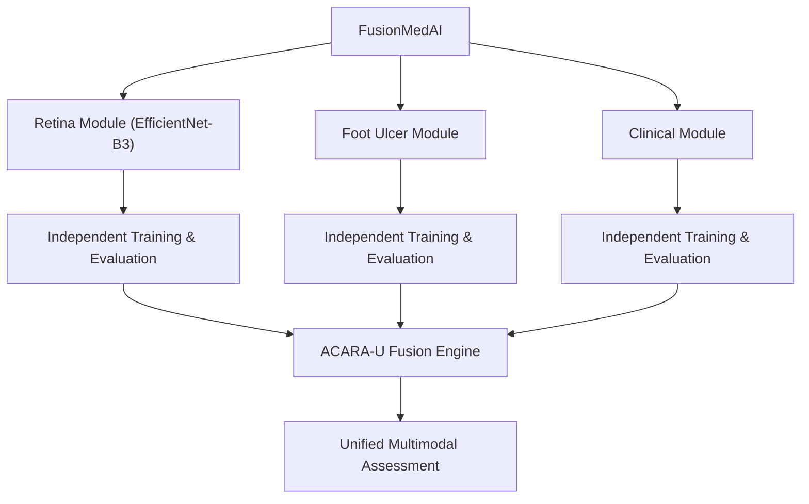
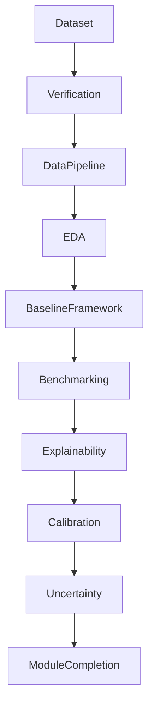

# System Architecture

## Overview

FusionMedAI is organized as a modular research framework for multimodal diabetic disease analysis. Each modality is developed and evaluated independently before its outputs are considered for integration through the ACARA-U Fusion Engine.

This design improves reproducibility, simplifies experimentation, and prevents information leakage between heterogeneous public datasets.

---

## High-Level Architecture

```mermaid
flowchart TD
    FMAI[FusionMedAI] --> Retina["Retina Module (EfficientNet-B3)"]
    FMAI --> Foot[Foot Ulcer Module]
    FMAI --> Clinical[Clinical Module]
    
    Retina --> R_Eval[Independent Training & Evaluation]
    Foot --> F_Eval[Independent Training & Evaluation]
    Clinical --> C_Eval[Independent Training & Evaluation]
    
    R_Eval & F_Eval & C_Eval --> Engine[ACARA-U Fusion Engine]
    Engine --> Assessment[Unified Multimodal Assessment]
```

---

## Module Architecture

Each modality follows the same engineering workflow:

```mermaid
flowchart TD
    Dataset
    --> Verification
    --> DataPipeline
    --> EDA
    --> BaselineFramework
    --> Benchmarking
    --> Explainability
    --> Calibration
    --> Uncertainty
    --> ModuleCompletion
```

For the Retina Module, this workflow currently terminates in the final Retina Module integration and verification stage.

The same methodology is currently being applied to the Foot Ulcer module, followed subsequently by the Clinical module.

---

## Current Implementation Status

| Module            | Status |
| ----------------- | ------ |
| Retina Module     | ✅ Complete |
| Foot Ulcer Module | 🔄 In development |
| Clinical Module   | ⏳ Planned |
| ACARA-U Fusion    | ⏳ Planned |

---

## Fusion Strategy

FusionMedAI adopts a **decision-level fusion** methodology.

Each independent module produces:

* Disease prediction
* Confidence score
* Reliability score
* Uncertainty estimate

The ACARA-U Fusion Engine aggregates these outputs to generate the final assessment.

Raw patient features are **not** merged across datasets because the public datasets originate from different patient populations.

---

## Design Principles

The system architecture is based on the following principles:

* Modular software design
* Independent model development
* Reproducible experimentation
* Versioned experiment tracking
* Separate evaluation of modality-specific models
* Decision-level fusion of modality outputs
