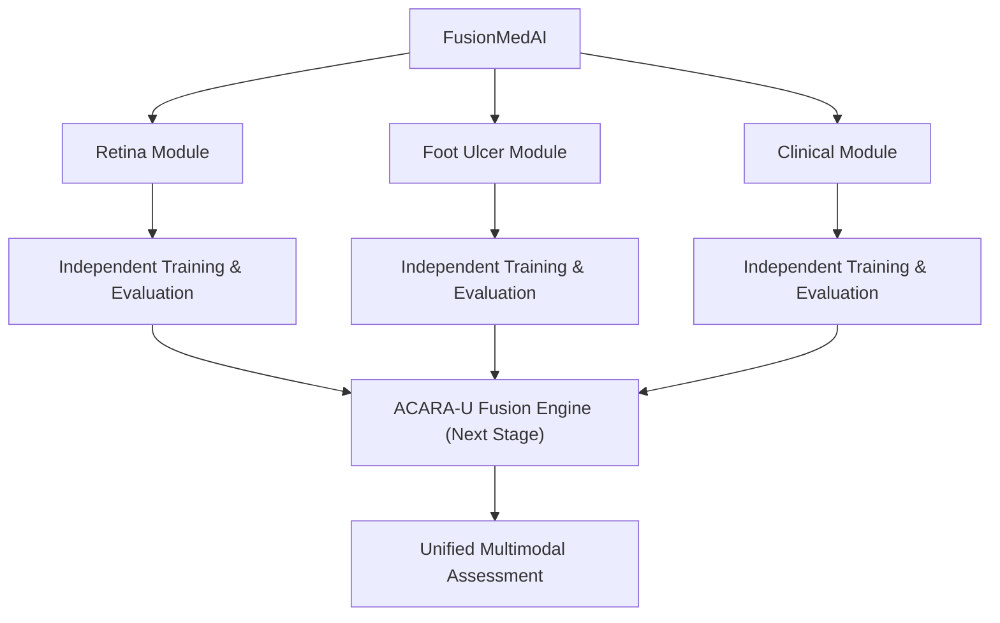
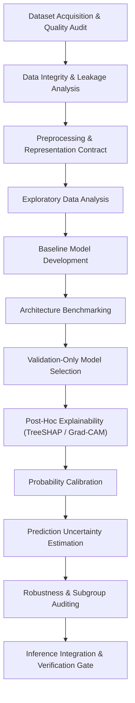
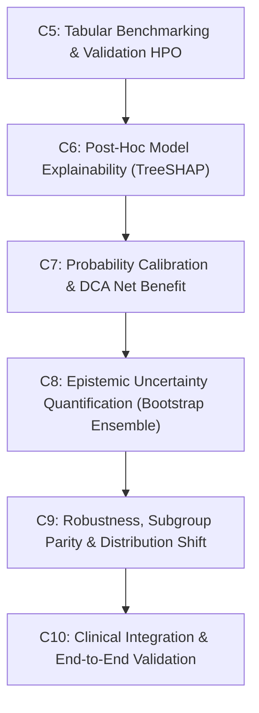
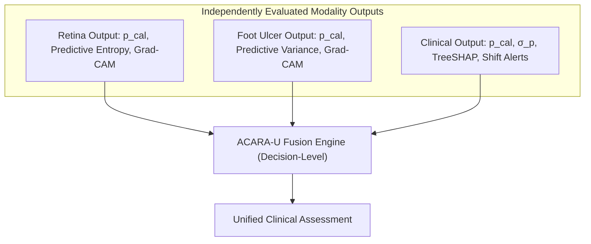

# System Architecture

## Overview

FusionMedAI is organized as a modular research framework for multimodal diabetic disease analysis. Each modality is developed and evaluated independently before its outputs are considered for multimodal integration through the ACARA-U Fusion Engine.

The architecture separates modality-specific datasets, preprocessing pipelines, models, and evaluation procedures. This allows each modality to be independently characterized before fusion.

---

## High-Level Architecture

```mermaid
flowchart TD
    FMAI[FusionMedAI]

    FMAI --> Retina["Retina Module"]
    FMAI --> Foot["Foot Ulcer Module"]
    FMAI --> Clinical["Clinical Module"]

    Retina --> R_Eval["Independent Training & Evaluation"]
    Foot --> F_Eval["Independent Training & Evaluation"]
    Clinical --> C_Eval["Independent Training & Evaluation"]

    R_Eval --> Engine["ACARA-U Fusion Engine (Next Stage)"]
    F_Eval --> Engine
    C_Eval --> Engine

    Engine --> Assessment["Unified Multimodal Assessment"]
```

The three modality pipelines are evaluated independently before their outputs are provided to the fusion stage.

ACARA-U is the next major research stage. Its purpose is to determine whether information from the Retina, Foot Ulcer, and Clinical modalities provides complementary information when combined, and how modality reliability and uncertainty should influence the fused prediction.

---

## Modality Development Architecture

Each modality follows a staged research and validation process:

```mermaid
flowchart TD
    Dataset["Dataset Acquisition & Quality Audit"]
    --> Verification["Data Integrity & Leakage Analysis"]
    --> DataPipeline["Preprocessing & Representation Contract"]
    --> EDA["Exploratory Data Analysis"]
    --> BaselineFramework["Baseline Model Development"]
    --> Benchmarking["Architecture Benchmarking"]
    --> ModelSelection["Validation-Only Model Selection"]
    --> Explainability["Post-Hoc Explainability (TreeSHAP / Grad-CAM)"]
    --> Calibration["Probability Calibration"]
    --> Uncertainty["Prediction Uncertainty Estimation"]
    --> Robustness["Robustness & Subgroup Auditing"]
    --> Integration["Inference Integration & Verification Gate"]
```

The exact stages vary according to the modality and its available data:
- The **Retina** and **Foot Ulcer** branches have completed their independent development and evaluation workflows.
- The **Clinical** branch has progressed through model selection, explainability, probability calibration, uncertainty estimation, robustness and distribution-shift analysis, and clinical end-to-end integration.
- The next stage is to connect the independently evaluated modality outputs through **ACARA-U multimodal fusion**.

---

## Current Implementation Status

| Component | Status | Evaluation Scope |
| :--- | :--- | :--- |
| **Retina Module** | Complete | EfficientNet-B3, Temperature Scaling, MC Dropout, Grad-CAM |
| **Foot Ulcer Module** | Complete | EfficientNet-B3, Vector Scaling, MC Dropout, Grad-CAM |
| **Clinical Module** | Complete (C1–C10) | CatBoost HPO, TreeSHAP, Isotonic, Bootstrap Ensemble, Shift Safeguards |
| **ACARA-U Fusion** | Next Research Stage | Decision-level reliability-aware fusion (Designed & Planned) |

---

## Clinical Module Validation

The Clinical module has been evaluated through the following research stages:

```mermaid
flowchart TD
    C5["C5: Tabular Benchmarking & Validation HPO"]
    --> C6["C6: Post-Hoc Model Explainability (TreeSHAP)"]
    --> C7["C7: Probability Calibration & DCA Net Benefit"]
    --> C8["C8: Epistemic Uncertainty Quantification (Bootstrap Ensemble)"]
    --> C9["C9: Robustness, Subgroup Parity & Distribution Shift"]
    --> C10["C10: Clinical Integration & End-to-End Validation"]
```

Phase C10 verifies the integration of the frozen clinical pipeline, including structured input validation, model inference, TreeSHAP attribution, calibration, uncertainty estimation, robustness safeguards, and end-to-end batch inference.

*Note: C10 establishes the clinical branch as an independently evaluated component. It does not constitute external or prospective clinical validation.*

---

## ACARA-U Fusion Architecture

The next major research stage is **ACARA-U Multimodal Fusion**:

```mermaid
flowchart TD
    subgraph ModalityOutputs["Independently Evaluated Modality Outputs"]
        RO["Retina Output: p_cal, Predictive Entropy, Grad-CAM"]
        FO["Foot Ulcer Output: p_cal, Predictive Variance, Grad-CAM"]
        CO["Clinical Output: p_cal, σ_p, TreeSHAP, Shift Alerts"]
    end

    RO --> ACARA["ACARA-U Fusion Engine (Decision-Level)"]
    FO --> ACARA
    CO --> ACARA

    ACARA --> Final["Unified Clinical Assessment"]
```

ACARA-U will investigate decision-level fusion of the independently evaluated modality outputs.

The research evaluation will include:
- Individual-modality baselines
- Pairwise fusion
- Three-modality fusion
- Modality ablation studies
- Missing-modality scenarios
- Modality reliability and uncertainty
- Fusion calibration
- Fusion robustness
- Final end-to-end evaluation

The central research question is whether the independently developed modalities provide complementary information when combined, particularly when one modality is uncertain, degraded, or unavailable.

---

## Fusion Strategy

FusionMedAI is designed around **decision-level fusion**:

- Each modality provides an independently generated prediction together with the reliability, uncertainty, and other validated outputs available from that modality.
- ACARA-U will operate on these modality-level outputs rather than directly concatenating raw patient records from the underlying datasets.
- Raw patient features are not directly merged across the modality datasets because the datasets originate from different populations and do not represent a shared patient cohort.
- The exact ACARA-U fusion mechanism will be established and evaluated as part of the C11 research phase.

---

## Design Principles

The architecture follows these principles:
- Modular software design
- Independent modality development
- Dataset isolation
- Reproducible experimentation
- Versioned experiment tracking
- Independent modality evaluation
- Explicit uncertainty and reliability handling
- Decision-level multimodal fusion
- End-to-end verification
- Clear separation between internal evaluation and external validation
