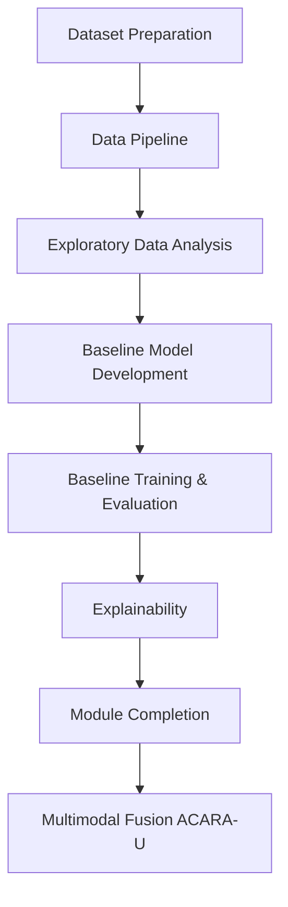

# FusionMedAI Methodology

## Overview

FusionMedAI is a modular clinical intelligence framework designed for multi-modal medical diagnosis. The project follows a staged research methodology in which each module is independently developed, validated, and benchmarked before integration into the final multimodal fusion system.

This incremental approach improves reproducibility, simplifies experimentation, and enables fair evaluation of each component.

---

# Research Methodology

The development process follows the pipeline below:

Each stage is verified before progressing to the next stage.

---

# Module Independence

FusionMedAI consists of independent diagnostic modules:

* Retina Module
* Foot Ulcer Module
* Clinical Module

Each module performs:

* Dataset preparation
* Data preprocessing
* Model training
* Evaluation
* Explainability

independently before multimodal integration.

---

# Dataset Alignment Statement

## Important Research Assumption

FusionMedAI **does not perform patient-level multimodal learning.**

The public datasets used throughout the project originate from different patient populations and therefore cannot be directly merged into a single patient-level dataset.

Consequently, patient identities are never assumed to correspond across datasets.

---

# Decision-Level Fusion (ACARA-U)

Instead of combining raw patient data, FusionMedAI adopts a **decision-level fusion** strategy.

Each module independently produces:

* Disease prediction
* Confidence score
* Reliability score
* Uncertainty estimate

These outputs are subsequently aggregated by the ACARA-U Fusion Engine to generate a unified clinical assessment.

This methodology avoids introducing artificial patient correspondences while maintaining methodological validity.

---

# Engineering Principles

The framework follows several core engineering principles:

* Modular software architecture
* Reproducible experimentation
* Configuration-driven execution
* Comprehensive verification
* Experiment versioning
* Clinically relevant evaluation metrics

---

# Current Project Status

Completed:

* Dataset Preparation
* Data Pipeline
* Exploratory Data Analysis
* Baseline Model Framework

In Progress:

* Baseline Training
* Hyperparameter Optimization
* Comparative Model Evaluation

Planned:

* Explainability
* Calibration
* Foot Ulcer Module
* Clinical Module
* ACARA-U Fusion

---

# Future Methodology

Once all individual modules have been validated, the final FusionMedAI methodology will integrate their outputs through the ACARA-U Fusion Engine using uncertainty-aware decision aggregation rather than feature-level patient fusion.

This approach preserves scientific validity while enabling multimodal clinical intelligence across heterogeneous public medical datasets.
