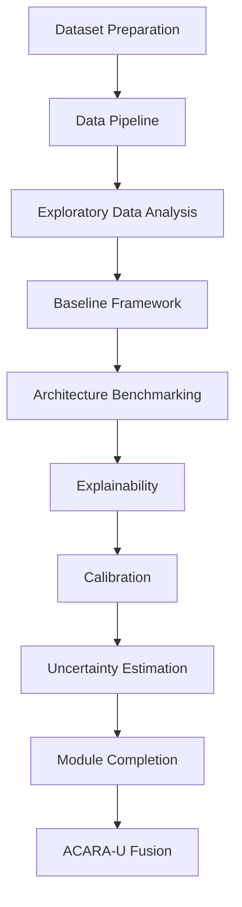

# FusionMedAI Methodology

## Overview

FusionMedAI is a modular research framework for multimodal diabetic disease analysis. The project follows a staged research methodology in which each module is independently developed, validated, and benchmarked before integration into the final multimodal fusion system.

This incremental approach improves reproducibility, simplifies experimentation, and enables fair evaluation of each component.

---

# Research Methodology

The development process follows the pipeline below:

```mermaid
flowchart TD
    DatasetPrep[Dataset Preparation]
    --> DataPipeline[Data Pipeline]
    --> EDA[Exploratory Data Analysis]
    --> BaselineFramework[Baseline Framework]
    --> ArchitectureBenchmarking[Architecture Benchmarking]
    --> Explainability
    --> Calibration
    --> UncertaintyEstimation[Uncertainty Estimation]
    --> ModuleCompletion[Module Completion]
    --> MultimodalFusion[ACARA-U Fusion]
```

Each stage is verified before progressing to the next stage.

---

# Module Independence

FusionMedAI consists of independent diagnostic modules:

* Retina Module
* Foot Ulcer Module
* Clinical Module

Each module performs:

* Dataset preparation
* Data preprocessing
* Model training
* Evaluation
* Explainability
* Probability Calibration
* Uncertainty Estimation

independently before multimodal integration.

---

# Dataset Alignment Statement

## Important Research Assumption

FusionMedAI **does not perform patient-level multimodal learning.**

The public datasets used throughout the project originate from different patient populations and therefore cannot be directly merged into a single patient-level dataset.

Consequently, patient identities are never assumed to correspond across datasets.

---

# Decision-Level Fusion (ACARA-U)

Instead of combining raw patient data, FusionMedAI adopts a **decision-level fusion** strategy.

Each module independently produces:

* Disease prediction
* Confidence score
* Reliability score
* Uncertainty estimate

These outputs are subsequently aggregated by the ACARA-U Fusion Engine to generate a unified assessment.

This methodology avoids introducing artificial patient correspondences while maintaining methodological validity.

---

# Engineering Principles

The framework follows several core engineering principles:

* Modular software architecture
* Reproducible experimentation
* Configuration-driven execution
* Comprehensive verification
* Experiment versioning
* Clinically relevant evaluation metrics

---

# Current Project Status

Completed:
* **Retina Module**: Complete from Dataset Preparation through Integration and Acceptance testing.
* **Foot Ulcer Module**: Completed through Phase 10.4 (Baseline Framework: ResNet-50 Macro F1 `0.6339`).

Current Stage:
* **Foot Ulcer Module — Phase 10.5 Architecture Benchmarking**

Planned:
* Clinical Module Development
* ACARA-U Fusion Engine

---

# Future Methodology

Once all individual modules have been validated, the final FusionMedAI methodology will integrate their outputs through the ACARA-U Fusion Engine using uncertainty-aware decision aggregation rather than feature-level patient fusion.

This approach avoids assuming that records from different public datasets belong to the same patients.

---

# Architecture Benchmarking (Step 5)

FusionMedAI conducts controlled architecture benchmarking to select the backbone for the evaluated dataset and experimental protocol. The protocol ensures that inductive biases and architectural paradigms (e.g., CNNs vs Vision Transformers) are compared transparently while keeping the specified training configuration fixed across architectures.

## Benchmarking Protocol
- **Frozen Environment**: All architectures are subjected to the exact same dataset, train/val/test splits, batch size, epochs, and random seeds.
- **Identical Optimization**: The specified optimizer, scheduler, and loss function are kept fixed across the benchmarked architectures.
- **Hardware Efficiency Tracking**: Beyond diagnostic metrics (Accuracy, QWK, ROC-AUC), models are profiled for parameter count, FLOPs, MACs, peak VRAM, inference latency, and throughput.
- **Model Selection**: Model selection considers the predefined evaluation metrics together with measured computational characteristics such as parameter count, memory usage, and inference latency.
