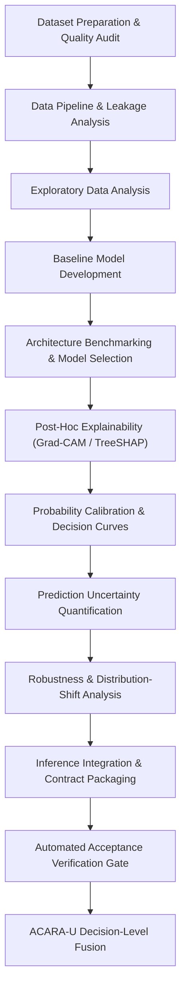
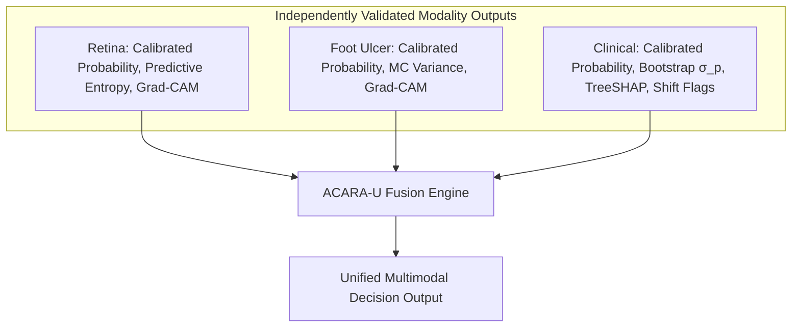

# FusionMedAI Methodology

## Overview

FusionMedAI is a modular research framework for multimodal diabetic disease analysis. The project follows a staged research methodology in which each modality is independently developed, validated, and benchmarked before its outputs are considered for decision-level integration through the ACARA-U Multimodal Fusion layer.

Each stage is evaluated separately so that dataset integrity, model discrimination, calibration, interpretability, uncertainty, robustness, and integration characteristics can be inspected and audited independently.

---

## Research Methodology

The development and evaluation process follows the staged research sequence below:

```mermaid
flowchart TD
    DatasetPrep["Dataset Preparation & Quality Audit"]
    --> DataPipeline["Data Pipeline & Leakage Analysis"]
    --> EDA["Exploratory Data Analysis"]
    --> BaselineFramework["Baseline Model Development"]
    --> Benchmarking["Architecture Benchmarking & Model Selection"]
    --> Explainability["Post-Hoc Explainability (Grad-CAM / TreeSHAP)"]
    --> Calibration["Probability Calibration & Decision Curves"]
    --> UncertaintyEstimation["Prediction Uncertainty Quantification"]
    --> Robustness["Robustness & Distribution-Shift Analysis"]
    --> Integration["Inference Integration & Contract Packaging"]
    --> Verification["Automated Acceptance Verification Gate"]
    --> MultimodalFusion["ACARA-U Decision-Level Fusion"]
```

Each major stage includes a corresponding verification procedure before its results are accepted into the permanent research record.

---

## Module Independence

FusionMedAI consists of three independent diagnostic and prognostic modalities:
- **Retina Module** (Fundus Imaging)
- **Foot Ulcer Module** (Wound Bed Imaging)
- **Clinical Tabular Module** (Structured EHR Records)

Each module is developed and evaluated independently. The common methodology comprises:
- Dataset preparation, audit, and quality assessment
- Data preprocessing and representation contract verification
- Exploratory data analysis and feature characterization
- Baseline model development
- Controlled architecture benchmarking and validation-only optimization
- Post-hoc explainability analysis
- Post-hoc probability calibration and decision curve analysis
- Epistemic and predictive uncertainty quantification
- Robustness, subgroup parity, and distribution-shift analysis, where applicable
- Module-level integration and automated acceptance verification

The exact evaluation protocol is tailored to the data characteristics of each modality (e.g., spatial convolutional activations for images, tabular tree ensembles and marginal log-odds additivity for structured EHR data).

---

## Dataset Alignment & Non-Causal Scope

### Research Scope Boundary
**FusionMedAI does not perform artificial patient-level multi-modal feature concatenation.**

The public retrospective datasets used across the project originate from different patient cohorts and healthcare institutions. Consequently:
- Patient identities are never assumed to correspond across datasets.
- Raw tabular features and raw pixel tensors are never concatenated into a single joint representation.
- Multimodal integration is strictly formulated at the decision level using validated modality predictions and reliability metrics.

---

## Decision-Level Fusion (ACARA-U)

Each independently validated module exposes its point prediction together with the reliability, uncertainty, and feature attribution information supported by its evaluation pipeline:

```mermaid
flowchart TD
    subgraph Inputs["Independently Validated Modality Outputs"]
        R["Retina: Calibrated Probability, Predictive Entropy, Grad-CAM"]
        F["Foot Ulcer: Calibrated Probability, MC Variance, Grad-CAM"]
        C["Clinical: Calibrated Probability, Bootstrap σ_p, TreeSHAP, Shift Flags"]
    end

    R --> ACARA["ACARA-U Fusion Engine"]
    F --> ACARA
    C --> ACARA

    ACARA --> Assessment["Unified Multimodal Decision Output"]
```

The ACARA-U Fusion Engine will investigate uncertainty-aware decision aggregation across the validated modality outputs. This design preserves scientific validity while enabling reliability-weighted consensus.

---

## Engineering & Research Principles

The framework adheres to core engineering and scientific standards:
- **Modular Software Architecture**: Source code, experiments, research documentation, and verification suites remain strictly isolated.
- **Reproducible Experimentation**: Deterministic random seeds, fixed partition manifests, and automated execution scripts ensure reproducibility.
- **Configuration-Driven Execution**: Hyperparameters and model settings are declared in structured configurations.
- **Verification at Each Major Stage**: Independent test scripts verify mathematical properties (e.g., TreeSHAP additivity tolerance, calibration monotonicity).
- **Cryptographic Versioning**: SHA-256 manifests link models, evaluation tables, and figures.
- **Explicit Scope Boundaries**: Clear separation between internal locked-test verification and external clinical validation.

---

## Current Project Status

### Completed
- **Retina Module**: Complete through architecture benchmarking (EfficientNet-B3), Temperature Scaling, MC Dropout uncertainty, Grad-CAM, and module integration.
- **Foot Ulcer Module**: Complete through leakage-aware grouping, EfficientNet-B3 selection, Vector Scaling, MC Dropout selective prediction, and module integration.
- **Clinical Tabular Module**: Complete through Phase C10 (Clinical Integration & End-to-End Validation). The frozen pipeline integrates CatBoost HPO point prediction, exact TreeSHAP attributions, Isotonic probability calibration, 50-member bootstrap uncertainty estimation, distribution-shift and blind-spot safeguards, input validation, and standardized `ClinicalOutput` schema generation.

### Next Research Stage
- **ACARA-U Fusion Engine**: Decision-level multimodal fusion combining independently validated modality outputs (Designed & Planned — Not Yet Implemented).

---

## Architecture Benchmarking Principles

For image-based and tabular modules, candidate architectures are compared under a controlled training and evaluation protocol:

- **Controlled Comparison**: Architectures within each benchmark use identical dataset splits and prescribed training configurations.
- **Metric Consistency**: Classification, calibration, and ranking metrics are computed using standardized evaluation pipelines.
- **Computational Profiling**: Parameter count, FLOPs, MACs, peak VRAM, inference latency, throughput, and serialized model size are programmatically measured.
- **Predefined Selection Criteria**: Model selection is based on primary metrics and constraints registered prior to test evaluation (e.g., held-out Macro F1 for Foot Ulcer; validation NLL for Clinical HPO).
- **Reproducibility**: Random seeds, configurations, and benchmark artifacts are recorded with each experiment run.

---

## Next Research Stage: ACARA-U Fusion

With the Retina, Foot Ulcer, and Clinical modules independently validated, the next research stage is the **ACARA-U Fusion Engine**.

ACARA-U will operate at the decision level and consume outputs from the validated modality-specific pipelines.

The fusion study will evaluate:
- Whether prediction, calibration, reliability, and uncertainty information can be combined into a unified assessment without assuming patient-level correspondence across datasets.
- Pairwise and three-way fusion dynamics.
- Modality ablation and missing-modality tolerance.
- Dynamic weighting driven by modality predictive dispersion ($\sigma_p$, predictive entropy).
- Multimodal distribution-shift robustness and stress testing.

The fusion stage will be evaluated independently from the modality-specific experiments.
