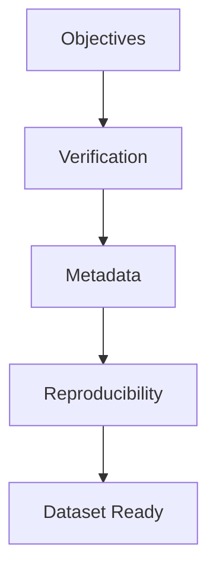

# Chapter 2: Research Objectives

## Primary Objective
The primary objective of this phase is to establish a **fully reproducible, automated, and reliable dataset preparation and verification pipeline** for the retinal fundus images within the FusionMedAI framework. This pipeline acts as a robust and standardized data ingestion gateway, designed to ensure that every sample fed into subsequent deep learning models is structurally sound, correctly labeled, and formatted.

## Secondary Objectives

- **Ensure Data Integrity**: Provide programmatic verification that all local raw files are complete, uncorrupted, and perfectly synchronized with their corresponding tabular index records.
- **Eliminate Corrupted Samples**: Detect and flag unopenable or truncated image files that would otherwise cause batch load crashes or training instability during PyTorch model training.
- **Produce Reusable Metadata**: Produce metadata that supports downstream exploratory data analysis, preprocessing optimization, quality assessment, and reproducible model development.
- **Improve Experiment Reproducibility**: Enforce complete reproducibility across multiple development environments by centralizing all hyperparameters, directory paths, and random seeds within a single configuration script.
- **Standardize Project Organization**: Establish a structured directory layout that separates immutable raw clinical data from transient preprocessed data, metadata reports, and experimental outputs.
- **Prepare Datasets for Downstream Preprocessing and Training**: Verify that all dataset statistics, file extensions, and color channels (RGB) are compatible with commonly used transfer-learning architectures such as EfficientNet, ConvNeXt, ResNet, and Vision Transformers.

---

## Objectives Flow
The following flowchart illustrates the logical progression of objectives required to establish a research-ready dataset:

---

## Research Questions
To validate the engineering and design choices in this dataset preparation phase, the project addresses the following core research questions:

1. **How can dataset integrity be automatically verified in a medical image pipeline to prevent silent training failures?**
   - *Investigation*: Designing an automated suite of structural and logical checks (CSV existence, folder layout, file corruption, label boundaries) that runs in a single script and returns unified error logs.
   
2. **Which metadata attributes most effectively support subsequent preprocessing, EDA, and model development?**
   - *Investigation*: Determining which per-image metrics (width, height, aspect ratio, channels, file size, ground-truth diagnosis) are crucial for optimizing data augmentation strategies, batch padding, and preprocessing pipelines without needing to read raw files repeatedly.

3. **How can reproducibility be improved through standardized project organization, configuration management, and automated verification?**
   - *Investigation*: Evaluating the impact of a centralized, read-only configuration module combined with a strict separation of raw datasets, interim files, and generated metadata on preventing code drift.

---

## Expected Outcomes
The execution of this phase is designed to yield the following expected deliverables:
- **Verified dataset**: A dataset with programmatically audited image paths.
- **Zero corrupted files**: Complete isolation of problematic files to prevent runtime training exceptions.
- **Standardized metadata**: Comprehensive, pre-computed data parameters detailing image metrics and class labels.
- **Reproducible directory structure**: A strict separation of read-only raw files, metadata reports, and transient outputs.
- **Centralized configuration**: Unified paths, random seeds, and class labels declared in a single source of truth.
- **Ready-to-use dataset pipeline**: A validated data entry point prepared for downstream preprocessing.

---

## Success Criteria
To evaluate the success of the dataset preparation phase, the implementation must meet the following criteria:
- **100% image verification completed**: All raw image files in the dataset audited and resolved.
- **Zero duplicate IDs**: Programmatic assurance that no overlapping sample IDs exist within split metadata.
- **Zero corrupted images**: Complete checks verifying image decodability without training-time crashes.
- **Metadata generated**: Successful creation of structured files summarizing dimensions, aspect ratios, and file sizes.
- **Class distribution documented**: Verification and logging of final diagnostic class distributions.
- **Configuration centralized**: No hardcoded paths or seeds allowed in operational preprocessing scripts.
- **Pipeline reproducible**: The entire verification suite executes identically across standard research environments.
