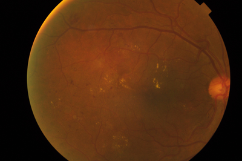
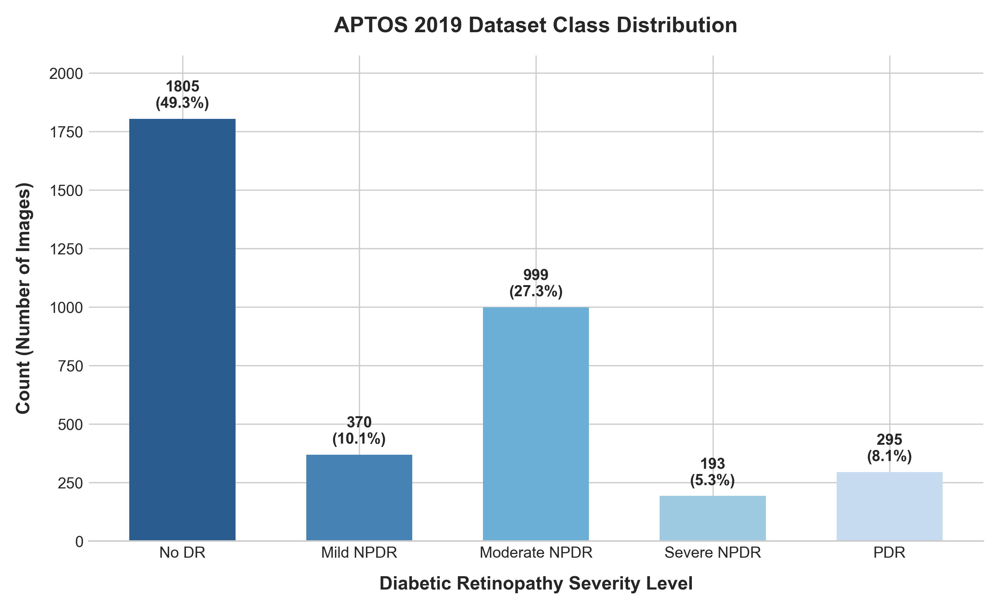

# Chapter 3: Dataset Selection

This research employs established public benchmarks for diabetic retinopathy classification to develop, validate, and test deep learning models. In Step 1, the primary focus is on the **APTOS 2019 Blindness Detection** dataset, with plans to integrate the **IDRiD** dataset in future development volumes.

---

## Dataset 1: APTOS 2019 Blindness Detection

### 1. Overview and Modality
The APTOS 2019 dataset was released by the Asia Pacific Tele-Ophthalmology Society (APTOS) for a Kaggle competition aimed at accelerating the automated detection of diabetic retinopathy. The imaging modality consists of **digital color retinal fundus photography**, capturing the interior surface of the eye (including the retina, optic disc, macula, and posterior pole).

A sample fundus photograph from the training partition is shown below:



*Figure 3.1: Resized sample retinal fundus photograph showing circular eye structure and vascular pathways.*

### 2. Dataset Characteristics
To summarize the properties of the APTOS 2019 dataset, the table below outlines the primary image metrics:

| Property | Value |
| :--- | :--- |
| **Train Images** | 3,662 |
| **Test Images** | 1,928 |
| **Classes** | 5 |
| **Image Format** | PNG |
| **Mean Width** | 2,015 px |
| **Mean Height** | 1,527 px |
| **Average Filesize** | 2,294.22 KB (~2.24 MB) |
| **Resolution Range** | $474 \times 358$ to $4288 \times 2848$ px |

### 3. Dataset Challenges
The APTOS dataset presents several practical challenges for deep learning. Images originate from different acquisition devices and clinical environments, resulting in substantial variability in resolution, illumination, contrast, focus, field-of-view, and image quality. These characteristics increase the complexity of preprocessing and motivate the need for robust verification, metadata generation, and standardized preprocessing pipelines.

### 4. Label Definitions and Quantitative Distribution
Each image in the training set is annotated by medical experts with a single integer corresponding to the severity of diabetic retinopathy:

| Label | Severity Level | Clinical Meaning | Sample Count | Percentage |
|-------|----------------|------------------|--------------|------------|
| **0** | No DR | Normal healthy retina, no vascular lesions visible. | 1,805 | 49.29% |
| **1** | Mild NPDR | Microaneurysms only. | 370 | 10.10% |
| **2** | Moderate NPDR | Microaneurysms, hemorrhages, and hard exudates. | 999 | 27.28% |
| **3** | Severe NPDR | Blocked vessels, cotton wool spots, severe hemorrhages in 4 quadrants. | 193 | 5.27% |
| **4** | PDR | Neovascularization (new fragile vessel growth), vitreous hemorrhage. | 295 | 8.06% |

The highly imbalanced distribution of severity classes is visually represented below:



*Figure 3.2. Distribution of diabetic retinopathy severity classes in the APTOS 2019 dataset. The dataset exhibits substantial class imbalance, with No DR accounting for nearly half of all training samples, whereas Severe NPDR represents the smallest category.*

The observed imbalance indicates that standard training may bias the model toward majority classes. Consequently, class weighting and data augmentation strategies will be investigated in later stages of the study. These characteristics directly influence resizing, augmentation, normalization, sampling, and class balancing, which connects directly to the preprocessing, exploratory analysis, and model development stages.

### 5. Suitability for DR Classification
APTOS 2019 is highly suitable because it represents a "real-world" clinical distribution. The images were collected from multiple clinics under varying lighting conditions, camera equipment, and resolutions. This clinical variety encourages models to learn robust features (such as exudates, microaneurysms, and hemorrhages) rather than overfitting to specific camera models or sensor noise.

### 6. Advantages
- Large public dataset containing over 5,500 expert-graded fundus images in total.
- Rich in clinical variation (noise, illumination, camera focus), mimicking real-world deployment challenges.
- Explicitly graded into all 5 international clinical severity classes, allowing multi-class classification rather than simple binary detection.

### 7. Limitations
- Highly imbalanced class distribution, with class 0 (No DR) accounting for nearly half the dataset, and class 3 (Severe) accounting for only 5.27%.
- Inconsistent aspect ratios and resolutions, requiring advanced resizing, cropping, and color normalization during preprocessing.
- Training labels are provided, but test set labels are held private by the competition organizers (used only for remote submissions).

### 8. Licensing
Available under the Kaggle Competition Terms for educational and research purposes.

---

## Dataset 2: IDRiD (Indian Diabetic Retinopathy Image Dataset) — Future Integration

### 1. Overview and Modality
The IDRiD dataset (Porwal et al., 2018) is a publicly available clinical benchmark dataset compiled from an eye clinic in Nanded, India. Similar to APTOS, it uses digital color retinal fundus photography.

### 2. Dataset Characteristics
- **Total Samples**: 516 Images (typically split into 413 training images and 103 testing images).
- **Resolution**: Homogeneous high-definition scans (typically 4,288 × 2,848 pixels).
- **Format**: TIFF / JPEG.

### 3. Label Definitions
Grades diabetic retinopathy severity using the same 5-class international scale (0 to 4). Additionally, it provides annotations for diabetic macular edema (DME) risk levels (0 to 2) and pixel-level segmentations for key lesions (microaneurysms, hemorrhages, hard exudates, and soft exudates).

### 4. Suitability, Advantages, and Limitations
- **Suitability**: Serves as a suitable external validation dataset or cross-dataset training benchmark due to its clinical grading. Because APTOS and IDRiD originate from different clinical environments, cross-dataset evaluation also introduces a domain-shift scenario, which later motivates the proposed Out-of-Distribution (OOD) detection module.
- **Advantages**: Provides precise pixel-level annotations for key pathological lesions, allowing models to learn explainable features (e.g., segmenting exudates to justify a severity score).
- **Limitations**: Much smaller sample size (516 images) compared to APTOS, making it less suitable as a standalone training set for deep architectures from scratch.
- **Licensing**: Available for research and academic purposes under the IDRiD database terms.

---

## Dataset Comparison and Selection Rationale

To contextualize the dataset choices, the table below compares the key properties of public retinal fundus datasets:

| Dataset | Images | Classes | Resolution | Lesion Masks | Licensing |
| :--- | :---: | :---: | :---: | :---: | :--- |
| **EyePACS** | ~88,000 | 5 | Variable | No | Non-commercial |
| **APTOS 2019** | 3,662 (Train) | 5 | Variable | No | Non-commercial |
| **IDRiD** | 516 | 5 | Fixed | Yes | Research-only |
| **Messidor** | 1,200 | 4 | Fixed | No | Research-only |

Although several public retinal datasets are available, APTOS 2019 was selected as the primary training and validation dataset due to:
- **Balanced Dataset Size**: Large enough (~3,662 training images) to support training deep convolutional and transformer backbones, yet small enough to allow rapid local verification and iterative experimentation.
- **Five-Class Severity Labels**: Matches the international clinical standard, supporting multi-class severity assessment.
- **Active Benchmark & Community Adoption**: Served as a key competition benchmark, allowing comparison with published literature.
- **Public Accessibility & Suitable Licensing**: Readily available under terms suited for research and academic development.

---

## Rationale: Why Start with APTOS Before IDRiD?

1. **Dataset Volume**: APTOS contains 3,662 labeled training samples, which is nearly **9 times larger** than IDRiD's 413 training samples. Deep learning models require significant data volume to learn generalized features before fine-tuning on smaller clinical datasets.
2. **Clinical Diversity**: APTOS is compiled from multiple screening sites with varying cameras and resolutions. IDRiD, on the other hand, was captured using a single camera model at a single clinic. Starting with the more diverse APTOS dataset prevents the model from developing early biases towards specific image characteristics.
3. **Pipeline Stress-Testing**: The high variability in APTOS's image dimensions (ranging from 474px to 4288px) and aspect ratios provides a more challenging benchmark for the automated verification and preprocessing pipelines compared to the uniform resolutions of IDRiD.

---

## Evaluation Workflow

The following flowchart shows how APTOS and IDRiD are utilized across training, verification, and external validation:

```
APTOS
  │
  ▼
Verification
  │
  ▼
Metadata
  │
  ▼
Split
  │
  ▼
Training
  │
  ▼
Validation
  │
  ▼
[Later]
IDRiD
  │
  ▼
External Validation
```

---

## References
- Porwal, P., Pachade, S., Kamble, R., Kokare, M., Deshmukh, S., Giancardo, L., & Meriaudeau, F. (2018). Indian Diabetic Retinopathy Image Dataset (IDRiD): A database for diabetic retinopathy screening research. *Scientific Data*, 5(1), 1-14.
- Kaggle. (2019). *APTOS 2019 Blindness Detection*. Asia Pacific Tele-Ophthalmology Society (APTOS). https://www.kaggle.com/c/aptos2019-blindness-detection
