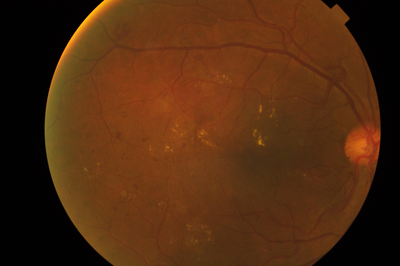
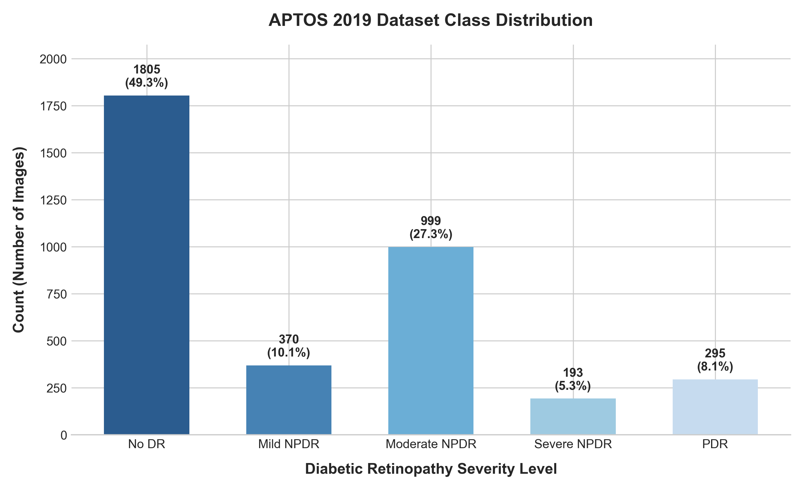

# Chapter 3: Dataset Selection

This research employs established public benchmarks for diabetic retinopathy classification to develop, validate, and test deep learning models. In Step 1, the primary focus is on the **APTOS 2019 Blindness Detection** dataset. IDRiD and additional retinal datasets are reserved for future external validation and cross-dataset generalization studies following completion of the Retina Module baseline.

---

## Dataset 1: APTOS 2019 Blindness Detection

### 1. Overview and Modality
The APTOS 2019 dataset was released by the Asia Pacific Tele-Ophthalmology Society (APTOS) for a Kaggle competition aimed at accelerating the automated detection of diabetic retinopathy. The imaging modality consists of **digital color retinal fundus photography**, capturing the interior surface of the eye (including the retina, optic disc, macula, and posterior pole).

A sample fundus photograph from the training partition is shown below:

*Figure 3.1: Resized sample retinal fundus photograph showing circular eye structure and vascular pathways.*

### 2. Dataset Characteristics
To summarize the properties of the APTOS 2019 dataset, the table below outlines the primary image metrics:

| Property | Value |
| :--- | :--- |
| **Train Images** | 3,662 |
| **Test Images** | 1,928 |
| **Classes** | 5 |
| **Image Format** | PNG |
| **Mean Width** | 2,015 px |
| **Mean Height** | 1,527 px |
| **Average Filesize** | 2,294.22 KB (~2.24 MB) |
| **Resolution Range** | $474 \times 358$ to $4288 \times 2848$ px |

### 3. Dataset Challenges
The APTOS dataset presents several practical challenges for deep learning. Images originate from different acquisition devices and clinical environments, resulting in substantial variability in resolution, illumination, contrast, focus, field-of-view, and image quality. These characteristics increase the complexity of preprocessing and motivate the need for robust verification, metadata generation, and standardized preprocessing pipelines.

### 4. Label Definitions and Quantitative Distribution
Each image in the training set is annotated by medical experts with a single integer corresponding to the severity of diabetic retinopathy:

| Label | Severity Level | Clinical Meaning | Sample Count | Percentage |
|-------|----------------|------------------|--------------|------------|
| **0** | No DR | Normal healthy retina, no vascular lesions visible. | 1,805 | 49.29% |
| **1** | Mild NPDR | Microaneurysms only. | 370 | 10.10% |
| **2** | Moderate NPDR | Microaneurysms, hemorrhages, and hard exudates. | 999 | 27.28% |
| **3** | Severe NPDR | Blocked vessels, cotton wool spots, severe hemorrhages in 4 quadrants. | 193 | 5.27% |
| **4** | PDR | Neovascularization (new fragile vessel growth), vitreous hemorrhage. | 295 | 8.06% |

The highly imbalanced distribution of severity classes is visually represented below:

*Figure 3.2. Distribution of diabetic retinopathy severity classes in the APTOS 2019 dataset. The dataset exhibits substantial class imbalance, with No DR accounting for nearly half of all training samples, whereas Severe NPDR represents the smallest category.*

The observed imbalance indicates that standard training may bias the model toward majority classes. Consequently, class weighting and data augmentation strategies will be investigated in later stages of the study. These characteristics directly influence resizing, augmentation, normalization, sampling, and class balancing, which connects directly to the preprocessing, exploratory analysis, and model development stages.

### 5. Suitability for DR Classification
APTOS 2019 is highly suitable because it represents a "real-world" clinical distribution. The images were collected from multiple clinics under varying lighting conditions, camera equipment, and resolutions. This clinical variety encourages models to learn robust features (such as exudates, microaneurysms, and hemorrhages) rather than overfitting to specific camera models or sensor noise.

### 6. Advantages
- Large public dataset containing over 5,500 expert-graded fundus images in total.
- Rich in clinical variation (noise, illumination, camera focus), mimicking real-world deployment challenges.
- Explicitly graded into all 5 international clinical severity classes, allowing multi-class classification rather than simple binary detection.

### 7. Limitations
- Highly imbalanced class distribution, with class 0 (No DR) accounting for nearly half the dataset, and class 3 (Severe) accounting for only 5.27%.
- Inconsistent aspect ratios and resolutions, requiring advanced resizing, cropping, and color normalization during preprocessing.
- Training labels are provided, but test set labels are held private by the competition organizers (used only for remote submissions).

### 8. Licensing
Available under the Kaggle Competition Terms for educational and research purposes.

---

## Future External Validation Datasets

- **IDRiD (Indian Diabetic Retinopathy Image Dataset)**
- **Messidor**

These datasets will be introduced and documented in later volumes when the project reaches the external validation and out-of-distribution (OOD) testing phases.

---

## References
- Porwal, P., Pachade, S., Kamble, R., Kokare, M., Deshmukh, S., Giancardo, L., & Meriaudeau, F. (2018). Indian Diabetic Retinopathy Image Dataset (IDRiD): A database for diabetic retinopathy screening research. *Scientific Data*, 5(1), 1-14.
- Kaggle. (2019). *APTOS 2019 Blindness Detection*. Asia Pacific Tele-Ophthalmology Society (APTOS). https://www.kaggle.com/c/aptos2019-blindness-detection
