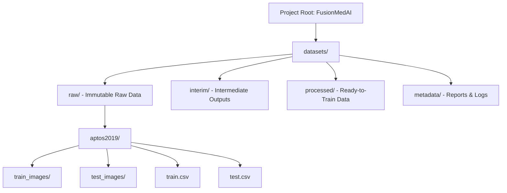
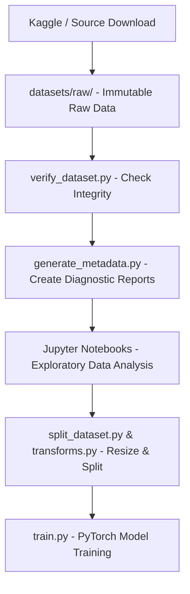

# Chapter 4: Dataset Preparation

This chapter documents the directory architecture, file organization, design philosophy, and workflow sequence implemented in the FusionMedAI framework to manage raw data and generated artifacts.

---

## Folder Structure
The workspace enforces a clear separation of data stages under the main `datasets/` root:

```text
datasets/
├── raw/
│   └── aptos2019/
│       ├── train_images/
│       ├── test_images/
│       ├── train.csv
│       ├── test.csv
│       └── sample_submission.csv
├── interim/
├── processed/
└── metadata/
```

The relationship and organization of these folders are visually represented below:


*Figure 4.1: Workspace directory layout mapping structural separation.*

### Purpose of Each Directory:

1. **`datasets/raw/`**:
   - Stores the absolute raw clinical data exactly as it was downloaded from the source (e.g., Kaggle, clinics). This directory is strictly **read-only**.
   - Under no circumstances should any script modify, move, rename, or write files to this folder after download.
   
2. **`datasets/interim/`**:
   - Reserved for intermediate data that has undergone partial transformations.
   - Examples include temporary resized images, intermediate formats (like converting TIFFs to PNGs), or unstratified temporary splits.
   
3. **`datasets/processed/`**:
   - Stores the final, ready-to-train datasets.
   - Examples include cropped, normalized, and resized tensors, stratified training/validation folds, or preprocessed clinical tabular arrays.
   
4. **`datasets/metadata/`**:
   - Stores all generated diagnostic reports, log files, image dimension records, and dataset summaries produced during verification and auditing.
   - This directory keeps all metadata centralized and easily accessible to Jupyter Notebooks, PyTorch datasets, and scripts.

---

## File Organization
To preserve the scientific integrity of the machine learning pipeline, two core rules govern file organization:

1. **Train and Test Partitions Remain Untouched**:
   - The original raw image partitions (`train_images/`, `test_images/`) and their indices (`train.csv`, `test.csv`) are kept in their original state. 
   - No manual deletion of corrupted files or duplicates is performed in the raw directory. Instead, issues are logged in `datasets/metadata/` and filtered programmatically at runtime or during train/validation splitting.
   
2. **Processed Data is Stored Separately**:
   - Any transformed data (resizing, augmentation, cropping) is written to `datasets/processed/`.
   - This guarantees that the original high-resolution pixels are always available for auditing, visualization, or testing alternative preprocessing strategies.

---

## Design Philosophy

- **Never Modify Raw Data**: Medical imaging studies must remain immutable. Modifying raw files corrupts the clinical audit trail and makes it impossible to reproduce benchmarks or verify data leakage from scratch.
- **Always Preserve the Original Dataset**: The raw download is the "ground truth" of the data engineering phase. It must match the source checksums exactly.
- **Separate Generated Artifacts from Source Data**: Config files, JSON reports, generated CSV listings, and training logs must reside outside the dataset folder to maintain cleanliness, simplify backup strategies, and prevent accidental commits of large binary files to source control.

---

## Expected Workflow
The FusionMedAI pipeline operates as a unidirectional flow, ensuring that data is thoroughly checked and analyzed before any optimization takes place:


*Figure 4.2: Unidirectional data flow from download to neural network training.*

1. **Kaggle / Source Download**: The researcher downloads the dataset files.
2. **Raw Dataset**: Files are extracted to the immutable `datasets/raw/aptos2019/` directory.
3. **Verification**: `verify_dataset.py` is run to perform 16 integrity checks, generating CSV logs of any corrupted files, missing entries, or duplicate records.
4. **Metadata**: `generate_metadata.py` runs to synthesize master metadata CSVs, class distributions, and size statistics.
5. **EDA**: Data scientists load the generated metadata files to perform statistical analysis and decide on augmentation and cropping parameters.
6. **Preprocessing**: The raw images are programmatically processed (resizing, normalization) and written to `datasets/processed/` based on metadata guides.
7. **Training**: The PyTorch model reads files from the processed directory and runs training epochs.
