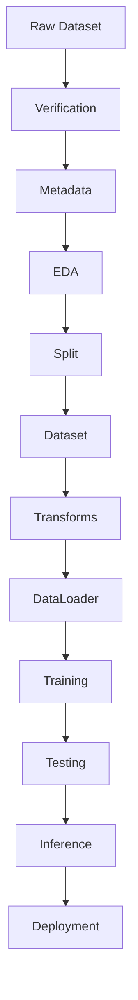

# Chapter 4: Dataset Preparation

This chapter documents the directory architecture, file organization, design philosophy, and workflow sequence implemented in the FusionMedAI framework to manage raw data and generated artifacts.

---

## Folder Structure
The workspace enforces a clear separation of data stages under the main `datasets/` root:

```text
datasets/
├── raw/
│   └── aptos2019/
│       ├── train_images/
│       ├── test_images/
│       ├── train.csv
│       ├── test.csv
│       └── sample_submission.csv
├── interim/
├── processed/
└── metadata/
```

The relationship and organization of these folders are visually represented below:

```text
datasets/
  ├── raw/ (Immutable raw clinical scans)
  ├── interim/ (Intermediate preprocessing cache)
  ├── processed/ (Stratified, ready-to-train tensors)
  └── metadata/ (Pre-computed audit reports & stats)
```
*Figure 4.1: Workspace directory layout mapping structural separation.*

### Purpose of Each Directory:

1. **`datasets/raw/`**:
   - Stores the absolute raw clinical data exactly as it was downloaded from the source (e.g., Kaggle, clinics). This directory is treated as an **immutable artifact**.
   - Under no circumstances should any script modify, move, rename, or write files to this folder after download.
   
2. **`datasets/interim/`**:
   - Reserved for intermediate data that has undergone partial transformations.
   - Examples include temporary resized images, intermediate formats (like converting TIFFs to PNGs), or unstratified temporary splits.
   
3. **`datasets/processed/`**:
   - Stores the final, ready-to-train datasets.
   - Examples include cropped, normalized, and resized tensors, stratified training/validation folds, or preprocessed clinical tabular arrays.
   
4. **`datasets/metadata/`**:
   - Stores all generated diagnostic reports, log files, image dimension records, and dataset summaries produced during verification and auditing.
   - Centralizing this directory allows Jupyter Notebooks, PyTorch datasets, and scripts to reference pre-computed values without reading raw image files dynamically.

---

## Scientific Rationale for Directory Separation

Separating raw, interim, processed, and metadata directories reduces the risk of data leakage, accidental overwriting, and irreproducible preprocessing, while improving experiment traceability.

In medical AI research, overwriting original images is a dangerous practice. Overwriting destroys the ability to compare different preprocessing methods (such as CLAHE vs. standard normalization), perform ablation studies on image resolution, or verify previous experiments from scratch. Therefore, all preprocessing outputs are generated strictly outside the raw dataset, keeping the clinical source data intact.

### Alignment with FAIR Data Principles
The directory architecture is designed to support the **FAIR Data Principles** (Wilkinson et al., 2016):
- **Findable**: The separation of metadata into `datasets/metadata/` enables clinical researchers to find dataset properties (resolutions, class counts) quickly.
- **Accessible**: Raw and processed files are organized under standard directories with well-documented paths, ensuring they are accessible to programmatic scripts.
- **Interoperable**: Using standard, non-proprietary file formats (PNG for raw images, CSV and JSON for metadata) guarantees compatibility across different operating systems and deep learning frameworks.
- **Reusable**: Retaining the immutable raw data ensures that the dataset can be reused for future studies—such as training new backbones, evaluating alternative augmentation strategies, or performing cross-dataset validations.

### Computational Reproducibility
The directory architecture was designed to support computational reproducibility. Because raw data remain immutable, every experiment can be reconstructed from the original source files, the metadata, and preprocessing scripts without manual intervention.

### Scalability to Multiple Datasets
The modular organization also allows additional datasets (e.g., IDRiD, DFUC, PIMA) to be incorporated without modifying existing project logic. Each new dataset is assigned its own subdirectory under `datasets/raw/` and `datasets/processed/`, allowing the verification and training scripts to scale to multi-site clinical configurations seamlessly.

### Separation of Metadata
Keeping metadata separate from image files avoids repeated disk scanning, improves preprocessing efficiency, and enables rapid EDA without reopening thousands of images. This separates lightweight data queries from heavy file I/O operations, improving execution speed.

### Git Version Control Compatibility
Large datasets, generated metadata, trained models, and experiment outputs are separated from source code to support efficient version control using Git. Standard configurations in `.gitignore` ensure that raw clinical binary files and temporary cache directories are ignored by default, preventing repository bloating.

---

## Engineering Principles
FusionMedAI follows several core software engineering and medical AI principles:
- **Single source of truth**: Centralized parameters and file definitions prevent configuration drift.
- **Immutable raw data**: The raw dataset remains unmodified to maintain the clinical audit trail.
- **Separation of concerns**: Directory separation ensures that code logic, raw data, processed outputs, and metadata logs do not mix.
- **Reproducibility**: Standardized seeds and deterministic processes ensure identical results across repeated executions.
- **Modularity**: Individual data components can be updated independently without affecting the training scripts.
- **Scalability**: Enforces directory standards that accommodate multi-modal or multi-site data extension.
- **Auditability**: Programmatic logs verify data integrity before model development begins.
- **Version control compatibility**: Keeps large binary artifacts separated from code repositories.

---

## Expected Workflow
The FusionMedAI pipeline operates as a unidirectional flow, ensuring that data is thoroughly checked and analyzed before any optimization takes place:


*Figure 4.2: Unidirectional data flow from download to deployment.*

1. **Source Acquisition**: The workflow begins with acquisition of the original dataset from the official source.
2. **Raw Dataset Extraction**: Files are extracted to the immutable `datasets/raw/aptos2019/` directory.
3. **Verification**: Automated checks are run to perform integrity audits, generating CSV logs of any corrupted files, missing entries, or duplicate records.
4. **Metadata Generation**: A metadata extraction process runs to synthesize master metadata CSVs, class distributions, and size statistics.
5. **EDA**: Data scientists load the generated metadata files to perform statistical analysis and decide on augmentation and cropping parameters.
6. **Preprocessing & Splitting**: The raw images are programmatically partitioned and written to `datasets/processed/` based on metadata guides.
7. **Dataset Loading**: Custom PyTorch dataset instances load images lazily and apply transforms.
8. **DataLoader Batching**: DataLoader batches images and transfers tensors to the training device.
9. **Training**: The PyTorch model reads files from the processed directory and runs training epochs.
10. **Testing**: Runs test set evaluation, profiling parameters, average latency (ms/image), and throughput (FPS).
11. **Inference**: Classified results are generated via the standalone inference API for clinical fundus scans.
12. **Deployment**: Models are deployed into production environments.

---

## References
- Wilkinson, M. D., Dumontier, M., Aalbersberg, I. J., Appleton, G., Axton, M., Baak, A., ... & Mons, B. (2016). The FAIR Guiding Principles for scientific data management and stewardship. *Scientific Data*, 3(1), 1-9.
