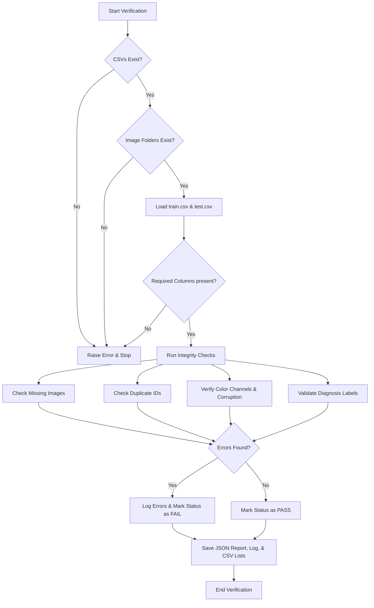

# Chapter 5: Dataset Verification

This chapter describes the motivation, risks, methodology, outputs, and engineering decisions behind the automated dataset verification stage.

---

## Motivation
Medical image datasets are frequently prone to transcription, transmission, and extraction errors. In deep learning pipelines, starting training on unverified datasets introduces severe risks, such as silent failure mid-training, corrupted gradient steps, or skewed evaluation metrics due to data leakage. Verification serves as a gatekeeper, programmatically proving that the dataset is complete, consistent, readable, and free of obvious errors before a single GPU cycle is spent.

The verification process is organized as a pipeline that runs a sequence of structural and data audits:

*Figure 5.1: Flowchart representing the automated dataset verification pipeline.*

---

## Verification Checks Summary
The suite of audits executed during the verification phase is summarized in the table below:

| Audit Check | Purpose | Method Description | Primary Output File |
| :--- | :--- | :--- | :--- |
| **CSV Existence** | Ensure label indexes are present | Checks path existence for training and testing CSVs | `verification.log` |
| **Folder Existence** | Ensure image directories exist | Checks for directories on disk | `verification.log` |
| **CSV Readability** | Detect encoding/corruption issues | Attempts to load dataframes using pandas parser | `verification.log` |
| **Column Validation** | Confirm required fields exist | Verifies presence of `id_code` and `diagnosis` | `verification.log` |
| **Row Count** | Establishes dataset size | Measures number of rows in the CSV files | `verification_report.json` |
| **Image Count** | Measures files on disk | Counts total PNG image files in directory listings | `verification_report.json` |
| **Missing Image Check**| Detect missing image files | Checks directory file list for every CSV `id_code` | `missing_images.csv` |
| **Duplicate Filenames**| Detect case-insensitive duplicates | Checks for duplicate image names in folder | `verification_report.json` |
| **Duplicate ID Check** | Prevent train/val split leakage | Scans CSV index for duplicate patient/image entries | `duplicate_ids.csv` |
| **Corruption Audit** | Find truncated or bad files | Opens image headers and verifies internal block structures | `corrupted_images.csv` |
| **Label Range Check** | Validate clinical bounds | Verifies diagnosis integers are strictly within range 0-4 | `invalid_labels.csv` |
| **Label Completeness** | Detect missing clinical scores | Scans for NaN values in the label column | `verification_report.json` |
| **File Extension Check**| Ensure format consistency | Confirms all images possess a `.png` extension | `verification_report.json` |
| **Color Mode Check** | Confirm 3-channel layout | Reads color channel mode for all images (must be RGB) | `verification_report.json` |
| **Test Set Consistency**| Verify test set structure | Checks test CSV duplicates and missing test files | `missing_test_images.csv` |

---

## Detailed Verification Methodology

### 1. Structural Checks
Structural checks verify that the workspace directories and raw files are present on disk before running any analysis. If the training CSV, test CSV, or image directories are missing, the pipeline logs the errors and halts immediately since downstream verification checks cannot be executed.

### 2. Tabular Integrity
Once the CSVs are successfully loaded, the pipeline verifies that the files are readable and contain the required columns (`id_code` and `diagnosis` for training; `id_code` for testing). It checks for:
- **Duplicate IDs**: Scans for duplicate entries in the index. Duplicates bias class weightings and can lead to data leakage if the same image is split across training and validation sets.
- **Unreadable Values**: Checks that the diagnosis labels are numeric and do not contain strings or unreadable characters.
- **Out-of-bounds Labels**: Ensures that the labels correspond strictly to the clinical grades $0$, $1$, $2$, $3$, or $4$.
- **Missing Labels**: Scans for empty (`NaN`) cells in the label column.

### 3. Image File Auditing
The pipeline maps every row in the index to its corresponding file on disk (constructing the expected filename as `f"{id_code}.png"`):
- **Missing Images**: Cross-references the CSV index with the directory files. Any missing image is logged as a critical error.
- **File Extensions**: Confirms that all images are stored in `.png` format. Non-standard extensions are flagged.
- **Corrupted Images**: The pipeline audits every image to ensure it can be decoded. It performs a structural verification on the file headers and block structures to check for corruption without loading full pixel arrays into memory, keeping the check fast.
- **Color Mode (RGB)**: Retinal models (such as EfficientNet or ResNet) require standard 3-channel input. The pipeline opens every image to confirm it is stored in `RGB` format, flagging any grayscale (`L`), transparent (`RGBA`), or `CMYK` images.

---

## Generated Reports and Audit Trail
The verification pipeline writes several structured files to [datasets/metadata/](file:///d:/FusionMedAI/datasets/metadata/):

1. **`verification_report.json`**:
   - A structured, machine-readable summary of the verification results. It contains row counts, file counts, and overall status flags. Preprocessing and training scripts read this file to verify that the dataset passed checks before executing.
2. **`verification.log`**:
   - A human-readable record of the exact console output, providing a quick visual reference of the check status.
3. **`missing_images.csv` & `missing_test_images.csv`**:
   - Logs any training or testing IDs that do not have corresponding image files on disk. (Empty if the dataset is complete).
4. **`corrupted_images.csv`**:
   - Lists any unreadable or corrupted filenames. (Empty if the dataset is healthy).
5. **`duplicate_ids.csv` & `duplicate_test_ids.csv`**:
   - Lists duplicate rows in the training or testing indices. (Empty if all IDs are unique).
6. **`invalid_labels.csv`**:
   - Records any patient IDs containing invalid clinical labels or missing cells.

---

## Engineering Decisions

- **Why JSON for Summary Reports?**
  JSON is a highly structured, machine-readable format. Downstream scripts (like preprocessing or training) can load the JSON file in milliseconds to verify that the dataset passed checks before starting, preventing models from training on corrupted data.
- **Why CSV for Error Lists?**
  Diagnostic listings of missing, corrupted, or duplicated files are saved as CSVs so they can be loaded easily by pandas. If a script needs to skip corrupted images, it simply loads `corrupted_images.csv` and drops those rows from the training queue.
- **Why Reusable Reports?**
  Generating reusable reports ensures that dataset verification only needs to be run **once**. Downstream tasks (like EDA and Preprocessing) can check the metadata folder directly rather than repeatedly traversing directory paths and opening thousands of files, saving significant time.
