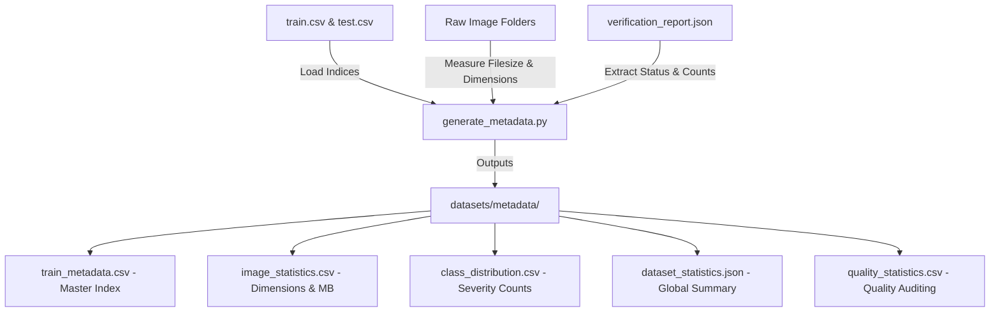
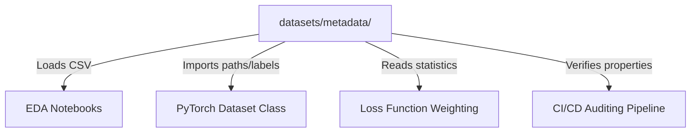

# Chapter 6: Metadata Generation

This chapter details the purpose, structure, columns, and downstream reuse of the generated metadata files.

---

## Why Metadata Matters
In deep learning pipelines, especially when dealing with high-resolution image data, disk and memory I/O can easily bottleneck training. Traversing thousands of directories to fetch image dimensions, file sizes, or labels during preprocessing or training is computationally expensive. Generating a centralized metadata directory solves this bottleneck.

Metadata acts as a lightweight, structured representation of the dataset. Instead of reading thousands of large images to calculate distributions, check dimensions, or verify labels, scripts can load a single CSV or JSON file in milliseconds, significantly reducing CPU memory overhead.

The relationship between the raw data and the generated metadata files is illustrated below:

*Figure 6.1: Relationship between raw inputs and generated metadata files.*

---

## Metadata Files Summary
The generated metadata files and their key attributes are summarized in the table below:

| Metadata File | Purpose | Key Columns / Fields | Downstream Target |
| :--- | :--- | :--- | :--- |
| **`train_metadata.csv`** | Master training index | `id_code`, `filename`, `label`, `width`, `height`, `aspect_ratio`, `filesize_kb` | Custom PyTorch Dataset class |
| **`image_statistics.csv`** | Individual file statistics | `id_code`, `filename`, `diagnosis`, `width`, `height`, `channels`, `aspect_ratio`, `filesize_kb` | EDA Notebooks, Preprocessing |
| **`class_distribution.csv`** | Imbalance summary | `Label`, `Severity`, `Count` | Loss weights calculation |
| **`quality_statistics.csv`** | Quality verification logging | `Metric`, `Value` (e.g. RGB Images, Corrupted Images) | CI/CD Auditing Pipeline |
| **`dataset_statistics.json`**| Global dataset summary | `dataset`, `training_images`, `testing_images`, `average_width`, `average_height`, sizes | Logging, Experiment Configuration |

---

## Detailed Metadata Structure

### 1. `train_metadata.csv`
- **Purpose**: Serves as the master index for the training split, uniting tabular patient labels with verified image attributes.
- **Columns**:
  - `id_code`: The unique patient identifier string (matches original clinical index).
  - `filename`: The exact filename in the directory (e.g., `000c1434d8d7.png`).
  - `label`: The expert-graded severity score (0, 1, 2, 3, or 4).
  - `width` & `height`: Raw dimensions in pixels.
  - `aspect_ratio`: Calculated as width divided by height (rounded to 2 decimal places).
  - `filesize_kb`: The disk size in kilobytes (rounded to the nearest integer).

### 2. `image_statistics.csv`
- **Purpose**: Records individual statistics for each image to assist in Exploratory Data Analysis (EDA) and batch normalization planning.
- **Columns**:
  - `id_code`, `filename`, `diagnosis`.
  - `width`, `height`, `channels` (strictly 3 for RGB).
  - `aspect_ratio`, `filesize_kb`.
- **Research Value**: The high variability in fundus image dimensions (ranging from 474 pixels to 4,288 pixels) requires metadata-driven preprocessing. This CSV helps identify size groupings and outlier dimensions, guiding resizing and padding strategies.

### 3. `class_distribution.csv`
- **Purpose**: Summarizes the count and proportion of each diabetic retinopathy severity stage.
- **Why Imbalance Analysis Matters**: Medical datasets are almost always highly imbalanced. The generated distribution shows that Class 0 (No DR) accounts for **49.29%** of the dataset, while Class 3 (Severe) accounts for only **5.27%**. Downstream training scripts read this CSV to compute class weights for the loss function (e.g., `WeightedCrossEntropyLoss`) or configure oversampling/undersampling parameters.

### 4. `dataset_statistics.json`
- **Purpose**: Provides a machine-readable summary of the entire dataset. It is ideal for storing overall metadata parameters (such as mean dimensions, class names, and dataset lists) that are easily read by scripts and configuration files, helping prevent configuration drift.

---

## Metadata Reuse and Data Flow
The pre-generated metadata is reused across multiple stages of the FusionMedAI pipeline:

*Figure 6.2: Workflow displaying how downstream tasks reuse the metadata.*

1. **Exploratory Data Analysis (EDA)**:
   - EDA notebooks load `image_statistics.csv` and `class_distribution.csv` directly to plot distributions, verify aspect ratios, and analyze outlier dimensions, saving execution time.
2. **PyTorch Dataset Class**:
   - The custom dataset class loads `train_metadata.csv` to read target labels and image filenames. This avoids performing expensive directory scans or reading image files on-the-fly during training.
3. **Training & Loss Optimization**:
   - Training scripts load `class_distribution.csv` to compute class-weight arrays, balancing the training loss to prevent the network from ignoring minority classes (e.g., Severe DR).
4. **Experiments Log & Reporting**:
   - Experiment managers (like MLflow or TensorBoard) read `dataset_statistics.json` to log hyperparameters and dataset attributes, establishing a solid audit trail for research publication.
