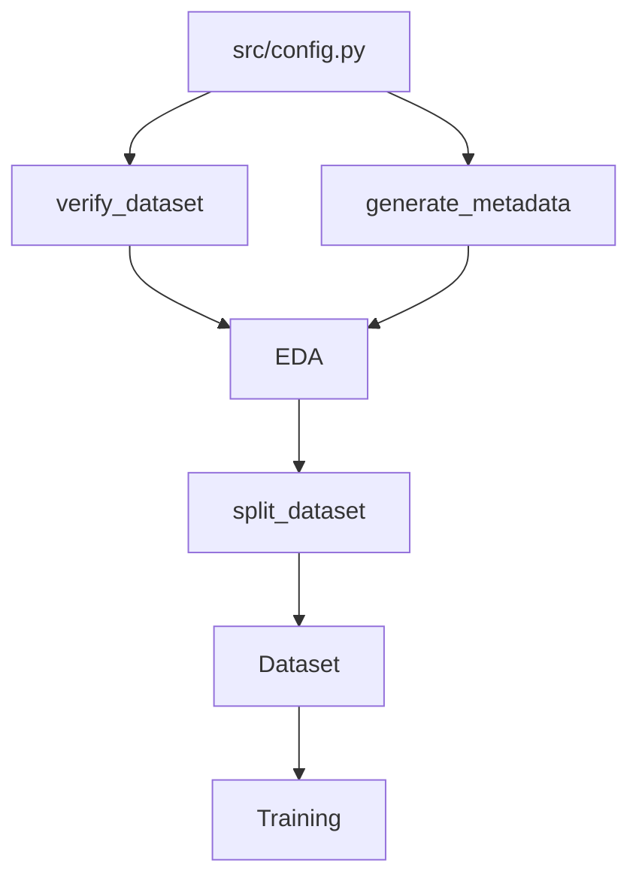

# Chapter 7: Engineering Decisions

This chapter documents the key technical decisions, trade-offs, and software engineering design principles implemented during the dataset preparation phase of the FusionMedAI project.

---

## Technical Decisions, Rationale, and Trade-offs

### 1. Why `pathlib` Instead of `os.path`?
- **Decision**: All paths are constructed and managed using Python's object-oriented `pathlib.Path`.
- **Engineering Rationale**: 
  - `os.path` relies on string concatenation, which is error-prone and platform-dependent (e.g., slash `/` vs. backslash `\`).
  - `pathlib` provides a clean, object-oriented API that resolves path operators portably across Linux, macOS, and Windows environments. This prevents path errors when moving the code from local Windows development environments to Linux-based high-performance computing or cloud GPU environments.
- **Trade-off**: Requires developers to become familiar with object-oriented path handling and conversion (e.g. converting `Path` objects to strings when interfaces require them) rather than using simple string manipulation.

### 2. Why Centralized `config.py`?
- **Decision**: Created the central configuration module (`src/config.py`) to centralize all paths, random seeds, class configurations, and training hyperparameters.
- **Engineering Rationale**:
  - Eliminates path and variable duplication across multiple scripts, implementing the **DRY (Don't Repeat Yourself)** principle.
  - Centralizing paths makes directory restructuring straightforward: if the raw dataset location changes, it only needs to be updated in a single file instead of multiple files.
  - Prevents configuration drift by ensuring that all components use identical configurations.
- **Trade-off**: Couples all scripts to a single configuration module, meaning changes to the config structure can affect multiple operational files.

### 3. Why Modular Scripts Instead of Monolithic Jupyers?
- **Decision**: Implement verification and metadata generation in pure Python scripts (`verify_dataset.py`, `generate_metadata.py`) under `src/data/` rather than in Jupyter Notebooks.
- **Engineering Rationale**:
  - Pure Python scripts can be version-controlled cleanly with Git, without the clutter of large JSON notebook outputs.
  - Scripts are easily executed from the terminal, making them ready for automated CI/CD pipelines, automated testing, and cloud GPU environments.
- **Trade-off**: Lacks the interactive, cell-by-cell visualization interface of Jupyter Notebooks during active code development.

### 4. Why Modular Training Architecture?
- **Decision**: Separate model definition, training loop execution, inference APIs, checkpointing, and visualization into decoupled modules rather than a single monolithic script.
- **Engineering Rationale**:
  - Allows changing the model architecture (e.g. switching from EfficientNet-B0 to ConvNeXt) by simply changing a string in `config.py`, without rewriting any training or validation code.
  - Simplifies testing and debugging of individual pipeline components (like checkpoint loading, early stopping, or metric calculations).
  - Makes code highly reusable and readable, aligning with production-grade research repositories.
- **Trade-off**: Requires managing imports and dependencies across multiple files, increasing the architectural complexity for small-scale experiments.

---

## Software Architecture Patterns

- **Configuration Pattern (Single Source of Truth)**: Centralizing configuration constants inside `src/config.py` prevents configuration drift across scripts.
- **Pipeline Pattern**: Directs data ingestion sequentially (Verification -> Metadata -> EDA -> Preprocessing -> Model Training) to enforce data integrity before computation.
- **Factory-like Dataset Construction**: Decouples dataset structure from image transformation operations, allowing the same dataset class to instantiate training, validation, or test batches.

---

## Design Principles Followed

1. **Single Responsibility Principle (SRP)** (Martin, 2003):
   - Each script has one responsibility: `verify_dataset.py` validates integrity, while `generate_metadata.py` handles the construction of summaries.
2. **Separation of Concerns (SoC)**:
   - Configuration, verification logic, and dataset documentation are kept separated, ensuring changes to one do not affect another.
3. **Don't Repeat Yourself (DRY)** (Hunt & Thomas, 1999):
   - Common configuration paths and constants are isolated within `src/config.py` rather than duplicated.
4. **Keep It Simple (KISS)**:
   - Verification and metadata generation remain separate scripts, keeping each component small, testable, and understandable.
5. **Open-Closed Principle (OCP)** (Martin, 2003):
   - New datasets can be added without modifying existing verification logic, only extending dataset-specific configuration files.
6. **Independent Unit Testing**:
   - Every script was verified independently before integration, reducing debugging complexity.

---

## Modularity & Pipeline Dependencies
The following flowchart illustrates the dependency structure of the modules, showing how the centralized configuration feeds all operations:

*Figure 7.1: Pipeline dependency diagram showing unidirectional data flow.*

---

## References
- Hunt, A., & Thomas, D. (1999). *The Pragmatic Programmer: From Journeyman to Master*. Addison-Wesley.
- Martin, R. C. (2003). *Agile Software Development, Principles, Patterns, and Practices*. Prentice Hall.
- Shore, J. (2004). Fail Fast. *IEEE Software*, 21(5), 21-25.*
