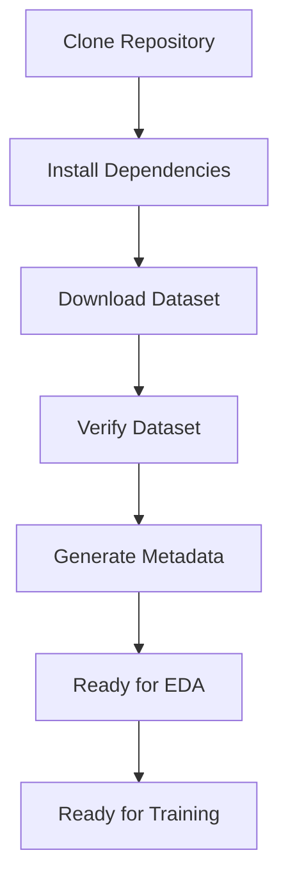

# Chapter 8: Reproducibility

This chapter outlines the strategies and step-by-step instructions implemented in the FusionMedAI project to address reproducibility challenges across different computing environments.

---

## Why Reproducibility Matters in AI Research
Reproducibility is a cornerstone of scientific research (Gundersen & Kjensmo, 2018; Pineau et al., 2021). In deep learning and computer vision, studies are frequently plagued by reproducibility challenges where models fail to achieve published metrics when trained on other machines. This is often caused by:
- Unrecorded dataset modifications.
- Random initialization drift (lack of fixed seeds).
- Undocumented preprocessing steps.
- Hardcoded directory paths that do not port cleanly to other systems.

Ensuring absolute reproducibility is critical for medical AI to verify clinical claims, audit model predictions, and establish trust with healthcare providers.

---

## Reproducibility Framework

### 1. Fixed Random Seed
- The project defines a global random seed (`SEED = 42`) within `src/config.py`. Although Step 1 itself contains no stochastic operations, defining a fixed seed establishes a reproducible foundation for subsequent stages such as stratified dataset splitting, data augmentation, and model training. Maintaining a centralized seed ensures consistent experimental behavior across the entire pipeline.

### 2. Centralized Configuration
- All paths, class definitions, and hyperparameters are declared in `src/config.py`. This prevents developers from introducing hardcoded paths or parameters in individual scripts, keeping the configuration consistent.

### 3. Immutable Raw Dataset
- The `datasets/raw/` folder is treated as read-only. Scripts are blocked from writing to or modifying files in this directory. If a file is corrupted, it is logged in the metadata directory, keeping the raw dataset unmodified.

### 4. Deterministic Dataset Splitting
- The dataset splitting procedure employs `train_test_split()` with `random_state=42` and stratified sampling. Consequently, repeated executions generate identical training, validation, and testing partitions while preserving class distributions.

### 5. Automated Validation & Metadata
- Every stage contains dedicated verification scripts before progression to the next stage, reducing debugging complexity. `verify_dataset.py` validates the dataset integrity and saves the results, while `generate_metadata.py` programmatically creates the metadata files (`train_metadata.csv`, `dataset_statistics.json`, etc.). By automating metadata creation, the dataset parameters remain consistent between runs.

### 6. Project Version Control
- Each completed milestone is preserved using Git commits and semantic version tags (e.g., `v0.1.0`). This enables researchers to reproduce experiments from any historical project state. Source code, documentation, and lightweight metadata files may be version-controlled, whereas large raw datasets, processed images, checkpoints, and experimental outputs are excluded through `.gitignore`.

### 7. Environment Reproducibility
- Python package versions are fixed through the project requirements file (`requirements.txt`) to reduce inconsistencies caused by dependency updates.

### 8. Consistent Folder Structure
- Enforcing a standardized directory structure (`raw/`, `interim/`, `processed/`, `metadata/`) ensures that scripts can find and write files to the correct locations regardless of the host machine.

### 9. Extended Reproducibility in Downstream Chapters
- Building upon this baseline, Step 3 (EDA) incorporates extended reproducibility controls, including a deterministic dataset reproducibility fingerprint (SHA-256), automated execution manifests (`manifest.json`) logging execution times and environmental package versions (Python, OpenCV), and version-controlled engineering reports to document all experimental configurations.

---

## Reproducibility Framework Summary

| Component | Reproducibility Mechanism |
| :--- | :--- |
| **Paths** | Centralized configuration in `src/config.py` |
| **Randomness** | Fixed global `SEED = 42` |
| **Dataset** | Immutable raw directories |
| **Splits** | Stratified splits with fixed `random_state = 42` |
| **Verification** | Automated verification scripts |
| **Metadata** | Deterministic metadata generation |
| **Versioning** | Git commits and semantic tags |
| **Dependencies** | Locked package versions in `requirements.txt` |
| **Fingerprint** | Dataset reproducibility SHA-256 fingerprinting |
| **Manifests** | Execution manifests (`manifest.json`) logging runtimes and environments |
| **Experiments** | Dynamic versioned experiment run directories |
| **Checkpoints** | Resumable state dictionaries (model, optimizer, scheduler, epoch) |
| **Environments** | Software environment logging (Python, PyTorch, Torchvision versions) |

---

## Deep Learning Reproducibility (Step 4 Baseline)
Beyond the dataset pipeline, the baseline modeling framework implements several clinical-grade reproducibility features:

### 1. Dynamic Experiment Versioning
* Experiments are automatically logged under unique, versioned directories (e.g., `experiments/v001_efficientnet_b0/`, `experiments/v002_effb0_aug/`).
* Each run folder contains its exact configuration file (`config.json`), preventing parameter drift and preserving the history of all settings.

### 2. State-Dict Checkpoint Reproducibility
* Model parameters, optimizer states, learning rate scheduler settings, training history, and best validation metrics are packed into unified checkpoint binaries (`best_model.pt` and `last_model.pt`).
* This enables resuming training or running offline evaluations at any time, producing bit-wise identical metrics.
* To prevent configuration loss, the active training configuration (`config.json`) is also copied directly into the `checkpoints/` directory alongside the binaries.

### 3. Execution Environment Logging
* System parameters—such as the exact Python version, PyTorch version, Torchvision version, and random seed—are automatically collected and written into the checkpoint's metadata block at save time.
* This ensures that any model can be audited for software dependency compatibility.

### 4. Relocated Verification Suite
* Verification tools are isolated from production runtime modules and stored under a dedicated top-level **[verification/](file:///d:/FusionMedAI/verification/)** folder.
* Automated verifications validate:
  - **Dataset structures** under [verification/data/](file:///d:/FusionMedAI/verification/data/).
  - **Model parameters, checkpoint loading consistency, and mock training loops** under [verification/model/](file:///d:/FusionMedAI/verification/model/).

---

## Computational Environment
To ensure full experimental comparability, all runs were conducted within the standardized local development environment outlined in the table below:

| Component | Value |
| :--- | :--- |
| **Python Version** | 3.12 |
| **PyTorch Version** | 2.4 |
| **Torchvision Version** | 0.19 |
| **CUDA Version** | 12.4 (where GPU acceleration is available) |
| **Operating System** | Windows 11 (Development/Verification) |
| **Hardware Environment** | Local workstation with multithreaded CPU support |

---

## Reproduction Workflow

The flowchart below illustrates the sequence of steps required to reproduce the dataset preparation pipeline:


*Figure 8.1: Pipeline reproduction workflow.*

---

## Step-by-Step Reproduction Guide

To reproduce the dataset preparation phase from scratch on a new machine, follow these steps:

### Step 1: Clone the Repository
Clone the codebase to your local machine:
```bash
git clone https://github.com/username/FusionMedAI.git
cd FusionMedAI
```

### Step 2: Set Up the Python Environment
Create a virtual environment and install the dependencies listed in `requirements.txt`:
```bash
python -m venv venv
source venv/bin/activate  # On Windows, use: venv\Scripts\activate
python -m pip install --upgrade pip
python -m pip install -r requirements.txt
```

### Step 3: Set Up the Directory Structure
Create the following directories if they do not already exist: `datasets/raw/aptos2019`, `datasets/interim`, `datasets/processed`, and `datasets/metadata`.

### Step 4: Download and Place the Dataset
1. Download the APTOS 2019 Blindness Detection dataset from Kaggle:
   [https://www.kaggle.com/competitions/aptos2019-blindness-detection](https://www.kaggle.com/competitions/aptos2019-blindness-detection)
2. Extract the downloaded files directly into `datasets/raw/aptos2019/`, ensuring it contains:
   - `train_images/`
   - `test_images/`
   - `train.csv`
   - `test.csv`
   - `sample_submission.csv`

### Step 5: Execute Dataset Verification
Run the verification script to audit the dataset and check for errors:
```bash
python verification/data/verify_dataset.py
```
This script will verify files, check image modes, verify labels, and generate reports under the `datasets/metadata/` subdirectories:
- `datasets/metadata/validation/verification_report.json`
- `logs/verification.log`
- `datasets/metadata/statistics/image_sizes.csv`
- `datasets/metadata/validation/missing_images.csv`
- `datasets/metadata/validation/corrupted_images.csv`
- `datasets/metadata/validation/duplicate_ids.csv`
- `datasets/metadata/validation/missing_test_images.csv`
- `datasets/metadata/validation/duplicate_test_ids.csv`

### Step 6: Generate Dataset Metadata
Run the metadata generation script to create the files required for training:
```bash
python src/data/generate_metadata.py
```
This script will produce:
- `datasets/metadata/statistics/train_metadata.csv`
- `datasets/metadata/statistics/class_distribution.csv`
- `datasets/metadata/statistics/dataset_statistics.json`
- `datasets/metadata/statistics/image_statistics.csv`
- `datasets/metadata/quality/quality_statistics.csv`

Following these steps will reproduce identical metadata files, verification reports, dataset statistics, and dataset split results (when deterministic procedures are used).

---

## References
- Gundersen, O. E., & Kjensmo, S. (2018). State of the art: Reproducibility in artificial intelligence. *AAAI Conference on Artificial Intelligence*, 32(1), 1644-1651.
- Pineau, J., Vincent-Lamarre, P., Sinha, K., Larochelle, H., Vincent, E., Shelhamer, A., ... & Ke, N. R. (2021). Improving reproducibility in machine learning research. *Journal of Machine Learning Research*, 22(156), 1-21.
