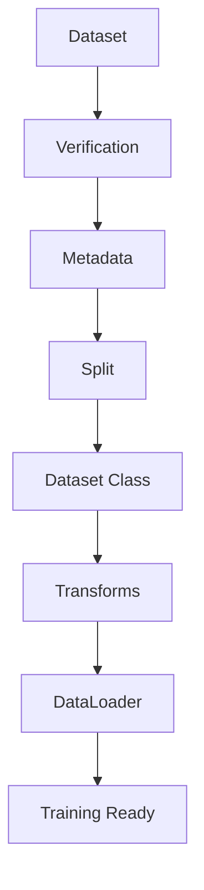
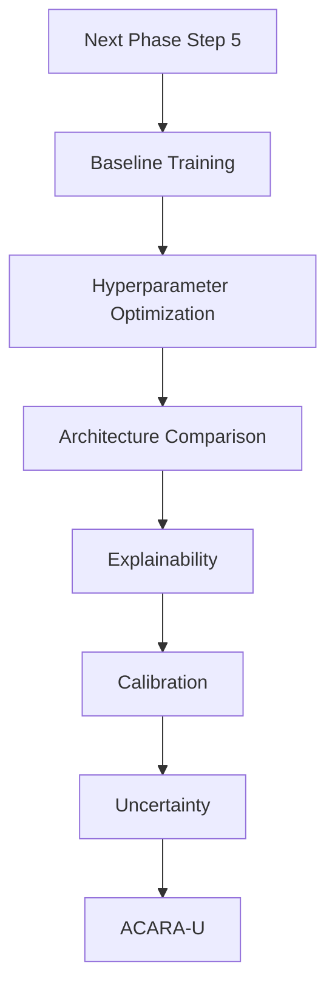

# Chapter 10: Summary

This chapter summarizes the objectives achieved, files generated, engineering contributions, and readiness of the project for model development.

---

## Objectives Achieved

The project has successfully completed the Dataset Preparation (Step 1), Data Pipeline (Step 2), Exploratory Data Analysis (Step 3), and Baseline Model Development (Step 4) phases of the FusionMedAI framework:
- **Verified Directory Structure**: Established a standardized folder layout separating raw clinical data from processed arrays, metadata reports, and logs.
- **Formulated Centralized Configuration**: Centralized paths, seeds, image size, learning rates, epochs, and DataLoader settings in `src/config.py`.
- **Automated Data Quality Audits**: Developed verification scripts validating file existence, duplicate records, and formats.
- **Pre-Generated Reusable Metadata**: Extracted image dimension records and statistics to avoid runtime CPU bottlenecks.
- **Deterministic Stratified Dataset Splitting**: Programmatically split the raw clinical images into Train (80%), Validation (10%), and Test (10%) splits while preserving class proportions.
- **Modular Dataset & Transform Implementations**: Created a reusable `RetinaDataset` with custom torchvision augmentations.
- **Configurable Dataloaders with Safety Shields**: Built memory-pinned PyTorch loaders with Windows-specific worker fallback policies.
- **Automated Exploratory Data Analysis (Step 3)**: Developed a concurrent statistics extraction and plotting pipeline, duplicate auditing, and quality assessments.
- **EfficientNet-B0 Baseline Framework (Step 4)**: Developed a fully modular deep learning baseline including model wrappers, training loops (AMP `autocast` optimized), Cosine scheduler, and TensorBoard logging.
- **Resumable State-Dict Checkpoint System**: Configured a checkpointing manager saving optimizer, scheduler, epoch, and metric history alongside host environment metadata and configuration parameters.
- **Standalone Inference CLI/API**: Created an API enabling single-scan and batch clinical predictions.
- **Relocated Verification Suite**: Moved all verification utilities under a dedicated top-level `verification/` folder to separate validation checks from the production codebase.

---

## Quantitative Verification Results
The quantitative metrics obtained during the automated verification run are detailed below:

| Metric | Verification Result | Status / Check |
| :--- | :---: | :--- |
| **Training Images** | 3,662 | Validated |
| **Train Split** | 2,929 | Validated |
| **Validation Split** | 366 | Validated |
| **Test Split** | 367 | Validated |
| **Missing Images** | 0 | Passed |
| **Corrupted Images** | 0 | Passed |
| **Duplicate IDs** | 0 | Passed |
| **RGB Images** | 3,662 | Passed |
| **Pipeline Verification** | PASS | Passed |
| **DataLoader Verification** | PASS | Passed |

---

## Deliverables Status

| Deliverable | Status |
| :--- | :---: |
| **Dataset Verification** | ✅ |
| **Metadata Generation** | ✅ |
| **Stratified Split** | ✅ |
| **Dataset Class** | ✅ |
| **Transform Pipeline** | ✅ |
| **DataLoader** | ✅ |
| **Pipeline Verification** | ✅ |

---

## Files and Artifacts Generated
Verification reports and diagnostic artifacts were automatically generated and stored under the workspace directories (`datasets/processed/splits/` and `datasets/metadata/`), including partition CSVs, class statistics indices, integrity reports, metadata summaries, duplicate detection logs, missing image reports, and dataset statistics. These artifacts provide a reproducible audit trail of the dataset preparation process.

---

## Engineering Contributions

- **Deterministic Stratified Splitting**: Preserves class imbalance while eliminating train/validation leakage.
- **Modular PyTorch Dataset**: Implemented `RetinaDataset` with custom file decoders and lazy image loading.
- **Centralized Transform Pipeline**: Built a single transforms module to apply transformations consistently.
- **End-to-End Validation**: Implemented automated integration tests verifying loader bounds, shapes, CPU devices, and traversals.
- **Independent Verification Suite**: Constructed five specialized test scripts to validate individual pipeline units independently.

---

## Pipeline Data Flow

The flowchart below shows the progression of data through the ingestion and preparation pipeline stages:

*Figure 10.1: Project data flow architecture.*

---

## Readiness for Baseline Training and Experimentation
After completion of Steps 1, 2, 3, and 4, the project is now ready for Step 5 (Baseline Training and Experimentation). The dataset has been verified, stratified, and analyzed, and the modular PyTorch baseline framework has been constructed and verified end-to-end (dry-run). The baseline configuration acts as the foundation for the subsequent experimental phase.

---

## Next Phase Roadmap

The flowchart below maps the research roadmap for the subsequent step (Model Training and Optimization):

*Figure 10.2: Model training, optimization, explainability, and post-training roadmap.*
