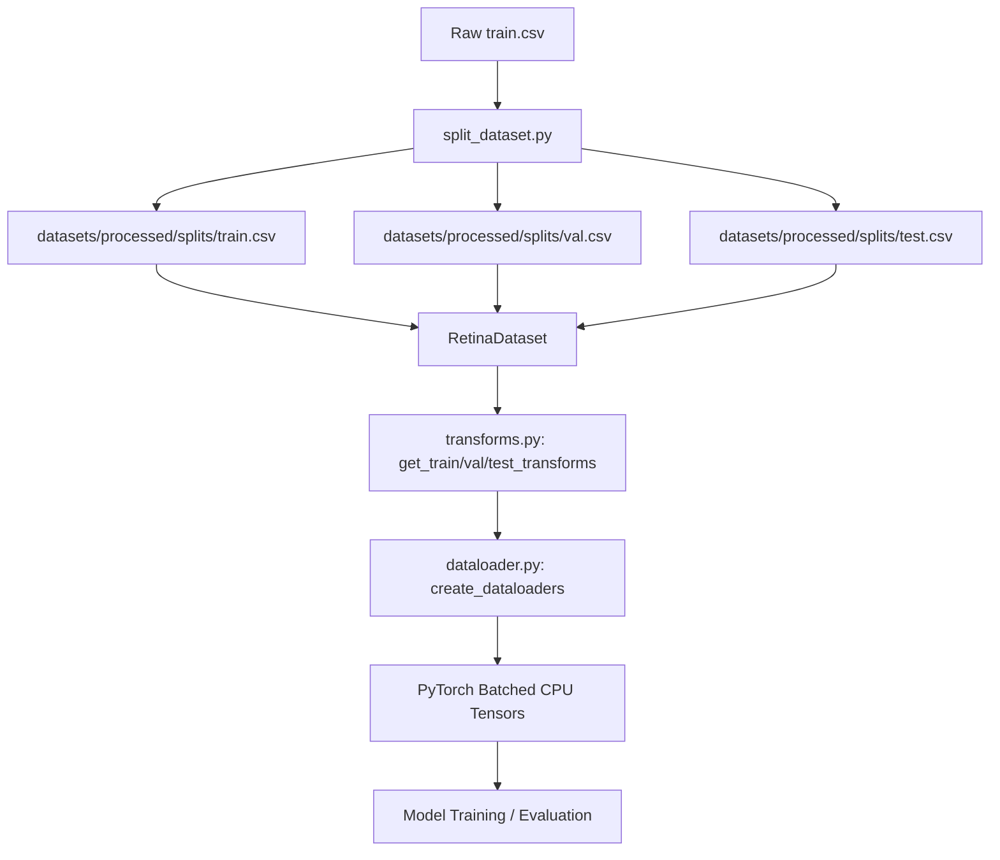

# Chapter 1: Introduction

## Purpose of the Data Pipeline
In medical image classification, the data pipeline is the central processing layer connecting raw, unstructured clinical data on disk to mathematical tensors that parameterize a Deep Learning model. While model architectures receive significant academic focus, the data pipeline is a foundational component that strongly influences training stability, model generalization, and operational efficiency.

The pipeline is also responsible for ensuring reproducible experimentation by maintaining deterministic dataset splits, centralized configuration, standardized preprocessing, and consistent data loading behavior across training runs.

A high-performance data pipeline must load raw images, validate their structural integrity, apply numerical augmentations to simulate clinical variations, organize them into batches, and transfer them from CPU host memory to GPU device memory. Doing this correctly, efficiently, and without introducing data leakage is the key prerequisite for training clinical-grade medical AI models.

## Why Preprocessing Matters in Medical AI
Retinal fundus photography presents several unique clinical and technical challenges that make standardized preprocessing critical:
- **Consistent Dimensions**: Retinal images are captured across a wide variety of resolutions (e.g., from 474x358 to 4288x2848 in the APTOS dataset). Neural networks require fixed input shapes (e.g., $224 \times 224 \times 3$) to construct batched tensors for parallelized matrix multiplications.
- **Color Channel Standardisation**: Diagnostic lesions (such as microaneurysms, hemorrhages, and hard exudates) rely on specific color cues. Standardizing all inputs to three-channel RGB prevents learning features based on camera sensor artifacts.
- **Normalization**: Medical images contain varying contrast and illumination levels due to camera flash intensities and patient pupil dilation. Scaling pixel values to a uniform range (such as $[0, 1]$ or standardized z-scores) stabilizes gradient updates and speeds up model convergence.
- **Augmentation**: Medical datasets, particularly for severe disease stages, are notoriously small. Augmenting training images using rotation, flipping, and color jittering artificially increases dataset size, encouraging the model to learn scale- and rotation-invariant features rather than memorizing noise.

## Overall Pipeline Architecture
The FusionMedAI data pipeline is built around modular, decoupled components conforming to the Single Responsibility Principle:

Each step of the pipeline is isolated:
1. **Stratified Splitting**: Decoupled from data loading, creating static, reproducible split CSVs representing 80% Train, 10% Validation, and 10% Test sets.
2. **Dataset Wrapper (`RetinaDataset`)**: Converts the CSV references into loaded, RGB PIL Images on demand.
3. **Transform Pipelines**: Centralizes torchvision augmentations, distinguishing between training (augmented) and validation/test (deterministic) flows.
4. **Data Loader (`create_dataloaders`)**: Handles batching, multiprocessing workers, memory pinning, and shuffling.

Although this phase prepares tensors for neural network training, its outputs also serve as the input to the Exploratory Data Analysis (EDA) pipeline, enabling quantitative assessment of image characteristics before model optimization.

## Design Principles
The data pipeline was designed around the following software engineering principles:
- **Modularity**: Every stage of the pipeline is isolated into a separate script/module.
- **Reproducibility**: Maintaining deterministic dataset splits, centralized configuration, and consistent data loading across training runs.
- **Separation of Concerns**: Preprocessing transforms, raw dataset loading, and batching loaders are decoupled.
- **Single Responsibility Principle**: Each component is responsible for one specific task.
- **Fail-Fast Validation**: Extensive checks are run at initialization to raise errors immediately.
- **Deterministic Evaluation**: Shuffling and random augmentations are disabled for validation/test splits.

## Objectives of Step 2
The core objectives of the Data Pipeline phase are:
1. **Implement Stratified Dataset Splitting**: Implement a two-stage splitting mechanism that preserves class proportions across train, validation, and test subsets to handle dataset imbalance.
2. **Implement PyTorch Dataset**: Create `RetinaDataset` to manage file loading, RGB conversion, and exception handling defensively.
3. **Build Transforms Module**: Establish distinct pipelines to standardize shapes and apply data augmentations.
4. **Wire PyTorch DataLoaders**: Connect the dataset and transforms into batched CPU loaders, optimizing memory usage and process boundaries.
5. **Implement E2E Verification**: Write an integration script to verify every step of the pipeline and benchmark processing performance prior to model development.

---

## References
- Paszke, A., Gross, S., Massa, F., Lerer, A., Bradbury, J., Chanan, G., ... & Chintala, S. (2019). PyTorch: An imperative style, high-performance deep learning library. *Advances in Neural Information Processing Systems*, 32, 8024-8035.
- Ting, D. S., Pasquale, L. R., Peng, L., Campbell, J. P., Lee, A. Y., & Wong, T. Y. (2019). Artificial intelligence and deep learning in ophthalmology. *British Journal of Ophthalmology*, 103(2), 167-175.
- Shorten, C., & Khoshgoftaar, T. M. (2019). A survey on Image Data Augmentation for Deep Learning. *Journal of Big Data*, 6(1), 1-48.
