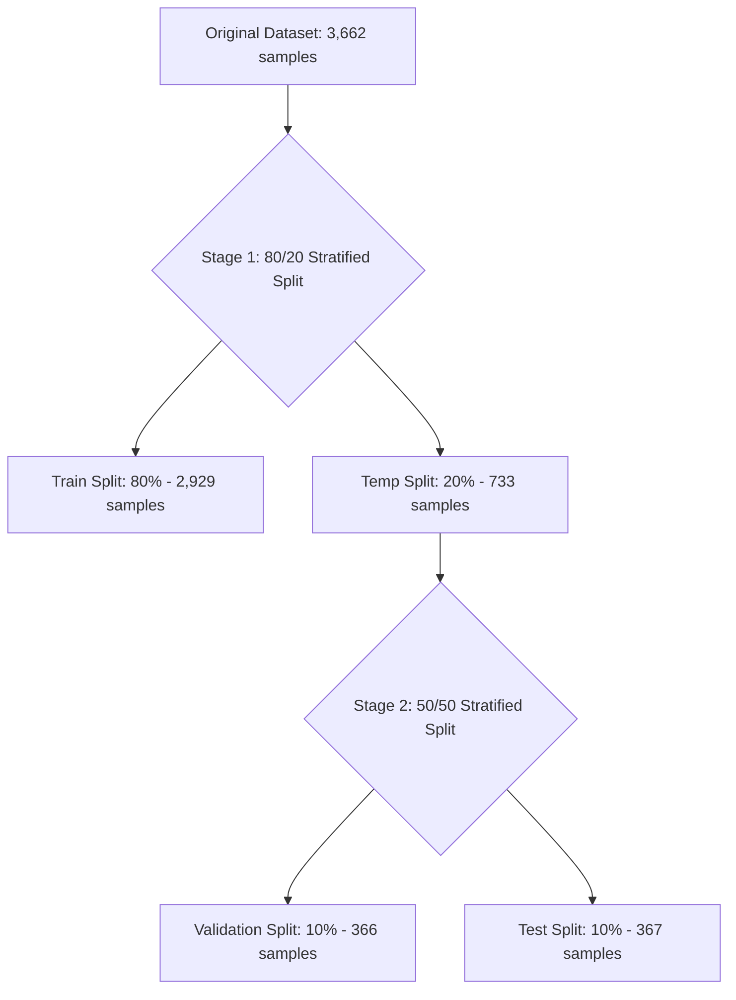

# Chapter 2: Stratified Splitting

## APTOS 2019 Dataset Overview
The APTOS 2019 dataset consists of 3,662 training images and 1,928 test images. The training set is provided with diagnostic labels graded by clinical experts according to the International Clinical Diabetic Retinopathy (ICDR) scale:
- **0**: No Diabetic Retinopathy (No DR)
- **1**: Mild Diabetic Retinopathy (Mild NPDR)
- **2**: Moderate Diabetic Retinopathy (Moderate NPDR)
- **3**: Severe Diabetic Retinopathy (Severe NPDR)
- **4**: Proliferative Diabetic Retinopathy (PDR)

## Original Class Imbalance
As documented in the metadata validation phase, the APTOS dataset has a severe class distribution imbalance:

- **Class 0 (No DR)**: 1,805 samples (49.29%)
- **Class 1 (Mild)**: 370 samples (10.10%)
- **Class 2 (Moderate)**: 999 samples (27.28%)
- **Class 3 (Severe)**: 193 samples (5.27%)
- **Class 4 (Proliferative)**: 295 samples (8.06%)

Nearly half the dataset belongs to Class 0, while the severe clinical classes (3 and 4) comprise less than 14% of the total dataset combined.

```
Class Imbalance Visualisation:
[0: No DR]        ████████████████████████████████████████ 49.29%
[1: Mild]         ████████ 10.10%
[2: Moderate]     ██████████████████████ 27.28%
[3: Severe]       ████ 5.27%
[4: Prolif.]      ██████ 8.06%
```

## Why Stratified Sampling was Chosen
If a standard random split is used on an imbalanced dataset, the resulting subsets may suffer from severe sampling bias:
- **Under-representation**: A random test or validation split might end up with extremely few (or zero) samples of Class 3 or Class 4. The model's evaluation metrics (such as Precision, Recall, and F1-score) on these classes would have high variance and low reliability.
- **Evaluation Drift**: The distribution of evaluation subsets would differ from training subsets, making cross-validation metrics non-representative.

**Stratified Sampling** solves this by enforcing that the proportion of each class in every split matches the original dataset's class distribution.

Let $p_i$ denote the proportion of class $i$ in the original dataset. Stratified sampling aims to preserve:
$$p_i^{train} \approx p_i^{val} \approx p_i^{test} \approx p_i$$
for every class $i \in \{0, 1, 2, 3, 4\}$, subject only to integer rounding constraints.

Class imbalance is intentionally preserved during splitting to ensure that the validation and test sets reflect the true clinical distribution. Class balancing techniques are introduced later during model training through sampling strategies or loss-function modifications rather than by altering evaluation datasets.

## Two-Stage 80/10/10 Split
A standard split ratio of **80% Train / 10% Validation / 10% Test** is implemented in a two-stage process using scikit-learn's `train_test_split`:



A two-stage approach was adopted because `train_test_split` directly supports binary partitioning while preserving class proportions via stratification. Splitting the temporary subset a second time ensures that the validation and test sets also maintain the original class distribution.

Both stages use `stratify=diagnosis` together with a fixed `random_state=42`, ensuring that identical dataset partitions are produced across repeated executions.

## Validation Procedures
Before splitting, the script performs a series of validation checks in a logical sequence to ensure data integrity:
1. **Required columns**: Verifies that required columns (`id_code` and `diagnosis`) exist.
2. **Dataset size**: Assures the total row count matches the verified dataset count (`EXPECTED_TRAIN_SAMPLES = 3662`).
3. **Missing values**: Checks that there are no missing values in `id_code` or `diagnosis`.
4. **Label validation**: Checks that the labels are exactly within `{0, 1, 2, 3, 4}`.
5. **Duplicate IDs**: Checks for duplicate ID codes in the CSV.
6. **Image existence**: Verifies that the physical image files exist on disk before splitting.

## Deterministic Split Ordering
After splitting, each subset is sorted by `id_code` and its index is reset before being written to disk. This deterministic ordering improves reproducibility, minimizes unnecessary Git diffs between runs, and simplifies future dataset verification.

## Reference-Based Split Storage
Instead of duplicating image files into separate directories, each split is stored as a lightweight CSV containing image identifiers and labels. Images remain in the original dataset directory and are resolved dynamically by the `RetinaDataset` class. This approach avoids redundant storage, reduces disk usage, and keeps the dataset organization simple.

## Class Distribution Tables
The resulting splits preserve the target class ratios with minimal rounding deviations:

| Class | Label Name | Original Count (%) | Train Count (%) | Val Count (%) | Test Count (%) |
|---|---|---|---|---|---|
| **0** | No DR | 1,805 (49.29%) | 1,444 (49.30%) | 180 (49.18%) | 181 (49.32%) |
| **1** | Mild | 370 (10.10%) | 296 (10.11%) | 37 (10.11%) | 37 (10.08%) |
| **2** | Moderate | 999 (27.28%) | 799 (27.28%) | 100 (27.32%) | 100 (27.25%) |
| **3** | Severe | 193 (5.27%) | 154 (5.26%) | 20 (5.46%) | 19 (5.18%) |
| **4** | Proliferative | 295 (8.06%) | 236 (8.06%) | 29 (7.92%) | 30 (8.17%) |

## Split Integrity Checks
Post-splitting integrity is verified through set disjointness:
- Let $S_{train}$, $S_{val}$, and $S_{test}$ be the sets of `id_code` values in each split.
- We check and assert that:
  - $S_{train} \cap S_{val} = \emptyset$
  - $S_{train} \cap S_{test} = \emptyset$
  - $S_{val} \cap S_{test} = \emptyset$

These checks guarantee that no image appears in more than one subset, preventing information leakage between training, validation, and testing stages. Such leakage could otherwise lead to overly optimistic evaluation metrics.

---

## References
- Pedregosa, F., Varoquaux, G., Gramfort, A., Michel, V., Thirion, B., Grisel, O., ... & Duchesnay, E. (2011). Scikit-learn: Machine learning in Python. *Journal of Machine Learning Research*, 12, 2825-2830.
