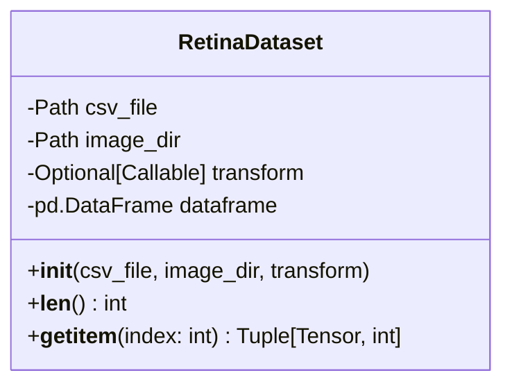
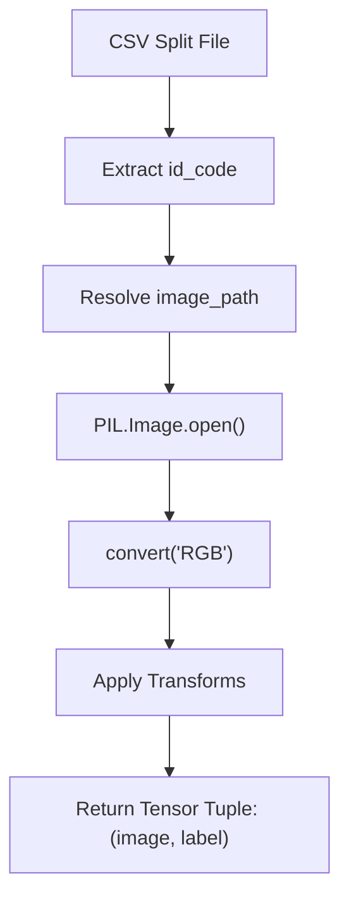
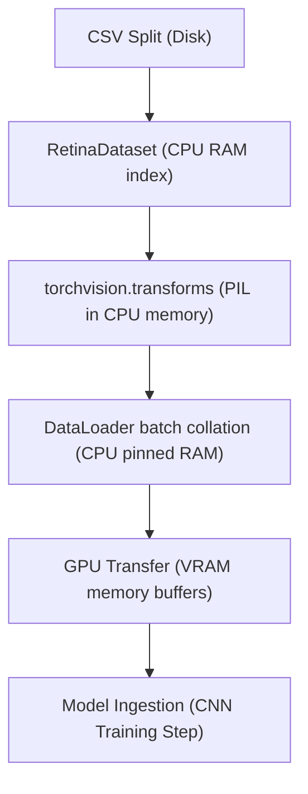

# Chapter 3: Dataset Implementation

## RetinaDataset Design
The `RetinaDataset` class is designed to wrap the local dataset directory structures and their referencing CSV splits. It inherits from `torch.utils.data.Dataset` and serves as a custom data loading class.

Unlike preloading the entire dataset into memory, `RetinaDataset` performs lazy loading, meaning images are loaded only when `__getitem__()` is called. This minimizes memory consumption and allows datasets much larger than system RAM to be processed efficiently.



## Dataset Flow
The following flowchart represents the exact data flow that occurs when a single sample is fetched via `__getitem__()`:



## Dataset Lifecycle
The sequential progression of data from disk representation to tensor format is defined by the following stages:


## Single Responsibility Principle
The implementation adheres strictly to the Single Responsibility Principle:
- **Responsibility**: Load a single raw image file from disk, convert it to standard RGB format, read the corresponding integer diagnosis label from the dataframe row, apply standard torchvision transforms, and return exactly `(image, label)`.
- **Decoupled Concerns**: It contains no caching, prefetching, or batching logic, nor does it define or configure standard augmentations. This keeps the class highly reusable and robust.

## Required Interface Methods

### `__getitem__(index)`
Loads the specific file at index, applies standard checks, performs PIL conversions and transform pipelines, and returns exactly the tuple `(image, label)`.

### `__len__()`
The `__len__()` method returns the total number of samples available in the split, allowing the PyTorch `DataLoader` to determine epoch length, batching, and iteration boundaries.

## CSV to Image Mapping
The CSV file stores only reference IDs (`id_code` column, such as `f4ea2a2cfbb9`), keeping it clean and filesystem-independent. Inside `__getitem__(index)`, the dataset maps this ID to the physical file location:
```python
image_path = self.image_dir / f"{id_code}.png"
```

## PIL Loading and RGB Conversion
Images are opened using Python Imaging Library (`PIL.Image`):
- **Why PIL?**: Most torchvision image transformations are designed to operate directly on PIL Images, reducing unnecessary conversions and simplifying preprocessing.
- **Context Manager**: A context manager is used to ensure file descriptors are closed promptly:
  ```python
  with Image.open(image_path) as img:
      image = img.convert("RGB")
  ```
- **RGB Conversion**: Regardless of the original image channel format, `.convert("RGB")` is called to guarantee consistency (3 channels) across all loaded tensors.

## Error Handling
In medical AI systems, silent data issues (such as missing files or corrupted image formats) can crash training after hours of processing. `RetinaDataset` implements defensive checks:
- **Initialization Validation**: Verifies that the required constants `ID_COLUMN` and `LABEL_COLUMN` exist in the loaded CSV file at instantiation time, raising `ValueError` immediately if missing.
- **Image File Existence**: Verifies that the resolved image path exists before opening it. If the file is missing, it raises a clean `FileNotFoundError` detailing the missing record's ID and index.
- **Fail-Fast Advantage**: Performing these validations at the dataset level enables failures to be detected early, rather than allowing training to proceed with incomplete or inconsistent data.

## Transform Integration & Dependency Injection
An optional `transform` callable can be supplied to the constructor:
- **Dependency Injection**: By accepting the transform pipeline as a constructor argument rather than defining it internally, the dataset remains independent of preprocessing policies. This design enables the same dataset implementation to be reused for training, validation, testing, offline inference, and Grad-CAM visualization simply by supplying different transform pipelines.

## Design Characteristics
The implemented `RetinaDataset` exhibits the following properties:
- **Lazy image loading**: Memory consumption remains minimal.
- **Modular preprocessing through dependency injection**: Allows decoupled transformations.
- **Minimal memory footprint**: Prevents system out-of-memory errors on large scale medical runs.
- **Robust error handling**: Validation checks run both at load and run time.
- **Deterministic image path resolution**: Dynamic and independent mapping.
- **Compatibility with PyTorch `DataLoader`**: Standard subclass implementation.

---

## References
- Paszke, A., Gross, S., Massa, F., Lerer, A., Bradbury, J., Chanan, G., ... & Chintala, S. (2019). PyTorch: An imperative style, high-performance deep learning library. *Advances in Neural Information Processing Systems*, 32, 8024-8035.
- PyTorch Documentation. (2024). *Writing Custom Datasets, DataLoaders and Transforms*. https://pytorch.org/tutorials/beginner/data_loading_tutorial.html
