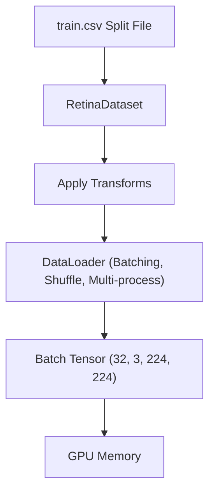

# Chapter 5: DataLoader

## DataLoader Architecture
The PyTorch `DataLoader` wraps a dataset and provides an iterable over the dataset batches. It manages batch formation, worker subprocess management, and memory optimizations.



The function `create_dataloaders()` handles the initialization of all three dataloaders in a single, centralized call, exposing a consistent interface:
```python
train_loader, val_loader, test_loader = create_dataloaders()
```

## Separation of Responsibilities
Following the Single Responsibility Principle, dataset loading is decoupled from data batching:
- **`RetinaDataset`** is responsible for loading, opening, and transforming a single sample.
- **`DataLoader`** is responsible for batching, shuffling, multiprocessing workers, pinning memory, and managing iterations.
- **Justification**: Separating these concerns improves modularity, makes unit testing simpler, and allows the same dataset implementation to be reused with different loading strategies.

## Batch Formation
Datasets load samples individually. The dataloader fetches $N$ samples (where $N = \text{batch\_size}$, configured to 32) and stacks them along a new dimension to form a batch tensor:
- **Image Batch Shape**: $(B, C, H, W) = (32, 3, 224, 224)$
- **Label Batch Shape**: $(B,) = (32,)$

Batching enables efficient parallel computation on modern CPUs and GPUs by processing multiple images simultaneously instead of one sample at a time. Mini-batch training also provides more stable gradient estimates than purely stochastic updates.

## Collation Strategy
Since each sample contains a fixed-size RGB image and a scalar label, the default PyTorch collation mechanism is sufficient. Custom collation becomes necessary only for variable-sized inputs or multimodal data.

### DataLoader Output
- **Image Tensor**: $(B, 3, 224, 224)$ float32 tensor representing the normalized image batch.
- **Label Tensor**: $(B,)$ int64 tensor representing the disease severity labels.
This ensures that downstream networks receive standard tensors ready for GPU transfer.

## Shuffling Strategy
- **Training DataLoader**: `shuffle=True`. Shuffling the training set at each epoch ensures that gradient updates are computed over different mini-batches, preventing the optimizer from memorizing dataset ordering.
- **Validation and Test DataLoaders**: `shuffle=False`. Since no parameter updates occur during validation or testing, sample ordering does not affect the computed metrics. Keeping the order deterministic improves reproducibility and simplifies debugging.

## Defensive Validation
Before constructing any DataLoader objects, `create_dataloaders()` performs strict validations:
1. Verifies that all split CSV files exist.
2. Verifies that the raw image directory exists.
3. Ensures `batch_size` is greater than zero (`batch_size > 0`).
4. Ensures `num_workers` is non-negative (`num_workers >= 0`).

Fail-fast validation prevents training from starting with invalid configuration.

## Multi-process Workers (`num_workers`)
PyTorch uses Python multiprocessing to load data in parallel:
- **Worker count**: Configured in `src/config.py` via `NUM_WORKERS`.
- **Portability**: On Windows, multi-process data loading can sometimes raise file lock issues or slow down startup during development. `create_dataloaders()` keeps the workers configurable and safely defaults to `num_workers=0` (single-thread execution on the main process) during verification runs.

## Memory Optimizations

### Pin Memory (`pin_memory`)
When training on a GPU, host memory must first be copied to the GPU:
- Setting `pin_memory=True` locks the host CPU memory pages, allowing PyTorch to perform fast, non-blocking asynchronous transfers directly to the GPU.
- **Portability**: In the configuration file, `PIN_MEMORY` is defined conditionally:
  ```python
  PIN_MEMORY = torch.cuda.is_available()
  ```
  This prevents unnecessary memory overhead when training on systems without a GPU.

### Persistent Workers (`persistent_workers`)
By default, the DataLoader recreates worker processes at each epoch, adding initialization overhead. Setting `persistent_workers=True` keeps the workers alive between epochs, reducing latency.
- **Safety check**: PyTorch requires `num_workers > 0` to enable persistent workers. The dataloader handles this automatically to prevent runtime failures:
  ```python
  persistent_workers = persistent_workers and num_workers > 0
  ```
- **Portability**: Persistent workers are disabled by default because the current project prioritizes portability across Windows development environments. They can be enabled later for GPU training workloads where worker initialization overhead becomes significant.

### Drop Last (`drop_last`)
Determines whether to drop the last incomplete batch if the dataset size is not divisible by the batch size:
- Set to `False` by default. This is particularly important during validation and testing, where every labeled sample contributes to evaluation metrics. Training can optionally enable `drop_last=True` if strict batch consistency is required by certain optimization techniques.

---

## References
- Paszke, A., Gross, S., Massa, F., Lerer, A., Bradbury, J., Chanan, G., ... & Chintala, S. (2019). PyTorch: An imperative style, high-performance deep learning library. *Advances in Neural Information Processing Systems*, 32, 8024-8035.
- PyTorch Documentation. (2024). *torch.utils.data.DataLoader*. https://pytorch.org/docs/stable/data.html
