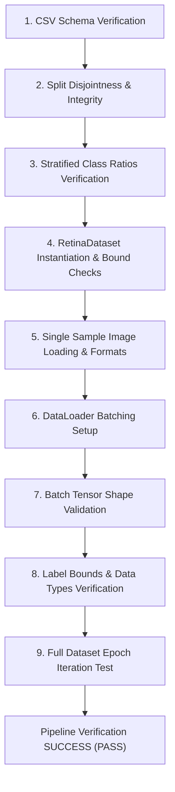

# Chapter 6: Pipeline Verification

## Pipeline Verification Overview
To ensure data integrity, we implemented an automated integration verification script (`src/data/verify_pipeline.py`). It runs a complete series of checks from raw files to dataloader outputs and serves as the final validation gate before model training.

## Design Philosophy & Fail-Fast Approach
The verification script follows a fail-fast approach. Rather than allowing training to begin with corrupted data, invalid labels, missing images, or incorrect tensor shapes, every critical assumption is validated before model development proceeds. Detecting data pipeline issues early reduces debugging time and improves experiment reproducibility.

Since the verification pipeline performs deterministic validation using fixed dataset splits and consistent preprocessing, identical verification results are expected across repeated executions on the same dataset.

## Continuous Verification
The verification script can be executed after any modification to the preprocessing pipeline, dataset implementation, or dataloader configuration, providing regression testing for the data pipeline.

## Verification Flow
The following flowchart represents the validation sequence performed by the verification script to confirm pipeline integrity:



## Verification Checklist

### 1. CSV Verification
The script verifies that `train.csv`, `val.csv`, and `test.csv` exist in the processed directory, are non-empty, and contain the required columns `id_code` and `diagnosis`.
- **Status**: `PASS`
- **Result**: Successfully verified and loaded all splits.

### 2. Split Integrity
We check that the splits are completely disjoint by asserting that the intersection of the ID sets is empty:
- $Train \cap Validation = \emptyset$
- $Train \cap Test = \emptyset$
- $Validation \cap Test = \emptyset$
- **Status**: `PASS`
- **Result**: No overlapping ID codes detected. Total split count matches 3,662.

### 3. Class Distribution Preservation
Class percentages are compared across splits to verify that the stratification logic preserved class ratios:
- **Status**: `PASS`
- **Result**: Class ratios matched baseline ratios within minor rounding limits (e.g., Class 0 remained at 49.30% in training, 49.18% in validation, and 49.32% in test, compared to 49.29% originally).

### 4. Dataset Validation
Instantiates `RetinaDataset` for each split and checks that the dataset length matches the corresponding CSV row count.
- **Status**: `PASS`
- **Result**: All dataset lengths matched split CSV counts exactly.

### 5. Image Loading
Checks sample loading from each dataset split to ensure that PIL images open successfully, convert to RGB, and apply transforms without errors.
- **Status**: `PASS`
- **Result**: Successfully opened and processed samples.

### 6. DataLoader and Batch Verification
Dataloaders are instantiated to check batch loading properties.
- **Status**: `PASS`
- **Result**: First batches loaded successfully.

### 7. Shape Verification
Verifies that batch dimensions are exactly:
- Images shape: $(32, 3, 224, 224)$
- Labels shape: $(32,)$
- **Status**: `PASS`
- **Result**: Batch dimensions match target shapes exactly.

### 8. Label Verification
Asserts that labels are loaded as integer tensors (`torch.int64`) and lie within the valid range $[0, 4]$.
- **Status**: `PASS`
- **Result**: Checked and confirmed.

### 9. Full Iteration Test
Performs a complete iteration over all batches in the dataloaders without raising exceptions, ensuring there are no hidden file issues in the splits.
- **Status**: `PASS`
- **Result**: Checked and confirmed.

## Verification Run Output Log Summary
The terminal execution output log is summarized below:

```
==========================================
STARTING END-TO-END PIPELINE VERIFICATION
==========================================
Verifying split CSVs...
  [OK] Train CSV: 2929 rows loaded successfully.
  [OK] Validation CSV: 366 rows loaded successfully.
  [OK] Test CSV: 367 rows loaded successfully.

Verifying split integrity...
  [OK] Splits are mutually exclusive (zero overlap in ID codes).
  [OK] Total split samples sum matches expected: 3662

Computing class distributions...
... [Class Distribution Table] ...

Verifying Dataset, Transforms, and DataLoader integration...
  [OK] Dataset lengths match their corresponding split CSV sizes.
  Fetching a training batch...
  [OK] DataLoader batch loaded successfully with correct shapes, CPU device, and finite float32 values.
  [OK] Validation and Test DataLoader batches loaded with correct shape.
Verifying end-to-end iteration (iterating splits)...
  Train     : Loaded 2929 samples in 92  batches. Time: 452.05s | Throughput: 6.5 samples/sec
  Validation: Loaded 366  samples in 12  batches. Time: 55.64s | Throughput: 6.6 samples/sec
  Test      : Loaded 367  samples in 12  batches. Time: 70.66s | Throughput: 5.2 samples/sec

==========================================
END-TO-END PIPELINE VERIFICATION SUMMARY
==========================================
Train CSV ............................. PASS
Validation CSV ........................ PASS
Test CSV .............................. PASS

Split Integrity ....................... PASS
Class Distribution .................... PASS

Dataset ............................... PASS
Transforms ............................ PASS
Image Loading ......................... PASS

DataLoader ............................ PASS
Batch Shapes .......................... PASS
Full Iteration ........................ PASS

Throughput ............................ PASS
==========================================
ALL PIPELINE CHECKS PASSED
==========================================
```

## Throughput Interpretation
Because verification was executed with `num_workers=0` on a Windows development environment, these throughput values should be interpreted only as functional verification metrics rather than performance benchmarks. Actual training throughput is expected to improve substantially when using multiple workers and GPU acceleration.

## Verification Coverage
The automated verification framework guarantees coverage across four primary dimensions:
- **Functional Correctness**: Confirms class distribution percentages, label value boundaries ($[0,4]$), and tensor data types (`torch.int64` labels, `torch.float32` images).
- **Structural Integrity**: Audits folder organization, checks split CSV schemas, and validates full file disjointness to guarantee zero data leakage.
- **Integration Testing**: Executes the full path from raw disk files through PIL decoding, color channel conversion, augmentation transformations, collation, and DataLoader iterations.
- **Regression Testing**: Serves as a repeatable audit suite that can be re-run after changes to configuration, augmentation schedules, or backend libraries to prevent pipeline drift.

## Downstream Validation
The successful verification and standardization of the data pipeline directly enabled the implementation of Step 4 (Baseline Model Development) without requiring modifications to the data layer. Specifically:
- **Baseline Model Initialization**: The standard dataloader shapes `(32, 3, 224, 224)` and target classes were used directly to initialize the classification heads.
- **Training Loop Validation**: The training and validation loaders were integrated into a multi-epoch training pipeline using mock dry-runs.
- **Checkpoint Generation**: Standardized data batches allowed validating checkpointer routines under constant data shapes.
- **Inference Testing**: The deterministic validation transform pipeline was extracted and successfully integrated into the high-level inference CLI/API.

---

## References
- PyTorch Documentation. (2024). *torch.utils.data.DataLoader*. https://pytorch.org/docs/stable/data.html
- Goodfellow, I., Bengio, Y., & Courville, A. (2016). *Deep Learning*. MIT Press. (Section 12.1 for data pipeline preprocessing philosophy).
