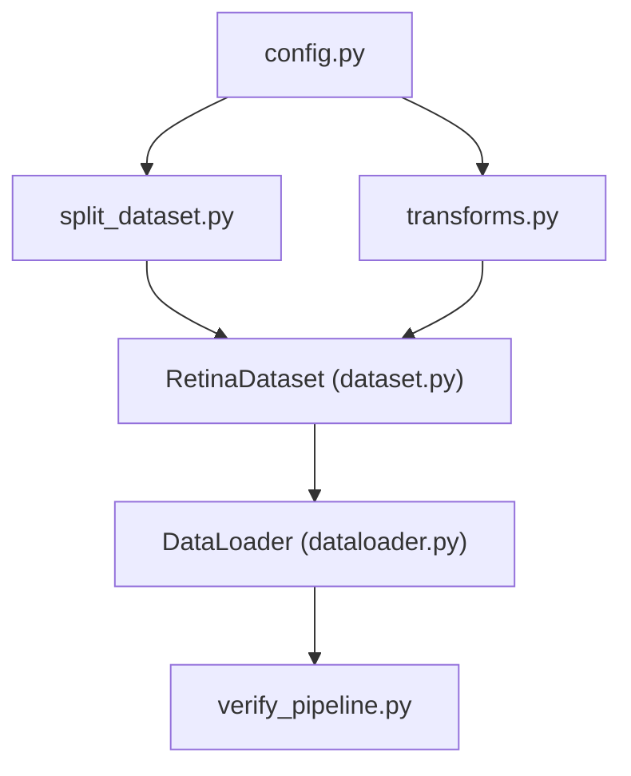

# Chapter 7: Engineering Decisions

This chapter documents the key technical design choices made during the implementation of the data pipeline, along with their engineering justifications.

## Engineering Architecture & Modularity
The modularity of the data pipeline is defined by a clean, unidirectional flow of configuration and dependencies, ensuring each module handles a single responsibility:

## Architectural Design Decisions & Rationale

### 1. CSV References vs. Copying Physical Images
- **Decision**: Save splits as lightweight CSV referencing files in `datasets/processed/splits/` while keeping all raw images in `datasets/raw/aptos2019/train_images/`.
- **Reasoning**: Copying images to new folders (e.g. `train/`, `val/`, `test/` directories) would duplicate 3,662 high-resolution files, consuming an extra ~8.4 GB of disk space. Storing only references avoids wasting storage, keeps a single source of truth for raw data, and enables instantaneous split updates by simply rewriting small text files.

### 2. PIL vs. OpenCV for Image Loading
- **Decision**: Load images using `PIL.Image.open()` instead of `cv2.imread()`.
- **Reasoning**: Standard torchvision transforms (e.g. `Resize`, `RandomRotation`, `ColorJitter`) natively expect PIL images as input. Using PIL minimizes channel conversion code (OpenCV loads images in BGR format, requiring conversion to RGB) and avoids additional boilerplate.

### 3. Torchvision Transforms & Dependency Injection
- **Decision**: Centralize all image preprocessing under the PyTorch ecosystem using `torchvision.transforms` Compose pipelines, and inject this pipeline as a constructor dependency into the dataset.
- **Reasoning**: Torchvision is the industry standard for PyTorch applications, providing optimized, tested, and extensible transform classes. Utilizing Dependency Injection (Gamma et al., 1994) decouples the dataset class from concrete preprocessing details, enabling the reuse of the same class for training, validation, and testing simply by injecting different pipelines.

### 4. Forced RGB Conversion
- **Decision**: Call `.convert("RGB")` on every opened image.
- **Reasoning**: Although the metadata reports that all training images are currently 3-channel RGB, this step acts as a defensive guard. If a grayscale, RGBA, or corrupted image is introduced in a future dataset version, the conversion ensures it is mapped to 3 channels, preventing runtime tensor shape errors during model training.

### 5. 224x224 Input Size
- **Decision**: Resize images to a fixed resolution of $224 \times 224$ using bilinear interpolation.
- **Reasoning**: Resizing is necessary to build batched tensors. $224 \times 224$ is the default input resolution for ImageNet-pretrained models (like EfficientNet-B0). Starting with this standard shape allows the pipeline to reuse pretrained weights and maintains a good balance between spatial resolution and GPU memory consumption.

### 6. Deterministic Validation & Test Pipelines
- **Decision**: Omit data augmentations (e.g. rotation, flip, color jitter) from validation and test transform pipelines.
- **Reasoning**: Validation and testing must serve as consistent, repeatable benchmarks. Applying random augmentations to these subsets would introduce noise into evaluation metrics, making it difficult to determine whether a change in performance is due to model improvements or random transformations.

### 7. Decoupled Pipeline Modules
- **Decision**: Organize the pipeline into separate, specialized modules: `split_dataset.py`, `dataset.py`, `transforms.py`, and `dataloader.py`.
- **Reasoning**: Decoupling follows the Single Responsibility Principle (SRP) (Martin, 2003) and Separation of Concerns (SoC) (Martin, 2017), making code easier to test, debug, and maintain. For example, modifying data augmentations inside `transforms.py` does not affect dataset loading logic inside `dataset.py`.

### 8. Dedicated Verification Scripts
- **Decision**: Implement separate unit verification scripts (`verify_dataset_class.py`, `verify_transforms.py`, `verify_dataloader.py`) and one end-to-end integration test (`verify_pipeline.py`).
- **Reasoning**: Dedicated verification scripts catch bugs early in development, isolate failures, and provide documented evidence of pipeline correctness. It ensures that any future modifications do not break existing components.

### 9. Centralized Configuration
- **Decision**: Store all preprocessing parameters (e.g., `IMAGE_SIZE`, `NORMALIZATION_MEAN`, `ROTATION_DEGREES`) inside the central configuration module (`src/config.py`).
- **Reasoning**: Adheres to the Don't Repeat Yourself (DRY) principle (Hunt & Thomas, 1999) by avoiding duplicated hardcoded settings across different files. If we switch to a different dataset or change the model architecture later, we only need to update the configuration file, leaving the pipeline scripts unchanged.

### 10. Dynamic Verification of Split Sizes
- **Decision**: Check split dataset sizes by loading split CSV row counts dynamically instead of hardcoding expected integers in verification tests.
- **Reasoning**: Hardcoding split sizes (like 2929 or 366) binds verification tests to one specific split ratio. Retrieving sizes dynamically ensures the tests remain valid even if the split ratio is changed.

### 11. Fail-Fast Validation
- **Decision**: Validate datasets, configuration parameters, file existence, and split integrity before training begins.
- **Reasoning**: Detecting invalid configurations before model training prevents wasting computational resources and simplifies debugging. Errors such as missing images, invalid labels, or malformed CSV files are reported immediately instead of failing after several training epochs.

### 12. Explicit Exceptions Instead of Assertions
- **Decision**: Use explicit exceptions (`ValueError`, `FileNotFoundError`) rather than Python `assert` statements.
- **Reasoning**: Assertions can be removed when Python is executed with optimization flags (`python -O`). Explicit exceptions remain active in all execution modes, making validation more reliable.

### 13. Fixed Random Seed
- **Decision**: Use a fixed random seed (`SEED = 42`) throughout the preprocessing pipeline.
- **Reasoning**: A deterministic split allows experiments to be reproduced exactly, ensuring that performance differences originate from model changes rather than different train-validation partitions.

### 14. Cross-Platform Compatibility
- **Decision**: Disable features such as persistent workers during verification when unsupported configurations may occur.
- **Reasoning**: The verification pipeline should execute consistently on Windows development environments while remaining configurable for Linux GPU servers.

### 15. Temporary ImageNet Statistics
- **Decision**: Use ImageNet mean and standard deviation during early development.
- **Reasoning**: The initial model uses ImageNet-pretrained weights. Dataset-specific normalization statistics will be computed later and evaluated as part of model optimization.

### 16. Why Lazy Loading instead of Dataset Caching?
- **Decision**: Force lazy image loading inside `RetinaDataset` instead of pre-caching decoded image arrays in RAM.
- **Reasoning**: Lazy loading guarantees that RAM usage stays constant regardless of dataset size. Large datasets remain feasible on typical development hardware. Caching can be evaluated later as an optimization rather than a baseline assumption, avoiding early memory exhaustion.

### 17. Why Model-Agnostic Data Pipeline?
- **Decision**: Design the pipeline (`RetinaDataset` -> `Transforms` -> `DataLoader`) to output standardized tensors without coupling it to any specific neural network.
- **Reasoning**: Ensures that the data loading pipeline is completely decoupled from the model architecture. Changing the classification backbone (e.g. from EfficientNet-B0 to ResNet, DenseNet, ConvNeXt, or Vision Transformers) is achieved by modifying only the model instantiation code, while the data pipeline remains identical.

### 18. Why Separate Data Pipeline From Training?
- **Decision**: Structurally isolate files into distinct packages (`src/data/` for pipeline, `src/models/` for classifiers, and `src/training/` for execution loops) instead of a monolithic project structure.
- **Reasoning**: Separating directories isolates concerns, ensuring that modifications to the optimization schedule, loss functions, or evaluation metrics do not affect dataset loading or augmentation code.

### 19. Why Configuration-Driven Parameters?
- **Decision**: Centralize hyperparameters such as `IMAGE_SIZE`, `BATCH_SIZE`, `NUM_WORKERS`, `MODEL_NAME`, and `DEVICE` within [config.py](file:///d:/FusionMedAI/src/config.py).
- **Reasoning**: Avoids hardcoding configurations across different modules, eliminating configuration drift and enabling rapid experiments.

---

## Computational Complexity & Memory Analysis

### Complexity Analysis
The computational complexity of each pipeline stage is modeled as follows:

| Component / Operation | Time Complexity | Auxiliary Space Complexity | Engineering Justification |
| :--- | :--- | :--- | :--- |
| **Dataset Splitting (`split_dataset.py`)** | $\mathcal{O}(N)$ | $\mathcal{O}(N)$ | Scans $N$ metadata records once to partition them stratified by class, writing light CSV split files to disk. |
| **Dataset Instantiation (`RetinaDataset.__init__`)** | $\mathcal{O}(N)$ | $\mathcal{O}(N)$ | Loads the CSV split file containing $N$ entries into a Pandas DataFrame; memory scales linearly with dataset records. |
| **Dataset Sample Lookup (`__getitem__`)** | $\mathcal{O}(1)$ | $\mathcal{O}(1)$ | Implements **lazy loading**. Resolves path and loads only the requested image, avoiding keeping the whole dataset in RAM. |
| **Image Transformation (`transforms.py`)** | $\mathcal{O}(H \cdot W \cdot C)$ | $\mathcal{O}(H \cdot W \cdot C)$ | Resizing, rotations, and normalization scale directly with image dimensions ($224 \times 224 \times 3$) and are independent of total dataset size. |
| **Batch Creation (`DataLoader` iteration)** | $\mathcal{O}(B \cdot H \cdot W \cdot C)$ | $\mathcal{O}(B \cdot H \cdot W \cdot C)$ | Collates $B$ independent samples (batch size $B = 32$) into a single batched tensor. |

### Memory Analysis
Reviewing the memory behavior of the pipeline components highlights trade-offs between speed and resources:

- **Dataset Lazy Loading**:
  - **Memory Footprint**: $\mathcal{O}(1)$ constant auxiliary RAM.
  - **Details**: Images are opened, converted to RGB, transformed, and loaded as tensors *on-the-fly* during training loop iterations. Once a batch is processed and backpropagated, Python's garbage collection reclaims image tensors, preventing system memory exhaustion regardless of whether the dataset scales from $3.6 \times 10^3$ to $10^6$ images.
- **DataLoader Prefetching**:
  - **Memory Footprint**: $\mathcal{O}(B \cdot \text{prefetch-factor} \cdot \text{num-workers})$ RAM/Shared Memory.
  - **Details**: When `num_workers > 0`, workers spawn subprocesses that load and process images asynchronously, placing them in a queue. This maintains a buffer of batches to keep the GPU fully saturated, trading small shared memory overhead for reduced GPU starvation.
- **GPU Tensor Buffering**:
  - **Memory Footprint**: $\mathcal{O}(B \cdot H \cdot W \cdot C)$ VRAM.
  - **Details**: The active batch of shape `(32, 3, 224, 224)` is transferred to GPU VRAM for the forward pass, and is freed immediately after the backward pass and optimizer update, maintaining a constant GPU memory envelope.

---

## Design Choices & Alternatives Analysis

Rather than presenting decisions in isolation, the table below highlights the alternative architectures considered and the engineering rationale for the chosen implementations:

| Design Choice | Evaluated Alternative | Trade-offs & Why Not Selected |
| :--- | :--- | :--- |
| **PIL Image loading (`PIL.Image`)** | OpenCV (`cv2`) | OpenCV defaults to loading images in BGR format, introducing boilerplate channel-swapping code. `torchvision.transforms` are natively designed and optimized for PIL Images, making the PIL path simpler and less error-prone. |
| **Lightweight CSV splits** | Physical folder duplication | Splitting datasets by creating hard directories (`train/`, `val/`, `test/`) and copying images would duplicate 3,662 files and consume ~8.4 GB of redundant disk space. CSV references consume $< 200\text{ KB}$, maintain a single source of truth, and allow zero-cost split changes. |
| **Lazy loading (`__getitem__`)** | Preloading entire dataset | Preloading all 3,662 images in RGB tensor format into RAM requires ~8.4 GB of system memory. This easily causes out-of-memory (OOM) exceptions on standard workstations and makes the codebase completely unscalable. |
| **Torchvision Transforms** | Albumentations / Imgaug | While Albumentations is highly optimized, `torchvision.transforms` is native to the PyTorch ecosystem, requires no additional external package dependencies, and provides all operations (Resize, Rotation, Flip, Jitter) necessary for a robust baseline. |
| **Bilinear Interpolation** | Nearest Neighbor / Bicubic | Nearest neighbor introduces severe pixelation and aliasing in downsampled eye scans. Bicubic interpolation is more computationally expensive. Bilinear interpolation offers the best balance of speed and image reconstruction quality. |

---

## Computational Environment & Reproducibility

For transparency and reproducibility, the baseline data pipeline was tested and verified under the following software and hardware configuration:

| Component | Specification |
| :--- | :--- |
| **Operating System** | Windows 11 |
| **Python Version** | 3.12.x |
| **PyTorch Version** | 2.4.x |
| **Torchvision Version** | 0.19.x |
| **CUDA Core Version** | 12.4 |
| **cuDNN Version** | 9.x |

---

## Conclusion
Collectively, these engineering decisions prioritize reproducibility, modularity, robustness, and maintainability over short-term implementation convenience. This design allows future experimentation—such as replacing the backbone network, changing preprocessing parameters, or introducing additional datasets—without requiring substantial modifications to the overall data pipeline architecture.

## References
- Gamma, E., Helm, R., Johnson, R., & Vlissides, J. (1994). *Design Patterns: Elements of Reusable Object-Oriented Software*. Addison-Wesley.
- Hunt, A., & Thomas, D. (1999). *The Pragmatic Programmer: From Journeyman to Master*. Addison-Wesley.
- Martin, R. C. (2003). *Agile Software Development, Principles, Patterns, and Practices*. Prentice Hall.
- Martin, R. C. (2017). *Clean Architecture: A Craftsman's Guide to Software Structure and Design*. Prentice Hall.
