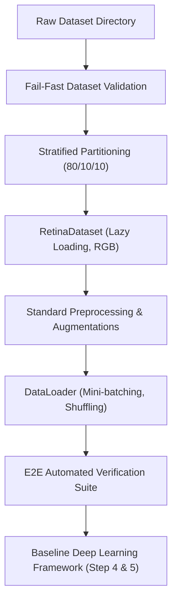

# Chapter 9: Step 2 Summary

## Phase Overview
The **Data Pipeline** phase establishes a modular, validated, and reproducible data pipeline for feeding training data into PyTorch models. By separating concerns across dedicated scripts and implementing a rigorous verification gate, we ensure that downstream model training is built on a stable foundation.

All preprocessing stages are deterministic where required, and the train/validation/test partitions are reproducible through a fixed random seed and versioned split metadata.

## Pipeline Architecture Overview

The following diagram illustrates the flow of data through the pipeline stages to downstream model training:



## Key Outcomes

### 1. Completed Modules
- **Stratified Splitter**: `src/data/split_dataset.py` splits the verified dataset into Train (80%), Validation (10%), and Test (10%) splits while preserving class ratios.
- **Dataset Class**: `src/data/dataset.py` implements `RetinaDataset` to manage file loading, RGB conversion, and exception handling defensively.
- **Transforms Pipeline**: `src/data/transforms.py` centralizes preprocessing and augmentation workflows.
- **DataLoader Builder**: `src/data/dataloader.py` constructs batched PyTorch loaders with memory optimizations.
- **End-to-End Verification**: `src/data/verify_pipeline.py` checks every step of the pipeline.

### 2. Files Created
The following files were added to the project structure:
- `src/data/split_dataset.py`
- `src/data/dataset.py`
- `src/data/transforms.py`
- `src/data/dataloader.py`
- `src/data/verify_dataset_class.py`
- `src/data/verify_transforms.py`
- `src/data/verify_dataloader.py`
- `src/data/verify_pipeline.py`
- `datasets/processed/splits/train.csv`
- `datasets/processed/splits/val.csv`
- `datasets/processed/splits/test.csv`
- `datasets/processed/splits/split_statistics.json`

### 3. Engineering Achievements
- **Reproducible 80/10/10 Stratified Dataset Split**: Partitions the clinical data while strictly maintaining class ratios across all subsets.
- **Modular Dataset, Transform, and DataLoader Implementation**: Each component has a clearly defined responsibility and can be modified independently without requiring changes to the remaining pipeline modules.
- **Defensive Validation and Fail-Fast Error Handling**: Uses explicit exceptions (`ValueError`, `FileNotFoundError`) to check dataset bounds, missing files, and label bounds before training initialization.
- **Centralized Configuration Management**: Concentrates all directory paths, hyperparameter bounds, and image sizes in a central configuration module (`src/config.py`).
- **Unit and End-to-End Verification Framework**: Validates CSV schemas, disjointness constraints, transform outputs, and dataloader batch construction.
- **Clean Separation between Preprocessing and Model Development**: Decouples dataset ingestion from training loops to facilitate scalable backbone architectures.

## Verification Completed
We executed the end-to-end verification script and confirmed that all checks passed successfully:
- CSV validation, split integrity, class distribution, dataset length, image loading, batch shapes, and full iteration tests have been verified.
- No data leakage or loading failures were detected during verification.

## Readiness for Baseline Training and Experimentation
The project is now ready for baseline training, architecture comparison, hyperparameter optimization, and explainability. The data pipeline outputs stable, shuffled training batches of shape `(32, 3, 224, 224)` and deterministic validation and test batches, feeding the finalized modular PyTorch baseline framework.

### Baseline Deep Learning Achievements (Step 4)
* **Baseline EfficientNet-B0**: Integrated PyTorch's official pretrained EfficientNet-B0 with custom classifier heads.
* **Training Framework**: Established multi-epoch loops using Automatic Mixed Precision (`autocast`), Cosine Annealing learning rate schedule, and Early Stopping.
* **Inference Pipeline**: Built a dedicated CLI and API for single-image and batch fundus classification.
* **Checkpoint Manager**: Configured saving/loading of model weights, optimizer/scheduler states, and Python/PyTorch version configurations.
* **Experiment Logging**: Integrated TensorBoard and CSV trackers to log learning rates, losses, and metrics.

The validated pipeline developed in this phase was subsequently used to generate the quantitative analyses presented in the Exploratory Data Analysis phase, confirming its correctness under practical experimental workloads.

---

## Next Phase Roadmap

The flowchart below maps the research roadmap for the subsequent steps:

```
Pipeline
   │
   ▼
Baseline Model
   │
   ▼
Training
   │
   ▼
Evaluation
   │
   ▼
Grad-CAM
   │
   ▼
Calibration
   │
   ▼
ACARA-U
```
*Figure 9.1: Data pipeline to clinical model training roadmap.*
