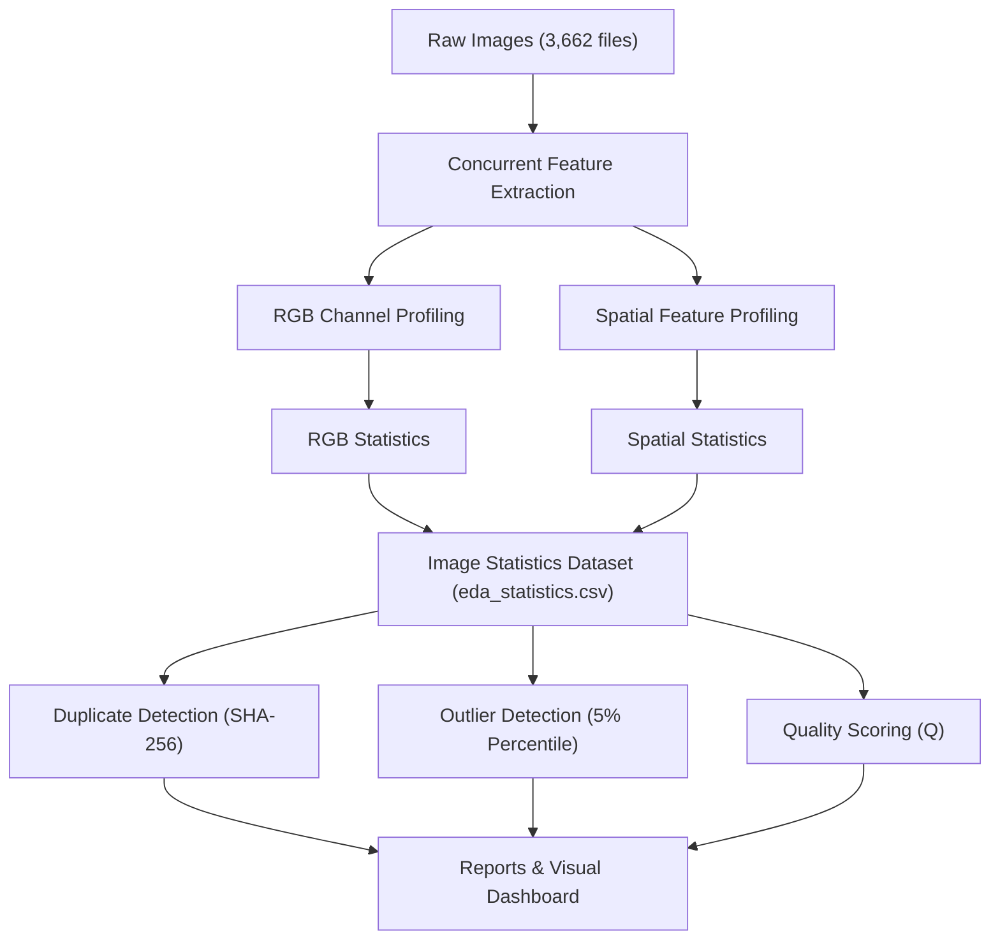

# Chapter 3: Dataset Overview

## High-Level Dataset Metrics
A comprehensive data integrity audit was performed on the cohort under read-only constraints, yielding the following descriptive parameters:

- **Dataset Identifier**: `APTOS 2019 Blindness Detection (Training Split)`
- **Dataset Integrity Status**: Passed (no structural inconsistencies detected)
- **Total Annotated Images**: $3,662$ files
- **Missing Files**: $0$ files (passed)
- **Corrupted / Unreadable Files**: $0$ files (passed)
- **Invalid Channel Dimensions**: $0$ files (all files confirmed as $3$-channel RGB color format, passed)
- **Dataset Reproducibility Fingerprint (SHA-256)**: `df102971518b36519862bbfb8b1afc601fd2ba27e6c2b2371d3c3ff77b443593`
- **Average Image Quality Score ($Q$)**: $0.7332$
- **Average Processing Throughput**: $47.4$ images/sec
- **Total Execution Run Duration**: $77.27$ seconds

---

## Environmental and Dependency Specifications
To ensure absolute reproducibility of the statistics and visual figures, the development and verification environments were locked:

- **Development Platform**: Windows-based workstation
- **Python Version**: `3.12.2`
- **NumPy Version**: `2.2.6`
- **Pandas Version**: `2.2.2`
- **OpenCV Version**: `4.13.0`
- **PyTorch Version**: `2.4`
- **CUDA Version**: `12.4`

---

## Pipeline Data Flow Architecture
The flowchart below maps the progression of image data and labels through the concurrent feature extraction, quality analysis, and report generation pipeline:

*Figure 3.1: Data flow schema of the Phase 3 extraction pipeline.*
