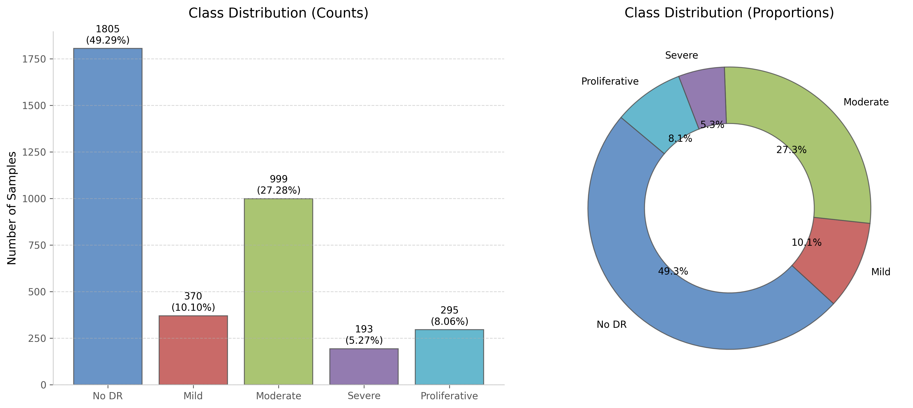

# Chapter 4: Class Distribution

## Disease Severity Staging Counts
The APTOS 2019 training cohort contains five classes representing different clinical severity stages of Diabetic Retinopathy (DR) based on clinical diagnostic features (such as microaneurysms, hemorrhages, hard exudates, cotton wool spots, and neovascularization):

| Diagnosis ID | Severity Stage | Image Count | Percentage (%) | Clinical Diagnostic Criteria |
| :---: | :--- | :---: | :---: | :--- |
| **0** | No DR | 1,805 | 49.29% | Healthy retina. Zero microaneurysms, hemorrhages, or exudates. |
| **1** | Mild NPDR | 370 | 10.10% | Presence of microaneurysms (early localized capillary dilations) only. |
| **2** | Moderate NPDR | 999 | 27.28% | Multiple microaneurysms, intraretinal hemorrhages, or hard exudates. |
| **3** | Severe NPDR | 193 | 5.27% | >20 hemorrhages in 4 quadrants, venous beading in 2+ quadrants, or IRMA. |
| **4** | Proliferative DR | 295 | 8.06% | Neovascularization (abnormal vessel growth) or vitreous hemorrhage. |

---

## Class Imbalance Summary
A quantitative summary of the class distribution and distribution skewness is presented below:

| Statistic Metric | Value |
| :--- | :--- |
| **Majority Class** | No DR (Class 0) |
| **Minority Class** | Severe NPDR (Class 3) |
| **Majority Class Proportion** | $49.29\%$ |
| **Minority Class Proportion** | $5.27\%$ |
| **Imbalance Ratio (IR)** | $9.3523$ |

The majority-to-minority imbalance ratio is formally defined as:
$$\text{Imbalance Ratio} = \frac{\max_c(N_c)}{\min_c(N_c)}$$

Substituting the cohort counts yields:
$$\text{Imbalance Ratio} = \frac{N_{\text{Class 0}}}{N_{\text{Class 3}}} = \frac{1,805}{193} \approx 9.3523$$

---

## Clinical Implications of Distribution Skewness
In primary care screening programs, the negative class (No DR) is naturally the most prevalent. However, directly training a neural network on this raw distribution introduces significant clinical and gradient-level risks:

1. **Catastrophic Missed Referrals (False Negatives)**: Because the network's loss gradients are dominated by Class 0 (No DR) and Class 2 (Moderate DR), the model is incentivized to ignore the features of the rarest classes. In clinical practice, failing to detect Class 3 (Severe) and Class 4 (Proliferative) is catastrophic, as these patients require immediate referral for sight-saving laser photocoagulation or anti-VEGF injections.
2. **Gradient Imbalance**: The backpropagation signals of the $1,805$ Class 0 images will overwhelm the signals of the $193$ Class 3 images. The network may under-learn discriminative representations associated with severe retinal lesions.

### Ordinal Severity Staging Context
Although the dataset is represented as five discrete classes, diabetic retinopathy severity is inherently ordinal. Misclassifying Class 4 as Class 3 is clinically less severe than predicting Class 4 as Class 0. Consequently, future phases will also investigate ordinal-aware loss functions and evaluation metrics alongside conventional multi-class classification losses.

### Class-Balanced Evaluation Metrics
Because overall accuracy can be dominated by the majority class, later evaluation will emphasize class-balanced metrics such as Balanced Accuracy, Macro F1-score, and Quadratic Weighted Kappa (QWK) to align with clinical screening requirements. QWK is particularly relevant as it penalizes larger staging errors more heavily, reflecting the ordinal progression of the disease.

---

## Recommended Balancing Formulations
To prevent gradient imbalance and ensure high clinical sensitivity for severe stages, the following data-level and algorithm-level balancing techniques will be evaluated:

### 1. Algorithm-Level: Class-Weighted Cross-Entropy Loss
Inverse-frequency weighting scales the loss gradients dynamically based on class prevalence:
$$w_c = \frac{N_{\text{total}}}{C \times N_c}$$
Where $N_{\text{total}} = 3662$, $C = 5$, and $N_c$ is the number of samples in class $c$. The calculated weights are:
- **Class 0 (No DR)**: $w_0 \approx 0.40576$ (down-weighted)
- **Class 1 (Mild NPDR)**: $w_1 \approx 1.97946$ (up-weighted)
- **Class 2 (Moderate NPDR)**: $w_2 \approx 0.73313$
- **Class 3 (Severe NPDR)**: $w_3 \approx 3.79482$ (heavily up-weighted)
- **Class 4 (Proliferative DR)**: $w_4 \approx 2.48271$ (up-weighted)

### 2. Algorithm-Level: Focal Loss
Focal Loss down-weights the loss of easy, well-classified examples (mostly Class 0), forcing the model to focus on hard, misclassified clinical cases:
$$\text{FL}(p_t) = -\alpha_t (1 - p_t)^\gamma \log(p_t)$$
Where $p_t$ is the model's estimated probability for the correct class, and $\gamma \ge 0$ is the focusing parameter (typically $\gamma = 2$).

### 3. Data-Level Balancing Techniques
Data-level balancing techniques such as weighted random sampling and minority-class oversampling will also be evaluated during model training and compared with algorithm-level loss weighting to resolve the distribution skewness.

### Visual Artifacts and Grids

*Figure 4.1: Distribution of severity classes showing significant majority bias.*

*Figure 4.2: 5x5 Grid showing representative samples for each severity class (0-4).*
