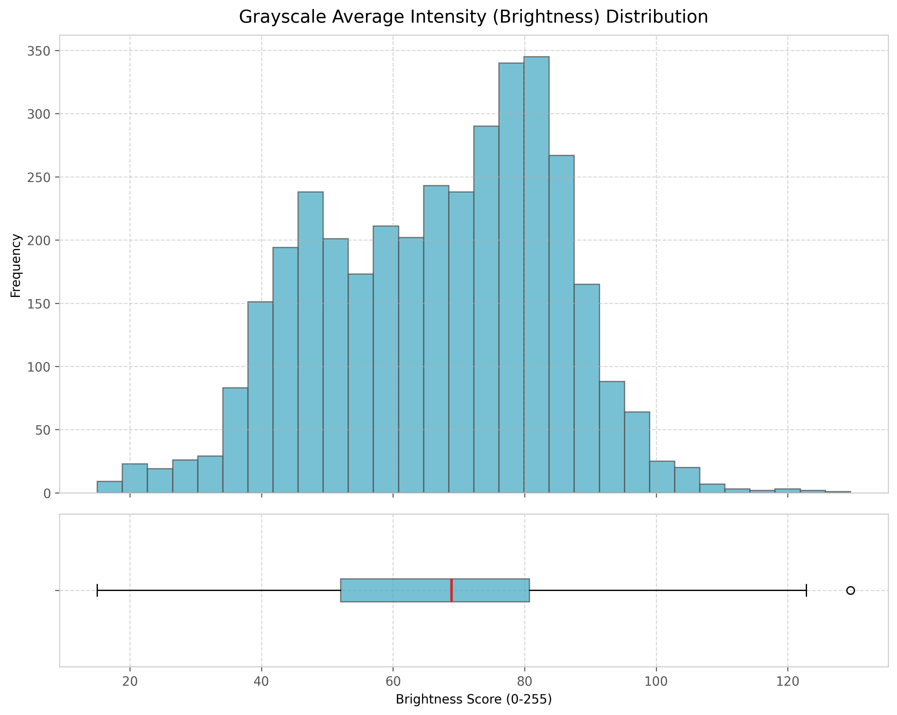
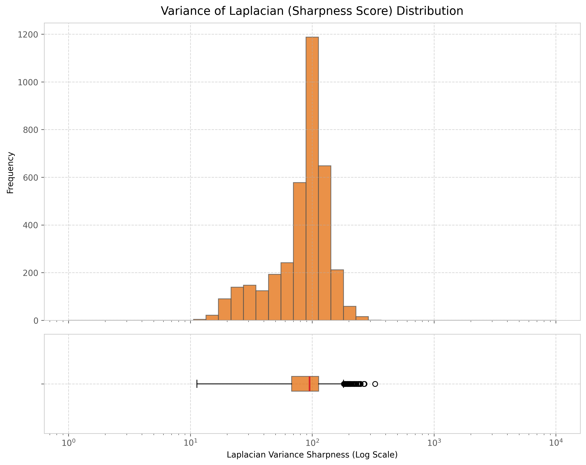
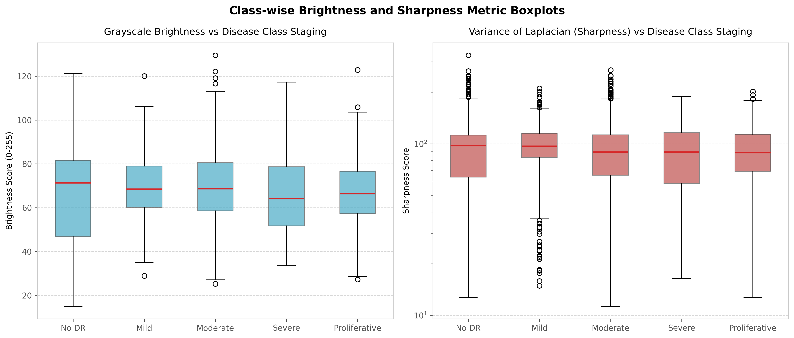

# Chapter 6: Quality Analysis

## Image Brightness Distribution
Grayscale average intensity (brightness) is calculated as the mean intensity across all pixels after converting the image to single-channel grayscale:

- **Global Average Brightness**: $63.21$ (on a $[0, 255]$ scale)
- **Brightness 5th Percentile**: $37.78$ (under-exposure threshold)
- **Brightness 95th Percentile**: $92.42$ (over-exposure threshold)

The lower average brightness primarily results from the dark background surrounding the circular retinal field, together with variability in illumination and camera acquisition settings.

---

## Sharpness Score (Laplacian Variance)
Sharpness is estimated using the **Variance of the Laplacian**, which calculates the second spatial derivative of the image intensity. Regions with sharp edges (high focus) yield high Laplacian variance, while blurred regions yield low variance:

$$\text{Sharpness Score} = \sigma^2(\nabla^2 I)$$

- **Global Average Sharpness**: $631.42$
- **Sharpness 5th Percentile**: $24.37$ (blurry outlier threshold)

Low sharpness scores indicate poor focus, defocus blur, motion blur, or optical distortion, which can obscure critical clinical features.

---

## Outlier Quality Flag Distributions
Using the 5th and 95th percentiles as thresholds, the pipeline flagged sub-optimal images for quality audits:

- **Dark Outliers ($\text{Brightness} < 37.78$)**: $5.02\%$ of images ($184$ files). These images may exhibit under-exposure, insufficient illumination, or thick ocular media (cataracts).
- **Bright Outliers ($\text{Brightness} > 92.42$)**: $5.02\%$ of images ($184$ files). These images are associated with over-exposure, flash artifacts, or reflection anomalies.
- **Blurry Outliers ($\text{Sharpness} < 24.37$)**: $5.02\%$ of images ($184$ files). These images may exhibit defocus blur, motion blur, or optical distortion.

*Note on Data Filtering*: Images were not removed from the dataset during the EDA phase. These quality flags are intended solely for diagnostic auditing and future training experimentation.

---

## Continuous Image Quality Score ($Q$)
A continuous Quality Score $Q \in [0, 1]$ is computed for each image as a weighted sum of normalized brightness, sharpness, and resolution:

$$Q = 0.4 \times Q_{\text{brightness}} + 0.3 \times Q_{\text{sharpness}} + 0.3 \times Q_{\text{resolution}}$$

The weighting coefficients were selected as heuristic engineering parameters to emphasize illumination quality while still incorporating spatial resolution and sharpness. These coefficients are not clinically validated and will be investigated in future ablation studies.

We formally define the bounding function as:
$$\text{clip}(x, a, b) = \max(a, \min(x, b))$$

The individual quality components are defined as:
- **Brightness Quality ($Q_{\text{brightness}}$)**:
  $$Q_{\text{brightness}} = \text{clip}\left(1.0 - \frac{|\text{brightness} - 120.0|}{120.0}, 0.0, 1.0\right)$$
  The target brightness value of 120 represents a mid-range grayscale intensity selected empirically to favor adequately exposed retinal images while penalizing severe under- and over-exposure.
- **Sharpness Quality ($Q_{\text{sharpness}}$)**:
  $$Q_{\text{sharpness}} = \text{clip}\left(\frac{\text{sharpness}}{\text{ref-sharpness}}, 0.0, 1.0\right)$$
  Where the sharpness is normalized by a reference sharpness ($\text{ref-sharpness} = 811.23$, matching the 75th percentile of the dataset).
- **Resolution Quality ($Q_{\text{resolution}}$)**:
  $$Q_{\text{resolution}} = \text{clip}\left(\frac{\text{width} \times \text{height}}{1024 \times 1024}, 0.0, 1.0\right)$$
  One megapixel ($1024 \times 1024$ pixels) was selected as a practical engineering reference because images above this resolution generally retain sufficient retinal detail for modern CNN architectures while avoiding excessive computational cost.

### Quantitative Quality Findings
Across the $3,662$ training images, the quality distribution shows:
- **Average Quality Score ($Q_{\text{avg}}$)**: $0.7332$
- **Quality Score Standard Deviation ($\sigma_Q$)**: $0.1458$

### Practical Engineering Applications
During baseline model development and training (Step 4), the quality score was not yet integrated directly into training loss calculations or sampling loops; it remains preserved as an experimental variable for future iterations. In subsequent optimization phases, these parameters can support:
- **Quality-Aware Gradient Weighting**: Low-quality images can be down-weighted or filtered to prevent noisy gradient updates.
- **Explainability Validation**: Quality scores will be cross-referenced with post-training Grad-CAM activation maps to verify whether image quality or blur artifacts bias the model's spatial attention boundaries.

### Visual Quality Distributions

*Figure 6.1: Distribution of average image brightness values.*

*Figure 6.2: Distribution of Laplacian variance scores.*

*Figure 6.3: Boxplots of brightness and sharpness across different severity stages.*

*Figure 6.4: Examples of dark, bright, blurry, and normal quality retinal scans.*
