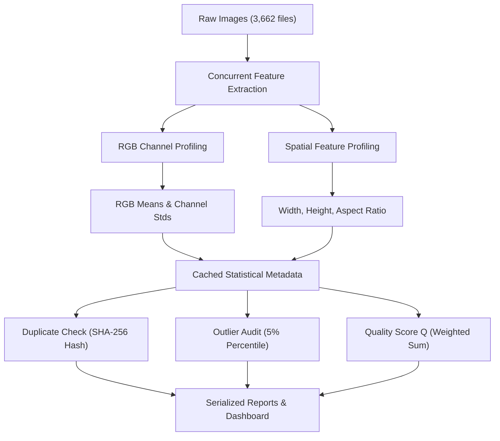

# Chapter 9: Step 3 Summary

This chapter summarizes the objectives achieved, quantitative results, files generated, and readiness of Step 3 for subsequent model development.

---

## Objectives Achieved
The Exploratory Data Analysis (EDA) phase for the Retina Module has been successfully completed:
- **Descriptive Statistics**: Analyzed resolution, file size, brightness, sharpness, and color distributions across $3,662$ images.
- **Colorimetric Profiling**: Calculated global and class-wise RGB channel averages.
- **Continuous Image Quality Assessment**: Designed and calculated a continuous Quality Score $Q \in [0, 1]$ based on brightness, sharpness, and resolution.
- **Duplicate Verification**: Scanned and flagged $134$ exact visual duplicate image pairs.
- **Automated Report Generation**: Created automated pipelines compiling vector PDF reports, Markdown summaries, and interactive notebooks.
- **Execution Manifest Generation**: Logged version metadata, execution duration, and dataset fingerprints in `manifest.json`.

---

## Quantitative Verification Summary
The primary quantitative metrics obtained during the automated EDA run are:

| Metric | Value |
| :--- | :---: |
| **Total Images** | $3,662$ |
| **Dataset Reproducibility Fingerprint** | `df10297...` |
| **Average Resolution** | $2015.18 \times 1526.83$ pixels |
| **Average Aspect Ratio** | $1.2831$ |
| **Average File Size** | $2,294.22$ KB |
| **Average Quality Score ($Q$)** | $0.7332$ |
| **Dataset RGB Mean (R, G, B)** | `(0.4216, 0.2238, 0.0722)` |
| **Detected Duplicate Pairs** | $134$ |
| **Imbalance Ratio** | $9.3523$ |
| **Dark Outlier Count (< 37.78)** | $184$ |
| **Bright Outlier Count (> 92.42)** | $184$ |
| **Blurry Outlier Count (< 24.37)** | $184$ |
| **Corrupted / Missing Files** | $0$ |
| **Execution Duration** | $77.27$ seconds |

---

## Deliverables Checklist

| Deliverable | Location | Status |
| :--- | :--- | :---: |
| **Descriptive CSV Statistics** | `datasets/metadata/eda_statistics.csv` | ✅ |
| **Descriptive Parquet Statistics** | `datasets/metadata/eda_statistics.parquet` | ✅ |
| **Quality Flags List** | `datasets/metadata/quality_flags.csv` | ✅ |
| **Visual Duplicate List** | `datasets/metadata/duplicate_images.csv` | ✅ |
| **Descriptive JSON Summary** | `datasets/metadata/eda_summary.json` | ✅ |
| **Preprocessing Guidelines** | `datasets/metadata/preprocessing_recommendations.json` | ✅ |
| **Publication Figures (14 files)** | `research/Volume_03_Exploratory_Data_Analysis/images/Fig_03_*` (PNG) | ✅ |
| **Summary Dashboard** | `results/retina/summary_dashboard.png` | ✅ |
| **PDF Summary Report** | `reports/retina_eda_summary.pdf` | ✅ |
| **Markdown Summary Report** | `reports/retina_eda_summary.md` | ✅ |
| **Jupyter Notebook** | `notebooks/retina/eda.ipynb` | ✅ |
| **Execution Manifest** | `results/retina/manifest.json` | ✅ |

---

## Engineering Contributions
- **Parallel Feature Extraction**: Developed a multi-threaded image scanning pipeline utilizing `ThreadPoolExecutor` and in-memory downscaling.
- **Continuous Image Quality Assessment**: Designed a normalized Quality Score ($Q$) integrating brightness, sharpness, and spatial resolution for downstream quality-aware experimentation.
- **Data Leakage Audit**: Implemented SHA-256 pixel hashing to detect and report exact visual duplicate pairs, enabling their removal or handling before future dataset splitting and model training.
- **Dataset Fingerprinting**: Implemented deterministic SHA-256 fingerprinting of dataset metadata to support experiment reproducibility and dataset integrity verification.
- **Cached Metadata Generation**: Eliminated repeated image scanning by serializing extracted statistics to CSV and optional Parquet formats.
- **Structured Reporting**: Automated generation of Markdown reports, PDF reports, research figures, and execution manifests to improve reproducibility.

---

## Pipeline Data Flow

The flowchart below shows the progression of data through the Phase 3 (EDA) pipeline:

*Figure 9.1: Phase 3 pipeline data flow.*

---

## Readiness for Step 4
With Step 3 complete and frozen, the project is ready for **Step 4 – Image Preprocessing**. Candidate preprocessing configurations have been established and will be evaluated during preprocessing and subsequent model training.
