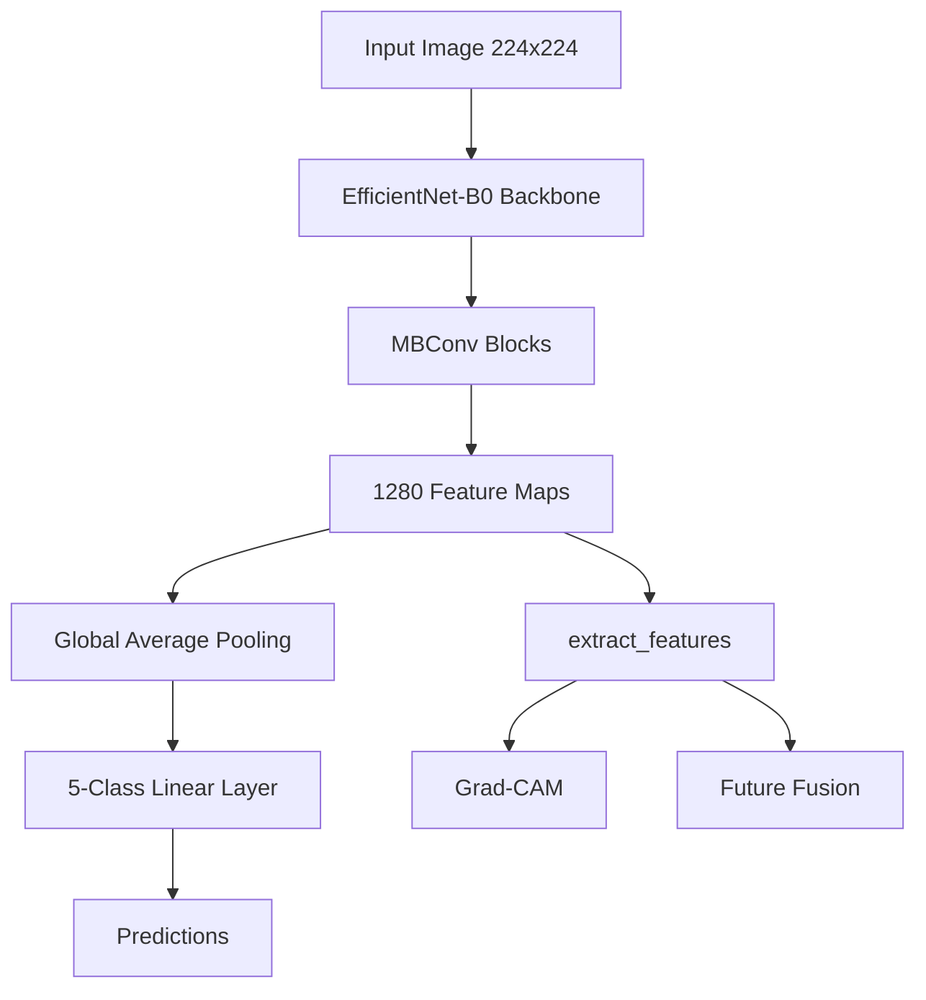

# Chapter 2: Baseline Model Selection

Selecting an appropriate baseline architecture is a critical step in developing a reliable medical image classification system. The baseline model should provide strong predictive performance while remaining computationally efficient, reproducible, and suitable for systematic comparison with more advanced architectures. Based on these criteria, **EfficientNet-B0** was selected as the baseline convolutional neural network for Diabetic Retinopathy severity classification.

## 2.1 Why EfficientNet-B0

The primary purpose of EfficientNet-B0 is to establish a **reference baseline** for subsequent experimental studies. Future phases of the project will compare this baseline against more advanced backbone architectures (including EfficientNet-B3, ConvNeXt, Swin Transformer, and Vision Transformer) using the same training framework and evaluation protocol.

EfficientNet-B0 was chosen because of its exceptional balance of performance and computational efficiency. Its lightweight design makes it suitable for rapid experimentation and future deployment on resource-constrained clinical systems. Furthermore, using the official `torchvision.models.efficientnet_b0` implementation reduces external dependencies and ensures long-term compatibility with the PyTorch ecosystem.

## 2.2 EfficientNet Architecture

EfficientNet-B0 is a convolutional neural network introduced by Tan and Le (2019) that achieves high classification performance through **Compound Scaling**, a principled strategy that uniformly scales network depth, width, and input resolution. Rather than arbitrarily increasing a single network dimension, EfficientNet balances all three dimensions simultaneously.

The network is constructed using **Mobile Inverted Bottleneck Convolution (MBConv)** blocks combined with **Squeeze-and-Excitation (SE)** attention modules. MBConv blocks reduce computational cost through depthwise separable convolutions, while SE blocks adaptively recalibrate channel-wise feature responses, enabling the network to emphasize diagnostically relevant retinal features.

## 2.3 Custom Wrapper Design

To ensure consistency across future backbone architectures, EfficientNet-B0 is encapsulated within a custom wrapper that inherits from the common `BaseClassifier` interface. This abstraction provides a standardized interface for forward inference, intermediate feature extraction, and parameter profiling. 

Consequently, new architectures can be integrated into the dynamic model factory with minimal changes to the surrounding training, evaluation, inference, and experiment management pipelines.

### Classifier Replacement

The network is initialized using ImageNet pretrained weights to leverage generic low-level visual representations (edges, textures). The original ImageNet classifier predicts 1000 object categories. Since the Retina Module performs five-class Diabetic Retinopathy severity classification, the final fully connected layer is replaced with a 5-class linear head.

This modification reduces the trainable parameter count from approximately **5.29 million** (ImageNet model) to **4.01 million (~15 MB)** for the Retina Module, while preserving the pretrained feature extraction backbone.

## 2.4 Feature Extraction

The wrapper exposes an `extract_features(x)` method that returns feature maps immediately before global average pooling. The output feature shape is `[batch_size, 1280, 7, 7]`.

These intermediate feature representations provide the foundation for several future components of the FusionMedAI framework:

1. **Grad-CAM explainability** (implemented in Volume 06).
2. **Future multimodal feature fusion** within the ACARA-U framework.
3. **Embedding extraction** for feature analysis and representation learning.

## 2.5 Architectural Advantages

The baseline EfficientNet-B0 implementation provides several practical advantages:
* Compact model size (~4.01 million trainable parameters).
* Efficient inference suitable for large-scale experimentation.
* Strong transfer learning capability through ImageNet pretraining.
* Seamless compatibility with the modular training framework.
* Straightforward extension to larger EfficientNet variants and alternative backbone architectures.
