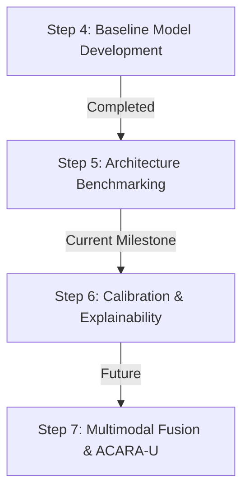

# Chapter 9: Step 4 Summary

Step 4 successfully established the baseline deep learning framework for the Retina Module of FusionMedAI. Rather than focusing on maximizing predictive performance, this phase concentrated on building a robust, reproducible, and modular research infrastructure that supports systematic experimentation and future model development.

## Major Achievements

Step 4 delivered:
- **Baseline framework**: Implemented EfficientNet-B0 with a common `BaseClassifier` interface.
- **Reproducible training pipeline**: Separated modules for training, validation, testing, optimization, and metrics.
- **Experiment management**: Centralized configuration, deterministic random seeds, versioning, and TensorBoard logging.
- **Verification**: Dedicated verification scripts to ensure infrastructure correctness prior to full training.

## Limitations and Future Work

While the baseline framework is highly stable, it was designed with intentional constraints that define the scope for future phases:

- **Input Resolution Constraints**: All images were resized to 224x224. Future studies will evaluate larger input resolutions (384x384, 512x512).
- **Baseline Preprocessing Strategy**: Advanced preprocessing (CLAHE, Ben Graham, circular cropping) was intentionally excluded to ensure a simple and reproducible baseline.
- **Image-Only Learning**: Multimodal integration (clinical metadata) is excluded from the baseline and will be introduced through the ACARA-U Fusion framework.

## Roadmap and Next Steps

This framework was subsequently used for:
- **Five-model benchmarking (Step 5)**, where EfficientNet-B0, EfficientNet-B3, ConvNeXt-Tiny, Swin-Tiny, and ViT-B/16 were systematically compared.

With the architecture benchmark complete, the current research roadmap transitions to:
- **Calibration**
- **Explainability (Grad-CAM)**
- **Uncertainty Estimation**
- **Multimodal Fusion**

