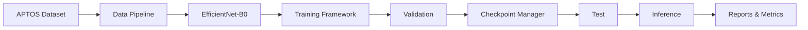

# Chapter 1: Introduction to Baseline Model Development

Step 4 of the FusionMedAI framework establishes the baseline deep learning framework for automated Diabetic Retinopathy (DR) severity classification using the APTOS 2019 Blindness Detection dataset. Building upon the verified dataset preparation (Step 1), modular data pipeline (Step 2), and exploratory data analysis (Step 3), this phase implements a reproducible and extensible PyTorch training framework centered on an EfficientNet-B0 baseline model.

Rather than optimizing for the highest classification accuracy, the primary objective of this phase is to construct a reliable research infrastructure that supports reproducible experimentation, systematic benchmarking, and future architectural comparisons. The framework integrates modular model definitions, configurable training and validation pipelines, comprehensive evaluation metrics, checkpoint management, experiment versioning, TensorBoard logging, inference utilities, and verification tools. These components provide a stable foundation for subsequent hyperparameter optimization, architecture comparison, explainability, calibration, and multimodal fusion.

## Objectives

1. **Baseline Model Development:** Implement EfficientNet-B0 as the reference convolutional neural network using ImageNet pretrained weights and adapt it for five-class Diabetic Retinopathy severity classification.

2. **Modular Training Framework:** Develop a reusable PyTorch framework with clearly separated modules for model definition, optimization, scheduling, training, validation, testing, inference, visualization, and experiment management.

3. **Reproducibility and Traceability:** Ensure deterministic execution through centralized configuration management, random seed control, experiment versioning, checkpoint metadata, TensorBoard logging, and comprehensive verification procedures.

4. **Comprehensive Evaluation:** Establish a standardized evaluation pipeline supporting clinically relevant metrics including Accuracy, Balanced Accuracy, Macro F1-score, Cohen's Kappa, Quadratic Weighted Kappa (QWK), Sensitivity, Specificity, ROC-AUC, confusion matrices, and inference performance measurements.

5. **Research Foundation:** Create a scalable experimental framework that enables fair comparison of future backbone architectures (EfficientNet-B3, ConvNeXt, Swin Transformer, Vision Transformer), advanced training strategies, explainability methods, uncertainty estimation, and multimodal FusionMedAI components.

## Overall Step 4 Architecture

