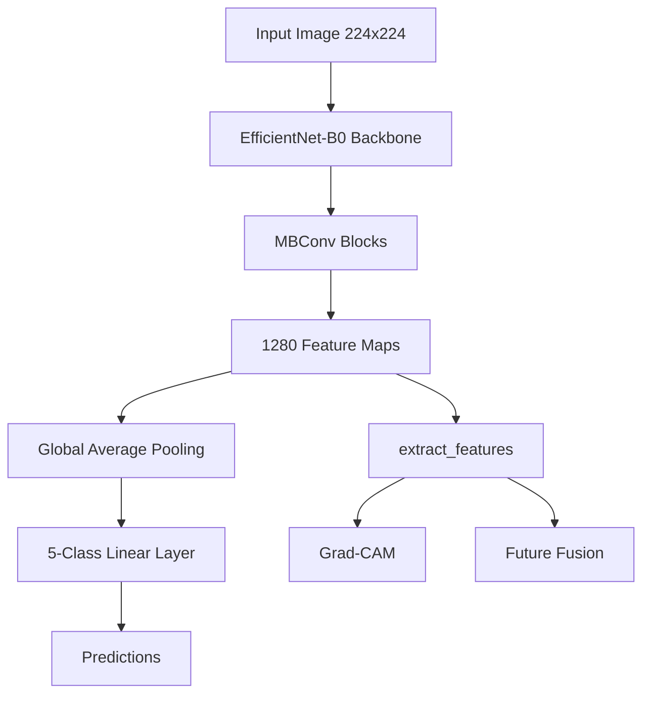

# Chapter 3: EfficientNet-B0 Architecture

EfficientNet-B0 is a convolutional neural network introduced by Tan and Le (2019) that achieves high classification performance through **Compound Scaling**, a principled strategy that uniformly scales network depth, width, and input resolution. Rather than arbitrarily increasing a single network dimension, EfficientNet balances all three dimensions simultaneously, resulting in an excellent trade-off between predictive performance and computational efficiency.

The network is constructed using **Mobile Inverted Bottleneck Convolution (MBConv)** blocks combined with **Squeeze-and-Excitation (SE)** attention modules. MBConv blocks reduce computational cost through depthwise separable convolutions, while SE blocks adaptively recalibrate channel-wise feature responses, enabling the network to emphasize diagnostically relevant retinal features.

For the baseline Retina Module, the official **`torchvision.models.efficientnet_b0`** implementation was adopted and initialized with ImageNet pretrained weights.

## Custom Wrapper Design

To ensure consistency across future backbone architectures, EfficientNet-B0 is encapsulated within a custom wrapper that inherits from the common `BaseClassifier` interface.

### Standardized Interface

The wrapper inherits from `BaseClassifier`, providing a consistent interface for:

* Forward inference
* Intermediate feature extraction
* Parameter profiling

This abstraction allows future architectures (EfficientNet-B3, ConvNeXt, Swin Transformer, Vision Transformer) to integrate into the same training framework without modifying the training or evaluation pipelines.

### Classifier Replacement

The original ImageNet classifier predicts **1000 object categories**. Since the Retina Module performs **five-class Diabetic Retinopathy severity classification**, the final fully connected layer is replaced with:

```python
nn.Linear(in_features, num_classes)
```

where:

* `in_features = 1280`
* `num_classes = 5`

This modification reduces the trainable parameter count from approximately **5.29 million** (ImageNet model) to **4.01 million** for the Retina Module while preserving the pretrained feature extraction backbone.

### Feature Extraction Support

The wrapper exposes an `extract_features(x)` method that returns feature maps immediately before global average pooling.

Output feature shape:

```text
[batch_size, 1280, 7, 7]
```

These intermediate feature representations provide the foundation for several future components of the FusionMedAI framework:

1. **Grad-CAM** for visual explainability of retinal lesion localization.
2. **Multimodal feature fusion** within the ACARA-U framework.
3. **Embedding extraction** for feature analysis and representation learning.

## EfficientNet Wrapper Architecture



## Architectural Advantages

The baseline EfficientNet-B0 implementation provides several practical advantages:

* Compact model size (~4.01 million trainable parameters, approximately 15 MB).
* Efficient inference suitable for large-scale experimentation.
* Strong transfer learning capability through ImageNet pretraining.
* Seamless compatibility with the modular training framework developed in Step 4.
* Straightforward extension to larger EfficientNet variants and alternative backbone architectures.

The combination of computational efficiency, transfer learning capability, and modular software design makes EfficientNet-B0 an appropriate baseline architecture for subsequent benchmarking and comparative evaluation.
