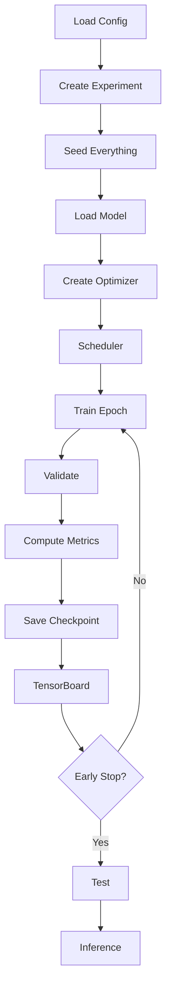

# Chapter 4: Training Pipeline Design

The baseline training framework is coordinated through a centralized `Trainer` class located in `src/training/trainer.py`. The trainer orchestrates the complete deep learning workflow, including experiment initialization, model optimization, validation, checkpoint management, metric logging, and experiment tracking. This centralized design separates training logic from model definitions and data loading, resulting in a modular and reusable framework suitable for future backbone architectures.

## Training Pipeline Workflow

The overall execution flow is illustrated below:

## Core Training Stages

### 1. Reproducibility Initialization

Before training begins, deterministic execution is established by initializing random seeds for Python, NumPy, and PyTorch. When CUDA is available, deterministic backend settings are also enabled to minimize experimental variability.

### 2. Experiment Initialization

Each execution automatically creates a versioned experiment directory (e.g., `v001`, `v002`, …). The complete configuration is exported to `config.json`, ensuring that every experiment can be reproduced exactly.

### 3. Model Construction

The selected architecture is instantiated through the model factory. For the baseline implementation, EfficientNet-B0 is initialized using ImageNet pretrained weights and configured for five-class Diabetic Retinopathy classification.

### 4. Optimizer and Learning Rate Scheduler

Training uses the AdamW optimizer together with the Cosine Annealing learning rate scheduler. The learning rate is updated after each epoch, and the current value is recorded for experiment tracking and analysis.

### 5. Training Epoch

Each epoch invokes `train_epoch()`, which performs:

* Forward propagation
* Loss computation
* Automatic Mixed Precision (AMP) using `torch.amp.autocast`
* Gradient scaling
* Backpropagation
* Optimizer update

Automatic Mixed Precision reduces computational cost while maintaining numerical stability on supported hardware.

### 6. Validation Epoch

After every training epoch, `validate_epoch()` evaluates the model on the validation dataset without gradient computation. Validation metrics include:

* Validation Loss
* Accuracy
* Balanced Accuracy
* Macro F1-score
* Quadratic Weighted Kappa (QWK)
* Sensitivity
* Specificity

ROC-AUC calculations are intentionally deferred to the final testing phase to reduce validation overhead.

### 7. Checkpoint Management

The checkpoint manager automatically stores:

* Best model checkpoint
* Latest model checkpoint
* Optimizer state
* Scheduler state
* Current epoch
* Training history
* Experiment metadata
* Configuration snapshot

The best model is selected according to the highest validation QWK.

### 8. Experiment Monitoring

Training progress is continuously recorded through:

* TensorBoard event logs
* `history.csv`
* `history.json`
* Training logs
* Experiment configuration files

These artifacts enable detailed analysis of model convergence and experimental reproducibility.

### 9. Early Stopping

Training terminates automatically when the validation QWK fails to improve for the configured patience period. This prevents unnecessary computation and reduces the risk of overfitting.

### 10. Testing and Inference

After training completes, the best checkpoint is evaluated on the held-out test dataset. The testing pipeline generates prediction files, confusion matrices, ROC curves, latency measurements, throughput statistics, and summary reports. The same framework also supports standalone single-image and batch inference through the dedicated inference module.
