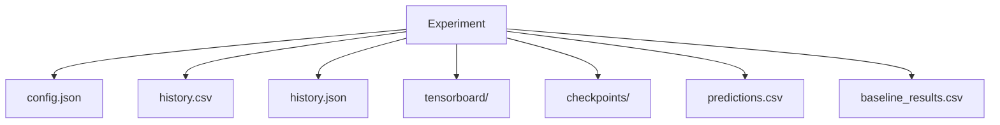
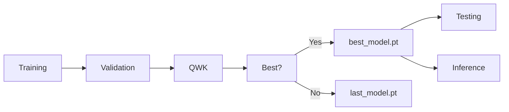

# Chapter 8: Model Checkpointing and Resuming

To ensure reproducible experimentation and fault-tolerant training, the baseline framework implements a comprehensive checkpoint management system. Each experiment automatically stores model checkpoints within its version-specific directory (e.g., `experiments/v001_efficientnet_b0/checkpoints/`, `experiments/v002_.../checkpoints/`). This design enables interrupted training sessions to be resumed while preserving the complete optimization state.

## Experiment Directory Structure

## Checkpoint Types

The framework automatically generates three checkpoint types:

1. **`last_model.pt`**

   * Updated at the end of every training epoch.
   * Represents the most recent training state.
   * Used for resuming interrupted experiments.

2. **`best_model.pt`**

   * Saved whenever the validation **Quadratic Weighted Kappa (QWK)** exceeds the previous best score.
   * Represents the best-performing model during training.
   * Used for final testing and inference.

3. **`epoch_X.pt`**

   * Optional periodic checkpoints (e.g., every 10 epochs).
   * Preserve historical model states for debugging, ablation studies, or recovery.

## Checkpoint Contents

Each checkpoint stores the complete training state required for exact experiment reproduction, including:

* Current epoch number
* Model parameters (`model_state_dict`)
* Optimizer state (`optimizer_state_dict`)
* Learning rate scheduler state (`scheduler_state_dict`)
* Training history
* Best validation metrics
* Current best epoch

In addition, reproducibility metadata is embedded within the checkpoint:

* Random seed
* Python version
* PyTorch version
* Torchvision version

The corresponding experiment configuration (`config.json`) is also copied into the checkpoint directory, ensuring that both model parameters and hyperparameter settings remain synchronized.

## Model Selection Strategy

Unlike conventional training pipelines that monitor validation loss alone, the Retina Module selects the best checkpoint using **Quadratic Weighted Kappa (QWK)**.

QWK is widely regarded as one of the most clinically relevant evaluation metrics for Diabetic Retinopathy severity grading because it accounts for the ordinal relationship between disease stages. Misclassifying a Mild case as Moderate is penalized less severely than predicting it as Proliferative DR, making QWK more representative of clinical decision-making than simple classification accuracy.

## Checkpoint Lifecycle

## Training Resumption

Because checkpoints preserve the complete optimization state, interrupted experiments can resume training without restarting from the beginning. The restored checkpoint includes:

* Model weights
* Optimizer momentum
* Scheduler progress
* Best validation metrics
* Experiment history

This guarantees continuity of optimization while maintaining reproducibility across repeated experimental runs.

## Design Considerations

The checkpoint framework was designed to provide:

* Reliable recovery from interrupted training.
* Experiment reproducibility.
* Consistent deployment of the best-performing model.
* Support for long-running experiments and future architecture comparisons.

By separating checkpoint management into a dedicated module, the training framework remains modular and easily extensible for subsequent research phases.
