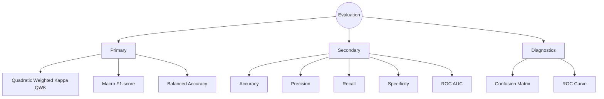

# Chapter 9: Evaluation Metrics

Evaluating Diabetic Retinopathy (DR) severity classification requires more than conventional accuracy because the dataset exhibits class imbalance and the disease stages follow an **ordinal progression**. Consequently, the baseline evaluation framework employs multiple complementary metrics to measure classification performance from different perspectives.

The implemented metrics provide a comprehensive assessment of overall performance, minority-class behavior, clinical relevance, and prediction consistency.

## Metric Hierarchy

## Primary Evaluation Metrics

### 1. Quadratic Weighted Kappa (QWK)

Quadratic Weighted Kappa (QWK) is the **primary evaluation metric** for the Retina Module and serves as the model selection criterion during training.

Unlike standard accuracy, QWK accounts for the ordinal relationship between disease stages by assigning larger penalties to predictions that are farther from the true class. For example, predicting **Proliferative DR** for a **No DR** image is penalized much more heavily than predicting **Mild DR**.

Because disease severity progresses gradually, QWK provides a clinically meaningful measure of agreement between predicted and true labels and is widely reported in diabetic retinopathy benchmark studies.

### 2. Macro F1-Score

Macro F1-score computes the harmonic mean of Precision and Recall independently for each class before averaging across all classes.

Since every class contributes equally, Macro F1 prevents the majority class from dominating the evaluation and provides a more balanced assessment of performance on minority disease stages.

### 3. Balanced Accuracy

Balanced Accuracy represents the average recall across all classes.

This metric compensates for class imbalance by ensuring that each disease stage contributes equally to the final score, regardless of the number of available training samples.

### 4. Confusion Matrix

The confusion matrix provides a detailed visualization of class-wise prediction behavior.

It enables identification of systematic misclassification patterns, such as confusion between adjacent disease stages, and supports qualitative analysis of model strengths and weaknesses.

## Secondary Evaluation Metrics

The framework additionally reports several complementary performance measures:

* **Accuracy** – Overall percentage of correctly classified images.
* **Precision (Macro)** – Reliability of positive predictions across all classes.
* **Recall (Sensitivity)** – Ability to correctly identify each disease stage.
* **Specificity** – Ability to correctly identify negative instances for each class.
* **ROC AUC (One-vs-Rest Macro)** – Measures the discriminative ability of the classifier across all classes.

To minimize computational overhead during training, ROC-AUC is calculated only during the final testing phase rather than after every validation epoch.

## Evaluation Strategy

The evaluation framework follows a hierarchical strategy:

* **Primary optimization metric:** Quadratic Weighted Kappa (QWK)
* **Secondary monitoring metrics:** Macro F1-score and Balanced Accuracy
* **Diagnostic metrics:** Confusion Matrix, ROC curves, Precision, Recall, Specificity, and Accuracy

This combination provides both quantitative performance assessment and qualitative insight into model behavior, establishing a robust benchmark for future architecture comparisons and clinical evaluation.
