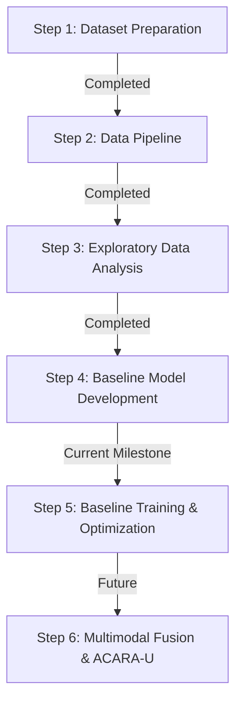

# Chapter 13: Step 4 Summary

Step 4 successfully established the baseline deep learning framework for the Retina Module of FusionMedAI. Rather than focusing on maximizing predictive performance, this phase concentrated on building a robust, reproducible, and modular research infrastructure that supports systematic experimentation and future model development.

The completed framework integrates EfficientNet-B0 with a comprehensive PyTorch training pipeline, standardized evaluation metrics, experiment tracking, checkpoint management, inference utilities, and automated verification. Together, these components provide a stable foundation for subsequent baseline training and comparative research.

## Major Achievements

### Baseline Architecture

* Implemented EfficientNet-B0 using official `torchvision` pretrained weights.
* Developed a common `BaseClassifier` interface to support future backbone architectures.
* Implemented a dynamic model factory for configuration-driven model selection.
* Added intermediate feature extraction to support future Grad-CAM visualization and multimodal feature fusion.

### Modular Training Framework

* Developed separate modules for training, validation, testing, optimization, scheduling, metrics, checkpointing, and visualization.
* Integrated Automatic Mixed Precision (AMP) using the modern `torch.amp` API.
* Implemented Early Stopping based on validation Quadratic Weighted Kappa (QWK).

### Reproducibility and Experiment Management

* Centralized configuration management.
* Random seed control for deterministic execution.
* Automatic experiment versioning.
* Configuration export for every experiment.
* Environment metadata stored with checkpoints.
* TensorBoard integration.
* Training history exported as CSV and JSON.

### Evaluation and Inference

* Implemented comprehensive evaluation metrics including QWK, Macro F1-score, Balanced Accuracy, Sensitivity, Specificity, ROC-AUC, and Confusion Matrix.
* Developed a standalone inference module supporting both single-image and batch prediction.
* Added inference latency and throughput measurement.

### Verification Framework

The baseline framework was successfully validated through dedicated verification scripts:

* `verify_model.py`
* `verify_training.py`
* `verify_checkpoint.py`

These scripts confirmed correct model initialization, forward propagation, gradient computation, optimizer updates, learning rate scheduling, checkpoint restoration, and overall pipeline integrity.

## Step 4 Outcome

The Retina Module now possesses a complete, reproducible, and extensible deep learning framework capable of supporting large-scale experimentation. The infrastructure developed during this phase enables future research without requiring further architectural redesign.

The baseline framework is now ready for:

* Full baseline training on the APTOS 2019 dataset.
* Hyperparameter optimization.
* Comparative evaluation of alternative backbone architectures.
* Explainability through Grad-CAM.
* Calibration and uncertainty estimation.
* Integration with the Foot Ulcer Module and the multimodal ACARA-U Fusion framework.

Step 4 therefore marks the transition from software engineering and framework development to systematic experimental research in the subsequent phases of the FusionMedAI project.

## Project Progress

