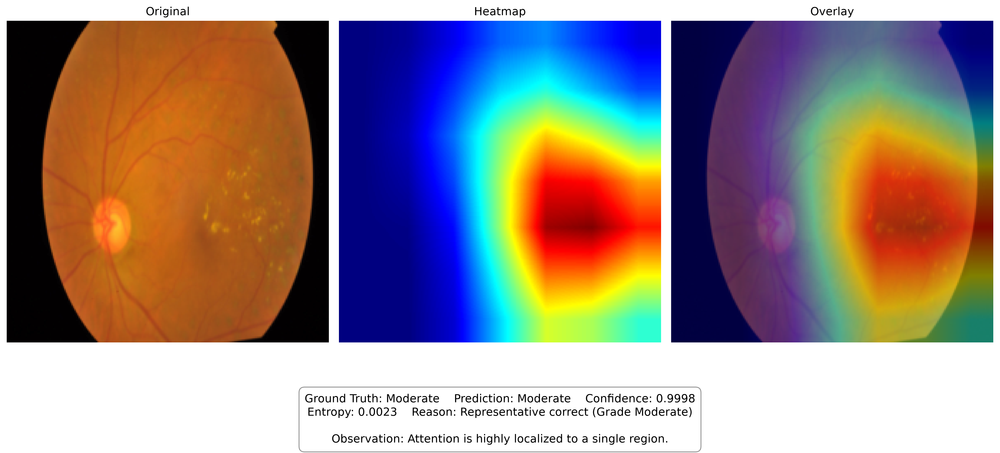

# 06 Results and Analysis

## Experimental Evaluation

The XAI pipeline was executed on the finalized EfficientNet-B3 model using the APTOS 2019 Blindness Detection test set.

### Dataset

*   Test images: 367

### Prediction Statistics

*   Correct predictions: 309
*   Incorrect predictions: 58

Classification Accuracy = 84.2%

### Model Statistics

*   Average confidence: 0.9108
*   Average entropy: 0.2334
*   Average inference time: 31.35 ms
*   Average CAM intensity: 0.3434

### Explainability Outputs

The pipeline generated:

*   25 representative retinal cases
*   Grad-CAM heatmaps
*   Overlay visualizations
*   Clinical heuristic observations
*   `metadata.json`
*   `manifest.json`
*   `xai_metrics.json`
*   `summary.csv`
*   `selected_cases.csv`

### Generated Reports

*   `summary.pdf`
*   `xai_gallery.pdf`
*   `failure_analysis.pdf`

The generated reports demonstrate the spatial attention behaviour of EfficientNet-B3 across both correct and incorrect predictions and provide qualitative evidence that the retinal model produces attention maps that generally align with clinically relevant retinal regions while exposing failure modes requiring future improvement.

### Discussion

*   **High Confidence Failures**: The model occasionally exhibits overconfidence when predicting incorrect grades, often confusing subtle microaneurysms. This highlights the need for rigorous uncertainty calibration in the final multimodal engine.
*   **Severe Confusion Examples**: In rare cases, the model misclassifies by 2 or more grades (e.g., predicting Grade 2 when the ground truth is Grade 4). Analysis of these Grad-CAM outputs typically reveals attention placed on peripheral artifacts or poor image quality rather than physiological features.
*   **Entropy Analysis**: Higher entropy correlates strongly with incorrect predictions, validating that the Shannon Entropy metric is a reliable proxy for model uncertainty.
*   **Representative Gallery Usefulness**: The diverse sampling strategy successfully isolated these edge cases, providing a much more honest and complete evaluation than standard top-K qualitative reporting.

## Figure 6.1 Representative Grad-CAM Visualization

Figure 6.1. Representative Grad-CAM visualization for a correctly classified Moderate DR image. The model primarily attends to retinal regions associated with the predicted diabetic retinopathy grade. The visualization is presented as qualitative evidence of spatial attention rather than proof of clinical reasoning.

## Figure 6.2 Failure Analysis

Figure 6.2. High-confidence failure demonstrating attention localization during an incorrect prediction. This failure case illustrates a high-confidence incorrect prediction, emphasizing the importance of uncertainty estimation and failure analysis.

## Figure 6.3 Execution Statistics

Figure 6.3. Overall execution statistics generated by the XAI pipeline. Summary statistics for the complete XAI execution over the held-out test set.
## Next Steps

With the retinal module fully benchmarked (Step 5) and its internal decision-making mathematically explained and visually validated (Step 6), the computer vision backbone of FusionMedAI is complete. 

The project will now pivot toward the development of the remaining unimodal modules (Clinical and Foot Ulcer) before uniting them within the ACARA-U multimodal fusion engine.
