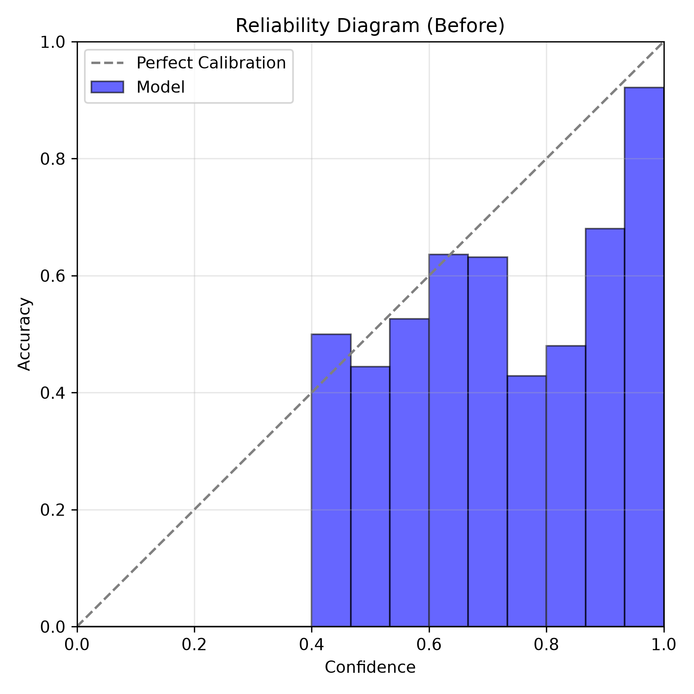
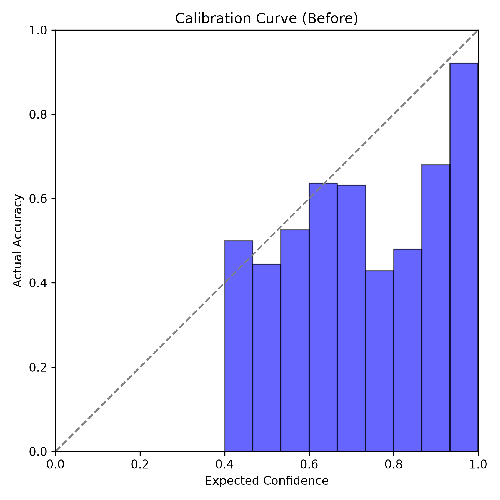
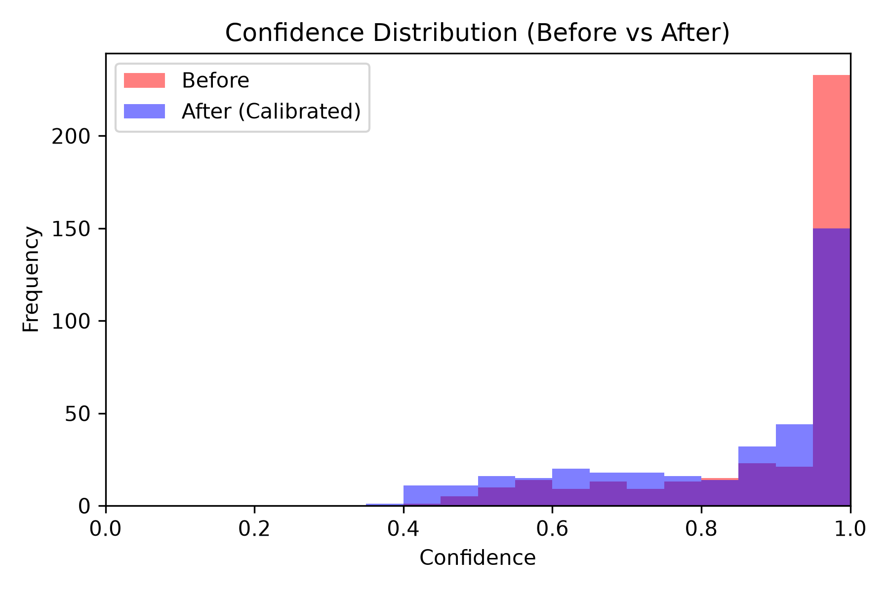
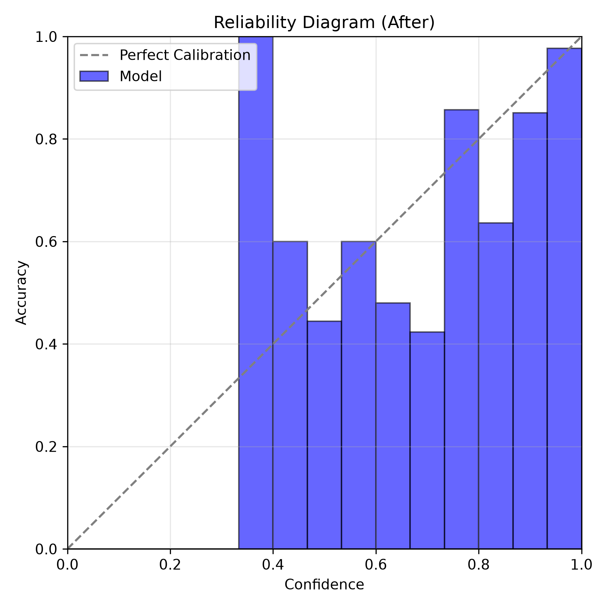
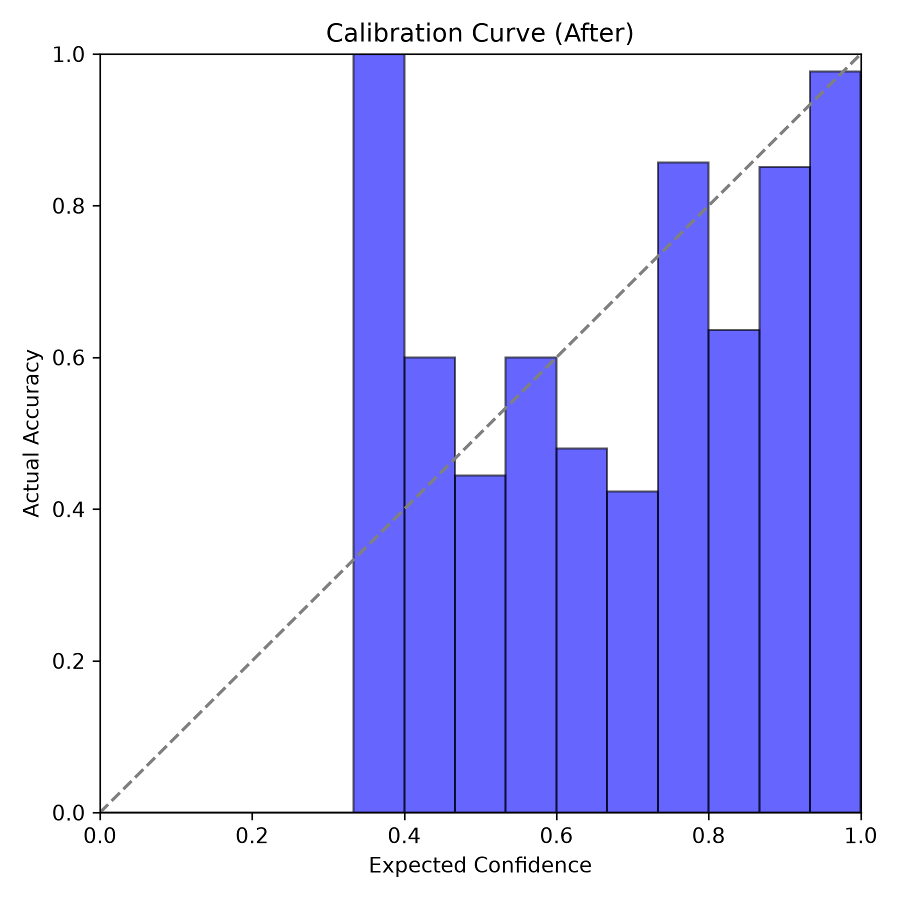

# 4. Reliability Diagrams

Reliability diagrams visually represent how well-calibrated a model is by plotting the expected sample accuracy within a given confidence bin against the average confidence of that bin.

## Before Calibration

Before calibration, we can observe that the model's confidence frequently exceeds its actual accuracy (the blue bars fall below the dotted perfect calibration line). This visually confirms the model is overconfident.

## After Calibration

After calibration via Temperature Scaling, the confidence and accuracy match closely. The blue bars align much more closely with the perfect calibration diagonal, demonstrating that the calibrated probabilities are highly reliable. The subplot displaying the bin counts helps highlight regions of sparse data, offering a more nuanced view of the model's calibration limits in low-frequency confidence bins.
