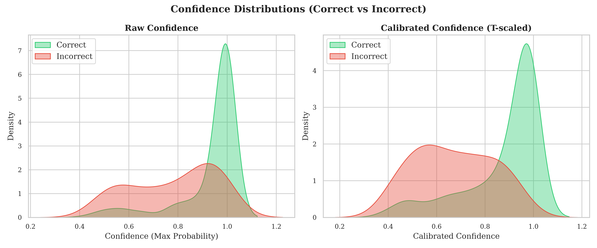
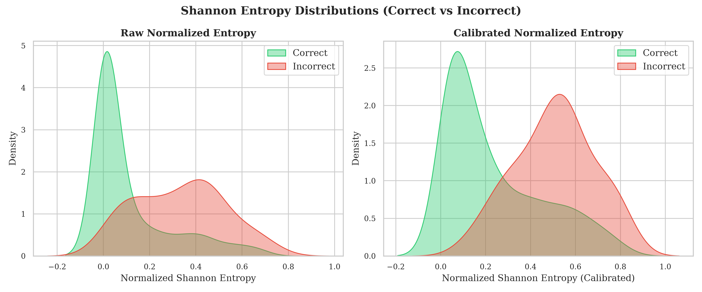
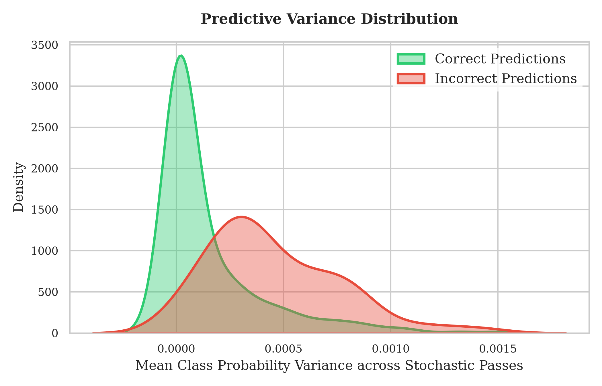
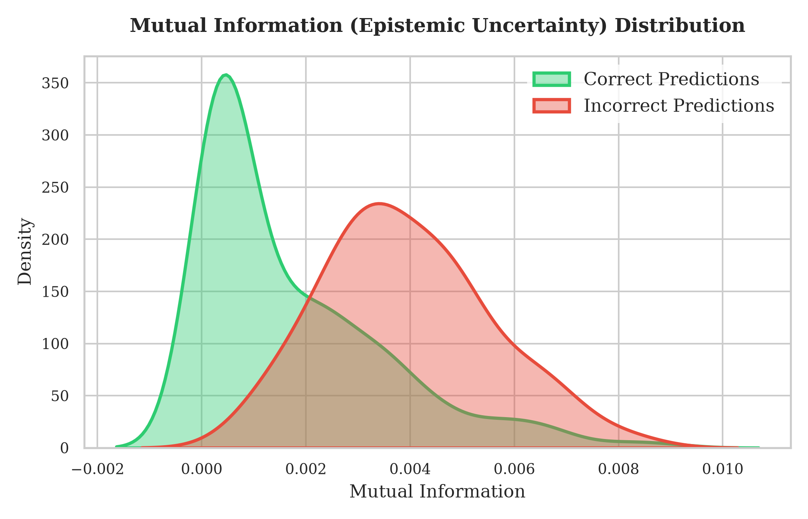
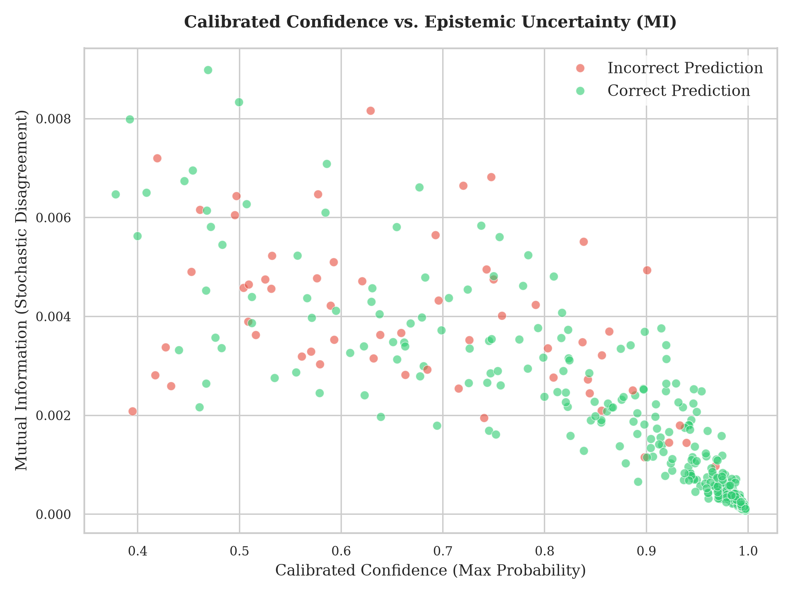
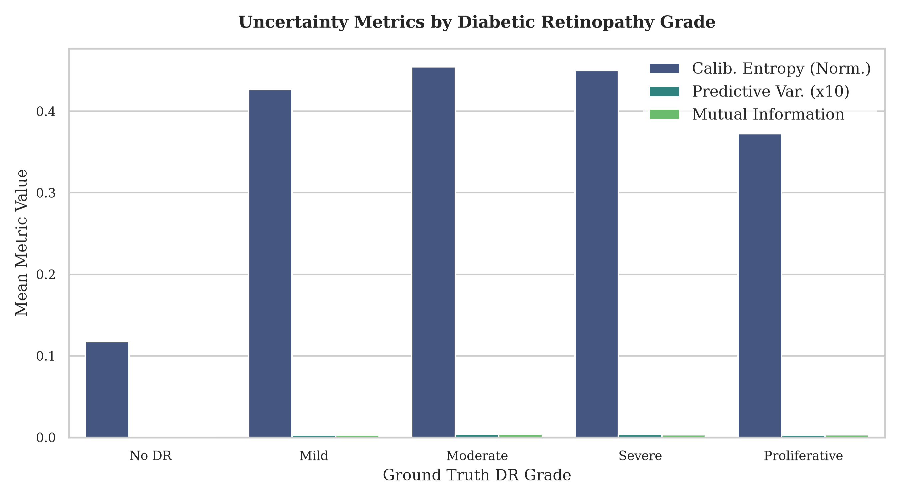
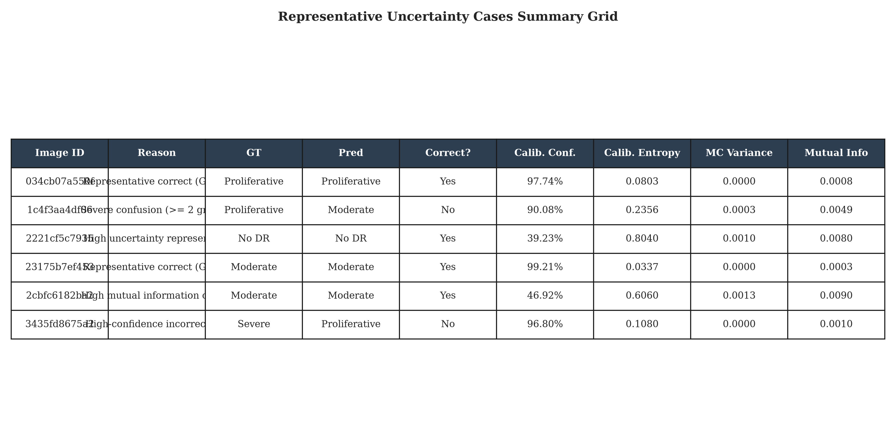
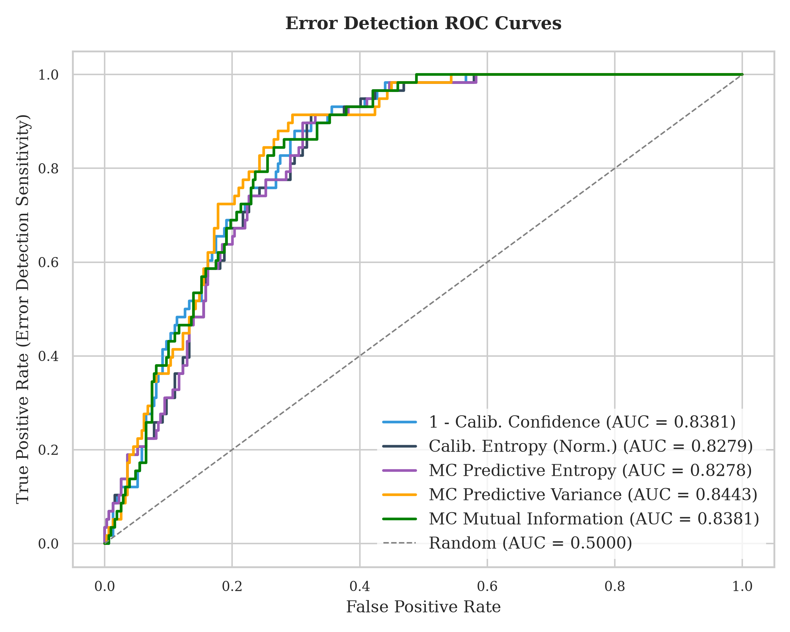
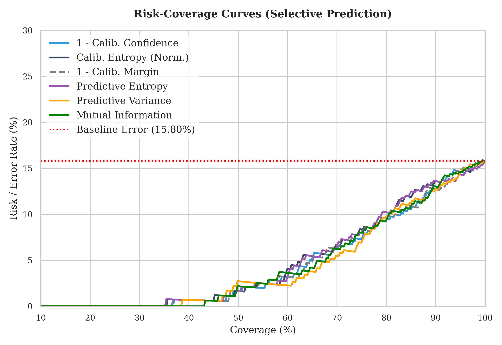
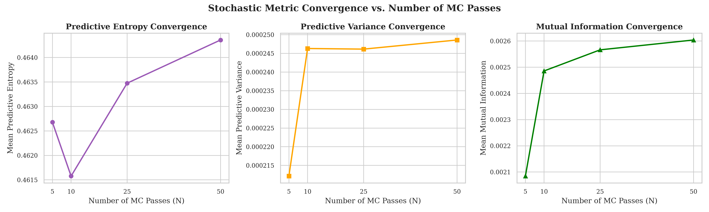

# 5. Experimental Results

This chapter presents the quantitative results from the prediction uncertainty estimation experiments on the APTOS test split.

---

## 5.1 Calibration and Checkpoint Verification

Before running inference, the dynamic calibration verification process confirmed:
- **Learned Temperature ($T$)**: `1.6218`
- **Calibration Source**: `experiments/calibration/v004_temperature_scaling`
- **Target Checkpoint**: `experiments/efficientnet_b3/checkpoints/best_model.pt`
- **Integrity Status**: Passed. Checkpoint SHA256 matches the hash of the validation calibration checkpoint.

---

## 5.2 Programmatic Dropout and Sanity Validation

Programmatic discovery identified the active dropout layer:
- **Layer Name**: `backbone.classifier.0`
- **Dropout Rate ($p$)**: `0.3`
- **Mode**: Set to `.train()` during inference, with the remainder of the model in `.eval()`.

The mandatory 5-pass stochasticity validation check on 5 sample images succeeded:
- **Sanity Validation Variance**: `1.5395e-4`
- **Sanity Validation Probability Std**: `0.00767`
- **Logs Status**: Logged to `results/uncertainty/mc_dropout_validation.json`. The non-zero variance confirmed that stochastic passes produce differing predictions, validating the MC pipeline.

---

## 5.3 Deterministic baseline vs. Stochastic Uncertainty Distributions

We compared the distribution of uncertainty proxies and metrics between correct and incorrect predictions:

### 5.3.1 Correct vs. Incorrect Comparison

| Subset | Sample Count | Mean Calib. Confidence | Std Calib. Confidence | Mean Calib. Entropy (Norm) | Mean MC Variance | Mean Mutual Info |
| :--- | :---: | :---: | :---: | :---: | :---: | :---: |
| **Correct Predictions** | 309 | 87.58% | 15.70% | 0.2359 | 1.4638e-4 | 0.00171 |
| **Incorrect Predictions** | 58 | 67.02% | 16.03% | 0.5060 | 4.5337e-4 | 0.00394 |

### 5.3.2 Analysis
The results demonstrate the expected clinical patterns:
- **Calibrated Confidence**: Correct predictions have significantly higher mean confidence (87.58%) than incorrect predictions (67.02%).
- **Calibrated Entropy**: Incorrect predictions exhibit more than double the mean calibrated entropy (0.5060) of correct ones (0.2359), indicating that failure cases are accompanied by model hesitation.
- **Stochastic Disagreement**: Incorrect predictions have three times higher mean MC variance (4.5337e-4) and over double the mutual information (0.00394) of correct predictions, reflecting parameter instability on incorrect cases.

### 5.3.3 Visual Distributions
Below are the probability density distributions of confidence, entropy, variance, and mutual information comparing correct and incorrect predictions:

---

## 5.4 Error Detection Performance

We evaluated the capacity of different uncertainty indicators to detect prediction errors (`is_incorrect == 1`).

| Method | AUROC | AUPRC | AURC | E-AURC |
| :--- | :---: | :---: | :---: | :---: |
| **1 - Calibrated Confidence** | 0.8381 | 0.3863 | 0.0418 | 0.0284 |
| **Calibrated Entropy (Norm)** | 0.8279 | **0.4087** | 0.0437 | 0.0303 |
| **1 - Calibrated Margin** | 0.8381 | 0.4014 | 0.0418 | 0.0284 |
| **MC Predictive Entropy** | 0.8278 | 0.4067 | 0.0437 | 0.0303 |
| **MC Predictive Variance** | **0.8443** | 0.3941 | **0.0406** | **0.0272** |
| **MC Mutual Information** | 0.8381 | 0.3790 | 0.0416 | 0.0282 |

### 5.4.1 Highlights
- **Stochastic Superiority**: **MC Predictive Variance** achieved the highest overall failure detection performance with an **AUROC of 0.8443** and the lowest Area Under the Risk-Coverage Curve (AURC) of **0.0406** (Excess AURC of 0.0272).
- **Calibrated Entropy Performance**: **Calibrated Entropy (Norm)** achieved the highest Precision-Recall Area Under Curve (**AUPRC of 0.4087**), indicating high sensitivity in catching errors.
- **Deterministic Baseline Competitiveness**: Standard calibrated confidence ($1 - C$) remains extremely competitive, achieving an **AUROC of 0.8381** and an AURC of **0.0418**, demonstrating that post-hoc temperature scaling provides a strong, compute-efficient baseline.

### 5.4.2 Error Detection ROC Curves
Below are the Receiver Operating Characteristic (ROC) curves evaluating the error detection capability of deterministic proxies vs. stochastic metrics:

---

## 5.5 Selective Prediction Milestones

We mapped the error rate (risk) as a function of coverage (fraction of samples retained) by rejecting the most uncertain predictions first.

| Method | Risk @ 100% Coverage | Risk @ 90% Coverage | Risk @ 80% Coverage | Risk @ 70% Coverage | Risk @ 50% Coverage |
| :--- | :---: | :---: | :---: | :---: | :---: |
| **1 - Calibrated Confidence** | 15.80% | 12.73% | **9.52%** | 6.23% | **1.63%** |
| **Calibrated Entropy (Norm)** | 15.80% | 13.64% | 10.20% | 6.61% | **1.63%** |
| **1 - Calibrated Margin** | 15.80% | 12.73% | 9.86% | 6.61% | **1.63%** |
| **MC Predictive Entropy** | 15.80% | 13.64% | 10.20% | 6.61% | **1.63%** |
| **MC Predictive Variance** | 15.80% | 12.73% | 9.86% | **5.45%** | 2.72% |
| **MC Mutual Information** | 15.80% | 13.03% | **9.52%** | 6.23% | 2.17% |

### 5.5.1 Analysis
- **Monotonic Risk Reduction**: For all methods, reducing the coverage level leads to a significant decrease in the remaining risk (error rate).
- **High Retention Performance**: At 70% coverage, **MC Predictive Variance** achieves the lowest error rate of **5.45%** (a 65.5% reduction from the baseline risk of 15.80%).
- **Low Coverage Safety**: At 50% coverage, **Calibrated Confidence** reduces the remaining error rate to just **1.63%** (a 89.7% reduction from the baseline risk), demonstrating that the model can be used almost error-free if allowed to refer 50% of the cases.

### 5.5.2 Selective Prediction Curves
Below are the risk-coverage curves showing the relationship between automated decision coverage and remaining risk:

---

## 5.6 MC Passes Convergence Analysis

We evaluated the stability of the stochastic uncertainty metrics on a subset of 50 images for $N \in \{5, 10, 25, 50\}$.

- **Stochastic Metrics Standard Deviation**: Standard metrics (Predictive Entropy, Variance, MI) stabilized rapidly as $N$ increased.
- **Metric Mean Differences ($N=25$ vs $N=50$)**:
  - Mean Absolute Difference in Predictive Entropy: `0.004123`
  - Mean Absolute Difference in Predictive Variance: `1.2395e-5`
  - Mean Absolute Difference in Mutual Information: `0.000392`
- **Conclusion**: The convergence analysis confirms that the uncertainty estimates show negligible additional stabilization beyond $N=25$. Increasing $N$ to 50 provides minor gains in precision at the cost of doubling the computation, justifying the selection of $N=25$ as the baseline configuration for our research.

### 5.6.1 Convergence Stabilization Curves
Below are the line plots showing the stabilization of MC predictive metrics as a function of the number of stochastic passes:

