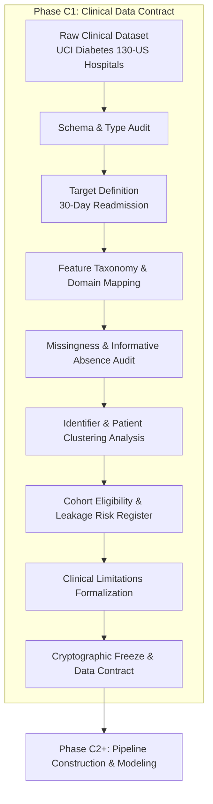

# Phase C1 — Dataset & Clinical Task Audit: Introduction

## 1. Scope & Executive Context

The Clinical Module of the **FusionMedAI** research framework provides structured electronic health record (EHR) risk assessment for diabetic patients. In the overall multimodal architecture, this module acts as a decision-level tabular modality alongside the Retina (fundus imaging) and Foot Ulcer (photographic ulcer grading) pipelines. Modality predictions, uncertainties, and calibrated risk distributions are designed to converge downstream in the **ACARA-U** (Adaptive Calibrated Architecture for Risk Assessment under Uncertainty) multimodal fusion engine.

Phase C1 establishes a frozen, auditable specification of the clinical data foundation before any feature engineering, transformation, imputation, or predictive modeling is initiated.

---

## 2. Core Audit Objectives

The audit addresses ten fundamental questions required for reproducible, leak-free, clinically grounded AI:

1. **Dataset Provenance**: What exact EHR dataset is being analyzed, under what institutional authority was it extracted, and what are its exact source specifications?
2. **Unit of Observation**: What is an encounter versus a patient, and how does encounter-level clustering affect statistical independence?
3. **Prediction Target**: What is the exact clinical outcome supported by the data, and how is it mathematically formulated for risk assessment?
4. **Feature Availability**: Which variables are genuinely available in raw form, and what are their semantic definitions?
5. **Missingness Representation**: How is missingness encoded across different variables (e.g., `'?'` vs `'None'` vs administrative IDs), and why is missingness itself informative?
6. **Variable Taxonomy**: Which variables represent identifiers, demographics, admission contexts, hospital utilization, laboratory results, diagnoses, and medication regimens?
7. **Identifier Discipline**: How must identifier fields (`encounter_id`, `patient_nbr`) be handled during modeling and splitting?
8. **Cohort Eligibility & Leakage Risks**: Which variables or data structures require cohort filtering (e.g., expired/hospice cases) or could break train/validation/test isolation?
9. **Clinical & Epidemiological Limitations**: What systematic biases, unmeasured confounders, and structural boundaries must be transparently disclosed in research publications?
10. **Dataset Fingerprint**: What exact cryptographic hashes (SHA-256) and environmental configurations freeze this dataset against silent drift?

---

## 3. Guiding Audit Principles

Phase C1 enforces four foundational principles:

### Principle I: Strict Pre-Modeling Isolation
No imputation, encoding, one-hot transformation, scaling, or model fitting is permitted during Phase C1. The raw dataset must be audited in its natural, untransformed state.

### Principle II: Informative Missingness Preservation
In clinical medicine, diagnostic and therapeutic tests are not ordered at random (Missing Not At Random — MNAR). For example, ordering an HbA1c test or a serum glucose test reflects clinical judgment regarding patient acuity. Blindly imputing missing values (or conflating `'None'` with missingness) destroys this clinical signal.

### Principle III: Separation of Concerns
Each document in this audit owns a distinct analytical scope:
- `03_schema_audit.md` answers: *"What is this column?"*
- `07_identifier_analysis.md` answers: *"Should this column participate in modeling?"*
- `08_leakage_risk_register.md` answers: *"Could this column expose information unavailable at prediction time or distort cohort eligibility?"*

### Principle IV: Cryptographic Determinism
All artifacts, file sizes, row counts, column counts, and checksums are deterministically verified via automated unit verification (`verification/clinical/data/verify_dataset_audit.py`).

---

## 4. Phase C1 Verification Gate Standards

Phase C1 concludes with a formal 11-point gate:

| Gate Check | Evaluation Criterion | Target Status |
| :--- | :--- | :---: |
| **Dataset identity** | Verification of UCI Diabetes 130-US Hospitals (1999–2008) source | **PASS** |
| **Dataset integrity** | 101,766 rows, 50 columns: 47 predictive attributes + 2 identifiers + 1 target | **PASS** |
| **Schema verified** | 50/50 column dtypes, unique value counts, zero-variance columns audited | **PASS** |
| **Target frozen** | Exact 3-class distribution and binary 30-day early readmission definition | **PASS** |
| **Feature taxonomy** | Partition of 50 columns into 9 clinical/operational domains | **PASS** |
| **Missingness documented** | Explicit mapping of `'?'`, `'None'`, and administrative missingness codes | **PASS** |
| **Identifiers classified** | Classification of `encounter_id` and `patient_nbr`; repeat clustering documented | **PASS** |
| **Leakage candidates identified** | Register of expired/hospice structural determinism, patient overlap, and chronology | **PASS** |
| **Clinical limitations** | Explicit cataloging of EHR observational biases for paper publication | **PASS** |
| **Dataset fingerprint frozen** | Deterministic SHA-256 hashes computed and frozen | **PASS** |
| **Reproducibility** | Automated Python verification test runs and passes with exit code 0 | **PASS** |
| **C1 OVERALL STATUS** | **All 11 gates evaluated as PASS** | **PASS** |
