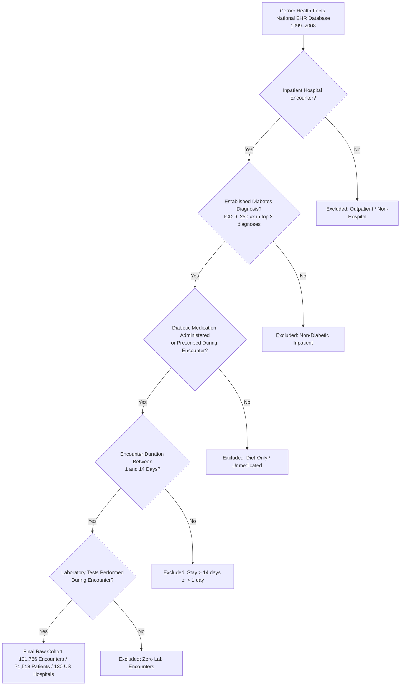

# Phase C1 — Dataset & Clinical Task Audit: Dataset Source & Provenance

## 1. Primary Source Identity

The clinical modality of **FusionMedAI** utilizes the **Diabetes 130-US Hospitals (1999–2008)** dataset, hosted on the UCI Machine Learning Repository and originally published in peer-reviewed clinical informatics literature.

- **Dataset Identifier**: UCI Machine Learning Repository — Diabetes 130-US Hospitals for Years 1999–2008
- **Original Source Database**: Health Facts database (Cerner Corporation, Kansas City, MO, USA)
- **Primary Publication Citation**:
  > Strack, B., DeShazo, J. P., Gennings, C., Olmo, J. L., Ventura, S., Cios, K. J., & Clore, J. N. (2014). *Impact of HbA1c Measurement on Hospital Readmission Rates: Analysis of 70,000 Clinical Database Patient Records*. BioMed Research International, vol. 2014, Article ID 781670, 11 pages. [DOI: 10.1155/2014/781670](https://doi.org/10.1155/2014/781670)

---

## 2. Ingestion & Inclusion Criteria

The raw dataset was extracted from Cerner Health Facts according to specific clinical and operational inclusion criteria:

### Exact Inclusion Rule Summary:
1. **Encounter Type**: Inpatient hospital admission.
2. **Diabetic Condition**: Diabetes was entered into the system as an active primary, secondary, or tertiary diagnosis (ICD-9-CM prefix `250.xx`).
3. **Stay Duration**: Length of stay ranged strictly from 1 to 14 days.
4. **Diagnostic Intensity**: At least one laboratory test was performed during the encounter.
5. **Pharmacotherapy**: Diabetic medications were administered or prescribed during the encounter.

---

## 3. Dataset Physical Inventory

The dataset is stored in the canonical local repository location under `datasets/clinical/`.

| File Name | Physical Size (Bytes) | Cryptographic Hash (SHA-256) | Record Count | Description |
| :--- | :--- | :--- | :--- | :--- |
| `diabetic_data.csv` | 19,159,383 bytes (18.27 MB) | `0689e7ec031237dc63031b938805c48377748761a3b26acab621567afa24df97` | 101,766 rows | Main clinical encounter data table |
| `IDS_mapping.csv` | 2,547 bytes (2.49 KB) | `f1bb82b471cb34649352597572c9b1fb00bd27f77b9f5a22a03dc3eb1039749e` | 69 lines | Lookup table for integer ID descriptions |

---

## 4. Operational & Institutional Scope

- **Temporal Coverage**: 10 continuous years of hospitalizations from January 1, 1999 to December 31, 2008.
- **Geographic Representation**: 130 participating medical centers and hospitals across all four major US Census regions:
  - Northeast (19 hospitals)
  - Midwest (29 hospitals)
  - South (54 hospitals)
  - West (28 hospitals)
- **Clinical Setting**: Represents emergency, urgent, and elective inpatient admissions across academic, community, urban, and rural hospital facilities.
