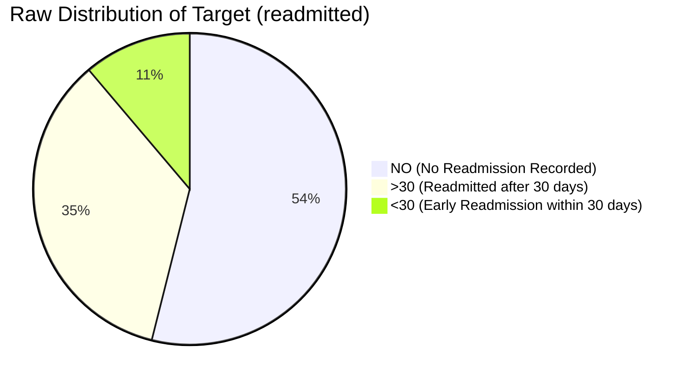

# Phase C1 — Dataset & Clinical Task Audit: Target Definition & Formulation

## 1. Raw Target Attribute: `readmitted`

In the UCI Diabetes 130-US Hospitals dataset, the target column is named `readmitted`. It encodes whether the patient was readmitted to an inpatient hospital facility following the current discharge, and within what time horizon:

### Quantitative Raw Target Distribution

| Raw Value | Clinical Meaning | Encounter Count | Percentage of Total |
| :--- | :--- | :---: | :---: |
| `'NO'` | No readmission recorded in the 130-hospital network | 54,864 | 53.91% |
| `'>30'` | Readmitted to an inpatient facility more than 30 days post-discharge | 35,545 | 34.93% |
| `'<30'` | **Early readmission to an inpatient facility within 30 days post-discharge** | 11,357 | 11.16% |
| **Total** | | **101,766** | **100.00%** |

---

## 2. Mathematical Task Formulation

### Primary Task: 30-Day Early Readmission Prediction (Binary)
In clinical medicine, health policy (e.g., Centers for Medicare & Medicaid Services [CMS] Hospital Readmissions Reduction Program [HRRP]), and clinical AI benchmarking, **unplanned readmission within 30 days** is the gold-standard quality and risk metric. Readmissions after 30 days are generally considered distinct disease progression or unrelated episodes rather than discharge-related care failures.

We formally define the primary clinical prediction target $y_i \in \{0, 1\}$ for encounter $i$ as:

$$y_i = \begin{cases} 1 & \text{if } \text{readmitted}_i = \text{'<30'} \\ 0 & \text{if } \text{readmitted}_i \in \{\text{'>30'}, \text{'NO'}\} \end{cases}$$

#### Prevalence & Class Imbalance:
- **Positive Class ($y=1$, Early Readmission <30d)**: $N_1 = 11,357$ ($11.16\%$)
- **Negative Class ($y=0$, No early readmission)**: $N_0 = 90,409$ ($88.84\%$)
- **Imbalance Ratio**: $\approx 1 : 7.96$

### Secondary Task: 3-Class Granular Outcome (Multi-Class)
For granular clinical profiling and research comparison, the raw 3-class target is preserved:

$$y_i^{\text{3-class}} \in \{0: \text{'NO'}, 1: \text{'>30'}, 2: \text{'<30'}\}$$

---

## 3. Clinical & Epidemiological Justification

1. **CMS Alignment**: 30-day readmissions represent actionable clinical risk where post-discharge monitoring, glycemic management adjustments, and outpatient care coordination directly reduce morbidity.
2. **ACARA-U Decision Fusion**: In the FusionMedAI framework, the clinical module outputs calibrated risk probabilities $P(\text{Readmission}_{<30\text{d}} \mid X_{\text{clinical}})$ and associated epistemic uncertainty. This risk score is fused with the Wagner ulcer grade risk (Foot module) and diabetic retinopathy stage risk (Retina module) to form a unified systemic diabetes severity profile.
3. **No Target Inversion**: We strictly reject inventing artificial medical targets (e.g., synthetic mortality or arbitrary composite scores) not supported by the underlying data schema. The task is strictly defined as hospital-supported 30-day readmission.
